# Diagrama de Classes do Backend

Este diagrama resume as principais classes e entidades do ERP, com foco no
backend (`server/src/models` e `server/src/modules`). Ele foi montado a partir
dos relacionamentos definidos em `server/src/models/index.ts`.

## Legenda

- `--` relacionamentos 1:1 ou referencia direta
- `o--` relacionamentos 1:N
- `..|>` heranca / implementacao conceitual

## Diagrama

```mermaid
classDiagram
  class Entity {
    +id
    +createdAt
    +updatedAt
    +equals(other)
  }

  class ValueObject {
    +equals(other)
  }

  class User {
    +id
    +name
    +email
    +password
    +role
  }

  class Employee {
    +id
    +name
    +user_id
    +department_id
  }

  class Department {
    +id
    +name
    +manager_id
  }

  class Client {
    +id
    +name
    +document
  }

  class Supplier {
    +id
    +name
    +document
  }

  class Category {
    +id
    +name
  }

  class Product {
    +id
    +name
    +sku
    +quantity
    +min_quantity
    +status
  }

  class Item {
    +id
    +codigo
    +descricao
    +status
  }

  class ItemCategoria {
    +id
    +nome
  }

  class ItemDetalheComercial {
    +id
    +item_id
    +categoria_id
  }

  class ItemEspecificacaoTecnica {
    +id
    +item_id
  }

  class ItemEstrutura {
    +id
    +item_pai_id
    +item_componente_id
    +parent_item_estrutura_id
  }

  class Purchase {
    +id
    +supplier_id
    +requester_id
    +status
  }

  class PurchaseItem {
    +id
    +purchase_id
    +product_id
    +item_id
    +quantity
  }

  class PurchaseReceipt {
    +id
    +purchase_id
  }

  class Sale {
    +id
    +customer_id
    +user_id
    +status
  }

  class SaleItem {
    +id
    +sale_id
    +product_id
    +item_id
    +quantity
  }

  class AccountReceivable {
    +id
    +sale_id
    +customer_id
    +status
  }

  class AccountPayable {
    +id
    +supplier_id
    +purchase_id
    +status
  }

  class InventoryMovement {
    +id
    +product_id
    +item_id
    +user_id
    +type
    +quantity
  }

  class InventoryCount {
    +id
    +created_by
    +approved_by
    +status
  }

  class InventoryCountItem {
    +id
    +inventory_count_id
    +product_id
    +counted_by
  }

  class ProductCostLedger {
    +id
    +product_id
    +created_by
  }

  class ProductionOrder {
    +id
    +product_id
    +item_id
    +sales_order_id
    +responsible_id
  }

  class ProductionRoute {
    +id
    +product_id
    +item_id
    +created_by
    +approved_by
  }

  class ProductionRouteStep {
    +id
    +production_route_id
  }

  class ProductionOrderTracking {
    +id
    +production_order_id
    +production_route_step_id
    +operator_id
  }

  class LotControl {
    +id
    +product_id
    +item_id
    +supplier_id
    +purchase_id
    +production_order_id
    +created_by
  }

  class SerialNumber {
    +id
    +product_id
    +item_id
    +lot_control_id
    +production_order_id
    +sale_id
  }

  class ProductionLotConsumption {
    +id
    +production_order_id
    +lot_control_id
    +product_id
    +item_id
    +user_id
  }

  class ServiceOrder {
    +id
    +client_id
    +product_id
    +technician_id
    +responsible_id
  }

  class Asset {
    +id
    +department_id
    +responsible_id
    +product_id
  }

  class NonConformity {
    +id
    +product_id
    +production_order_id
    +supplier_id
    +reported_by
    +responsible_id
    +closed_by
  }

  class MaintenanceOrder {
    +id
    +asset_id
    +technician_id
    +reported_by
    +diagnosed_by
  }

  class AuditLog {
    +id
    +user_id
    +action
  }

  class WebhookEvent {
    +id
    +event_type
    +status
  }

  class CompanyFiscalConfig {
    +id
    +company_name
    +enabled
  }

  class BillOfMaterial {
    +id
    +product_id
    +revision
    +status
  }

  class BillOfMaterialItem {
    +id
    +bom_id
    +component_product_id
    +item_id
    +parent_item_id
  }

  class MrpOrdemPlanejada {
    +id
    +item_id
    +status
  }

  %% Cadastros principais
  User "1" -- "0..1" Employee : user
  Department "1" o-- "0..*" Employee : employees
  Employee "1" -- "0..*" Department : managed_departments
  Department "0..1" -- "1" Employee : manager

  Category "1" o-- "0..*" Product : products
  Supplier "1" o-- "0..*" Purchase : purchases
  User "1" o-- "0..*" Purchase : purchases
  Client "1" o-- "0..*" Sale : sales
  User "1" o-- "0..*" Sale : sales

  %% Compras e contas
  Purchase "1" o-- "0..*" PurchaseItem : items
  Product "1" o-- "0..*" PurchaseItem : purchase_items
  Item "1" o-- "0..*" PurchaseItem : purchase_items
  Purchase "1" o-- "0..*" PurchaseReceipt : receipts
  Purchase "1" o-- "0..*" AccountPayable : accounts_payable
  Supplier "1" o-- "0..*" AccountPayable : accounts_payable

  %% Vendas e financeiro
  Sale "1" o-- "0..*" SaleItem : items
  Product "1" o-- "0..*" SaleItem : sale_items
  Item "1" o-- "0..*" SaleItem : sale_items
  Sale "1" o-- "0..*" AccountReceivable : accounts_receivable
  Client "1" o-- "0..*" AccountReceivable : accounts_receivable

  %% Estoque
  Product "1" o-- "0..*" InventoryMovement : movements
  Item "1" o-- "0..*" InventoryMovement : item_movements
  User "1" o-- "0..*" InventoryMovement : inventory_movements
  InventoryCount "1" o-- "0..*" InventoryCountItem : items
  Product "1" o-- "0..*" InventoryCountItem : inventory_count_items
  User "1" o-- "0..*" InventoryCount : created_inventory_counts
  User "1" o-- "0..*" InventoryCount : approved_inventory_counts
  User "1" o-- "0..*" InventoryCountItem : counted_inventory_items
  Product "1" o-- "0..*" ProductCostLedger : cost_ledgers
  User "1" o-- "0..*" ProductCostLedger : created_cost_ledgers

  %% Produção
  Product "1" o-- "0..*" ProductionOrder : production_orders
  Item "1" o-- "0..*" ProductionOrder : production_orders
  Employee "1" o-- "0..*" ProductionOrder : production_orders
  User "1" o-- "0..*" ProductionOrder : created_production_orders
  Sale "1" o-- "0..*" ProductionOrder : production_orders

  Product "1" o-- "0..*" ProductionRoute : production_routes
  Item "1" o-- "0..*" ProductionRoute : production_routes
  User "1" o-- "0..*" ProductionRoute : created_production_routes
  User "1" o-- "0..*" ProductionRoute : approved_production_routes
  ProductionRoute "1" o-- "0..*" ProductionRouteStep : steps
  ProductionOrder "1" o-- "0..*" ProductionOrderTracking : tracking
  ProductionRouteStep "1" o-- "0..*" ProductionOrderTracking : tracking_entries
  Employee "1" o-- "0..*" ProductionOrderTracking : production_tracking

  Product "1" o-- "0..*" LotControl : lot_controls
  Item "1" o-- "0..*" LotControl : lot_controls
  Supplier "1" o-- "0..*" LotControl : lot_controls
  Purchase "1" o-- "0..*" LotControl : lot_controls
  ProductionOrder "1" o-- "0..*" LotControl : generated_lots
  User "1" o-- "0..*" LotControl : created_lot_controls

  Product "1" o-- "0..*" SerialNumber : serial_numbers
  Item "1" o-- "0..*" SerialNumber : serial_numbers
  LotControl "1" o-- "0..*" SerialNumber : serial_numbers
  ProductionOrder "1" o-- "0..*" SerialNumber : generated_serial_numbers
  Sale "1" o-- "0..*" SerialNumber : serial_numbers

  ProductionOrder "1" o-- "0..*" ProductionLotConsumption : lot_consumptions
  LotControl "1" o-- "0..*" ProductionLotConsumption : production_consumptions
  Product "1" o-- "0..*" ProductionLotConsumption : production_lot_consumptions
  Item "1" o-- "0..*" ProductionLotConsumption : production_lot_consumptions
  User "1" o-- "0..*" ProductionLotConsumption : production_lot_consumptions

  %% Qualidade, servico e ativos
  Client "1" o-- "0..*" ServiceOrder : service_orders
  Product "1" o-- "0..*" ServiceOrder : service_orders
  User "1" o-- "0..*" ServiceOrder : service_orders_technician
  User "1" o-- "0..*" ServiceOrder : service_orders_responsible

  Department "1" o-- "0..*" Asset : assets
  Employee "1" o-- "0..*" Asset : assets
  Product "1" o-- "0..*" Asset : assets

  Product "1" o-- "0..*" NonConformity : non_conformities
  ProductionOrder "1" o-- "0..*" NonConformity : non_conformities
  Supplier "1" o-- "0..*" NonConformity : non_conformities
  User "1" o-- "0..*" NonConformity : reported_ncs
  User "1" o-- "0..*" NonConformity : responsible_ncs
  User "1" o-- "0..*" NonConformity : closed_ncs

  Asset "1" o-- "0..*" MaintenanceOrder : maintenance_orders
  User "1" o-- "0..*" MaintenanceOrder : maintenance_as_technician
  User "1" o-- "0..*" MaintenanceOrder : maintenance_reported
  User "1" o-- "0..*" MaintenanceOrder : maintenance_diagnosed

  %% Auditoria e fiscal
  User "1" o-- "0..*" AuditLog : audit_logs

  %% Estrutura industrial / BOM / MRP
  Supplier "1" o-- "0..*" Item : itens_padrao
  Item "1" o-- "0..*" ItemEstrutura : estruturas_filhas
  Item "1" o-- "0..*" ItemEstrutura : estruturas_componente
  User "1" o-- "0..*" ItemEstrutura : estruturas_criadas
  User "1" o-- "0..*" ItemEstrutura : estruturas_aprovadas
  ItemEstrutura "1" o-- "0..*" ItemEstrutura : sub_estruturas
  Item "1" o-- "0..*" ItemEstrutura : estruturas_alternativas
  ItemCategoria "1" o-- "0..*" ItemDetalheComercial : itens_detalhe
  Item "1" -- "0..1" ItemDetalheComercial : detalheComercial
  Item "1" -- "0..1" ItemEspecificacaoTecnica : especificacaoTecnica
  Item "1" o-- "0..*" MrpOrdemPlanejada : ordens_mrp_planejadas

  Product "1" o-- "0..*" BillOfMaterial : boms
  BillOfMaterial "1" o-- "0..*" BillOfMaterialItem : items
  Product "1" o-- "0..*" BillOfMaterialItem : bom_references
  Item "1" o-- "0..*" BillOfMaterialItem : bill_of_material_items
  BillOfMaterialItem "1" o-- "0..*" BillOfMaterialItem : subItems
```

## Observacoes

- O diagrama acima foca no modelo de dados e nos relacionamentos definidos no
  backend.
- Algumas entidades de suporte interno, repositorios e use cases foram
  omitidos para manter a leitura pratica.
- Se voce quiser, eu posso gerar uma segunda versao:
  - mais enxuta, para apresentar em reuniao;
  - ou mais detalhada, com os `use cases` e camadas `domain/application/infrastructure`.

---

## Módulos entregues após a versão original deste diagrama (2026-08-06)

**Status:** 🟡 Parcial — o diagrama principal acima **não foi
re-renderizado** com estas classes (ficaria muito denso); esta seção lista,
em texto, as entidades novas e suas relações principais, para que o
diagrama fique rastreável sem duplicar o dicionário de dados completo
(que é responsabilidade de `docs/DATABASE.md`, mantido separadamente pelo
agente `AdmDBA`).

| Classe (model) | Tabela | Relações principais |
|---|---|---|
| `Rfq`, `RfqItem`, `RfqSupplier`, `RfqQuote` | `rfqs`, `rfq_items`, `rfq_suppliers`, `rfq_quotes` | `Rfq 1--N RfqItem`; `Rfq N--N Supplier` via `RfqSupplier`; `RfqQuote` referencia `RfqItem` + `Supplier`, alimenta `ItemSupplier` na adjudicação |
| `CostCenter` | `cost_centers` | `CostCenter 1--N AccountPayable`, `CostCenter 1--N AccountReceivable` (FK `cost_center_id` opcional) |
| `CustomerPriceList` | `customer_price_lists` | `Client 1--N CustomerPriceList N--1 Item/Product` (preço negociado por par cliente×produto, com vigência opcional) |
| `WorkCenter`, `WorkCenterShift` | `work_centers`, `work_center_shifts` | `WorkCenter 1--N WorkCenterShift`; `WorkCenter 1--N ProductionRouteStep` (via `work_center_id`); `WorkCenter 1--N ProductionDowntime` |
| `ProductionDowntime` | `production_downtimes` | `ProductionOrder`/`WorkCenter 1--N ProductionDowntime`; alimenta o cálculo de OEE (`GET /api/reports/oee`) |
| `BankStatement`, `BankStatementEntry` | `bank_statements`, `bank_statement_entries` | `BankStatement 1--N BankStatementEntry`; `BankStatementEntry N--1 AccountPayable`/`AccountReceivable` (baixa por conciliação) |
| `PurchaseRequisition`, `PurchaseRequisitionItem` | `purchase_requisitions`, `purchase_requisition_items` | `PurchaseRequisition 1--N PurchaseRequisitionItem`; `PurchaseRequisition 1--N Purchase` (via `requisition_id`, UC-25) |
| `EngineeringProject`, `ProductDrawing` | `engineering_projects`, `product_drawings` | `EngineeringProject 1--N PurchaseRequisition` (via `engineering_project_id`, UC-39); `Product 1--N ProductDrawing` |
| `AcousticTestResult` | `acoustic_test_results` | `Product 1--N AcousticTestResult`; `AcousticTestResult N--1 NonConformity` (quando reprovado) |
| `AccessProfile`, `AccessProfilePermission` | `access_profiles`, `access_profile_permissions` | `AccessProfile 1--N AccessProfilePermission`; `User N--1 AccessProfile` |
| `Warehouse`, `WarehouseTransfer` | `warehouses`, `warehouse_transfers` | `Warehouse 1--N InventoryMovement` (via `warehouse_id`); `WarehouseTransfer` referencia dois `Warehouse` (origem/destino) |
| `ItemSupplier` | `item_suppliers` | `Item N--N Supplier` (catálogo item×fornecedor, com `preferred` único por item) |
| `ImportProcess`, `ImportProcessItem` | `import_processes`, `import_process_items` | `ImportProcess 1--N ImportProcessItem` (CASCADE); `ImportProcess N--1 Supplier` (RESTRICT), `N--1 User` (`created_by`, RESTRICT); `ImportProcessItem N--1 Item` (RESTRICT) |

Fonte: `server/src/models/*.ts` (2026-08-06). Consulte `docs/DATABASE.md`
para o dicionário de dados completo (colunas, tipos, constraints) — esta
tabela é apenas o mapa de classes/relações, não o dicionário.

### Módulo `comex` (Importação/COMEX, UC-19) — classes de aplicação

Além dos models acima, o módulo novo `server/src/modules/comex/` segue o
mesmo padrão Clean Architecture dos demais módulos recentes (`rfq/`,
`maintenance/`):

- **Repositório:** `ComexRepository` (contrato,
  `domain/repositories/`) → `SequelizeComexRepository`
  (`infrastructure/sequelize/`).
- **Use cases** (`application/use-cases/`): `CreateImportProcessUseCase`,
  `ListImportProcessesUseCase`, `GetImportProcessByIdUseCase`,
  `RegisterImportTrackingUseCase`, `CancelImportProcessUseCase`,
  `ReceiveImportProcessUseCase` — mais dois helpers sem classe própria
  (`importTaxCalculator.ts`, função pura de cálculo tributário, e
  `recalculateImportProcessTaxes.ts`, compartilhado entre os use cases
  acima).
- **Presentation:** `importProcessValidators.ts` (Zod),
  `importProcessController.ts`, `routes/importProcesses.ts` — montada em
  `server/app.ts` como `/api/comex/import-processes`.
