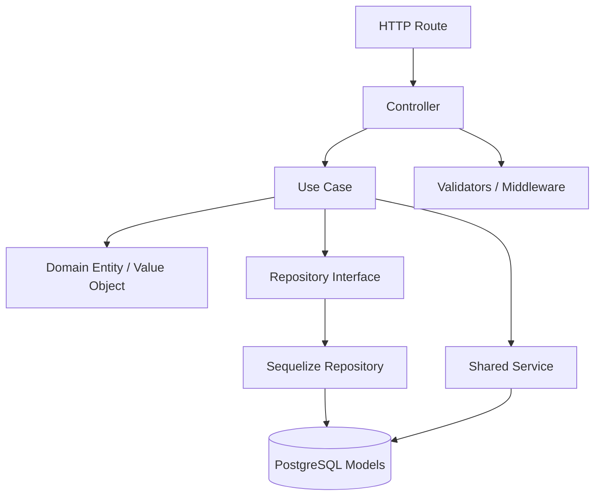
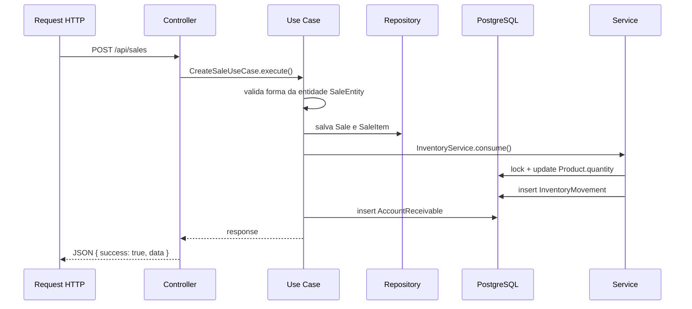

# Diagrama de Classes e Camadas

Esta versao complementa o diagrama de entidades de [DIAGRAMA_CLASSES.md](DIAGRAMA_CLASSES.md)
com a arquitetura em camadas usada no backend:

- `presentation` com controllers, rotas e validators
- `application` com use cases
- `domain` com entidades e interfaces de repositorio
- `infrastructure` com Sequelize, JWT, providers e adaptadores

O foco aqui e mostrar o fluxo de dependencias entre as camadas, usando os
modulos mais representativos do projeto.

## Visao geral

```mermaid
classDiagram
  class Controller
  class UseCase
  class Repository
  class ReportsRepository
  class Entity
  class ValueObject
  class Model
  class Service
  class SequelizeReportsRepository

  Controller <|-- AuthController
  Controller <|-- UserController
  Controller <|-- ClientController
  Controller <|-- ProductController
  Controller <|-- SaleController
  Controller <|-- InventoryController
  Controller <|-- BomController
  Controller <|-- ProductionOrderController

  UseCase <|-- LoginUseCase
  UseCase <|-- RegisterUserUseCase
  UseCase <|-- GetMeUseCase
  UseCase <|-- ListUsersUseCase
  UseCase <|-- CreateUserUseCase
  UseCase <|-- UpdateUserUseCase
  UseCase <|-- DeactivateUserUseCase
  UseCase <|-- ListClientsUseCase
  UseCase <|-- CreateClientUseCase
  UseCase <|-- UpdateClientUseCase
  UseCase <|-- DeactivateClientUseCase
  UseCase <|-- ListProductsUseCase
  UseCase <|-- CreateProductUseCase
  UseCase <|-- UpdateProductUseCase
  UseCase <|-- DeactivateProductUseCase
  UseCase <|-- CreateSaleUseCase
  UseCase <|-- ChangeSaleStatusUseCase
  UseCase <|-- CreateInventoryMovementUseCase
  UseCase <|-- CreateInventoryCountUseCase
  UseCase <|-- ApproveInventoryCountUseCase
  UseCase <|-- CreateBOMUseCase
  UseCase <|-- UpdateBOMUseCase
  UseCase <|-- CreateProductionOrderUseCase
  UseCase <|-- ChangeProductionOrderStatusUseCase

  Repository <|-- AuthRepository
  Repository <|-- UsersRepository
  Repository <|-- ClientsRepository
  Repository <|-- ProductsRepository
  Repository <|-- SaleRepository
  Repository <|-- InventoryRepository
  Repository <|-- InventoryCountRepository
  Repository <|-- BOMRepository
  Repository <|-- ProductionOrderRepository
  Repository <|-- ReportsRepository

  Entity <|-- User
  Entity <|-- Client
  Entity <|-- ProductEntity
  Entity <|-- SaleEntity
  Entity <|-- InventoryMovementEntity
  Entity <|-- InventoryCountEntity
  Entity <|-- BOMEntity
  Entity <|-- ProductionOrderEntity

  ValueObject <|-- ThieleSmallParams

  Model <|-- SequelizeUser
  Model <|-- SequelizeClient
  Model <|-- SequelizeProduct
  Model <|-- SequelizeSale
  Model <|-- SequelizeInventoryMovement
  Model <|-- SequelizeBillOfMaterial
  Model <|-- SequelizeProductionOrder

  Service <|-- TokenService
  Service <|-- InventoryService
  Service <|-- AuditLogService
  Service <|-- ReportService
  Service <|-- QrCodeService
  Service <|-- BomService
  Service <|-- DashboardService
  Service <|-- CostingService

  AuthController --> LoginUseCase
  AuthController --> RegisterUserUseCase
  AuthController --> GetMeUseCase

  UserController --> ListUsersUseCase
  UserController --> GetUserByIdUseCase
  UserController --> CreateUserUseCase
  UserController --> UpdateUserUseCase
  UserController --> DeactivateUserUseCase

  ClientController --> ListClientsUseCase
  ClientController --> GetClientByIdUseCase
  ClientController --> CreateClientUseCase
  ClientController --> UpdateClientUseCase
  ClientController --> DeactivateClientUseCase

  ProductController --> ListProductsUseCase
  ProductController --> GetProductByIdUseCase
  ProductController --> CreateProductUseCase
  ProductController --> UpdateProductUseCase
  ProductController --> DeactivateProductUseCase

  SaleController --> ListSalesUseCase
  SaleController --> GetSaleByIdUseCase
  SaleController --> CreateSaleUseCase
  SaleController --> ChangeSaleStatusUseCase

  InventoryController --> ListInventoryMovementsUseCase
  InventoryController --> GetInventoryMovementByIdUseCase
  InventoryController --> CreateInventoryMovementUseCase
  InventoryController --> GetStockReportUseCase
  InventoryController --> ListLowStockUseCase

  BomController --> ListBOMsUseCase
  BomController --> GetBOMByIdUseCase
  BomController --> CreateBOMUseCase
  BomController --> UpdateBOMUseCase
  BomController --> DeactivateBOMUseCase
  BomController --> GetBOMTreeUseCase
  BomController --> ExplodeBOMUseCase

  ProductionOrderController --> ListProductionOrdersUseCase
  ProductionOrderController --> GetProductionOrderByIdUseCase
  ProductionOrderController --> CreateProductionOrderUseCase
  ProductionOrderController --> UpdateProductionOrderUseCase
  ProductionOrderController --> ChangeProductionOrderStatusUseCase

  LoginUseCase --> AuthRepository
  LoginUseCase --> TokenService
  RegisterUserUseCase --> AuthRepository
  GetMeUseCase --> AuthRepository
  ListUsersUseCase --> UsersRepository
  GetUserByIdUseCase --> UsersRepository
  CreateUserUseCase --> UsersRepository
  UpdateUserUseCase --> UsersRepository
  DeactivateUserUseCase --> UsersRepository
  ListClientsUseCase --> ClientsRepository
  CreateClientUseCase --> ClientsRepository
  UpdateClientUseCase --> ClientsRepository
  DeactivateClientUseCase --> ClientsRepository
  ListProductsUseCase --> ProductsRepository
  CreateProductUseCase --> ProductsRepository
  UpdateProductUseCase --> ProductsRepository
  DeactivateProductUseCase --> ProductsRepository
  CreateSaleUseCase --> SaleRepository
  ChangeSaleStatusUseCase --> SaleRepository
  CreateSaleUseCase --> InventoryService
  ChangeSaleStatusUseCase --> InventoryService
  CreateInventoryMovementUseCase --> InventoryRepository
  CreateInventoryMovementUseCase --> InventoryService
  CreateInventoryCountUseCase --> InventoryCountRepository
  ApproveInventoryCountUseCase --> InventoryCountRepository
  ApproveInventoryCountUseCase --> InventoryService
  CreateBOMUseCase --> BOMRepository
  UpdateBOMUseCase --> BOMRepository
  ExplodeBOMUseCase --> BomService
  CreateProductionOrderUseCase --> ProductionOrderRepository
  ChangeProductionOrderStatusUseCase --> ProductionOrderRepository
  ChangeProductionOrderStatusUseCase --> InventoryService
  ReportService --> ReportsRepository

  AuthRepository --> SequelizeUser
  UsersRepository --> SequelizeUser
  ClientsRepository --> SequelizeClient
  ProductsRepository --> SequelizeProduct
  SaleRepository --> SequelizeSale
  InventoryRepository --> SequelizeInventoryMovement
  InventoryCountRepository --> SequelizeInventoryCount
  BOMRepository --> SequelizeBillOfMaterial
  ProductionOrderRepository --> SequelizeProductionOrder
  ReportsRepository --> SequelizeReportsRepository

  InventoryService --> SequelizeProduct
  InventoryService --> SequelizeInventoryMovement
  AuditLogService --> SequelizeAuditLog
  ReportService --> SequelizeReportsRepository
```

## Padrões por camada

## Exemplo de fluxo completo

## Observacoes

- O diagrama e propositalmente "macro". Ele mostra o padrao repetido do
  projeto, nao cada classe auxiliar.
- Se voce quiser, eu posso criar uma terceira versao:
  - focada so em um modulo, por exemplo `sales` ou `inventory`
  - ou um diagrama de componentes por pasta
  - ou converter tudo para um arquivo `.mmd` pronto para renderizacao
