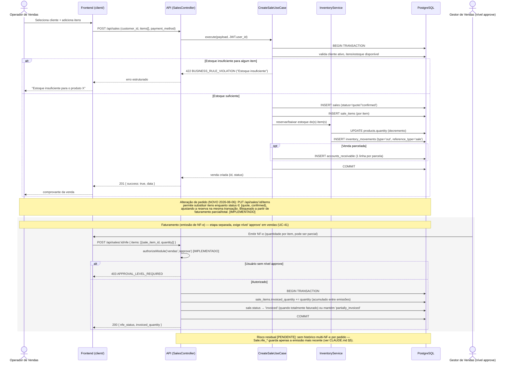
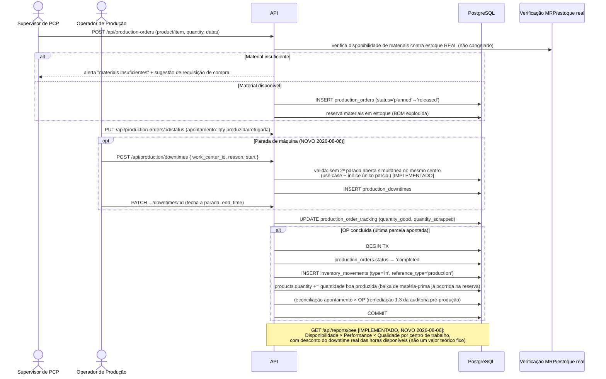

# Diagramas de Sequência — Fluxos Críticos do ERP EVOK ÁUDIO

**Status:** 🟢 Novo (2026-08-06) — cobre os 3 fluxos de maior valor de
negócio/risco técnico do sistema. Baseado nos casos de uso já
especificados em `docs/projeto/04-USE_CASES.md` (UC-04, UC-12, UC-13,
UC-15, UC-16, UC-17B, UC-23, UC-24, UC-25, UC-41) e no comportamento real
descrito em `docs/API.md` e `docs/DATABASE.md`. Onde um passo do use case
textual é simplificado (ex.: "sistema calcula total"), o diagrama mantém o
mesmo nível de abstração do UC de origem — não inventa detalhe de
implementação que o UC não descreve.

Convenção: `[IMPLEMENTADO]` ao lado de uma nota indica que aquele passo
está confirmado em código/uso de caso já formalizado; `[PENDENTE]` indica
lacuna conhecida (ver `docs/governance/TODO.md`).

---

## 1. Venda → Reserva/Baixa de Estoque → Contas a Receber → NF-e

Cobre UC-04 (Registrar Venda) e UC-41 (Emissão de NF-e restrita a gestor).
Inclui a trava de faturamento parcial (`CLAUDE.md` §4, "Faturamento
parcial NOVO 2026-08-06").



---

## 2. Requisição de Compra → RFQ/Cotação → Pedido de Compra → Recebimento → Estoque

Cobre UC-23 (aprovação de requisição), UC-24/24b (MRP → requisição),
UC-25 (requisição → pedido de compra), RFQ multi-fornecedor (`CLAUDE.md`
§4) e UC-16 (recebimento com quarentena de lote).

```mermaid
sequenceDiagram
    actor SOL as Solicitante / MRP
    actor ADM as Aprovador (admin)
    actor COMP as Comprador
    participant API as API
    participant DB as PostgreSQL
    participant ALMOX as Almoxarife

    alt Origem manual
        SOL->>API: POST /api/purchase-requisitions (draft)
    else Origem MRP (UC-24)
        API->>DB: GenerateMrpPlanUseCase cria ordens planejadas
        SOL->>API: POST /api/mrp/planned-orders/convert (planned_order_ids[])
        API->>DB: BEGIN TX, SELECT...FOR UPDATE nas ordens planejadas
        API->>DB: INSERT purchase_requisitions (origin='mrp') + itens<br/>(sugere fornecedor preferencial via item_suppliers)
        API->>DB: ordens planejadas → status EM_EXECUCAO
        API->>DB: COMMIT
    end

    Note over API,DB: UC-24b [IMPLEMENTADO]: itens com items.conversao_automatica=true<br/>disparam este mesmo fluxo automaticamente dentro de POST /api/mrp/plan,<br/>sem ação do planejador (origin='mrp_auto')

    SOL->>API: PATCH /api/purchase-requisitions/:id/status (draft → pending)
    ADM->>API: PATCH /api/purchase-requisitions/:id/status (pending → approved)
    API->>API: exige perfil admin; approved_by/approval_date do JWT (nunca do payload)
    API->>DB: UPDATE purchase_requisitions SET status='approved'

    rect rgb(245,245,245)
    Note over COMP,DB: Cotação/RFQ multi-fornecedor (opcional, NOVO 2026-08-06)
    COMP->>API: POST /api/rfqs (a partir da requisição ou avulsa)
    API->>DB: INSERT rfqs + rfq_items
    COMP->>API: POST /api/rfqs/:id/suppliers (convida fornecedores)
    COMP->>API: POST /api/rfqs/:id/quotes (registra cotação de cada fornecedor)
    API->>DB: INSERT rfq_quotes (mapa comparativo: melhor preço/prazo)
    COMP->>API: POST /api/rfqs/:id/award (adjudica por item, pode dividir entre fornecedores)
    API->>DB: gera pedido(s) de compra por fornecedor vencedor
    API->>DB: realimenta item_suppliers (catálogo item×fornecedor)
    end

    COMP->>API: POST /api/purchase-requisitions/:id/convert<br/>{ fallback_supplier_id? } (quando RFQ não foi usado)
    API->>DB: BEGIN TX, SELECT...FOR UPDATE na requisição + itens
    API->>DB: resolve fornecedor: suggested_supplier_id → preferencial (item_suppliers) → fallback
    API->>DB: agrupa por fornecedor, cria 1 purchase_order por fornecedor (requisition_id)
    API->>DB: requisição e itens → status='ordered'
    API->>DB: COMMIT
    API-->>COMP: pedidos de compra criados

    COMP->>API: PUT /api/purchases/:id/status → 'sent' (pedido emitido ao fornecedor)

    ALMOX->>API: POST /api/purchases/:id/receive (confere NF do fornecedor)
    API->>DB: BEGIN TX
    API->>DB: products.quantity += quantidade recebida
    API->>DB: INSERT/UPDATE lot_controls (status='quarantine' — bloqueado para consumo)
    API->>DB: purchase_orders.status → 'received' ou 'partial'
    API->>DB: INSERT accounts_payable (gerado APÓS recebimento, não na aprovação)
    API->>DB: COMMIT

    Note over ALMOX,API: Inspeção de recebimento (UC-17B) [IMPLEMENTADO]:<br/>lote permanece quarantine até inspetor liberar (→available) ou bloquear (→blocked)/abrir RNC
```

---

## 3. Ordem de Produção → Apontamento → Paradas/OEE → Baixa de Estoque de Produto Acabado

Cobre UC-12 (Cadastrar OP), UC-13 (Apontar Produção) e o downtime/OEE
entregues em 2026-08-06 (`CLAUDE.md` §4).



---

## Observações gerais

- Estes diagramas descrevem o comportamento **documentado** nos use cases
  e no `CLAUDE.md`; não substituem teste de integração real. O
  `docs/governance/TODO.md` já registra como pendência o teste de
  concorrência real (2 clients simultâneos) para o fluxo de contagem
  cíclica e para os três recursos de maior risco da terceira rodada de
  2026-08-06 (conciliação bancária, índice único parcial de downtime,
  faturamento parcial) — os mesmos mecanismos aparecem aqui como
  `[IMPLEMENTADO]` no nível de código, não como "testado sob carga real".
- Próximos fluxos candidatos a diagrama de sequência, se o time achar
  valor (não cobertos nesta rodada): contagem cíclica com claim
  concorrente (`InventoryCount`), conciliação bancária OFX
  (`/api/finance/reconciliation/*`), ciclo completo de RFQ até
  adjudicação item a item.

## Referências

- `docs/projeto/04-USE_CASES.md` — UC-04, UC-12, UC-13, UC-15, UC-16,
  UC-17B, UC-23, UC-24, UC-24b, UC-25, UC-41.
- `docs/API.md` §5 (Vendas), §8 (Estoque), §10 (Produção), §11/§11.1
  (Compras/RFQ), §13 (MRP).
- `CLAUDE.md` §4 — descrição funcional dos módulos por área.
