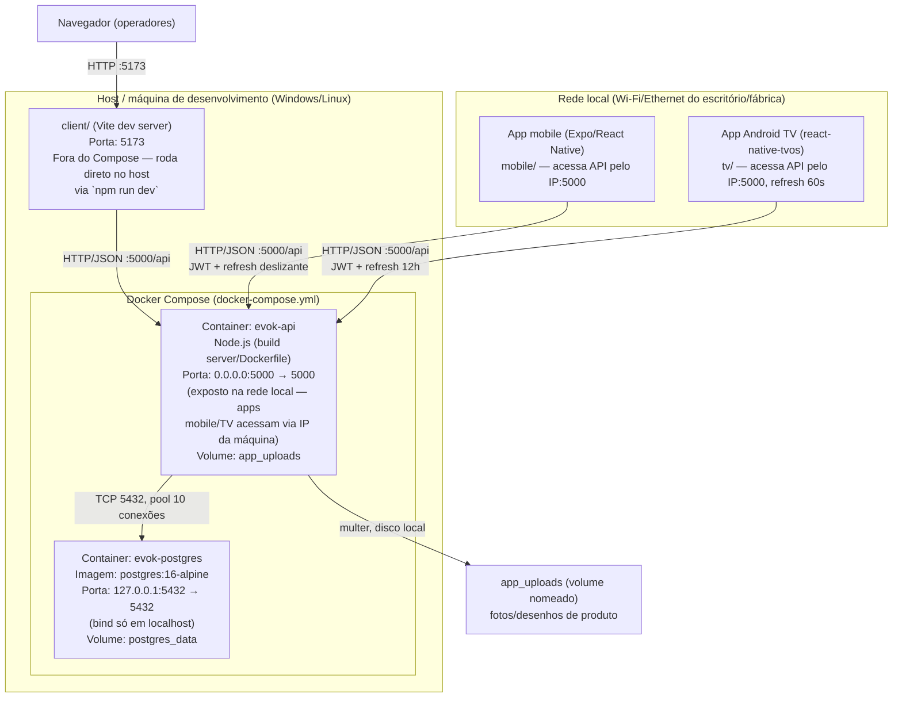
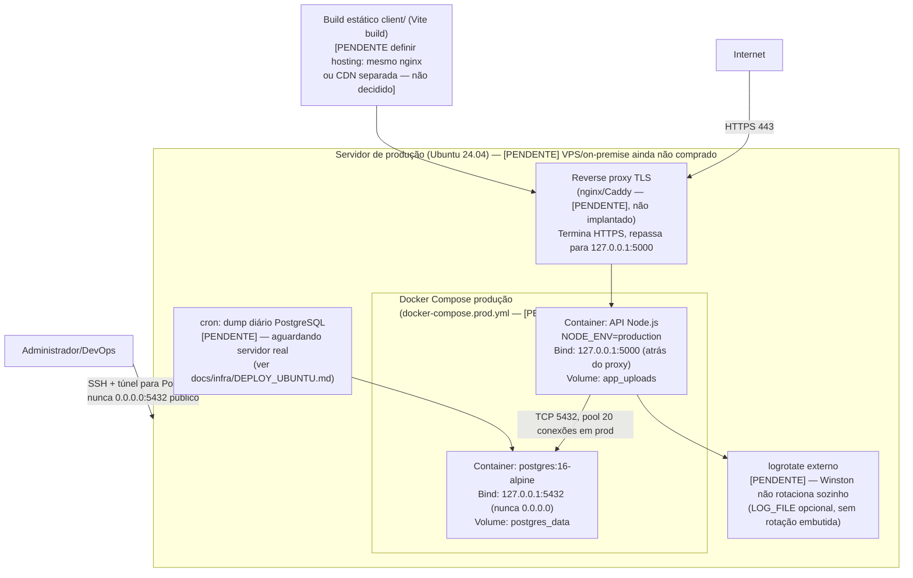

# Diagrama de Arquitetura de Infraestrutura — ERP EVOK ÁUDIO

**Status:** 🟡 Parcial — descreve a infraestrutura de **desenvolvimento**
(`docker-compose.yml`, real e em uso) com precisão. A infraestrutura de
**produção** está desenhada conforme `docs/infra/DEPLOY_UBUNTU.md`, mas o
servidor de produção físico/VPS ainda **não foi adquirido** (ver
`docs/governance/TODO.md` e `CLAUDE.md` §5, item "Infra de produção") — os
blocos marcados `[PENDENTE]` abaixo são plano, não fato hoje.

Fontes usadas para este documento: `docker-compose.yml` (raiz),
`server/Dockerfile`, `docs/infra/DEPLOY_UBUNTU.md`, `.env.example`,
`server/app.ts`. Nenhum dado abaixo foi inventado — onde a config real não
determina um valor (ex.: specs de CPU/RAM do servidor de produção), o item
está marcado como não especificado.

---

## 1. Ambiente de desenvolvimento (real, `docker-compose.yml`) [IMPLEMENTADO]

**Notas de segurança já aplicadas em dev:**
- PostgreSQL só aceita conexões de `127.0.0.1` (não exposto na LAN).
- A API (`:5000`) é exposta em `0.0.0.0` **propositalmente** em dev, para
  que `mobile/`/`tv/` na mesma rede local consigam acessá-la pelo IP da
  máquina — isso é aceitável em rede de desenvolvimento fechada, mas
  **não deve se repetir em produção** (ver seção 2).

---

## 2. Ambiente de produção — plano `[PENDENTE]` (servidor ainda não adquirido)

Baseado em `docs/infra/DEPLOY_UBUNTU.md` e nos comentários de produção já
escritos em `docker-compose.yml` (ex.: `TRUST_PROXY`, aviso de bind em
`127.0.0.1:5000` + reverse proxy). **Nenhum destes componentes está em
operação hoje** — é o desenho-alvo.

**Decisões já registradas em código/config (não é invenção):**
- `TRUST_PROXY` deve ser `1` atrás de exatamente um proxy reverso (nginx),
  para que o rate-limit de login use o IP real do cliente.
- `DB_SSL` deve ser `true` em produção (validado em
  `server/src/config/runtimeEnv.ts`); `ALLOW_LOCAL_DB_NO_SSL=true` é
  bloqueado como caminho de produção real.
- Pool de conexões PostgreSQL: 10 conexões em dev, 20 em produção
  (`server/src/config/database.ts`).
- Uploads (`app_uploads`) e o dump do Postgres precisam entrar na mesma
  rotina de backup — perda do volume = perda de fotos/desenhos enviados.

**O que falta para este bloco sair de `[PENDENTE]` (rastreado em
`docs/governance/TODO.md` e `CLAUDE.md` §5):**
1. Aquisição do servidor de produção (VPS ou on-premise).
2. `docker-compose.prod.yml` real, exercitado em staging antes do primeiro
   deploy.
3. Reverse proxy TLS (nginx/Caddy) configurado com certificado válido.
4. Cron de backup diário do dump PostgreSQL + do volume `app_uploads`.
5. `logrotate` (ou equivalente) para os logs Winston, se `LOG_FILE` for
   usado em produção.

---

## 3. Portas expostas — resumo

| Serviço | Porta (dev) | Porta (prod, plano) | Exposição |
|---|---|---|---|
| PostgreSQL | 5432 | 5432 | `127.0.0.1` apenas, nunca pública (dev e prod) |
| API (Node.js/Express) | 5000 (`0.0.0.0`, LAN) | 5000 (`127.0.0.1`, atrás do proxy) | Dev: LAN para mobile/TV. Prod: só via reverse proxy TLS |
| client/ (Vite dev) | 5173 | N/A (build estático, hosting a definir) | Local ao host de dev |
| Reverse proxy (nginx/Caddy) | N/A | 443 (HTTPS) | `[PENDENTE]` — não implantado |

---

## 4. Acesso remoto seguro

- **Hoje (dev):** sem acesso remoto formal — ambiente roda na máquina/rede
  local do time de implantação.
- **Plano (produção):** SSH para administração do servidor; acesso ao
  PostgreSQL apenas via túnel SSH (nunca porta pública 5432); HTTPS via
  reverse proxy para tráfego de API/frontend. Nenhum mecanismo de VPN
  dedicado está especificado no código/docs hoje — **não especificado
  formalmente** além do túnel SSH mencionado em `docker-compose.yml`.

---

## Referências

- `docker-compose.yml` (raiz) — fonte de verdade do ambiente de dev.
- `docs/infra/DEPLOY_UBUNTU.md` — runbook de deploy/operação Ubuntu.
- `server/src/config/runtimeEnv.ts` — validação de variáveis de ambiente críticas.
- `server/src/config/database.ts` — pool de conexões PostgreSQL.
- `server/app.ts` — helmet, CORS, rate limiters.
- `.env.example` — variáveis de ambiente documentadas.
