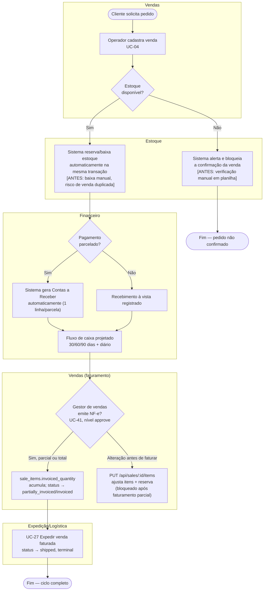
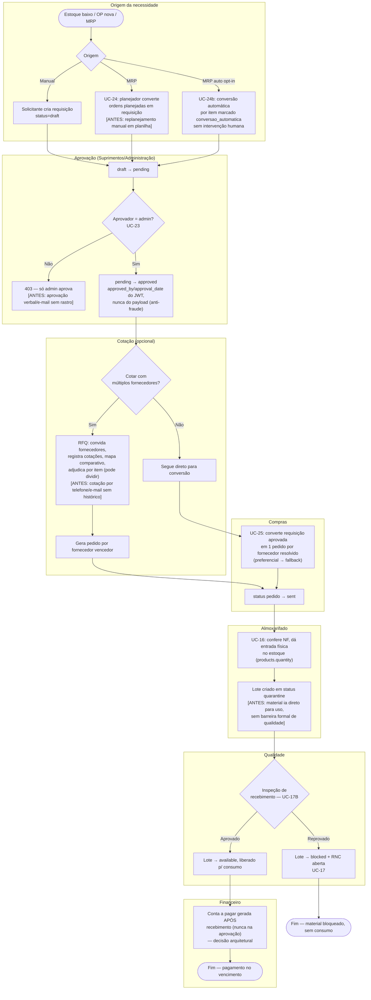
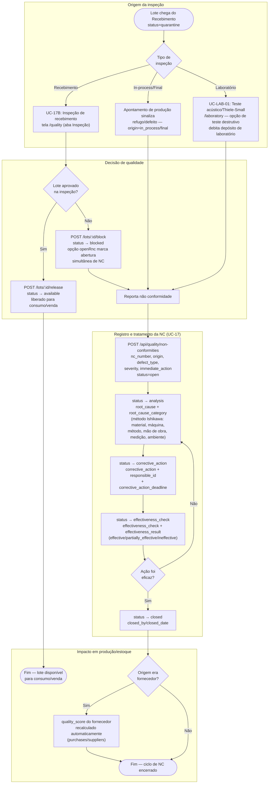
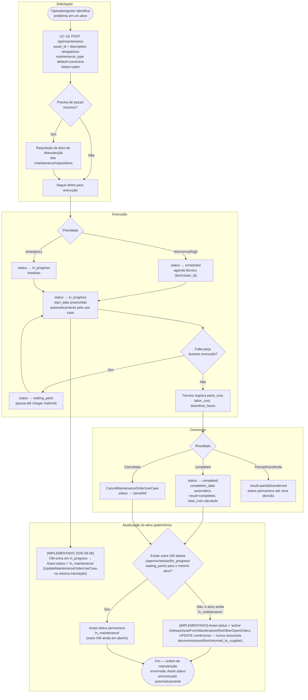

# Diagrama de Casos de Uso e Mapeamento de Processos (BPMN simplificado)

**Status:** 🟢 Atualizado (2026-08-06). Este documento converte o conteúdo
textual já existente em `docs/projeto/04-USE_CASES.md` e
`docs/business/01-USE_CASES.md` (atores × casos de uso formais UC-01 a
UC-41) em artefatos visuais complementares:

1. **Diagrama de Casos de Uso** (Mermaid `flowchart`) — visão atores ×
   funcionalidades, por módulo.
2. **Mapeamento de Processos (BPMN simplificado)** — fluxo ponta a ponta
   por departamento, mostrando onde a tecnologia (ERP) substitui/otimiza
   uma etapa que antes seria manual. Cobre hoje 4 fluxos: Order-to-Cash
   (Vendas), Purchase-to-Pay (Suprimentos), Qualidade (inspeção → NC →
   liberação de lote) e Manutenção (solicitação → execução → atualização
   de ativo).

Não redefine nenhuma regra de negócio nova — é uma representação visual do
que já está formalizado em texto. Onde um processo cruza módulos ainda sem
UC formal (ex.: parte do fluxo RFQ), o rótulo indica a origem
(`CLAUDE.md §4`) em vez de inventar um número de UC.

---

## 1. Diagrama de Casos de Uso — Atores × Módulos

Atores conforme `docs/projeto/04-USE_CASES.md` (papel JWT global:
admin/operator/financial) **e** `docs/business/01-USE_CASES.md`
(perfis de acesso configuráveis por área/módulo, `operate`/`approve`).

```mermaid
flowchart LR
    subgraph ATORES["Atores"]
        ADM["Administrador<br/>(role=admin, acima de<br/>qualquer perfil de área)"]
        OPER["Operador<br/>(role=operator +<br/>perfil de área nível operate)"]
        FIN["Financeiro<br/>(role=financial)"]
        GESTOR["Gestor de área<br/>(perfil nível approve:<br/>ex. Compras, Vendas, Qualidade)"]
        SISTEMA["Sistema (MRP síncrono,<br/>conversão automática opt-in)"]
    end

    subgraph VENDAS["Vendas / Comercial"]
        UC02[UC-02 Cadastrar Cliente]
        UC04[UC-04 Registrar Venda]
        UC27[UC-27 Expedir Venda Faturada]
        UC41[UC-41 Emitir/Cancelar NF-e]
        UCPRECO["Tabela de preços por cliente<br/>(CLAUDE.md §4)"]
    end

    subgraph SUPRIMENTOS["Compras / Suprimentos"]
        UC15[UC-15 Registrar Pedido de Compra]
        UC16[UC-16 Receber Pedido de Compra]
        UC22[UC-22 Catálogo Item×Fornecedor]
        UC23[UC-23 Aprovar Requisição de Compra]
        UC25[UC-25 Requisição → Pedido de Compra]
        UCRFQ["RFQ / Cotação multi-fornecedor<br/>(CLAUDE.md §4)"]
    end

    subgraph PRODUCAO["PCP / Produção"]
        UC12[UC-12 Cadastrar OP]
        UC13[UC-13 Apontar Produção]
        UC20[UC-20 Gerenciar BOM]
        UC24[UC-24 / UC-24b MRP → Requisição]
        UCDOWN["Paradas de Máquina / OEE<br/>(CLAUDE.md §4)"]
    end

    subgraph QUALIDADE["Qualidade / Laboratório"]
        UC17[UC-17 Registrar Não Conformidade]
        UC17B[UC-17B Liberar/Bloquear Lote]
        UCLAB[UC-LAB-01/02 Testes Acústicos]
    end

    subgraph ESTOQUE["Almoxarifado / Logística"]
        UC08[UC-08 Controlar Estoque]
        UC14[UC-14 Movimentar Insumos]
        UCCONT["Inventário Cíclico<br/>(pool/atribuídas — mobile/)"]
    end

    subgraph FINANCEIRO["Financeiro"]
        UC05[UC-05 Contas a Pagar]
        UC06[UC-06 Contas a Receber]
        UC29[UC-29 Projeção de Fluxo de Caixa]
        UCCC["Centros de Custo<br/>(CLAUDE.md §4)"]
        UCREC["Conciliação Bancária OFX<br/>(CLAUDE.md §4)"]
    end

    subgraph ENGENHARIA["Engenharia / P&D"]
        UCENG1[UC-ENG-01 Projeto de Engenharia]
        UCENG2[UC-ENG-02 Desenho Técnico]
        UC39[UC-39 Requisição de Amostra]
    end

    subgraph ADMIN_MOD["Administração / Acesso"]
        UC10[UC-10 Gerenciar Usuários]
        UC30[UC-30 Criar Perfil de Acesso]
        UC33[UC-33 Atribuir Perfil a Usuário]
    end

    OPER --> UC02 & UC04 & UC08 & UC14 & UC15 & UC12 & UC13 & UC17 & UCLAB
    GESTOR --> UC23 & UC25 & UC27 & UC41 & UCRFQ & UC17B
    FIN --> UC05 & UC06 & UC29 & UCCC & UCREC
    ADM --> UC10 & UC30 & UC33 & UC22 & UC20 & UCENG1 & UCENG2 & UC39
    SISTEMA --> UC24 & UCDOWN & UCCONT & UCPRECO
```

---

## 2. Mapeamento de Processos — Order-to-Cash (Vendas)

Fluxo ponta a ponta desde a criação do pedido até a baixa financeira,
mostrando onde o ERP substitui etapas que antes eram manuais/planilha.

---

## 3. Mapeamento de Processos — Purchase-to-Pay (Suprimentos)

Fluxo ponta a ponta desde a necessidade de material até o pagamento ao
fornecedor — a espinha dorsal de rastreabilidade do sistema (decisão
arquitetural "Requisição de Compra como Origem", `CLAUDE.md` §7).

---

## 4. Mapeamento de Processos — Qualidade (Inspeção → NC → Liberação de Lote)

Fluxo ponta a ponta de garantia da qualidade, cobrindo tanto a inspeção de
recebimento (chega do Purchase-to-Pay, seção 3, quando o lote nasce em
`quarantine`) quanto a inspeção in-process/final ligada a uma Ordem de
Produção. Baseado no código real de
`server/src/modules/nonConformities/`, `server/src/modules/inventory/`
(`ReleaseLotUseCase`/`BlockLotUseCase`) e nas telas
`client/src/pages/quality/` (`InspectionTab.tsx`, `NonConformitiesTab.tsx`),
`client/src/pages/laboratory/`.

**Observações de fidelidade ao código:**
- O bloqueio de lote (`block`) permite abrir a NC no mesmo ato
  (`openRnc: boolean` em `InspectionTab.tsx`), mas isso é uma conveniência de
  UI — a NC continua sendo um recurso independente
  (`POST /api/quality/non-conformities`), não uma sub-entidade do lote.
- O ciclo de status da NC (`open → analysis → corrective_action →
  effectiveness_check → closed`) é o enum real de
  `server/src/models/NonConformity.ts`; o diagrama não inventa nenhum estado
  intermediário.
- `canceled` (estado alternativo do enum) não está desenhado como caminho
  formal porque nenhum use case dedicado (`Cancel...UseCase`) foi encontrado
  para NC — a transição, se usada, passa pelo `UpdateNonConformityUseCase`
  genérico.

---

## 5. Mapeamento de Processos — Manutenção (Solicitação → Execução → Atualização de Ativo)

Fluxo de manutenção de ativos/patrimônio, baseado em
`server/src/modules/maintenance/` (use cases `CreateMaintenanceOrderUseCase`,
`UpdateMaintenanceOrderUseCase`, `CancelMaintenanceOrderUseCase`) e nas telas
`client/src/pages/maintenance/` (`MaintenanceOrdersTab.tsx`,
`ServiceOrdersTab.tsx`, `MaintenanceRequisitionsPage.tsx`).

**Observações de fidelidade ao código (atualizado 2026-08-06 — sincronização
automática implementada, gap fechado):** o modelo `Asset` tem o valor
`in_maintenance` no enum `status`, e agora **é** atribuído automaticamente
pelo módulo `maintenance`: a transição da OM para `in_progress`
(`UpdateMaintenanceOrderUseCase`) marca `Asset.status = 'in_maintenance'`;
a conclusão (`completed`, mesmo use case) ou o cancelamento
(`CancelMaintenanceOrderUseCase`) tentam devolver `Asset.status = 'active'`,
mas **somente se** (a) não existir nenhuma outra OM aberta para o mesmo
ativo, e (b) o ativo ainda estiver `in_maintenance` no momento (o `UPDATE`
usa `WHERE status = 'in_maintenance'`, então nunca sobrescreve um ativo
baixado — `decommissioned`/`lost`/`returned_to_supplier` — durante a
manutenção). Toda a sincronização roda na mesma transação Sequelize da
mudança de status da OM. Isso está registrado como `RF-PAT-05
[IMPLEMENTADO]` em `docs/arquitetura/DOCUMENTO_DE_REQUISITOS.md` §8 e
detalhado em `docs/patrimonio/03-MANUTENCAO.md` §6.

---

## Legenda de convenções BPMN simplificado

- Cada `subgraph` representa uma raia (swimlane) departamental.
- Textos entre colchetes `[ANTES: ...]` indicam, quando conhecido pela
  documentação de negócio (`docs/<área>/00-README.md`), o que o ERP
  substituiu de processo manual — **não são inventados**: refletem as
  decisões arquiteturais já documentadas em `CLAUDE.md` §7 e nos UCs de
  origem. Onde a documentação não descreve explicitamente o "antes",
  nenhuma anotação foi adicionada.
- Losangos (`{}`) são pontos de decisão/aprovação, sempre citando o UC
  formal quando existir.

## Referências

- `docs/projeto/04-USE_CASES.md` — UCs formais numerados.
- `docs/business/01-USE_CASES.md`, `docs/business/BUSINESS_RULES.md` —
  perfis de acesso e regras `operate`/`approve`.
- `docs/00-ESTRUTURA_ORGANIZACIONAL.md` — departamentos reais da empresa.
- `docs/arquitetura/DIAGRAMAS_SEQUENCIA.md` — mesmo conteúdo em nível de
  sequência técnica (API/DB), para os 3 fluxos mais críticos.
- `docs/arquitetura/DOCUMENTO_DE_REQUISITOS.md` — requisitos funcionais
  rastreáveis por módulo (RF-QUA, RF-PAT entre outros), incluindo os gaps
  anotados nas seções 4 e 5 acima.
