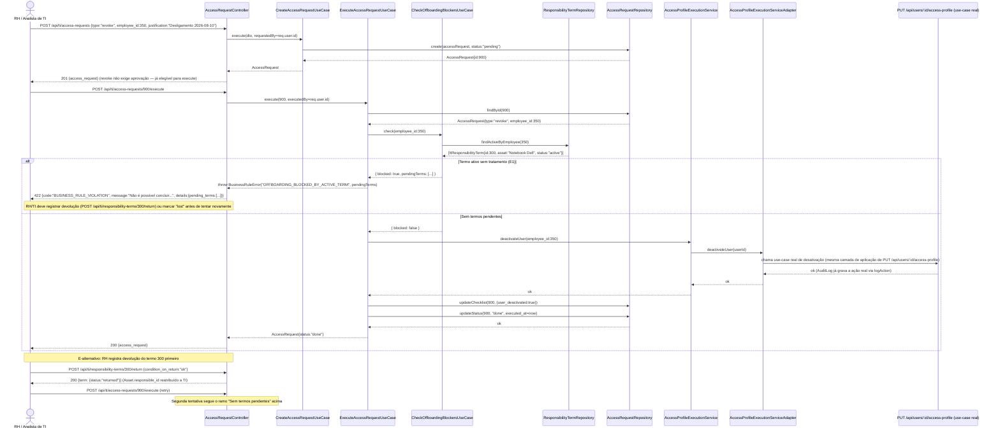

# BLOCO 2 — Módulo TI (Tecnologia da Informação) — Contrato de API

**Departamento:** 13 — TI.
**Insumos:** `docs/business/briefs/BRIEF_TI_2026-08-06.md` (domínio) e
`docs/business/BLOCO_2_TI_REQUISITOS.md` (46 RF-TI, UC-49 a UC-51, §5
decisões/pendências para arquitetos).
**Autor:** `ArquitetoSoftwareAPI`.
**Data:** 2026-08-07.
**Status:** 🟡 Contrato pronto para modelagem de banco em paralelo
(`AdmDBA`) e implementação futura (`programador`). **Nenhum código foi
criado neste passo** — TI não existe hoje em `server/src/`, exceto pela
reutilização já verificada de `Asset` (`server/src/models/Asset.ts`) e
`MaintenanceOrder` (`server/src/models/MaintenanceOrder.ts`). Segue
estritamente o padrão de `docs/business/BLOCO_1_SST_API.md` (mesmo pipeline,
Bloco 1) e a implementação real madura de `server/src/modules/sst/`
(Clean Architecture + mapper DTO PT-BR↔inglês).

**Nota de auditoria (2026-08-07):** este documento foi revisado e corrigido
pela auditoria cruzada `AuditorIntegrador` — ver
`docs/business/BLOCO_2_TI_AUDITORIA.md` para o relatório completo. Trechos
corrigidos estão marcados inline. Resumo: (1) parametrização resolvida com
tabela `ti_settings`; (2) elegibilidade de aprovador de acesso corrigida
para refletir `departments.manager_id`/`employees.user_id` já existentes;
(3) `it_ticket_priority_history` confirmada (não mais pendência); (4)
`ItTicket.requester_id` nullable + `system_generated` para chamados
automáticos; (5) `it_access_requests.corporate_email`/`equipment_needed`
adicionadas ao schema.

Base URL: `/api/ti/*` (novo módulo `server/src/modules/ti/`), exceto onde
indicado (reaproveitamento de `/api/assets`, `/api/maintenance`,
`/api/users/:id/access-profile`, `/api/purchase-requisitions`).

**Autenticação:** `Authorization: Bearer <JWT>` em todas as rotas
(`authenticate`). Identidade de quem executa a ação **sempre** vem de
`req.user.id` (nunca do body) — aplica-se a `requester_id`, `assigned_to`
(quando o próprio analista se atribui), `delivered_by`, `received_by`,
`approved_by`, `executed_by`, `verified_by`. Referência a pessoa em
qualquer payload usa exclusivamente `employee_id`/`user_id` (nunca duplica
nome/CPF — quem quiser exibir, resolve via `GET /api/employees/:id` ou
`GET /api/users/:id`).

**Tipos de dado — alinhados ao schema reutilizado (verificado em
`server/src/models/Asset.ts`, `MaintenanceOrder.ts`, `User.ts`,
`Employee.ts`):** `Asset.id`, `Employee.id`, `User.id` são
`INTEGER autoIncrement` — **não UUID**. Todas as FKs novas do módulo TI
(`asset_id`, `employee_id`, `requester_id`, `assigned_to` etc.) são
`integer` no contrato JSON, nunca `string` genérica. Isto é uma correção
deliberada de padrão em relação ao brief, que não especifica tipos de FK —
o contrato aqui os fixa como `integer` para casar com o schema real (mesmo
cuidado documentado na seção 6 de `BLOCO_1_SST_API.md`, onde `department_id`
foi corrigido de texto livre para FK).

**RBAC — novo módulo `ti`:** requer adicionar a chave `ti` ao catálogo
`ACCESS_MODULES` (`server/src/shared/domain/accessModules.ts`, hoje 31
chaves confirmadas — `ti` ausente), seguindo o padrão de comentário
estrutural já usado para `rh`/`sst`/`comex`:

```ts
{ key: 'ti', label: 'Tecnologia da Informação (TI)' }
```

Comentário a acrescentar no bloco de documentação do arquivo (mesmo
padrão dos parágrafos de `rh`/`sst` já existentes), registrando
explicitamente a natureza **inversa** do módulo `ti` em relação a `rh`/`sst`:
naqueles, o módulo restringe leitura de dado sensível mesmo para quem já
está autenticado; em `ti`, a **maior parte** do módulo é restrita a 1-2
pessoas (`operate`/`approve`), mas uma fatia (abertura/acompanhamento do
próprio chamado, RF-TI-002/014/015, BR-TI-001) é **liberada a todo usuário
autenticado independentemente de possuir o módulo**. Isso é uma tarefa do
`programador` (é código, não contrato) — documentado aqui para que o
handoff não deixe a chave nem a ressalva subentendidas.

**Padrão de erro:** idêntico ao restante do projeto — `AppError` e
subclasses (`ValidationError` 400/422, `NotFoundError` 404,
`UnauthorizedError` 401, `ForbiddenError` 403, `ConflictError` 409,
`BusinessRuleError` 422) tratadas pelo `errorHandler` central, nunca stack
trace ao cliente. Ver `docs/arquitetura/API.md` seção "Códigos de Erro".

---

## 0. O middleware `authorizeSelfOrModule` (decisão central deste bloco)

### 0.1 Problema

O padrão do projeto é `authorizeModule(<módulo>)` bloqueando a rota inteira
para quem não tem o módulo (visto em `server/src/middlewares/auth.ts`).
BR-TI-001/RF-TI-015/RNF-TI-02 exigem o oposto para uma fatia específica: **o
próprio dono do recurso** (quem abriu o chamado) deve poder lê-lo/comentá-lo
mesmo sem nenhum módulo RBAC atribuído — o único fluxo do sistema com essa
característica, além do login (RNF-TI-02, texto do requisito).

Diferente da exceção de `rh` (que resolve isso filtrando **campos**
sensíveis dentro do use case, mantendo a rota aberta para todos) e da
exceção de `sst` (duas rotas de status enxuto liberadas por checagem
`sst || rh` inline no controller, mas ainda documento de dado agregado, não
o registro completo de terceiro), aqui a necessidade é liberar a **rota
inteira do próprio registro** (histórico completo do chamado, comentários)
para quem não tem módulo nenhum, restringindo por **posse**
(`ticket.requester_id === req.user.id`).

### 0.2 Decisão: middleware reutilizável `authorizeSelfOrModule`

Especificado como novo middleware em
`server/src/middlewares/authorizeSelfOrModule.ts` (implementação é tarefa do
`programador`; abaixo, o contrato de comportamento que ele deve cumprir):

```ts
/**
 * Autoriza a requisição se:
 * (a) `req.user.role === 'admin'` (curto-circuito, igual authorizeModule); OU
 * (b) `req.user.permissions[moduleKey]` >= requiredLevel (mesma regra de
 *     authorizeModule); OU
 * (c) o usuário é "dono" do recurso, segundo `ownershipCheck(req)` — função
 *     assíncrona fornecida pelo chamador, que resolve o recurso (ex.:
 *     buscar o ItTicket por :id) e retorna `true` se
 *     `resource.requester_id === req.user.id`.
 *
 * Diferença crítica para authorizeModule: aqui a AUSÊNCIA de
 * accessProfileId/módulo NÃO é 403 automático — cai para a checagem de
 * posse (c) antes de negar. Auditoria de acesso negado (`access_denied`)
 * só é registrada se (c) também falhar.
 */
function authorizeSelfOrModule(
  moduleKey: AccessModuleKey,
  requiredLevel: AccessModuleLevel,
  ownershipCheck: (req: Request) => Promise<boolean>,
): (req: Request, res: Response, next: NextFunction) => Promise<void>;
```

**Uso nas rotas de auto-serviço deste bloco** (única aplicação no projeto até
hoje — se um módulo futuro precisar do mesmo padrão, reutiliza este
middleware em vez de recriar a checagem inline):

- `GET /api/ti/tickets/:id` — `ownershipCheck` = `ticket.requester_id ===
  req.user.id` (busca o ticket por id antes de decidir).
- `POST /api/ti/tickets/:id/comments` — mesma checagem, com a ressalva de
  RF-TI-014 (nota interna `is_internal` só é visível a quem tem módulo
  `ti`; ownership não dá acesso a notas internas — ver §1.3).
- `GET /api/ti/tickets/mine` **não usa** o middleware — é sempre
  auto-filtrado por `req.user.id` no próprio use case, sem alternativa de
  módulo (não existe "ver os chamados de todo mundo" nesta rota; isso é
  `GET /api/ti/tickets`, atrás de `authorizeModule('ti')`).
- `POST /api/ti/tickets` (abertura) **não usa** o middleware — é sempre
  liberado por `authenticate` puro (não há recurso ainda para checar posse).

### 0.3 Resumo das 3 categorias de autorização deste módulo

| Categoria | Mecanismo | Exemplos |
|---|---|---|
| **público-autenticado / self-service** | `authenticate` puro, ou `authorizeSelfOrModule('ti', 'operate', ownership)` | Abrir chamado, ver/comentar o próprio chamado, `GET /mine` |
| **ti:operate** | `authorizeModule('ti', 'operate')` | Fila completa, triagem, atribuição, resolução, termos, licenças (CRUD), backup log, execução de acesso |
| **ti:approve** | `authorizeModule('ti', 'approve')` | Cancelar/excluir vínculo de matriz (não aplicável aqui — ver por recurso), aprovar `grant`/`change` de acesso, marcar termo `lost`, confirmar renovação de licença que gera Requisição de Compra |

Cada tabela de rota abaixo declara explicitamente a categoria na coluna
"Auth".

---

## Estrutura de módulo (Clean Architecture)

```
server/src/modules/ti/
├── domain/
│   ├── entities/                 # ItTicket, ItTicketCategory, ItTicketComment,
│   │                              #  ItResponsibilityTerm, ItSoftwareLicenseDetail,
│   │                              #  ItLicenseSeat, ItAccessRequest, ItBackupLog
│   └── repositories/             # Interfaces: TicketRepository, TicketCategoryRepository,
│                                  #  ResponsibilityTermRepository, LicenseDetailRepository,
│                                  #  AccessRequestRepository, BackupLogRepository
├── application/
│   ├── services/                 # AssetLookupService, MaintenanceOrderService,
│   │                              #  AccessProfileExecutionService, PurchaseRequisitionService
│   │                              #  (interfaces — cada uma com um adapter em infrastructure/,
│   │                              #  nunca import direto de outro módulo)
│   └── use-cases/
│       ├── ticket/                # CreateTicketUseCase, AssignTicketUseCase,
│       │                          #  ChangeTicketStatusUseCase, ResolveTicketUseCase,
│       │                          #  CloseTicketUseCase (confirmação/auto-close),
│       │                          #  ReopenTicketUseCase, AddTicketCommentUseCase,
│       │                          #  ListMyTicketsUseCase, ListTicketsUseCase (fila),
│       │                          #  GetTicketByIdUseCase, LinkMaintenanceOrderUseCase
│       ├── term/                  # DeliverAssetUseCase, ReturnAssetUseCase,
│       │                          #  MarkTermLostUseCase, GetEmployeeTermsUseCase,
│       │                          #  ListPendingTermsForOffboardingUseCase
│       ├── license/               # CreateLicenseDetailUseCase, AllocateSeatUseCase,
│       │                          #  RevokeSeatUseCase, GetLicenseKeyRevealUseCase,
│       │                          #  ListExpiringLicensesUseCase, RequestRenewalUseCase
│       ├── accessRequest/         # CreateAccessRequestUseCase, ApproveAccessRequestUseCase,
│       │                          #  RejectAccessRequestUseCase, ExecuteAccessRequestUseCase,
│       │                          #  CancelAccessRequestUseCase, CheckOffboardingBlockersUseCase
│       └── backup/                # RegisterBackupLogUseCase, CheckBackupHealthUseCase,
│                                  #  ListBackupHealthUseCase
├── infrastructure/
│   ├── adapters/                  # AssetLookupServiceAdapter (chama use case real de
│                                  #  server/src/modules/assets/), MaintenanceOrderServiceAdapter,
│                                  #  AccessProfileExecutionServiceAdapter (chama
│                                  #  PUT /api/users/:id/access-profile internamente via
│                                  #  use-case, não HTTP loopback), PurchaseRequisitionServiceAdapter
│   ├── mappers/                   # TicketMapper, TermMapper, LicenseMapper,
│                                  #  AccessRequestMapper, BackupLogMapper (PT-BR↔inglês,
│                                  #  mesmo padrão de EpiMapper/AsoMapper do módulo sst)
│   └── sequelize/                 # SequelizeTicketRepository, SequelizeTermRepository,
│                                  #  SequelizeLicenseDetailRepository,
│                                  #  SequelizeAccessRequestRepository, SequelizeBackupLogRepository
└── presentation/
    ├── controllers/               # ticketController, termController, licenseController,
    │                              #  accessRequestController, backupController
    └── routes/                    # ti.ts (router agregador único, montado em /api/ti,
                                    #  mesmo padrão de server/src/routes/*.ts)
```

**Tipos extraídos para `*Types.ts`** (evitar a armadilha ESM+CJS no mesmo
arquivo — ver `CLAUDE.md`/system prompt e `ProductionDowntimeTypes.ts` como
referência): `TicketTypes.ts`, `TermTypes.ts`, `LicenseTypes.ts`,
`AccessRequestTypes.ts`, `BackupLogTypes.ts` — cada um contendo somente
`export interface`/`export type` de DTOs de entrada/saída, importados pelos
controllers/use-cases. Nenhuma classe com `export =` divide arquivo com
`export interface`.

**Baixo acoplamento — 4 interfaces de serviço injetadas, nunca import
direto de outro módulo:**
1. `AssetLookupService` — usado por `CreateTicketUseCase` (buscar asset por
   tag/QR opcional) e por `DeliverAssetUseCase`/`ReturnAssetUseCase`
   (ler/atualizar `Asset.responsible_id`/`location`). Implementado por
   adapter que chama o use-case real de `server/src/modules/assets/`
   (nunca `Asset` Sequelize direto a partir do módulo `ti`).
2. `MaintenanceOrderService` — usado por `LinkMaintenanceOrderUseCase`.
   Adapter chama o use-case real de `server/src/modules/maintenance/`.
3. `AccessProfileExecutionService` — usado por
   `ExecuteAccessRequestUseCase`. Adapter chama o use-case real de
   `PUT /api/users/:id/access-profile` (camada de aplicação, não HTTP
   loopback) e a desativação de usuário existente.
4. `PurchaseRequisitionService` — usado por `RequestRenewalUseCase`.
   Adapter chama o use-case real de criação de Requisição de Compra
   (`/api/purchase-requisitions`).

---

## 1. Chamados de TI — Helpdesk (Processo P1, UC-49)

Base: `/api/ti/tickets`, `/api/ti/ticket-categories`.

### 1.1 ItTicketCategory (catálogo leve)

| Método | Rota | Auth | Descrição |
|---|---|---|---|
| `GET` | `/api/ti/ticket-categories` | ti:operate | Lista categorias (filtro `active`) — usada também para popular o seletor de categoria na abertura do chamado |
| `GET` | `/api/ti/ticket-categories/active` | público-autenticado | Versão enxuta (`id`, `name`, `default_priority`) para o formulário de abertura de qualquer usuário — não exige módulo `ti` |
| `POST` | `/api/ti/ticket-categories` | ti:operate | Cria categoria |
| `PUT` | `/api/ti/ticket-categories/:id` | ti:operate | Atualiza (inclusive `active: false` — sem `DELETE`, é catálogo referenciado por `ItTicket`) |

**POST — Request:**
```json
{ "name": "Rede", "description": "Conectividade, Wi-Fi, VPN", "default_priority": "medium", "active": true }
```
`default_priority` (enum): `low` / `medium` / `high` / `urgent`.

**Erros:**
| Código | Quando |
|---|---|
| 400 | `name` ausente |
| 409 | `name` já cadastrado em categoria ativa |

### 1.2 ItTicket (núcleo do helpdesk)

Modelado como **transição de estado controlada** (RF-TI-006/BR-TI-003), não
CRUD livre de status.

| Método | Rota | Auth | Descrição |
|---|---|---|---|
| `POST` | `/api/ti/tickets` | **público-autenticado** | Abre chamado; `requester_id` sempre `req.user.id` |
| `GET` | `/api/ti/tickets/mine` | **público-autenticado** | Lista os próprios chamados (qualquer status), auto-filtrado por `req.user.id`, sem alternativa de módulo |
| `GET` | `/api/ti/tickets/:id` | **self-or-module** (`authorizeSelfOrModule('ti','operate', ownership)`) | Detalhe — dono vê sempre; terceiro exige `ti:operate` |
| `GET` | `/api/ti/tickets` | ti:operate | Fila completa (filtros: `status`, `priority`, `category_id`, `assigned_to`, `asset_id`, `sla_overdue`, `start_date`, `end_date`) |
| `POST` | `/api/ti/tickets/:id/assign` | ti:operate | Analista assume o chamado (`assigned_to = req.user.id`) e move para `in_progress` — triagem implícita (RF-TI-004) |
| `PUT` | `/api/ti/tickets/:id/priority` | ti:operate | Reclassifica prioridade (RF-TI-005) — grava histórico de/para |
| `POST` | `/api/ti/tickets/:id/wait` | ti:operate | `in_progress → waiting` (pausa cronômetro de resolução) |
| `POST` | `/api/ti/tickets/:id/resume` | ti:operate | `waiting → in_progress` (retoma cronômetro) |
| `POST` | `/api/ti/tickets/:id/link-maintenance-order` | ti:operate | Gera/vincula `MaintenanceOrder`; chamado vai a `waiting` (RF-TI-007/BR-TI-009) |
| `POST` | `/api/ti/tickets/:id/resolve` | ti:operate | Registra `solution` (obrigatória) → `resolved` (RF-TI-008/BR-TI-004) |
| `POST` | `/api/ti/tickets/:id/confirm` | **self-or-module** | Solicitante confirma resolução (+ `satisfaction_rating` opcional) → `closed`; dono ou `ti:operate` em nome dele |
| `POST` | `/api/ti/tickets/:id/reopen` | **self-or-module** | Reabre `resolved`/`closed → in_progress`, dentro do prazo parametrizável (RF-TI-013, E3 do UC-49) |
| `POST` | `/api/ti/tickets/:id/cancel` | ti:operate | `open → canceled` |
| `GET` | `/api/ti/tickets/:id/comments` | **self-or-module** | Lista comentários (notas `is_internal` filtradas se o requisitante não tem módulo `ti`) |
| `POST` | `/api/ti/tickets/:id/comments` | **self-or-module** | Adiciona comentário; `is_internal: true` só é aceito se `req.user` tem módulo `ti` (senão `403`, ver E-novo abaixo) |

**POST /api/ti/tickets — Request:**
```json
{
  "subject": "Impressora do RH não imprime",
  "description": "Erro de driver desde ontem",
  "category_id": 4,
  "asset_id": 118,
  "urgency_perceived": "medium",
  "opened_on_behalf_of": null
}
```
**Nota de nomenclatura/tipo (corrigida por auditoria cruzada, achado de
naming):** `urgency_perceived` (string enum `low|medium|high|urgent`, a
percepção do solicitante na abertura) **não é** a mesma coisa que a coluna
`it_tickets.urgency` do banco (`SMALLINT` 1-3, preenchida pelo analista na
triagem junto com `impact`, RF-TI-004). `urgency_perceived` **não é
persistida como coluna própria** — o `CreateTicketUseCase` usa esse valor
apenas para sobrepor a `priority` herdada de `category.default_priority`
(se o solicitante perceber urgência maior que o padrão da categoria, a
`priority` inicial já nasce mais alta) e descarta a string em seguida; a
granularidade fina (`impact`/`urgency` numéricos 1-3) só existe a partir da
triagem do analista (`POST /:id/assign`). Se uma implementação futura
decidir que a percepção original do solicitante deve ficar auditável, isso
exige uma coluna nova (`initial_priority_source` ou similar) — fora de
escopo deste bloco, registrado aqui para não ser perdido.

`asset_id` opcional (busca por tag/QR no formulário, resolve para o id
antes do submit). `opened_on_behalf_of` (FK → `employees.id`) só é aceito
se `req.user` tem módulo `ti` nível `operate` (RF-TI-003/BR-TI-002) — se
informado por quem não tem o módulo, a API **ignora silenciosamente o
campo e usa sempre o próprio solicitante como dono**, nunca erro 403 aqui,
para não travar abertura de chamado por payload malformado; é o mesmo
padrão de robustez de ignorar campos de identidade não autorizados citado
em `CLAUDE.md` §4. Resposta (`201`) inclui `priority` (herdada de
`category.default_priority`, salvo `impact`/`urgency` informados),
`sla_response_due_at`, `sla_resolution_due_at` (RF-TI-009) e
`ticket_number` (`TI-2026-0001`).

**Erros:**
| Código | Quando |
|---|---|
| 400 | `subject`, `description` ou `category_id` ausentes |
| 404 | `category_id` ou `asset_id` informado não existe |

**POST /:id/assign — Request:** (sem body; `assigned_to = req.user.id`)
Opcionalmente aceita `{ "category_id": 4, "impact": 2, "urgency": 3 }` para
ajustar categoria/matriz de prioridade no mesmo passo (RF-TI-004).

**PUT /:id/priority — Request:**
```json
{ "priority": "high", "impact": 3, "urgency": 2, "reason": "Impacta linha de produção" }
```
Grava em histórico na tabela `it_ticket_priority_history` (confirmada em
`BLOCO_2_TI_MODELO_DADOS.md` §3.4, migration `20260807-000151`; corrigido
por auditoria cruzada — a versão original desta seção tratava a existência
dessa tabela como pendência em aberto): `ticket_id`, `changed_by`,
`previous_priority`, `new_priority`, `reason`, `changed_at`.

**POST /:id/resolve — Request:**
```json
{ "solution": "Reinstalado driver HP LaserJet e testado com folha de teste." }
```
**Erro (422/`BUSINESS_RULE_VIOLATION`)** — `solution` vazia (BR-TI-004).

**POST /:id/confirm — Request:**
```json
{ "satisfaction_rating": 5, "satisfaction_comment": "Rápido, obrigado!" }
```
Ambos os campos opcionais (fechamento sem avaliação é permitido, RF-TI-012).

**POST /:id/comments — Request:**
```json
{ "body": "Já tentei reiniciar a impressora, sem sucesso.", "is_internal": false }
```

**Erros transversais do recurso `ItTicket`:**
| Código | `code` | Quando | UC |
|---|---|---|---|
| 400 | `VALIDATION_ERROR` | Tentativa de `POST /:id/confirm` ou `/cancel` diretamente de `in_progress`/`waiting` sem passar por `resolved` | E1 (UC-49) |
| 403 | `FORBIDDEN` | Usuário sem módulo `ti` tenta `GET /api/ti/tickets` (fila), `/assign`, `/wait`, `/resolve` de chamado de terceiro | E2 (UC-49) |
| 403 | `FORBIDDEN` | Usuário sem módulo `ti` tenta `POST /:id/comments` com `is_internal: true` (qualquer chamado, inclusive o próprio) | novo — RF-TI-014 |
| 403 | `FORBIDDEN` | Usuário tenta `GET /:id`/`comments`/`confirm`/`reopen` de chamado de terceiro sem módulo `ti` (`authorizeSelfOrModule` nega) | E2 (UC-49), RNF-TI-02 |
| 409 | `CONFLICT` | Tentativa de reabrir chamado que já foi reaberto e está `in_progress` novamente (idempotência negativa) | — |
| 422 | `BUSINESS_RULE_VIOLATION` | Reabertura fora do prazo parametrizável (RF-TI-006) | E3 (UC-49) |

**GET /api/ti/tickets/:id — Response (200), visão do dono (sem módulo `ti`):**
```json
{
  "success": true,
  "data": {
    "id": 900, "ticket_number": "TI-2026-0142", "subject": "Impressora do RH não imprime",
    "status": "resolved", "priority": "medium", "category": { "id": 4, "name": "Hardware" },
    "asset": { "id": 118, "tag": "TI-0042", "name": "HP LaserJet M404" },
    "assigned_to": { "id": 12, "name": "Analista de TI" },
    "solution": "Reinstalado driver HP LaserJet e testado com folha de teste.",
    "sla_response_due_at": "2026-08-06T14:00:00Z", "sla_resolution_due_at": "2026-08-08T12:00:00Z",
    "sla_overdue": false, "first_response_at": "2026-08-06T13:10:00Z", "resolved_at": "2026-08-07T09:00:00Z",
    "closed_at": null, "satisfaction_rating": null,
    "comments": [ { "id": 3010, "author": { "id": 501, "name": "Solicitante X" }, "body": "...", "is_internal": false, "created_at": "..." } ]
  }
}
```
Notas internas (`is_internal: true`) são omitidas do array `comments` para
quem não tem módulo `ti` — filtro aplicado no use case
(`GetTicketByIdUseCase`), não no controller (mesma prática de filtragem de
campo já usada em `employeeSensitiveFields.ts` do módulo `rh`).

---

## 2. Termo de Responsabilidade de Equipamento (Processo P2, UC-50)

Base: `/api/ti/responsibility-terms`. Todas as rotas: `ti:operate`, exceto
onde indicado.

| Método | Rota | Auth | Descrição |
|---|---|---|---|
| `GET` | `/api/ti/responsibility-terms` | ti:operate | Lista (filtros: `employee_id`, `asset_id`, `status`, `department_id`) |
| `GET` | `/api/ti/responsibility-terms/:id` | ti:operate | Detalhe |
| `POST` | `/api/ti/responsibility-terms` | ti:operate | Registra entrega (cria termo `active`) |
| `POST` | `/api/ti/responsibility-terms/:id/return` | ti:operate | Registra devolução (`status: returned`) |
| `POST` | `/api/ti/responsibility-terms/:id/lost` | **ti:approve** | Marca `lost` com justificativa obrigatória (perda/roubo, sem devolução física) |
| `GET` | `/api/ti/responsibility-terms/by-employee/:employeeId` | ti:operate | Ficha "equipamentos por funcionário" (RF-TI-022) |
| `GET` | `/api/ti/responsibility-terms/pending-for-offboarding/:employeeId` | ti:operate (**também consumida internamente por RH — ver §2.4**) | Lista termos `active` pendentes do funcionário (RF-TI-023) |

**POST /api/ti/responsibility-terms — Request:**
```json
{
  "asset_id": 118,
  "employee_id": 501,
  "condition_on_delivery": "Notebook em bom estado, sem avarias visíveis",
  "accessories": "Carregador, mochila, mouse sem fio",
  "acceptance_type": "digital_ack",
  "signed_document_path": null
}
```
`asset_id` deve ter `asset_type='it'` (BR-TI-008 aplicado por analogia — a
API não permite termo sobre asset de outro tipo). `signed_document_path`
(upload via Multer, mesma infra de `docs/arquitetura/API.md` seção
"Upload") é **obrigatório quando `acceptance_type='physical_signature'`**
(E3 do UC-50) — payload aqui representa o caminho do arquivo já enviado por
`multipart/form-data` num passo anterior/simultâneo, seguindo o mesmo
padrão de outros uploads do projeto (ex.: foto de asset em
`server/src/modules/assets/`).

**Erros:**
| Código | `code` | Quando |
|---|---|---|
| 400 | `VALIDATION_ERROR` | `asset_id`/`employee_id` ausentes, ou `asset_id` não é `asset_type='it'` |
| 404 | `NOT_FOUND` | `asset_id` ou `employee_id` não existe |
| 409 | `CONFLICT` | Já existe `ItResponsibilityTerm` `active` para o `asset_id` (E1/BR-TI-010) — mensagem inclui funcionário atual e data de início |
| 422 | `BUSINESS_RULE_VIOLATION` | `acceptance_type='physical_signature'` sem `signed_document_path` (E3) |

Efeitos do `201`, na mesma transação: cria o termo `active` e atualiza
`Asset.responsible_id`/`Asset.location` via `AssetLookupService`
(RF-TI-018) — nunca edição manual paralela do asset fora do termo
(BR-TI-010).

**POST /:id/return — Request:**
```json
{ "condition_on_return": "ok", "return_notes": "Devolvido em perfeito estado" }
```
`condition_on_return` (enum): `ok` / `damaged` / `incomplete`. Efeitos:
encerra o termo (`status: returned`), reatribui `Asset.responsible_id` a TI
(ou próximo responsável, se informado) e — se `condition_on_return =
"damaged"` — cria/associa `ItTicket` (categoria "Hardware") ou
`MaintenanceOrder` referenciando o asset (RF-TI-021, A1 do UC-50).

**Erro (400)** — termo não está `active` (não é possível devolver termo já
`returned`/`lost`).

**POST /:id/lost — Request:**
```json
{ "justification": "Notebook furtado em viagem a trabalho, B.O. nº 12345/2026" }
```
**Erro (400)** — `justification` ausente.

**GET /api/ti/responsibility-terms/pending-for-offboarding/:employeeId —
Response (200):**
```json
{
  "success": true,
  "data": {
    "employee_id": 501,
    "has_pending_terms": true,
    "terms": [ { "id": 300, "asset": { "id": 118, "tag": "TI-0042", "name": "Notebook Dell" }, "delivered_at": "2026-01-10", "status": "active" } ]
  }
}
```
Consumida diretamente por `CheckOffboardingBlockersUseCase` do recurso
`ItAccessRequest` (§4) — ver §2.4 sobre a natureza da integração.

### 2.4 Integração com offboarding (RH ainda sem tela — decisão §5.4 do requisitos)

Como o módulo RH não tem camada de eventos/telas hoje
(`BLOCO_2_TI_REQUISITOS.md` §5.4), a primeira versão trata o gatilho como
**chamada direta de use case a use case dentro do próprio backend**, não um
endpoint HTTP separado: `ExecuteAccessRequestUseCase` (tipo `revoke`) chama
internamente `CheckOffboardingBlockersUseCase`, que por sua vez consulta o
mesmo repositório usado por
`GET /api/ti/responsibility-terms/pending-for-offboarding/:employeeId` — a
rota REST existe para uso de tela (RH consultando manualmente antes de
desligar), e o use case interno a reaproveita sem HTTP loopback. Não há
endpoint `POST` de "bloquear desligamento" nesta versão — o bloqueio
acontece dentro de `POST /api/ti/access-requests/:id/execute` (§4.3).

---

## 3. Licenças de Software (Processo P3) — visão/extensão de `Asset`

Base: `/api/ti/licenses` (visão enriquecida de `assets` +
`ItSoftwareLicenseDetail`, nunca CRUD paralelo de ativo — BR-TI-008). O
cadastro do próprio `Asset` (`asset_type='license'`) continua em
`POST /api/assets` (módulo Patrimônio); este módulo só adiciona a extensão.

| Método | Rota | Auth | Descrição |
|---|---|---|---|
| `GET` | `/api/ti/licenses` | ti:operate | Lista licenças (join `assets` × `ItSoftwareLicenseDetail`; filtros: `vendor`, `license_type`, `expiring_in_days`, `status_derivado=expired\|active\|expiring`) |
| `GET` | `/api/ti/licenses/:assetId` | ti:operate | Detalhe (com `license_key` mascarada por padrão) |
| `POST` | `/api/ti/licenses` | ti:operate | Cria `ItSoftwareLicenseDetail` para um `asset_id` já existente (`asset_type='license'`) |
| `PUT` | `/api/ti/licenses/:assetId` | ti:operate | Atualiza fornecedor/seats/custo/ciclo |
| `POST` | `/api/ti/licenses/:assetId/reveal-key` | **ti:operate ou role=admin, com log de leitura** | Retorna `license_key` em claro (RF-TI-027/BR-TI-014/RNF-TI-01) |
| `GET` | `/api/ti/licenses/:assetId/seats` | ti:operate | Lista assentos alocados |
| `POST` | `/api/ti/licenses/:assetId/seats` | ti:operate | Aloca assento a `employee_id` |
| `DELETE` | `/api/ti/licenses/:assetId/seats/:seatId` | ti:operate | Revoga assento (`revoked_at`, sem hard delete de linha) |
| `GET` | `/api/ti/licenses/expiring` | ti:operate | Alerta consolidado (janelas 30/15/7 dias, parametrizáveis — RF-TI-028) |
| `POST` | `/api/ti/licenses/:assetId/request-renewal` | **ti:approve** | Gera Requisição de Compra (renovação com custo) via `PurchaseRequisitionService` |

**POST /api/ti/licenses — Request:**
```json
{ "asset_id": 205, "license_type": "subscription", "vendor": "Autodesk", "seats": 5, "cost": 1200.00, "billing_cycle": "yearly", "license_key": "XXXX-YYYY-ZZZZ", "renewal_date": "2026-12-01" }
```
`asset_id` deve existir com `asset_type='license'` (senão `404`/`400`).

**Erros:**
| Código | `code` | Quando |
|---|---|---|
| 400 | `VALIDATION_ERROR` | `asset_id` não tem `asset_type='license'` |
| 404 | `NOT_FOUND` | `asset_id` não existe |
| 409 | `CONFLICT` | Já existe `ItSoftwareLicenseDetail` para esse `asset_id` (FK única, RF-TI-024) |

**GET /:assetId — Response (200), leitura padrão (chave mascarada):**
```json
{
  "success": true,
  "data": {
    "asset_id": 205, "name": "AutoCAD 2026", "vendor": "Autodesk", "license_type": "subscription",
    "seats": 5, "seats_allocated": 4, "cost": 1200.00, "billing_cycle": "yearly",
    "license_key_masked": "XXXX-****-****", "renewal_date": "2026-12-01",
    "license_expires_at": "2026-12-31", "status_derivado": "active"
  }
}
```
`license_key_masked`: mostra apenas os 4 primeiros caracteres, resto `*`.

**POST /:assetId/reveal-key — Response (200):**
```json
{ "success": true, "data": { "license_key": "XXXX-YYYY-ZZZZ" } }
```
Todo acesso gera log de **leitura** (não apenas escrita) — RNF-TI-01, mesmo
padrão de `RNF-SST-05` do bloco SST.

**Erro (403)** — usuário sem módulo `ti` e `role !== 'admin'` tentando
`reveal-key` (BR-TI-014).

**POST /:assetId/seats — Request:**
```json
{ "employee_id": 501 }
```
**Erro (422/`BUSINESS_RULE_VIOLATION`)** — assentos ativos já atingiram
`seats` contratado (RF-TI-026/BR-TI-015); resposta inclui `seats_allocated`
e `seats` para orientar o usuário (padrão O QUE/POR QUE/O QUE FAZER).

**POST /:assetId/request-renewal — Request:**
```json
{ "estimated_cost": 6000.00, "justification": "Renovação anual AutoCAD, 5 assentos" }
```
Efeito: cria uma `PurchaseRequisition` via `PurchaseRequisitionService`
(módulo `/api/purchase-requisitions`) referenciando o `asset_id`; resposta
(`201`) inclui `purchase_requisition_id`. TI nunca compra fora do fluxo de
suprimentos (BR-TI-015).

**GET /api/ti/licenses/expiring — Response (200):**
```json
{
  "success": true,
  "data": [
    { "asset_id": 205, "name": "AutoCAD 2026", "license_expires_at": "2026-08-20", "days_remaining": 13, "alert_window": 15 }
  ]
}
```

---

## 4. Solicitações de Acesso — Onboarding/Change/Offboarding (Processo P4, UC-51)

Base: `/api/ti/access-requests`. `grant`/`change` exigem aprovação antes da
execução; `revoke` dispensa aprovação prévia (BR-TI-012).

| Método | Rota | Auth | Descrição |
|---|---|---|---|
| `GET` | `/api/ti/access-requests` | ti:operate | Lista (filtros: `type`, `status`, `employee_id`, `department_id`, `pending_over_days`) |
| `GET` | `/api/ti/access-requests/:id` | ti:operate | Detalhe (inclui checklist, aprovação, execução) |
| `POST` | `/api/ti/access-requests` | ti:operate | Cria solicitação (`grant`/`change`/`revoke`); `requested_by = req.user.id` |
| `POST` | `/api/ti/access-requests/:id/approve` | **ti:approve** (ou gestor do `department_id` — ver §4.1) | Aprova `grant`/`change` |
| `POST` | `/api/ti/access-requests/:id/reject` | **ti:approve** (ou gestor do `department_id`) | Rejeita com motivo |
| `POST` | `/api/ti/access-requests/:id/execute` | ti:operate | Executa (cria/atualiza usuário, vincula perfil, entrega/recolhe equipamento); bloqueado para `revoke` com termos pendentes |
| `POST` | `/api/ti/access-requests/:id/checklist` | ti:operate | Atualiza item do `checklist` JSONB (parcial, sem re-executar tudo) |
| `POST` | `/api/ti/access-requests/:id/cancel` | ti:operate | Cancela solicitação `pending`/`approved` ainda não executada |

**POST /api/ti/access-requests — Request (grant):**
```json
{
  "type": "grant",
  "employee_id": 620,
  "department_id": 4,
  "requested_profile_id": 7,
  "justification": "Admissão — Analista de Compras Jr.",
  "corporate_email": "novo.funcionario@evokaudio.com",
  "equipment_needed": ["notebook", "headset"]
}
```
**Request (revoke):**
```json
{
  "type": "revoke",
  "employee_id": 350,
  "justification": "Desligamento em 2026-08-10",
  "checklist": { "user_deactivated": false, "email_revoked": false, "equipment_collected": false, "files_transferred": false }
}
```
`revoke` não exige `requested_profile_id` nem aprovação — vai direto a
`pending`, elegível para `execute` imediatamente (RF-TI-034).

**Nota (corrigida por auditoria cruzada, achado #7):** `corporate_email` e
`equipment_needed` são persistidos em `it_access_requests.corporate_email`
(`VARCHAR(150)`) e `it_access_requests.equipment_needed` (`JSONB`) —
colunas ausentes na migration `20260807-000154` original apesar de já
contratadas neste payload; adicionadas pela auditoria antes da
implementação. `equipment_needed` é apenas registro de intenção; a entrega
real do equipamento sempre passa por `ItResponsibilityTerm` (UC-50) durante
`.../execute`.

**Erros:**
| Código | `code` | Quando |
|---|---|---|
| 400 | `VALIDATION_ERROR` | `type`/`employee_id` ausentes; `grant`/`change` sem `requested_profile_id` |
| 404 | `NOT_FOUND` | `employee_id`/`department_id`/`requested_profile_id` não existe |

**POST /:id/approve — Erros:**
| Código | `code` | Quando |
|---|---|---|
| 400 | `VALIDATION_ERROR` | Solicitação não está `pending`, ou é `type=revoke` (revoke não passa por approve) |
| 403 | `FORBIDDEN` | Usuário não tem `ti:approve` nem é gestor do `department_id` do funcionário-alvo (§4.1) |

`approved_by`/`approved_at` sempre do JWT — payload não aceita esses campos
(E2 do UC-51, spoofing).

### 4.1 Elegibilidade do aprovador (pendência §5.2 do requisitos — RESOLVIDA pela auditoria cruzada)

**Corrigido por `AuditorIntegrador` (achado #2, `docs/business/BLOCO_2_TI_AUDITORIA.md`):**
a versão original desta seção afirmava que "não há tabela verificada no
schema atual (`departments`) que aponte um responsável/gestor" — isso está
**incorreto** e contradiz o próprio `BLOCO_2_TI_MODELO_DADOS.md` §1/§4, que
já apontava `departments.manager_id` (FK → `employees.id`, verificado em
`server/src/models/Department.ts`). A auditoria confirmou adicionalmente
que `employees.user_id` (FK → `users.id`, verificado em
`server/src/models/Employee.ts`) fecha a cadeia até o usuário do sistema.

`approved_by` permanece FK genérica para `users` (qualquer papel elegível
grava o mesmo campo); a elegibilidade em `POST /:id/approve` é:

```
elegível = req.user.role === 'admin'
        OR req.user.permissions.ti === 'approve'
        OR (
             gestor = Employee.findOne({ where: { id: department.manager_id } })
             E gestor.user_id === req.user.id
           )
```

Nenhuma migração de schema é necessária — `manager_id` e `user_id` já
existem e estão em produção. Implementação: `POST /:id/approve` resolve o
funcionário-gestor a partir de `department.manager_id` (pode ser `NULL` —
nem todo departamento tem gestor cadastrado; nesse caso só a 1ª/2ª condição
se aplicam) e compara `gestor.user_id` com `req.user.id`.

**POST /:id/execute — Efeitos (grant/change):**
1. Cria usuário (se ainda não existir) e/ou vincula perfil via
   `AccessProfileExecutionService` → `PUT /api/users/:id/access-profile`.
2. Se `equipment_needed` presente, cria `ItResponsibilityTerm` via chamada
   interna ao use case de §2 (não duplica a lógica de entrega).
3. Marca `executed_by`/`executed_at`/`execution_notes`; status `done`.

**POST /:id/execute — Efeitos (revoke):**
1. Chama `CheckOffboardingBlockersUseCase(employee_id)` (§2.4). Se houver
   termo `active` sem tratamento → **bloqueia** (ver erro E1 abaixo); o
   checklist item `equipment_collected` não pode ser marcado `true` nem a
   execução completa enquanto houver pendência.
2. Se sem bloqueio: desativa usuário via `AccessProfileExecutionService`,
   marca `checklist.user_deactivated = true`.
3. `email_revoked`/`files_transferred` são marcados manualmente pelo
   analista via `POST /:id/checklist` (não há integração automatizada de
   e-mail/arquivos neste bloco — fora de escopo do brief).
4. Quando todos os itens do `checklist` estão `true`, `execute` finaliza a
   solicitação (`status: done`, `executed_at`).

**Erros de `POST /:id/execute`:**
| Código | `code` | Quando | UC |
|---|---|---|---|
| 400 | `VALIDATION_ERROR` | Solicitação já `done`/`rejected`/`canceled` | — |
| 400 | `VALIDATION_ERROR` | `grant`/`change` ainda `pending` (não aprovada) | — |
| 404 | `NOT_FOUND` | Solicitação não encontrada |
| 422 | `BUSINESS_RULE_VIOLATION` | `revoke` com `ItResponsibilityTerm` `active` sem tratamento (E1/RF-TI-037/BR-TI-011) — resposta inclui a lista de termos pendentes (mesmo payload de §2.3) | E1 (UC-51) |

**Response de erro E1 (exemplo):**
```json
{
  "success": false,
  "error": {
    "code": "BUSINESS_RULE_VIOLATION",
    "message": "Não é possível concluir o recolhimento de equipamentos: existem termos de responsabilidade ativos para este funcionário.",
    "details": { "pending_terms": [ { "id": 300, "asset": { "tag": "TI-0042", "name": "Notebook Dell" } } ] }
  }
}
```

**POST /:id/checklist — Request:**
```json
{ "field": "email_revoked", "value": true }
```

---

## 5. Backup e Continuidade (Processo P5)

Base: `/api/ti/backup-logs`. Tabela mínima, majoritariamente alimentada por
script pós-cron (mesma máquina/processo do runbook, `CLAUDE.md` §6), com
registro manual do teste de restore.

| Método | Rota | Auth | Descrição |
|---|---|---|---|
| `GET` | `/api/ti/backup-logs` | ti:operate | Lista (filtros: `backup_type`, `success`, `start_date`, `end_date`) |
| `POST` | `/api/ti/backup-logs` | ti:operate (script pós-cron autentica com uma conta de serviço/token de aplicação — mesmo padrão de outras integrações automatizadas do projeto, não usuário humano) | Registra execução de backup/teste de restore |
| `GET` | `/api/ti/backup-logs/health` | ti:operate | Painel: último backup `daily` (sucesso/falha), dias desde último `restore_test`, alerta se `> 26h` sem `daily` bem-sucedido (RNF-TI-04) |

**POST /api/ti/backup-logs — Request:**
```json
{
  "executed_at": "2026-08-07T02:00:00Z", "backup_type": "daily", "target": "database",
  "destination": "s3://evok-backups/db/2026-08-07.dump", "size_bytes": 452000000,
  "success": true, "error_message": null, "notes": null
}
```
`backup_type` (enum): `daily` / `weekly` / `monthly` / `restore_test`.
`target` (enum): `database` / `uploads`.

**Efeito automático (RF-TI-040/BR-TI-017):** se `success: false`, a API cria
automaticamente um `ItTicket` `urgent` na categoria "Sistema ERP"
(`CreateTicketUseCase` chamado internamente com `requester_id: null` e
`system_generated: true` — **resolvido pela auditoria cruzada**:
`it_tickets.requester_id` foi corrigido para `NULLABLE` e a coluna
`system_generated` foi adicionada em `20260807-000150`, com `CHECK
(requester_id IS NOT NULL OR system_generated = true)`; não há mais
necessidade de usuário de serviço fixo `bot@ti`). Resposta (`201`) inclui
`generated_ticket_id` quando aplicável.

**GET /api/ti/backup-logs/health — Response (200):**
```json
{
  "success": true,
  "data": {
    "last_daily_success_at": "2026-08-07T02:05:00Z",
    "hours_since_last_daily": 6,
    "daily_alert": false,
    "last_restore_test_at": "2026-07-15T10:00:00Z",
    "days_since_last_restore_test": 23,
    "restore_test_alert": false
  }
}
```
`daily_alert: true` quando `hours_since_last_daily > 26` (RF-TI-041,
verificação ao acessar o painel, RNF-TI-04 — não depende de job externo
para ser detectável, mas idealmente há também uma verificação agendada
fora do ciclo HTTP; a rota funciona como fallback determinístico).
`restore_test_alert: true` quando `days_since_last_restore_test` excede a
frequência mínima parametrizada (default sugerido 31 dias, RF-TI-042).

---

## 6. Diagrama de Sequência — Offboarding com Bloqueio por Termo Ativo (fluxo mais crítico)



---

## Rastreabilidade RF-TI → Endpoint

| RF-TI | Endpoint(s) |
|---|---|
| 001 | `GET/POST/PUT /api/ti/ticket-categories`, `GET /api/ti/ticket-categories/active` |
| 002 | `POST /api/ti/tickets` |
| 003 | `POST /api/ti/tickets` (`opened_on_behalf_of`, aceito apenas com `ti:operate`) |
| 004 | `POST /api/ti/tickets/:id/assign` |
| 005 | `PUT /api/ti/tickets/:id/priority` |
| 006 | Transições: `.../assign`, `.../wait`, `.../resume`, `.../resolve`, `.../confirm`, `.../reopen`, `.../cancel` |
| 007 | `POST /api/ti/tickets/:id/link-maintenance-order` |
| 008 | `POST /api/ti/tickets/:id/resolve` |
| 009 | Calculado em `POST /api/ti/tickets` (resposta), pausado em `.../wait`/`.../resume` |
| 010 | Sinalização em `GET /api/ti/tickets` (filtro `sla_overdue`) e `GET /:id` (`sla_overdue`) — nunca bloqueia transição |
| 011 | Job de auto-close (fora do ciclo HTTP) — efeito visível em `GET /api/ti/tickets/:id` (`status: closed`, `closed_at`) |
| 012 | `POST /api/ti/tickets/:id/confirm` |
| 013 | `POST /api/ti/tickets/:id/reopen` |
| 014 | `GET/POST /api/ti/tickets/:id/comments` |
| 015 | `GET /api/ti/tickets/mine`, `GET /:id` (self-or-module), `GET /api/ti/tickets` (fila, ti:operate) |
| 016 | Ausência de `DELETE` em `/api/ti/tickets/*`; `POST /:id/cancel` como único encerramento não resolutivo |
| 017 | `POST /api/ti/responsibility-terms` |
| 018 | Efeito automático de `POST /api/ti/responsibility-terms` (via `AssetLookupService`) |
| 019 | Validação `409` em `POST /api/ti/responsibility-terms` |
| 020 | `POST /api/ti/responsibility-terms/:id/return` |
| 021 | Efeito automático de `.../return` com `condition_on_return: "damaged"` |
| 022 | `GET /api/ti/responsibility-terms/by-employee/:employeeId` |
| 023 | `GET /api/ti/responsibility-terms/pending-for-offboarding/:employeeId`, consumida por `POST /api/ti/access-requests/:id/execute` |
| 024, 027 | `POST/GET/PUT /api/ti/licenses`, `POST /api/ti/licenses/:assetId/reveal-key` |
| 025 | `GET/POST/DELETE /api/ti/licenses/:assetId/seats` |
| 026 | Validação `422` em `POST /api/ti/licenses/:assetId/seats` |
| 028, 029 | `GET /api/ti/licenses/expiring`, campo `status_derivado` em `GET /api/ti/licenses` |
| 030 | `POST /api/ti/licenses/:assetId/request-renewal` |
| 031 | `POST /api/ti/access-requests` (`type: "grant"`) |
| 032 | `POST /api/ti/access-requests` (`type: "change"`) |
| 033 | `POST /api/ti/access-requests` (`type: "revoke"`), `POST .../checklist` |
| 034 | `POST /api/ti/access-requests/:id/approve`, `.../reject` |
| 035 | `POST /api/ti/access-requests/:id/execute` (`revoke`), painel via `GET /api/ti/access-requests?pending_over_days=` |
| 036 | Efeito de `.../execute` via `AccessProfileExecutionService` (nunca duplica `AuditLog`) |
| 037 | Bloqueio `422` em `.../execute` (E1, ver §4 e diagrama §6) |
| 038 | Status do recurso `ItAccessRequest` em todas as rotas de §4 (sem `DELETE`) |
| 039 | `POST /api/ti/backup-logs` |
| 040 | Efeito automático de `POST /api/ti/backup-logs` (`success: false`) |
| 041 | `GET /api/ti/backup-logs/health` (`daily_alert`) |
| 042 | `POST /api/ti/backup-logs` (`backup_type: "restore_test"`), `GET .../health` (`days_since_last_restore_test`) |
| 043 | Chave `ti` em `ACCESS_MODULES` (tarefa do `programador`, ver §"RBAC — novo módulo `ti`") |
| 044 | `authorizeSelfOrModule` (§0) aplicado a `POST /api/ti/tickets`, `GET /mine`, `GET /:id`, `POST /:id/comments`, `.../confirm`, `.../reopen` |
| 045 | Fora de escopo de endpoint detalhado neste bloco — recomenda-se `GET /api/ti/dashboard` em incremento futuro, reaproveitando os mesmos repositórios (sem tabela adicional), mesmo padrão de pendência declarada em `BLOCO_1_SST_API.md` RF-SST-020 |
| 046 | Todos os parâmetros (SLA por prioridade, dias de auto-close/reabertura, janelas de alerta de licença, frequência de restore) são lidos de `ti_settings` (tabela singleton, migration `20260807-000156` — decisão fechada pela auditoria cruzada); nenhuma rota deste contrato hard-codeia esses valores |

---

## Resumo — Handoff

**Total de endpoints especificados neste contrato: 57**, distribuídos em 5
grupos de recurso (Chamados/Helpdesk — 20, incluindo categorias; Termo de
Responsabilidade — 7; Licenças — 10; Solicitação de Acesso — 8; Backup — 3;
mais 9 sub-rotas de comentários/seats/checklist contadas dentro dos grupos
acima), cobrindo os 3 UCs formais do Bloco 2 (UC-49 a UC-51) com fluxo
completo de exceção e os RFs de Licenças/Backup (P1, sem UC dedicado) com
contrato CRUD enxuto + regra de negócio, conforme escopo definido no
requisito de origem (contagem detalhada por seção nas tabelas acima; não
reconta sub-recursos de forma dupla).

**Decisões de design da API:**

1. **`authorizeSelfOrModule` como novo middleware reutilizável (§0):**
   diferente de `rh` (filtra campo, rota aberta a todos) e de `sst`
   (checagem inline `sst || rh` em 2 rotas de status agregado), o módulo
   `ti` precisa liberar a **rota inteira do próprio registro** para quem
   não tem módulo nenhum, restringindo por posse
   (`requester_id === req.user.id`). Especificado como middleware
   composicional (não substitui `authenticate`/`authorizeModule`, se
   encaixa entre eles) para não virar solução pontual do controller —
   fica disponível para qualquer outro módulo futuro com a mesma
   necessidade (ex.: RH quando ganhar autoatendimento de férias/holerite).
2. **Fila de chamados nunca some para o dono, mesmo sem módulo `ti`:**
   `GET /mine`, `GET /:id`, `POST /:id/comments`, `.../confirm`,
   `.../reopen` funcionam por posse; a fila agregada (`GET /api/ti/tickets`
   sem filtro de dono) e toda ação sobre chamado de terceiro exigem
   `authorizeModule('ti', 'operate')`.
3. **Inventário de TI/licenças é visão, nunca CRUD paralelo (BR-TI-008):**
   `/api/ti/licenses` faz `JOIN` com `assets`; o cadastro do ativo em si
   continua exclusivamente em `POST /api/assets`. O mesmo vale para
   equipamentos — não há `POST /api/ti/equipment`, apenas
   `/api/ti/responsibility-terms` que referencia `asset_id` existente.
4. **`ItAccessRequest` como orquestração de estado, não nova camada de
   autorização:** a execução chama sempre as operações reais já auditadas
   (`PUT /api/users/:id/access-profile`, desativação de usuário) via
   `AccessProfileExecutionService` — nenhuma duplicação de `AuditLog`
   (RF-TI-036/BR-TI-013).
5. **Bloqueio de offboarding é síncrono e within-transaction, não um job
   separado:** `POST /:id/execute` consulta
   `CheckOffboardingBlockersUseCase` no mesmo request, garantindo que a
   conta nunca seja desativada com equipamento pendente registrado — mas
   sem impedir o desligamento formal no RH em si (decisão explícita do
   requisito: TI não tem trava sobre o processo de RH, apenas sobre a
   própria execução de acesso).
6. **Renovação de licença nunca é compra direta:** `.../request-renewal`
   apenas cria uma `PurchaseRequisition`; TI não tem rota de "pagar"/"criar
   pedido de compra" — mantém a origem única da cadeia de suprimentos
   (`CLAUDE.md` §7).

**Pendências/perguntas para o `AdmDBA` — RESOLVIDAS pela auditoria cruzada
(`docs/business/BLOCO_2_TI_AUDITORIA.md`), registro histórico abaixo:**

1. ~~Histórico de reclassificação de prioridade~~ — **RESOLVIDO:** tabela
   própria `it_ticket_priority_history` (migration `20260807-000151`),
   confirmado, referenciada em §1.2 acima.
2. ~~`department.manager_user_id` (§4.1)~~ — **RESOLVIDO:** a FK já existe
   como `departments.manager_id → employees.id` +
   `employees.user_id → users.id` (ambas verificadas em código); ver §4.1
   corrigido acima. Nenhuma migração nova necessária.
3. ~~Tabela de configuração de parâmetros do módulo `ti`~~ — **RESOLVIDO:**
   `ti_settings` criada (migration `20260807-000156`), seguindo o precedente
   real de `production_cost_settings` (não a decisão não implementada de
   RF-SST-019). Ver `BLOCO_2_TI_MODELO_DADOS.md` §5.
4. ~~`ItTicket.requester_id` nullable~~ — **RESOLVIDO:** coluna corrigida
   para `NULLABLE` + `system_generated BOOLEAN` + `CHECK`, migration
   `20260807-000150`.
5. ~~`ItLicenseSeat` unicidade~~ — **CONFIRMADO, já existia:** índice único
   parcial `uq_it_license_seats_active_per_employee` em
   `(license_detail_id, employee_id) WHERE revoked_at IS NULL`, migration
   `20260807-000153`.
6. **`ItResponsibilityTerm` × `asset_type` em runtime:** permanece pendência
   de implementação (não de schema) — confirmado que não há `CHECK`
   cross-table; é regra de aplicação no use-case de criação, mesmo padrão
   já aceito para `sst_acoes_corretivas.origem_id`. Sem ação de banco
   pendente.

**Chave RBAC pendente de implementação:** `ti` deve ser adicionada a
`server/src/shared/domain/accessModules.ts` (união de tipo + array
`ACCESS_MODULES`, com o comentário estrutural de exceção descrito na seção
"RBAC — novo módulo `ti`" acima) e o middleware
`authorizeSelfOrModule` deve ser criado em
`server/src/middlewares/authorizeSelfOrModule.ts` antes que qualquer rota
deste contrato possa ser implementada — tarefas do `programador`, não deste
bloco.

**Sinalização para `AuditorIntegrador`:** validar que (a) o desenho de
`authorizeSelfOrModule` não abre brecha para um usuário sem módulo `ti`
listar/ler chamados de terceiros via manipulação de `:id` (a checagem de
posse deve ocorrer sempre no use case, nunca confiar em filtro de query
string); (b) a integração RH→TI descrita em §2.4 (chamada direta de use
case, sem endpoint HTTP dedicado) é consistente com a decisão §5.4 do
`BLOCO_2_TI_REQUISITOS.md` de não criar acoplamento prematuro com um módulo
RH ainda sem telas; (c) o contrato de `POST /:id/request-renewal` não
duplica nenhuma validação já existente em `/api/purchase-requisitions`
(deve delegar 100% da regra de negócio de requisição ao módulo real).
