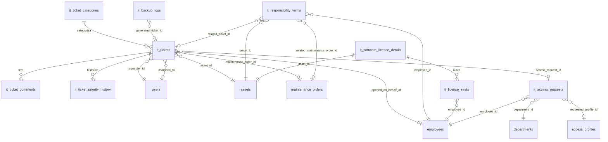

# BLOCO 2 — Módulo TI (Tecnologia da Informação) — Modelo de Dados

**Departamento:** 13 — TI.
**Insumos:** `docs/business/briefs/BRIEF_TI_2026-08-06.md` (domínio, 8
entidades novas, 18 BR-TI) e `docs/business/BLOCO_2_TI_REQUISITOS.md` (46
RF-TI, UC-49 a UC-51, §5 "Decisões e pendências para arquitetos").
**Autor:** `AdmDBA`.
**Data:** 2026-08-07.
**Status:** 🟢 `[IMPLEMENTADO]` — **migrations APLICADAS e no baseline
congelado** (`server/database/postgresql/00_baseline_frozen.sql`). Medido em
2026-08-12: as tabelas `it_*`/`ti_*` existem no banco (`it_tickets`,
`it_ticket_categories`, `it_ticket_comments`, `it_ticket_priority_history`,
`it_access_requests`, `it_backup_logs`, `it_license_seats`,
`it_software_license_details`, `it_responsibility_terms`, `ti_settings`),
idênticas em `erp_evok_audio_test`.

> **Status original deste documento (2026-08-07), mantido como histórico:**
> "🟡 Migrations criadas, **não aplicadas** (aguardando aprovação do dono do
> produto após revisão do `AuditorIntegrador`, mesma convenção do Bloco 1
> SST)". Nota obsoleta, corrigida pela auditoria documental de 2026-08-11/12.
> O restante do documento continua válido.

Trabalho coordenado com `ArquitetoSoftwareAPI`, que desenha o contrato REST
em paralelo. Ver §7 "Pendências para o ArquitetoSoftwareAPI" ao final.

---

## 0. Nota de nomenclatura

Diferente do Bloco 1 (SST, colunas em português por exigência de
rastreabilidade com termos legais de NR/eSocial), este bloco usa
**tabelas e colunas em inglês**, prefixo `it_` — segue a convenção
majoritária do restante do schema (`purchase_requisitions`,
`maintenance_orders`, `access_profiles` etc.) e o próprio brief/requisitos
já nomeiam as entidades em inglês (`ItTicket`, `ItAccessRequest`). Não há
justificativa de domínio (como em SST) para fugir do padrão.

---

## 1. Reaproveitamento obrigatório (não duplicado)

| Necessidade | Tabela existente | Como é usada pelo módulo TI |
|---|---|---|
| Inventário de equipamento de TI | `assets` (`asset_type='it'`) | `it_tickets.asset_id`, `it_responsibility_terms.asset_id` — FK direta, sem cópia de atributos |
| Licença como ativo com vencimento | `assets` (`asset_type='license'`, `license_expires_at`) | `it_software_license_details.asset_id` (FK 1:1 única) — data canônica de vencimento continua em `assets` |
| Manutenção física de equipamento | `maintenance_orders` | `it_tickets.maintenance_order_id`, `it_responsibility_terms.related_maintenance_order_id` |
| Usuário/perfil/permissão | `users`, `access_profiles` | `it_access_requests.requested_profile_id`, todas as colunas `*_by`/`*_id` de ator |
| Gestor de departamento | `departments.manager_id` (FK → `employees.id`, já existe) | usado pela camada de autorização para resolver quem pode aprovar `grant`/`change` sem nova FK (§5.2 do documento de requisitos) |
| Compra de equipamento/renovação de licença | Requisição de Compra (`/api/purchase-requisitions`) | integração de aplicação (RF-TI-030); nenhuma FK de schema — TI cria a requisição via API, não via banco |
| Trilha de auditoria | `AuditLog`/`logAction` | referenciada pela execução de `it_access_requests` (RF-TI-036), não duplicada |

**Nenhuma tabela paralela de ativos de TI foi criada** (BR-TI-008) e
nenhuma tabela de "gestor de departamento" foi criada (`departments.manager_id`
já resolve isso).

---

## 2. DER textual — Entidades novas

```
it_ticket_categories (1) ───< (N) it_tickets
users (1) ───< (N) it_tickets [requester_id]
users (1) ───< (N) it_tickets [assigned_to, opcional]
employees (1) ───< (N) it_tickets [opened_on_behalf_of, opcional]
assets (1) ───< (N) it_tickets [asset_id, opcional]
maintenance_orders (1) ───< (N) it_tickets [maintenance_order_id, opcional]
it_access_requests (1) ───< (N) it_tickets [access_request_id, opcional — FK fechada em 000154]

it_tickets (1) ───< (N) it_ticket_comments
it_tickets (1) ───< (N) it_ticket_priority_history

assets (1) ─── (1) it_responsibility_terms [asset_id, único ATIVO por índice parcial]
employees (1) ───< (N) it_responsibility_terms
it_tickets (1) ───< (N) it_responsibility_terms [related_ticket_id, opcional]
maintenance_orders (1) ───< (N) it_responsibility_terms [related_maintenance_order_id, opcional]

assets (1) ─── (1) it_software_license_details [asset_id, UNIQUE]
it_software_license_details (1) ───< (N) it_license_seats
employees (1) ───< (N) it_license_seats

employees (1) ───< (N) it_access_requests
users (1) ───< (N) it_access_requests [requested_by, approved_by, executed_by]
departments (1) ───< (N) it_access_requests
access_profiles (1) ───< (N) it_access_requests [requested_profile_id, opcional]

it_tickets (1) ───< (N) it_backup_logs [generated_ticket_id, opcional]
users (1) ───< (N) it_backup_logs [verified_by, opcional]
```

### 2.1 Diagrama Mermaid (para `02-MODELO_LOGICO.md`, quando consolidado)



---

## 3. Tabelas — colunas e constraints

### 3.1 `it_ticket_categories` — migration `20260807-000150`

| Coluna | Tipo | Constraints | Descrição |
|---|---|---|---|
| id | INTEGER PK | autoincrement | |
| name | VARCHAR(100) | NOT NULL, UNIQUE | |
| description | TEXT | NULL | |
| default_priority | ENUM(low,medium,high,urgent) | NOT NULL, default `medium` | Prioridade sugerida na abertura (RF-TI-001) |
| active | BOOLEAN | NOT NULL, default true | |
| created_at/updated_at | TIMESTAMP | NOT NULL | |

Seed inicial (hardware, software, rede, e-mail, sistema ERP, telefonia,
acesso, outros) é responsabilidade do `programador` — não incluída na
migration (mesmo padrão de cadastros do projeto, ex.: `sst_tipos_epi` não
semeia dados na própria migration de schema).

### 3.2 `it_tickets` — migration `20260807-000150`

| Coluna | Tipo | Constraints | Descrição |
|---|---|---|---|
| id | INTEGER PK | | |
| ticket_number | VARCHAR(20) | NOT NULL, UNIQUE | Gerado pela aplicação (ex.: `TI-2026-0001`) |
| requester_id | INTEGER | NULL (corrigido por auditoria — ver nota abaixo), FK → `users.id` RESTRICT | Sempre do JWT (BR-TI-002) quando o chamado é aberto por humano |
| system_generated | BOOLEAN | NOT NULL, default false | `true` para chamados abertos automaticamente (ex.: falha de backup, RF-TI-040) — CHECK garante `requester_id IS NOT NULL OR system_generated=true` |
| opened_on_behalf_of | INTEGER | NULL, FK → `employees.id` RESTRICT | Só `ti:operate` preenche (RF-TI-003) |
| category_id | INTEGER | NOT NULL, FK → `it_ticket_categories.id` RESTRICT | |
| priority | ENUM(low,medium,high,urgent) | NOT NULL | |
| impact | SMALLINT | NULL, CHECK 1-3 | |
| urgency | SMALLINT | NULL, CHECK 1-3 | |
| subject | VARCHAR(200) | NOT NULL | |
| description | TEXT | NULL | |
| asset_id | INTEGER | NULL, FK → `assets.id` RESTRICT | |
| assigned_to | INTEGER | NULL, FK → `users.id` RESTRICT | |
| status | ENUM(open,in_progress,waiting,resolved,closed,canceled) | NOT NULL, default `open` | Transições válidas = BR-TI-003 (enforcement de app) |
| solution | TEXT | NULL, CHECK obrigatória se `status IN (resolved,closed)` | |
| maintenance_order_id | INTEGER | NULL, FK → `maintenance_orders.id` RESTRICT | RF-TI-007 |
| access_request_id | INTEGER | NULL, FK → `it_access_requests.id` RESTRICT (fechada em `000154`) | |
| first_response_at/resolved_at/closed_at | TIMESTAMP | NULL | |
| sla_response_due_at/sla_resolution_due_at | TIMESTAMP | NULL | Calculados na abertura (RF-TI-009), tabela de SLA parametrizável em app |
| waiting_minutes | INTEGER | NOT NULL, default 0, CHECK ≥0 | Acumulado em `waiting` |
| satisfaction_rating | SMALLINT | NULL, CHECK 1-5 | |
| satisfaction_comment | TEXT | NULL | |
| created_at/updated_at | TIMESTAMP | NOT NULL | |

**Por que não há CHECK/trigger de máquina de estados completa:** a
CHECK `ck_it_tickets_solution_when_resolved` cobre apenas BR-TI-004
(solução obrigatória para `resolved`/`closed`); as demais transições
(BR-TI-003 — `open→in_progress|canceled` etc.) dependem do valor ANTERIOR
da linha (`OLD.status`), que um `CHECK` simples não enxerga sem trigger.
Seguindo a mesma decisão arquitetural do restante do projeto (nenhuma
lógica de processo em PL/pgSQL, exceto as 4 exceções estreitas já
documentadas em SST), a máquina de estados completa é responsabilidade do
use-case de mudança de status — o banco garante apenas os 2 invariantes
estruturais fortes (solução obrigatória, faixas numéricas).

### 3.3 `it_ticket_comments` — migration `20260807-000151`

| Coluna | Tipo | Constraints |
|---|---|---|
| id | INTEGER PK | |
| ticket_id | INTEGER | NOT NULL, FK → `it_tickets.id` **CASCADE** |
| author_id | INTEGER | NOT NULL, FK → `users.id` RESTRICT |
| body | TEXT | NOT NULL |
| is_internal | BOOLEAN | NOT NULL, default false |
| created_at | TIMESTAMP | NOT NULL |

### 3.4 `it_ticket_priority_history` — migration `20260807-000151`

| Coluna | Tipo | Constraints |
|---|---|---|
| id | INTEGER PK | |
| ticket_id | INTEGER | NOT NULL, FK → `it_tickets.id` **CASCADE** |
| changed_by | INTEGER | NOT NULL, FK → `users.id` RESTRICT |
| previous_priority/new_priority | ENUM(low,medium,high,urgent) | NOT NULL |
| reason | TEXT | NULL |
| changed_at | TIMESTAMP | NOT NULL |

**Por que `ticket_id` é CASCADE (exceção ao RESTRICT padrão) em ambas:**
comentário e histórico de prioridade são entidades de composição pura
(parte-todo) do chamado, sem valor probatório isolado fora dele — mesmo
racional de `sst_exames_complementares.aso_id` (BLOCO_1_SST_MODELO_DADOS.md
§3.2). Como `it_tickets` nunca é fisicamente apagado no fluxo normal da API
(RF-TI-016), o CASCADE é garantia teórica.

### 3.5 `it_responsibility_terms` — migration `20260807-000152`

| Coluna | Tipo | Constraints | Descrição |
|---|---|---|---|
| id | INTEGER PK | | |
| term_number | VARCHAR(30) | NOT NULL, UNIQUE | |
| asset_id | INTEGER | NOT NULL, FK → `assets.id` RESTRICT | Máx. 1 `active` por asset (índice único parcial) |
| employee_id | INTEGER | NOT NULL, FK → `employees.id` RESTRICT | |
| delivered_at | TIMESTAMP | NOT NULL | |
| delivered_by | INTEGER | NOT NULL, FK → `users.id` RESTRICT | |
| condition_on_delivery | TEXT | NULL | |
| accessories | TEXT | NULL | |
| acceptance_type | ENUM(physical_signature,digital_ack) | NOT NULL | |
| signed_document_path | VARCHAR(500) | NULL | Upload Multer |
| returned_at | TIMESTAMP | NULL | |
| received_by | INTEGER | NULL, FK → `users.id` RESTRICT | |
| condition_on_return | ENUM(ok,damaged,incomplete) | NULL | |
| return_notes | TEXT | NULL | |
| lost_justification | TEXT | NULL | Obrigatória em app quando `status='lost'` |
| related_ticket_id | INTEGER | NULL, FK → `it_tickets.id` RESTRICT | RF-TI-021 |
| related_maintenance_order_id | INTEGER | NULL, FK → `maintenance_orders.id` RESTRICT | RF-TI-021 alternativa |
| status | ENUM(active,returned,lost) | NOT NULL, default `active` | |
| created_at/updated_at | TIMESTAMP | NOT NULL | |

**Índice único parcial** `uq_it_responsibility_terms_active_per_asset` em
`(asset_id) WHERE status='active'` — garante BR-TI-010/RF-TI-019 sob
concorrência sem trigger, mesmo padrão de
`uq_production_downtimes_open_per_work_center` e
`uq_sst_eventos_esocial_origem_ativo`.

**Atualização de `Asset.responsible_id`/`Asset.location`** na
entrega/devolução é responsabilidade do use-case (mesma transação), não de
trigger — nenhuma coluna/gatilho de banco propaga isso automaticamente.

### 3.6 `it_software_license_details` — migration `20260807-000153`

| Coluna | Tipo | Constraints | Descrição |
|---|---|---|---|
| id | INTEGER PK | | |
| asset_id | INTEGER | NOT NULL, **UNIQUE**, FK → `assets.id` RESTRICT | 1:1, esperado `asset_type='license'` (validado em app) |
| license_type | ENUM(perpetual,subscription,free) | NOT NULL | |
| vendor | VARCHAR(150) | NULL | |
| seats | INTEGER | NOT NULL, default 1, CHECK >0 | |
| license_key | VARCHAR(500) | NULL | Texto simples; mascaramento/acesso restrito é 100% de aplicação (BR-TI-014) |
| cost | DECIMAL(18,6) | NULL | |
| billing_cycle | ENUM(one_time,monthly,yearly) | NOT NULL, default `one_time` | |
| renewal_date | DATE | NULL | Distinta de `assets.license_expires_at` |
| created_at/updated_at | TIMESTAMP | NOT NULL | |

### 3.7 `it_license_seats` — migration `20260807-000153`

| Coluna | Tipo | Constraints |
|---|---|---|
| id | INTEGER PK | |
| license_detail_id | INTEGER | NOT NULL, FK → `it_software_license_details.id` RESTRICT |
| employee_id | INTEGER | NOT NULL, FK → `employees.id` RESTRICT |
| assigned_at | TIMESTAMP | NOT NULL |
| revoked_at | TIMESTAMP | NULL |
| created_at/updated_at | TIMESTAMP | NOT NULL |

Índice único parcial `uq_it_license_seats_active_per_employee` em
`(license_detail_id, employee_id) WHERE revoked_at IS NULL` — evita 2
assentos ativos simultâneos do mesmo funcionário na mesma licença. O
bloqueio de excesso de assentos contra `seats` (RF-TI-026) é regra de
aplicação (contagem de linhas ativas no momento da alocação).

### 3.8 `it_access_requests` — migration `20260807-000154`

| Coluna | Tipo | Constraints | Descrição |
|---|---|---|---|
| id | INTEGER PK | | |
| request_number | VARCHAR(30) | NOT NULL, UNIQUE | |
| type | ENUM(grant,change,revoke) | NOT NULL | |
| employee_id | INTEGER | NOT NULL, FK → `employees.id` RESTRICT | |
| requested_by | INTEGER | NOT NULL, FK → `users.id` RESTRICT | Do JWT |
| department_id | INTEGER | NOT NULL, FK → `departments.id` RESTRICT | |
| requested_profile_id | INTEGER | NULL, FK → `access_profiles.id` RESTRICT | |
| justification | TEXT | NULL | |
| corporate_email | VARCHAR(150) | NULL | Corrigido por auditoria (achado #7) — a API já previa este campo no payload de `grant` (RF-TI-031) e a migration original não o persistia |
| equipment_needed | JSONB | NULL | Corrigido por auditoria (achado #7) — lista livre de equipamentos necessários informada na abertura; a entrega real vira `ItResponsibilityTerm` (UC-50) |
| approved_by | INTEGER | NULL, FK → `users.id` RESTRICT | Genérica — ver §4 abaixo |
| approved_at | TIMESTAMP | NULL | |
| executed_by | INTEGER | NULL, FK → `users.id` RESTRICT | |
| executed_at | TIMESTAMP | NULL | |
| execution_notes | TEXT | NULL | |
| status | ENUM(pending,approved,done,rejected,canceled) | NOT NULL, default `pending` | |
| rejection_reason | TEXT | NULL | |
| checklist | JSONB | NULL | Estrutura livre de offboarding (RF-TI-033) |
| created_at/updated_at | TIMESTAMP | NOT NULL | |

Esta migration também **fecha a FK adiada**
`it_tickets.access_request_id → it_access_requests.id` (RESTRICT),
criada sem FK em `20260807-000150` porque a tabela ainda não existia
(mesmo padrão de fechamento tardio do Bloco 1 SST — `sst_planos_exames.ges_id`
/ `sst_membros_cipa.treinamento_cipa_id`).

### 3.9 `it_backup_logs` — migration `20260807-000155`

| Coluna | Tipo | Constraints |
|---|---|---|
| id | INTEGER PK | |
| executed_at | TIMESTAMP | NOT NULL |
| backup_type | ENUM(daily,weekly,monthly,restore_test) | NOT NULL |
| target | VARCHAR(50) | NOT NULL |
| destination | VARCHAR(255) | NULL |
| size_bytes | BIGINT | NULL |
| success | BOOLEAN | NOT NULL |
| error_message | TEXT | NULL |
| generated_ticket_id | INTEGER | NULL, FK → `it_tickets.id` RESTRICT |
| verified_by | INTEGER | NULL, FK → `users.id` RESTRICT |
| notes | TEXT | NULL |
| created_at | TIMESTAMP | NOT NULL |

---

## 4. Decisão — §5.2 do documento de requisitos (aprovador de grant/change)

`departments.manager_id` (FK → `employees.id`) **já existe** no schema
real (`server/src/models/Department.ts`). Por isso, `it_access_requests`
**não** ganhou uma FK nova de "gestor de departamento" — `approved_by`
permanece uma FK genérica para `users.id`, e a elegibilidade de quem pode
aprovar (`ti:approve` OU "é o `employees.user_id` do
`departments.manager_id` do `department_id` da solicitação") é resolvida
na camada de autorização/use-case, não no schema. Isso está registrado
tanto na migration `20260807-000154` quanto aqui, para não ser
reaberto/duplicado por engano em uma passada futura.

---

## 5. Parametrização (RF-TI-046/RNF-TI-05) — `ti_settings` (DECISÃO REVISADA por auditoria)

**Esta seção foi corrigida pela auditoria cruzada
(`docs/business/BLOCO_2_TI_AUDITORIA.md`, achado #1).** A versão original
decidia "sem tabela dedicada, mesma decisão de RF-SST-019 no Bloco 1". Essa
citação de precedente não se sustenta: verificado em
`server/src/modules/sst/` que RF-SST-019 (parametrização do prazo do ASO
demissional) **nunca foi implementado em código** — não há mecanismo de
configuração real para ele, é uma decisão apenas documentada. Não é,
portanto, um padrão testado a ser seguido "por consistência".

O projeto **tem** um precedente real e em produção para exatamente este
problema: `production_cost_settings` (`server/src/models/ProductionCostSettings.ts`,
migration `20260804-000008`) — tabela singleton com colunas tipadas fixas
para parâmetros de negócio configuráveis sem deploy (rateio de overhead,
taxa de mão-de-obra padrão).

**Decisão final:** criar `ti_settings` — tabela singleton (uma linha,
`id=1`, `CHECK (id = 1)`, mesmo padrão de `production_cost_settings`) —
migration `20260807-000156`. Cobre SLA de 1ª resposta/resolução por
prioridade (8 colunas), dias de auto-close, dias de reabertura, 3 janelas
de alerta de vencimento de licença, intervalo máximo de teste de restore e
horas de alerta de backup diário. Retenção de backup (política de
diários/semanais/mensais) e "elegibilidade de aprovador" (§4 abaixo)
permanecem fora desta tabela: a primeira é operação externa ao ERP (rotina
de infraestrutura, não uma leitura em runtime de use-case) e a segunda já
está resolvida via `departments.manager_id`/`employees.user_id` (não é um
"parâmetro de tempo").

---

## 6. Rastreabilidade RF-TI → Tabela(s)

| RF-TI | Tabela(s) |
|---|---|
| 001 | `it_ticket_categories` |
| 002, 006, 009, 010, 013, 015, 016 | `it_tickets` |
| 003 | `it_tickets.opened_on_behalf_of` |
| 004 | `it_tickets` (status/priority/category na triagem) |
| 005 | `it_ticket_priority_history` |
| 007 | `it_tickets.maintenance_order_id` + `maintenance_orders` (reutilizada) |
| 008 | `it_tickets.solution`/`status` (CHECK `ck_it_tickets_solution_when_resolved`) |
| 011 | `it_tickets.status`/`resolved_at` (auto-close, job de aplicação, sem tabela dedicada) |
| 012 | `it_tickets.satisfaction_rating`/`satisfaction_comment` |
| 014 | `it_ticket_comments` |
| 017, 018, 019, 020, 022, 023 | `it_responsibility_terms` (+ `assets` reutilizada) |
| 021 | `it_responsibility_terms.related_ticket_id`/`related_maintenance_order_id` |
| 024, 027 | `it_software_license_details` |
| 025, 026 | `it_license_seats` |
| 028, 029 | `assets.license_expires_at` (leitura, sem tabela dedicada — alerta é job de aplicação) |
| 030 | integração de aplicação com `/api/purchase-requisitions`, sem FK de schema |
| 031, 038 | `it_access_requests` (type=`grant`) |
| 032 | `it_access_requests` (type=`change`) |
| 033, 037 | `it_access_requests` (type=`revoke`) + `checklist` JSONB, validado contra `it_responsibility_terms.status='active'` do funcionário |
| 034 | `it_access_requests.approved_by`/`approved_at` (elegibilidade resolvida em app, ver §4) |
| 035 | `it_access_requests.executed_at` (painel de idade da solicitação, leitura) |
| 036 | `it_access_requests.executed_by`/`execution_notes` (referencia `AuditLog`, sem duplicar) |
| 039, 041, 042 | `it_backup_logs` |
| 040 | `it_backup_logs.generated_ticket_id` → `it_tickets` |
| 043 | `server/src/shared/domain/accessModules.ts` (chave `ti`) |
| 044 | Sem tabela — exceção de rota de auto-serviço, documentada no comentário de `accessModules.ts` e delegada ao `ArquitetoSoftwareAPI` |
| 045 | Leitura consolidada de todas as tabelas acima, sem tabela adicional (padrão de dashboard já existente) |
| 046 | `ti_settings` (tabela singleton, ver §5 — decisão revisada por auditoria) |

**Cobertura: 46/46 RF-TI mapeados** (RF-TI-044/045 são leitura/RBAC sem
tabela nova; RF-TI-046 ganhou tabela dedicada `ti_settings` na revisão desta
auditoria — ver §5).

---

## 7-A. Correções aplicadas pela auditoria cruzada (`AuditorIntegrador`, 2026-08-07)

Ver `docs/business/BLOCO_2_TI_AUDITORIA.md` para o relatório completo. Resumo
das correções feitas diretamente nesta passada:

1. **Parametrização (achado #1):** criada `ti_settings` (migration
   `20260807-000156`) — ver §5 revisado.
2. **Aprovador de `grant`/`change` (achado #2):** confirmado
   `departments.manager_id → employees.id` e `employees.user_id → users.id`
   (ambos já existentes e verificados em código); nenhuma migração de schema
   necessária — apenas a documentação de contrato de API precisava parar de
   tratar isso como incerto (corrigido em `BLOCO_2_TI_API.md`).
3. **`it_tickets.requester_id` nullable (achado #3):** migration
   `20260807-000150` corrigida — coluna agora `NULL`, nova coluna
   `system_generated` e `CHECK` cobrindo o par.
4. **Histórico de prioridade (achado #4):** `it_ticket_priority_history`
   (migration `20260807-000151`) já existia; a inconsistência estava no
   contrato de API, que tratava o nome/existência da tabela como pendência
   — corrigido lá.
5. **Índice único parcial de seats (achado #5):** já existia
   (`uq_it_license_seats_active_per_employee`, migration `20260807-000153`)
   — confirmado, sem alteração necessária.
6. **`it_access_requests.corporate_email`/`equipment_needed` (achado #7):**
   colunas ausentes na migration original apesar de já contratadas pela API
   — adicionadas à migration `20260807-000154`.
7. **FK adiada `it_tickets.access_request_id` (achado #8):** ordem de
   aplicação e `down()` de ambas as migrations (`000150`/`000154`)
   verificados e corretos — sem alteração necessária.

## 7. Pendências para o `ArquitetoSoftwareAPI`

1. **Auto-serviço × `authorizeModule('ti')` (§5.1 dos requisitos):** as
   rotas de abertura/acompanhamento do próprio chamado
   (`it_tickets.requester_id === req.user.id`) devem ficar FORA do gate de
   módulo — o comentário em `accessModules.ts` já registra a exceção, mas o
   desenho do middleware (`authorizeSelfOrModule` ou equivalente) é do
   arquiteto.
2. **Máquina de estados de `it_tickets.status`** não é garantida pelo banco
   além da CHECK de `solution` — o use-case de mudança de status precisa
   implementar as transições de BR-TI-003 (incluindo o prazo de 7 dias para
   reabertura de `closed`, parametrizável).
3. **Fila polimórfica de licenças/assets:** `it_software_license_details.asset_id`
   é UNIQUE mas não há CHECK cross-table garantindo `asset_type='license'`
   no asset referenciado — o repositório/use-case deve validar isso na
   criação (mesmo padrão de exceção já aceito para
   `sst_acoes_corretivas.origem_id`).
4. **FK adiada:** `it_tickets.access_request_id` só recebe a constraint de
   FK na migration `20260807-000154` — se o `programador` aplicar as
   migrations fora de ordem (`154` sem `150` antes), a migration falha por
   design (a tabela `it_tickets` precisa existir primeiro). A ordem de
   timestamp já garante isso via `migration:up` sequencial.
5. **`license_key` em claro:** nenhuma criptografia de coluna foi aplicada
   (ver nota na migration `000153`) — o endpoint que expõe a chave em claro
   precisa impor `ti` ou `role=admin` e logar a leitura (RNF-TI-01); isso é
   trabalho de rota/middleware, o schema não impõe.
6. **Aprovador de `grant`/`change`:** resolver via
   `departments.manager_id → employees.user_id` OU `ti:approve` na camada
   de autorização, conforme §4 acima — nenhuma tabela nova a esperar.

---

## Referências

- `docs/business/briefs/BRIEF_TI_2026-08-06.md`
- `docs/business/BLOCO_2_TI_REQUISITOS.md`
- `docs/business/BLOCO_1_SST_MODELO_DADOS.md` (mesmo padrão de entregável)
- `server/src/models/Asset.ts`, `server/src/models/MaintenanceOrder.ts`,
  `server/src/models/Department.ts`, `server/src/models/Employee.ts`
- `server/src/shared/domain/accessModules.ts` (chave `ti` adicionada,
  31 → 32 chaves)
- Migrations: `server/migrations/20260807-000150-*.cjs` a
  `20260807-000155-*.cjs`

**Fim do modelo de dados do BLOCO 2 — TI.**
