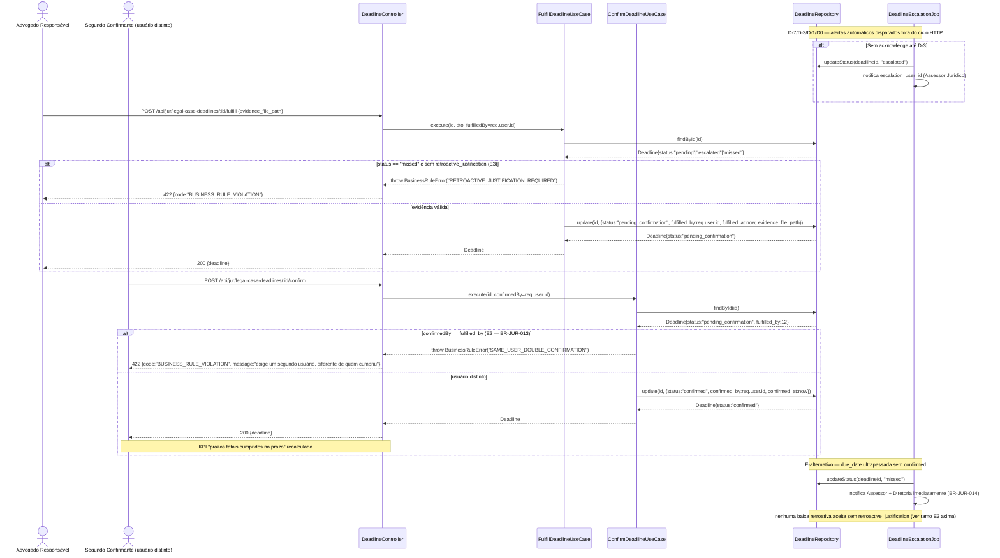

# BLOCO 3 — Módulo Jurídico (JUR) — Contrato de API

**Departamento:** 16 — Jurídico.
**Insumos:** `docs/business/briefs/BRIEF_JUR_2026-08-06.md` (domínio) e
`docs/business/BLOCO_3_JUR_REQUISITOS.md` (46 RF-JUR, UC-52 a UC-56, §6
decisões/pendências para arquitetos).
**Autor:** `ArquitetoSoftwareAPI`.
**Data:** 2026-08-07.
**Status:** 🟡 Contrato pronto para modelagem de banco em paralelo (`AdmDBA`)
e implementação futura (`programador`). **Nenhum código foi criado neste
passo** — Jurídico não existe hoje em `server/src/`, exceto pela reutilização
já verificada de `Supplier`, `Client`, `Employee`, `AccountPayable`,
`AuditLog`, `User` (todos `INTEGER autoIncrement`, confirmado em
`server/src/models/`). Segue estritamente o padrão de
`docs/business/BLOCO_1_SST_API.md` (Bloco 1) e `docs/business/BLOCO_2_TI_API.md`
(Bloco 2) — mesma estrutura de seções, mesmo padrão de erro, mesmo mapper
DTO PT-BR↔inglês.

Base URL: `/api/jur/*` (novo módulo `server/src/modules/juridico/`), exceto
onde indicado (reaproveitamento de `/api/suppliers`, `/api/clients`,
`/api/employees`, `/api/accounts-payable`).

**Convenção de nomes de tabela (decisão deste bloco, RECONCILIADA pela
auditoria cruzada):** o documento de requisitos original
(`BLOCO_3_JUR_REQUISITOS.md` §2) sugeria nomes sem prefixo (`contracts`,
`legal_cases`, `proxies`...), herdados literalmente do brief, e a primeira
versão do modelo de dados do `AdmDBA` seguiu essa sugestão — divergindo
deste contrato, que desde a primeira versão já assumia o prefixo `jur_`.
O `AuditorIntegrador` (`docs/business/BLOCO_3_JUR_AUDITORIA.md`) resolveu a
divergência a favor do prefixo `jur_` + snake_case (`jur_contracts`,
`jur_legal_cases`, `jur_proxies`...), para ficar consistente com a
convenção real já em produção para os dois módulos mais recentes (`sst_*`
em `server/src/modules/sst/`, `it_*` em `server/src/modules/ti/`) — nenhum
módulo novo do projeto usa tabela sem prefixo de domínio. As 12 migrations
do `AdmDBA` foram corrigidas e renumeradas para `20260807-000260` a
`20260807-000271` (ver `docs/business/BLOCO_3_JUR_MODELO_DADOS.md` §0) —
este documento de API já estava alinhado e não precisou de correção nos
nomes de rota (`/api/jur/*`, que nunca dependeram do nome de tabela).

**Autenticação:** `Authorization: Bearer <JWT>` em todas as rotas
(`authenticate`). Identidade de quem executa a ação **sempre** vem de
`req.user.id` (nunca do body) — aplica-se a `responsible_user_id` (quando
autoatribuição), `fulfilled_by`, `confirmed_by`, `approved_by`, `verified_by`,
`registered_by`, `escalated_to` (resolução do job, nunca body). Referência a
pessoa em qualquer payload usa exclusivamente `employee_id`/`user_id`
(nunca duplica nome/CPF — quem quiser exibir, resolve via
`GET /api/employees/:id` ou `GET /api/users/:id`).

**Tipos de dado:** todas as FKs para entidades já existentes
(`supplier_id`, `client_id`, `employee_id`, `user_id`, `department_id`) e
todos os PKs/FKs novos deste módulo são `integer` (schema real do projeto —
ver `server/src/models/Supplier.ts`/`Client.ts`/`AccountPayable.ts`, todos
`INTEGER autoIncrement`, nunca `UUID`). Valores monetários (`value`,
`provisioned_amount`, `claim_amount`, `estimated_cost`) são `DECIMAL`
expostos como **string** no JSON, nunca `number` — mesma decisão já adotada
em `/api/items` (`docs/arquitetura/API.md` §31) para não perder precisão de
ponto flutuante; ex.: `"value": "150000.00"`. Datas são `DATEONLY` (`"YYYY-MM-DD"`)
salvo quando o campo é claramente `TIMESTAMP` (`data_hora`, `created_at`,
alertas com hora), indicado caso a caso.

---

## 0. RBAC — novo módulo `juridico`

### 0.1 Chave nova em `ACCESS_MODULES`

Requer adicionar a chave `juridico` ao catálogo
`server/src/shared/domain/accessModules.ts` (32 chaves na leitura de
2026-08-07, incluindo `rh`, `sst`, `ti` — `juridico` ausente), seguindo o
padrão de comentário estrutural já usado para os três:

```ts
{ key: 'juridico', label: 'Jurídico (contratos, contencioso, LGPD — dados sensíveis)' }
```

Isso é tarefa do `programador` (é código, não contrato) — documentado aqui
para que o handoff não deixe a chave subentendida.

### 0.2 Desenho de restritividade — mais próximo de `sst` do que de `ti`

Conforme §6.1 do documento de requisitos, `juridico` segue o desenho **mais
restritivo** do projeto, no mesmo padrão de `sst`: **nenhuma rota deste
módulo é aberta por autenticação simples** — diferente de `ti` (que libera
auto-serviço do próprio chamado) e de `rh` (que libera listagem básica de
funcionário), aqui não há exceção de "acesso público-autenticado" nenhuma.
Todo endpoint de leitura ou escrita exige, no mínimo,
`authorizeModule('juridico', 'operate')`; a única fatia liberada a um
público diferente é a exceção de **campo** (não de rota) do perfil
`financeiro`, tratada isoladamente na seção 7.3.

Níveis:
- **`operate`** (Assessor Jurídico/Estagiário de Direito/Advogado Externo
  com usuário no sistema) — gestão completa de contratos, andamentos,
  prazos (exceto a 2ª confirmação, que exige um segundo usuário distinto,
  não necessariamente nível diferente), procurações, PI, RoPA e triagem de
  solicitação de titular.
- **`approve`** (Assessor Jurídico sênior/Encarregado-DPO/Diretoria) —
  aprovação de alçada de contrato, avaliação/encerramento de risco
  `probable`, encerramento de processo, revogação de procuração, decisão de
  comunicação de incidente LGPD à ANPD, rejeição justificada de solicitação
  de titular. Ver por recurso nas tabelas abaixo.

### 0.3 Exceção de campo para o perfil `financeiro` (RF-JUR-042/BR-JUR-050)

`financeiro` **nunca** recebe a chave `juridico`. Uma única rota,
`GET /api/jur/reports/financeiro` (§7.3), é liberada adicionalmente a quem
tem `authorizeModule('financeiro', 'operate')`, retornando **apenas** a
série de provisão vigente e custos lançados — nunca `object`/descrição do
processo, `parte_contraria`, `employee_id`, andamentos, `rationale` da
avaliação de risco, nem qualquer dado de LGPD/procuração/PI. É o mesmo
padrão de segregação de campo (não de rota inteira) já usado em `rh` para
`employeeSensitiveFields.ts`, mas invertido: aqui o "campo largo" (relatório
inteiro) é a unidade de exposição controlada, porque o dado bruto do
processo nunca deve compor a mesma resposta.

### 0.4 Campos que NUNCA aparecem em listagem (só em detalhe, com módulo `juridico`)

Regra transversal de todas as listagens (`GET` sem `/:id`) deste módulo —
implementada como shape resumido no `Mapper`/`UseCase` de listagem, nunca
filtrado só no frontend:

| Recurso | Campo omitido na listagem | Só aparece em |
|---|---|---|
| `Contrato` | `counterparty_doc` (CPF/CNPJ da contraparte) | `GET /api/jur/contracts/:id` |
| `ProcessoJudicial` | `parte_contraria` (nome/FK completos), `descricao`/objeto detalhado | `GET /api/jur/legal-cases/:id` — listagem mostra apenas `numero_cnj`, `tipo`, `papel`, `status`, `risk_class` |
| `ProcessoJudicial` (tipo `labor`) | qualquer campo que identifique o empregado/ex-empregado (`employee_id` resolvido para nome) | Detalhe, e mesmo assim só com módulo `juridico` — nunca em `rh` (RNF-JUR-01) |
| `ProvisaoContingencia` | `rationale` (justificativa textual da avaliação) | `GET /api/jur/legal-cases/:id/provisions` (histórico completo, não a listagem de processos) |
| `PrazoProcessual` | `evidence_file_path` | `GET /api/jur/legal-case-deadlines/:id` |
| `LgpdSolicitacaoTitular` | dados de identificação do titular (`requester_document`, `requester_contact`) | Detalhe |
| `LgpdIncidente` | `description`, `categorias_titulares_afetados`, `plano_acao` | Detalhe |
| `AtivoPI` tipo `trade_secret` | **o recurso inteiro** (não só campos) — nunca aparece em `GET /api/jur/ip-assets` para quem não é `role==='admin'` | `GET /api/jur/ip-assets/:id`, e mesmo assim só `role==='admin'` (§5.3, RF-JUR-033) |

---

## 1. Padrão de erro e transversais

Idêntico ao restante do projeto — `AppError` e subclasses (`ValidationError`
400/422, `NotFoundError` 404, `UnauthorizedError` 401, `ForbiddenError` 403,
`ConflictError` 409, `BusinessRuleError` 422) tratadas pelo `errorHandler`
central, nunca stack trace ao cliente. Ver `docs/arquitetura/API.md` seção
"Respostas Padrão".

**Auditoria (RF-JUR-043):** toda escrita deste módulo chama
`AuditLog.logAction` (mesmo padrão dos demais módulos) com `before`/`after`
quando aplicável. **Imutabilidade (RNF-JUR-02, RF-JUR-044):** nenhum recurso
deste módulo tem rota `DELETE`. Correções de registro finalizado são sempre
um novo registro/estorno, nunca `UPDATE` destrutivo — ver por recurso.

---

## Estrutura de módulo (Clean Architecture)

```
server/src/modules/juridico/
├── domain/
│   ├── entities/            # Contract, ContractAddendum, ContractSignatory,
│   │                         #  ContractDocument, LegalAlert, LegalCase,
│   │                         #  LegalCaseEvent, LegalCaseDeadline,
│   │                         #  LegalCaseProvision, ExternalLawyer, Proxy,
│   │                         #  IntellectualPropertyAsset, LgpdProcessingActivity,
│   │                         #  LgpdDataSubjectRequest, LgpdIncident
│   └── repositories/        # Interfaces (ContractRepository, LegalCaseRepository,
│                             #  DeadlineRepository, ProvisionRepository,
│                             #  ProxyRepository, IpAssetRepository,
│                             #  LgpdActivityRepository, LgpdRequestRepository,
│                             #  LgpdIncidentRepository, LegalAlertRepository, ...)
├── application/
│   ├── services/             # AccountPayableService, AuditLogService,
│   │                          #  DeadlineEscalationService (interfaces — cada
│   │                          #  uma com adapter em infrastructure/, nunca
│   │                          #  import direto de outro módulo)
│   └── use-cases/            # Um UseCase por ação de negócio (ver por recurso)
├── infrastructure/
│   ├── adapters/              # AccountPayableServiceAdapter (chama use-case real
│   │                          #  de server/src/modules/financial/ ou o Model
│   │                          #  AccountPayable via camada de aplicação, nunca
│   │                          #  Sequelize direto do módulo juridico)
│   ├── mappers/                # ContractMapper, LegalCaseMapper, DeadlineMapper,
│   │                          #  ProxyMapper, IpAssetMapper, LgpdMapper
│   │                          #  (PT-BR↔inglês, mesmo padrão de EpiMapper/TicketMapper)
│   └── sequelize/              # SequelizeContractRepository, SequelizeLegalCaseRepository, ...
└── presentation/
    ├── controllers/            # contractController, legalCaseController,
    │                          #  deadlineController, proxyController,
    │                          #  ipAssetController, lgpdController, alertController
    └── routes/                  # juridico.ts (router agregador único, montado
                                 #  em /api/jur, mesmo padrão de server/src/routes/*.ts)
```

**Tipos extraídos para `*Types.ts`** (evitar a armadilha ESM+CJS no mesmo
arquivo — ver `CLAUDE.md`/system prompt e `ProductionDowntimeTypes.ts` como
referência): `ContractTypes.ts`, `LegalCaseTypes.ts`, `DeadlineTypes.ts`,
`ProxyTypes.ts`, `IpAssetTypes.ts`, `LgpdTypes.ts` — cada um contendo somente
`export interface`/`export type`, importados pelos controllers/use-cases.
Nenhuma classe com `export =` divide arquivo com `export interface`.

**Baixo acoplamento — 2 interfaces de serviço injetadas, nunca import
direto de outro módulo:**
1. `AccountPayableService` — usado por `RegisterCaseCostUseCase` (RF-JUR-018)
   e `SettleCaseUseCase` (acordo com parcelamento). Adapter chama o
   use-case real de criação de `AccountPayable` (módulo Financeiro), nunca
   `AccountPayable.create()` direto do módulo `juridico`.
2. `AuditLogService` — reaproveita `AuditLog.logAction` já existente (mesmo
   padrão de todos os módulos maduros do projeto, não é interface nova de
   fato, citada aqui só para reforçar que não há Sequelize direto de
   `AuditLog` fora do helper compartilhado).

---

## 2. Grupo 1 — Contratos (Processo P1, UC-52)

Base: `/api/jur/contracts`. `authorizeModule('juridico', ...)`: leituras e
escritas comuns `operate`; **registrar aprovação de alçada** e **efetivar
aditivo que ELEVA o valor** exigem `approve` (RF-JUR-003 — tabela
configurável de alçada por valor/tipo, ver **§2.7**).

> **Nota de correção (2026-08-14, remediação de `FIND-ERP-005`).** Esta seção
> tinha duas divergências que a auditoria confirmou como falhas, ambas
> corrigidas por decisão do dono registrada em `APR-2026-021` Parte B:
>
> 1. A tabela abaixo **não listava** `POST /contracts/:id/approve` nem
>    `GET /contracts/:id/approvals` (nasceram depois da redação original) —
>    agora listam, com o nível realmente imposto pelo servidor.
> 2. O texto exigia `approve` para *"assinatura de aditivo que altera valor"*
>    enquanto a tabela dizia `operate` para o mesmo endpoint: o documento
>    contradizia a si mesmo e o código seguira a versão mais permissiva.
>    Agora há **uma única versão** — preparar o aditivo é `operate`,
>    **efetivar elevação de valor exige `approve`** (`APR-2026-021` B.4) —
>    e a verificação é server-side, dentro do use case, não só na rota.

Contrato é modelado como **transição de estado controlada**
(`draft → in_approval → signed → active → (expired | terminated)`), não CRUD
livre de status — mesmo padrão de `ItTicket`/`EntregaEPI`.

| Método | Rota | Nível | Descrição |
|---|---|---|---|
| `GET` | `/api/jur/contracts` | operate | Lista (filtros: `type`, `status`, `supplier_id`, `client_id`, `employee_id`, `responsible_user_id`, `vencendo_em_dias`) — shape resumido (sem `counterparty_doc`, §0.4) |
| `GET` | `/api/jur/contracts/:id` | operate | Detalhe completo (inclui documentos, signatários, aditivos, checklist) |
| `POST` | `/api/jur/contracts` | operate | Cria contrato em `draft` |
| `PUT` | `/api/jur/contracts/:id` | operate | Atualiza campos ainda não travados por assinatura (bloqueado a partir de `signed`, exceto `responsible_user_id`/`alert_advance_days`) |
| `POST` | `/api/jur/contracts/:id/documents` | operate | Anexa minuta versionada (v1, v2...) |
| `GET` | `/api/jur/contracts/:id/documents` | operate | Lista versões |
| `POST` | `/api/jur/contracts/:id/signatories` | operate | Adiciona `ContratoSignatario` (parte ou testemunha) |
| `GET` | `/api/jur/contracts/:id/signatories` | operate | Lista signatários |
| `POST` | `/api/jur/contracts/:id/checklist` | operate | Responde item do checklist de cláusulas (PI/confidencialidade/não concorrência) — `employment`/`supplier`/`nda` |
| `POST` | `/api/jur/contracts/:id/activate` | operate (a alçada é verificada **dentro** do use case, §2.7) | Transição para `active`; exige as aprovações de alçada já registradas; grava `approval_policy_snapshot`; gera `AlertaJuridico` de vencimento |
| `POST` | `/api/jur/contracts/:id/approve` | **approve** em `diretor` **ou** `financeiro` (`authorizeAnyModule`, fora do gate `juridico`) | Registra **1** aprovação de alçada (RF-JUR-003). Grava `approver_user_id` (do JWT), `approver_role` (do RBAC) e `approved_value`. Sujeito à segregação D-K (§2.7) |
| `GET` | `/api/jur/contracts/:id/approvals` | operate em `juridico`, `diretor` **ou** `financeiro` | Situação da alçada: `required_roles`, aprovações vivas e `missing_roles`. Somente leitura — é a fonte que a UI usa |
| `POST` | `/api/jur/contracts/:id/addendums` | operate para preparar; **approve** para EFETIVAR elevação de valor | Cria e assina `ContratoAditivo`; atualiza campos vigentes. `new_value` só é aceito com `change_type='value'`; elevação de faixa **reabre a alçada** (§2.7) |
| `GET` | `/api/jur/contracts/:id/addendums` | operate | Lista aditivos (histórico imutável) |
| `POST` | `/api/jur/contracts/:id/terminate` | operate | Encerra: `terminated` (com `termination_reason`+data) ou `expired` (fim natural) |
| `GET` | `/api/jur/settings/approval-thresholds` | operate | Política de alçada vigente + histórico de alterações (§2.7) |
| `PUT` | `/api/jur/settings/approval-thresholds` | **approve** | Substitui o conjunto de faixas da política; registra o estado anterior e o novo em `jur_approval_threshold_history` (§2.7) |

**13 endpoints de contrato** + **2 de alçada** (`approve`/`approvals`) +
**2 de configuração** (`settings/approval-thresholds`) = **17 rotas**
efetivamente montadas em `juridico.ts`. A contagem histórica de "13" era
anterior à alçada (2026-08-08) e à política configurável (2026-08-14).

### 2.1 POST /api/jur/contracts — Request

```json
{
  "type": "supplier",
  "object": "Fornecimento de componentes eletrônicos para linha de montagem",
  "counterparty_type": "supplier",
  "supplier_id": 45,
  "client_id": null,
  "employee_id": null,
  "counterparty_name": null,
  "counterparty_doc": null,
  "value": "150000.00",
  "currency": "BRL",
  "start_date": "2026-09-01",
  "end_date": "2027-08-31",
  "renewal_auto": false,
  "notice_days": null,
  "adjustment_index": "ipca",
  "adjustment_base_date": "2026-09-01",
  "alert_advance_days": 60
}
```

`type` (enum): `commercial` / `employment` / `supplier` / `service` /
`rental` / `nda` / `distribution` / `commercial_representation` /
`trademark_license` / `other`. `counterparty_type` (enum): `supplier` /
`client` / `employee` / `other`. `adjustment_index` (enum): `ipca` / `igpm` /
`inpc` / `other` / `none`. `end_date: null` = vigência indeterminada.
`responsible_user_id` **não é aceito na criação** — só é exigido/gravado em
`POST .../activate` (RF-JUR-005/BR-JUR-001), para permitir que o rascunho
comece sem gestor definido.

**Validação de exclusividade mútua da contraparte (§6.2 do documento de
requisitos — decisão de contrato, aplicação obrigatória em camada de
aplicação independentemente do que o `AdmDBA` decidir sobre `CHECK` no
banco):**

```
exatamente UM dos quatro grupos deve estar preenchido, de acordo com counterparty_type:
  counterparty_type = 'supplier' → supplier_id preenchido; client_id/employee_id/counterparty_name/counterparty_doc nulos
  counterparty_type = 'client'   → client_id preenchido;   demais nulos
  counterparty_type = 'employee' → employee_id preenchido; demais nulos
  counterparty_type = 'other'    → counterparty_name E counterparty_doc preenchidos; supplier_id/client_id/employee_id nulos
```

**Erros:**
| Código | `code` | Quando |
|---|---|---|
| 400 | `VALIDATION_ERROR` | `type`, `object` ou `counterparty_type` ausentes |
| 422 | `BUSINESS_RULE_VIOLATION` | Contraparte não respeita a exclusividade mútua acima (mais de um grupo preenchido, ou o grupo exigido por `counterparty_type` incompleto) — mensagem no padrão O QUE/POR QUE/O QUE FAZER |
| 404 | `NOT_FOUND` | `supplier_id`/`client_id`/`employee_id` informado não existe |

Resposta (`201`): `{ contract: { id, number: "CT-2026-0001", status: "draft", ... } }`.
`number` gerado pelo sistema (RF-JUR-001), nunca informado pelo cliente.

### 2.2 POST /api/jur/contracts/:id/documents — Request

```json
{ "file_url": "https://.../minuta-ct-2026-0001-v1.pdf", "notes": "Primeira versão enviada ao fornecedor", "is_signed_version": false }
```
Sequência (`v1`, `v2`...) calculada pelo backend, nunca informada pelo
cliente. `is_signed_version: true` é exigido antes de `POST .../activate`
(RF-JUR-004).

### 2.3 POST /api/jur/contracts/:id/signatories — Request

```json
{ "party_type": "party_a", "name": "João da Silva", "role": "Diretor", "employee_id": null }
```
`party_type` (enum): `party_a` / `party_b` / `witness`. `employee_id`
opcional (FK, se o signatário for colaborador da EVOK).

### 2.4 POST /api/jur/contracts/:id/activate

Sem body (exceto `responsible_user_id`, se ainda não definido):
```json
{ "responsible_user_id": 12 }
```

Efeitos, todos na mesma transação:
1. Valida ao menos 2 `ContratoSignatario` tipo `party_a`/`party_b` e ao menos
   1 documento `is_signed_version: true` (E3/BR-JUR-004).
2. Valida `responsible_user_id` presente — bloqueia sem exceção
   (E1/BR-JUR-001).
3. Se checklist de cláusulas é obrigatório para o `type` (`employment`/
   `supplier`/`nda`) e não foi respondido, bloqueia (RF-JUR-010).
4. Cria `AlertaJuridico` de vencimento se `end_date` definida
   (antecedência = `alert_advance_days`, default 60 — RF-JUR-005).
5. Se `renewal_auto=true` e `notice_days>0`, cria alerta adicional em
   `end_date - notice_days - 15 dias` (RF-JUR-006).
6. Se `adjustment_index != 'none'`, cria alerta de reajuste na
   `adjustment_base_date` seguinte (RF-JUR-007).
7. Marca `status: "active"`.

**Erros:**
| Código | `code` | Quando | UC |
|---|---|---|---|
| 422 | `BUSINESS_RULE_VIOLATION` | Sem `responsible_user_id` (E1) | E1 (UC-52) |
| 422 | `BUSINESS_RULE_VIOLATION` | Menos de 2 `ContratoSignatario` tipo parte ou sem versão assinada anexada (E3) | E3 (UC-52) |
| 422 | `BUSINESS_RULE_VIOLATION` | Checklist obrigatório não respondido (`employment`/`supplier`/`nda`) | RF-JUR-010 |
| 400 | `VALIDATION_ERROR` | Contrato não está em `draft`/`in_approval` (já `active`/`signed`) | — |
| 422 | `BUSINESS_RULE_VIOLATION` | Alçada de valor pendente: falta aprovação de `diretor`/`financeiro` (`details.rule = 'RF-JUR-003'`, `details.missingRoles`) — §2.7 | RF-JUR-003 |
| 422 | `BUSINESS_RULE_VIOLATION` | Política de alçada não configurada (`APPROVAL_POLICY_UNAVAILABLE`, fail-closed) — §2.7.2 | RF-JUR-003 |

### 2.5 POST /api/jur/contracts/:id/addendums — Request

```json
{ "change_type": "term", "new_end_date": "2028-08-31", "new_value": null, "description": "Prorrogação de 12 meses", "document_url": "https://.../aditivo-1-ct-2026-0001.pdf" }
```
`change_type` (enum): `term` / `value` / `clause` / `party` / `other`. Ao
criar o aditivo já assinado, o backend atualiza `contracts.end_date`/`value`
com os novos valores e recalcula os alertas (RF-JUR-008) — o aditivo em si e
os valores anteriores (`previous_end_date`/`previous_value`, gravados
automaticamente no momento da criação) são imutáveis; correção de aditivo
já criado é um novo aditivo, nunca `PUT`.

**`new_value` só é aceito com `change_type = 'value'`** (correção de
2026-08-14, `FIND-ERP-005` Falha 3). O exemplo acima traz `"new_value": null`
justamente porque é um aditivo de prazo: enviar um número ali resulta em
`422`. Antes da correção, o campo era aplicado sem consultar o
`change_type`, e um aditivo declarado como `term` alterava o valor do
contrato.

**Erros (422/`BUSINESS_RULE_VIOLATION`):**

| Quando | `details.rule` |
|---|---|
| Sequência do aditivo fora de ordem (nunca reaproveitada) | — |
| `change_type=value` sem `new_value`; `change_type=term` sem `new_end_date` | `BR-JUR-003` |
| `new_value` em aditivo cujo `change_type` **não** é `value` | `RF-JUR-008` |
| Elevação de valor sem nível `approve` no módulo `juridico` | `RF-JUR-008` |

Quando a elevação leva o contrato a uma faixa não coberta pelas aprovações
vigentes, a resposta é `201` — mas as aprovações antigas são invalidadas e o
contrato volta a `in_approval` (§2.7.5). O corpo da resposta traz
`approval_reopened: true` nesse caso.

### 2.6 POST /api/jur/contracts/:id/terminate — Request

```json
{ "resolution": "terminated", "termination_reason": "Rescisão amigável — substituição de fornecedor", "termination_date": "2026-10-15" }
```
`resolution` (enum): `terminated` / `expired`. `terminated` exige
`termination_reason` — `400` se ausente (RF-JUR-009). Bloqueia
`E2 (Tentativa de reverter contrato encerrado)`: nenhuma rota deste módulo
permite transição `expired`/`terminated → active` (BR-JUR-006) —
`400/VALIDATION_ERROR` explícito se tentado via `PUT`.

### 2.7 Alçada de aprovação (RF-JUR-003) — **implementada como tabela configurável**

> **Status:** IMPLEMENTADO em 2026-08-14 (remediação de `FIND-ERP-005`,
> caso SanaCore `ERP-LEGACY-001-CASE-002`, autorizada por `APR-2026-021`
> Partes B e C). Até essa data esta seção descrevia uma tabela que **não
> existia**: os limiares eram dois literais em
> `server/src/modules/juridico/domain/constants.ts` (`50000` e `300000`) e
> os dois endpoints de configuração nunca haviam sido criados. Esta seção
> agora descreve **o que o código faz**.
>
> **Os valores continuam `[VERIFICAR COM ASSESSOR JURÍDICO DA EMPRESA]`.**
> A migração para tabela preservou os números que já vigiam; nunca houve
> validação por autoridade jurídica. Com a política configurável, corrigi-los
> deixou de exigir deploy — mas continua exigindo decisão de quem tem
> alçada para tomá-la.

#### 2.7.1 Onde a política vive

| Artefato | Papel |
|---|---|
| `jur_approval_thresholds` | as faixas em si (migration `20260814-000048`) |
| `jur_approval_threshold_history` | histórico/auditoria de toda alteração (`previous_values`, `new_values`, `changed_by`, `change_reason`) |
| `modules/juridico/domain/approvalPolicy.ts` | **apenas** a interpretação: comparação, precedência por `contract_type`, vigência, fail-closed. Nenhum valor de negócio |
| `jur_contracts.approval_policy_snapshot` | qual política vigia **no instante da ativação** — auditável a posteriori |

Colunas de `jur_approval_thresholds`:

```
{ id, contract_type, min_value, max_value, required_roles[],
  required_level, active, valid_from, valid_to, notes, created_by }
```

- **Faixa:** `min_value < valor <= max_value`; `max_value = null` = sem teto.
- **`contract_type`:** o tipo do contrato, ou `'*'` (curinga). Se existir
  **qualquer** faixa vigente para o tipo do contrato, o conjunto `'*'` é
  ignorado por completo — os conjuntos não se mesclam, para não produzir
  faixas sobrepostas silenciosas.
- **`required_roles`:** papéis exigidos (`diretor`, `financeiro`).
- **`required_level`:** nível de RBAC exigido do aprovador.
- **Vigência:** `active` + `valid_from`/`valid_to`.

**Seed inicial (`contract_type = '*'`)**, que reproduz exatamente o
comportamento anterior à remediação:

| min_value | max_value | required_roles |
|---|---|---|
| 0 | 50.000 | — |
| 50.000 | 300.000 | `diretor` |
| 300.000 | (sem teto) | `diretor` + `financeiro` |

#### 2.7.2 Fail-closed

Se **não houver** política vigente aplicável (tabela vazia, tudo inativo ou
fora de vigência), `approve`, `activate`, `addendums` e `approvals`
**falham** com `RF-JUR-003 / APPROVAL_POLICY_UNAVAILABLE`. Política ausente
nunca é lida como "nenhuma aprovação exigida". Pelo mesmo motivo,
`ActivateContractUseCase` e `CreateContractAddendumUseCase` **não podem ser
construídos** sem os repositórios que impõem a alçada — antes da remediação
a dependência era opcional e, sem ela, o gate era pulado sem erro nem log.

#### 2.7.3 Endpoints de configuração

| Método | Rota | Nível | Efeito |
|---|---|---|---|
| `GET` | `/api/jur/settings/approval-thresholds` | operate | `{ rules, history }` |
| `PUT` | `/api/jur/settings/approval-thresholds` | **approve** | Substitui o conjunto de faixas |

`PUT` recebe `{ rules: [...], reason?: string }` e valida **no servidor**:
conjunto vazio → `400`; `max_value <= min_value` → `400`; papel fora de
`diretor`/`financeiro` → `400`; `required_level` fora de
`operate`/`approve` → `400`. `changed_by` vem sempre do JWT. A substituição
e o registro de histórico ocorrem na **mesma transação**.

A escrita é atrás de `authorizeModule('juridico','approve')`: **nenhuma
autorização baseada apenas no frontend** (`APR-2026-021` B.3). O client não
espelha mais limiar nenhum — a UI usa o `required_roles` devolvido por
`GET /contracts/:id/approvals`.

#### 2.7.4 Registrar aprovação (`POST /contracts/:id/approve`)

Exige nível **`approve`** no módulo `diretor` **ou** `financeiro`
(`authorizeAnyModule` com `requiredLevel: 'approve'` nos dois candidatos).
`diretor:operate` recebe **403** e **nada é gravado** — antes da remediação,
`operate` bastava, porque a rota omitia o nível e o controller resolvia o
papel por *truthiness*.

Cada aprovação grava `approver_user_id` (do JWT), `approver_role` (do RBAC;
o `role` do body apenas **desambigua**, nunca concede) e **`approved_value`**
— o valor do contrato no momento da aprovação.

**Segregação de função (D-K), `APR-2026-021` B.5 — vale para contrato
jurídico:**

- a **mesma pessoa** não registra as duas aprovações do mesmo contrato,
  ainda que tenha os dois papéis (`422` com `details.rule = 'D-K-JURIDICO'`);
- **quem criou** o contrato não o aprova;
- **`admin` não é exceção**: identidade não é concedível. A rejeição é por
  identidade e **não** por papel — dois administradores **diferentes**
  aprovando papéis diferentes é legítimo e passa.

O banco reforça: índice único parcial `(contract_id, approver_user_id)
WHERE invalidated_at IS NULL`. A unicidade por papel também virou parcial,
para que uma aprovação invalidada não impeça a nova.

#### 2.7.5 Aditivo × alçada (`POST /contracts/:id/addendums`)

Decisão `APR-2026-021` B.4 — *preparar* é `operate`, *efetivar aumento de
valor* é `approve`:

1. `new_value` **só** é aceito com `change_type = 'value'`. Um aditivo de
   prazo carregando `new_value` é **rejeitado** (`422`), não silenciosamente
   ignorado.
2. **Elevar** o valor exige nível `approve` no módulo `juridico`. Reduzir
   não exige.
3. Se o valor novo exige papéis que as aprovações vivas não cobrem
   (comparação contra `approved_value`), as aprovações são **invalidadas**
   — preservadas como histórico em `invalidated_at`/`invalidated_reason`, não
   apagadas — e o contrato volta a **`in_approval`**. Uma aprovação dada para
   R$ 60.000 não sustenta um contrato que virou R$ 5.000.000.

Ordenação de escrita **fail-safe**: invalidação + trava de status ocorrem
**antes** de o valor novo ser gravado, de modo que nenhuma interrupção deixe
o contrato `active` com valor elevado e sem aprovação. (A camada de
repositório deste módulo não tem plumbing de transação; a transação única
está registrada como melhoria posterior no `REMEDIATION.md` do caso.)

---

## 3. Grupo 2 — Contencioso: Processo, Andamento, Provisão, Advogado Externo (Processo P2, UC-53)

Base: `/api/jur/legal-cases`, `/api/jur/external-lawyers`.
`authorizeModule('juridico', ...)`: leituras/escritas comuns `operate`;
registrar avaliação `risk_class=probable`, encerrar processo e lançar
depósito judicial exigem `approve`.

Processo é **imutável nos campos originais** após criado (número CNJ,
tipo, papel, parte contrária); andamentos e provisões são séries append-only
(RNF-JUR-02).

| Método | Rota | Nível | Descrição |
|---|---|---|---|
| `GET` | `/api/jur/external-lawyers` | operate | Lista (filtros: `active`, `oab`) |
| `GET` | `/api/jur/external-lawyers/:id` | operate | Detalhe |
| `POST` | `/api/jur/external-lawyers` | operate | Cadastra advogado externo |
| `PUT` | `/api/jur/external-lawyers/:id` | operate | Atualiza contato/honorários/`supplier_id` |
| `GET` | `/api/jur/legal-cases` | operate | Lista (filtros: `type`, `status`, `risk_class`, `internal_responsible_user_id`, `sem_avaliacao_vigente`) — shape resumido (sem `parte_contraria`, §0.4) |
| `GET` | `/api/jur/legal-cases/:id` | operate | Detalhe completo (inclui eventos, provisão vigente, custos) |
| `POST` | `/api/jur/legal-cases` | operate | Cadastra processo (imutável nos campos originais) |
| `POST` | `/api/jur/legal-cases/:id/events` | operate | Registra `ProcessoAndamento` (insert-only) |
| `GET` | `/api/jur/legal-cases/:id/events` | operate | Lista andamentos, cronológico |
| `POST` | `/api/jur/legal-cases/:id/provisions` | operate ou **approve** (se `risk_class='probable'`) | Nova avaliação de risco/provisão (append-only) |
| `GET` | `/api/jur/legal-cases/:id/provisions` | operate | Histórico completo (inclui `rationale`, §0.4) |
| `GET` | `/api/jur/legal-cases/:id/provisions/current` | operate | Só a linha vigente (mais recente) |
| `POST` | `/api/jur/legal-cases/:id/costs` | operate | Lança custo (honorário/custas/perícia) em `AccountPayable` categoria "Jurídico", vinculado ao processo |
| `POST` | `/api/jur/legal-cases/:id/close` | **approve** | Encerra: `won`/`lost`/`settled` (com valor/parcelas → AP) ou `archived` |
| `GET` | `/api/jur/reports/provisions` | operate | Relatório completo "provisão vigente por processo/total + exposição possível" (versão `juridico`, com todos os campos — versão sanitizada é §7.3) |

**15 endpoints.**

### 3.1 POST /api/jur/legal-cases — Request

```json
{
  "case_number_cnj": "0001234-56.2026.5.02.0001",
  "type": "labor",
  "role": "reu",
  "opposing_party_employee_id": 350,
  "opposing_party_supplier_id": null,
  "opposing_party_client_id": null,
  "opposing_party_name": null,
  "court": "2ª Vara do Trabalho de São Paulo",
  "external_lawyer_id": 8,
  "claim_amount": "80000.00",
  "internal_responsible_user_id": 12
}
```
`type` (enum): `labor` / `civil` / `tax` / `consumer` / `regulatory` /
`administrative`. `role` (enum): `autor` / `reu` / `terceiro`. Parte
contrária: no máximo um dos três FKs opcionais preenchido, ou
`opposing_party_name` livre — mesma lógica de exclusividade mútua do §2.1,
mas aqui não obrigatória (pode não haver FK conhecida). `case_number_cnj`
único (RF-JUR-012).

**Erros:**
| Código | `code` | Quando |
|---|---|---|
| 400 | `VALIDATION_ERROR` | `case_number_cnj`, `type`, `role` ou `internal_responsible_user_id` ausentes (obrigatório desde a criação, diferente do contrato onde `responsible_user_id` só é exigido na ativação) |
| 409 | `CONFLICT` | `case_number_cnj` já cadastrado |
| 404 | `NOT_FOUND` | `external_lawyer_id`/`opposing_party_employee_id`/`_supplier_id`/`_client_id` informado não existe |

### 3.2 POST /api/jur/legal-cases/:id/events — Request

```json
{ "event_type": "hearing", "event_date": "2026-09-10", "description": "Audiência de instrução designada", "attachment_url": null }
```
`event_type` (enum): `hearing` / `decision` / `filing` / `deadline_set` /
`other`. Insert-only — correção gera novo evento com `correction_of_event_id`
referenciando o original (RF-JUR-014); nunca `PUT`/`DELETE`. Todo evento
`event_type=decision` dispara pendência de reavaliação de risco
(RF-JUR-017, efeito colateral, sem endpoint próprio).

### 3.3 POST /api/jur/legal-cases/:id/provisions — Request

```json
{ "risk_class": "probable", "provisioned_amount": "45000.00", "rationale": "Pedido de horas extras com alta probabilidade de procedência conforme jurisprudência do TRT-2" }
```
`risk_class` (enum, nomenclatura CPC 25): `probable` / `possible` /
`remote`. `provisioned_amount` **obrigatório e > 0** quando
`risk_class='probable'` (E1/BR-JUR-015) — `rationale` também obrigatório
neste caso.

**Erros:**
| Código | `code` | Quando | UC |
|---|---|---|---|
| 422 | `BUSINESS_RULE_VIOLATION` | `risk_class='probable'` sem `provisioned_amount>0` ou sem `rationale` | E1 (UC-53) |
| 403 | `FORBIDDEN` | Nível `operate` tentando registrar avaliação `probable` (exige `approve`) | RF-JUR-015 |

Toda chamada cria uma **nova linha** (nunca `UPDATE` da anterior — RNF-JUR-02);
`GET .../provisions/current` sempre resolve a mais recente por
`created_at DESC LIMIT 1`.

### 3.4 POST /api/jur/legal-cases/:id/costs — Request

```json
{ "entry_type": "expense", "description": "Honorários advocatícios - 1ª instância", "amount": "5000.00", "due_date": "2026-09-30", "category": "Jurídico" }
```
`entry_type` (enum): `expense` / `judicial_deposit` — distingue despesa de
depósito judicial/recursal, nunca confundidos (RF-JUR-018, decisão §6.3 do
documento de requisitos: o tratamento contábil fino de `judicial_deposit`
como ativo restrito depende do contador, mas o contrato já separa os dois
tipos desde o dia 1). Efeito: chama `AccountPayableService.create({...,
category: "Jurídico", legal_case_id: id, legal_expense_type: entry_type })` —
colunas já criadas em `accounts_payable` pela migration
`20260807-000268` do `AdmDBA` (`legal_case_id` integer nullable,
`legal_expense_type` enum nullable) — nomenclatura confirmada pela
auditoria cruzada (`docs/business/BLOCO_3_JUR_AUDITORIA.md`), este
contrato usava `legal_entry_type` na primeira versão, corrigido para
`legal_expense_type` para bater com a coluna real.

### 3.5 POST /api/jur/legal-cases/:id/close — Request

```json
{ "resolution": "settled", "settlement_amount": "60000.00", "installments": 3, "resolution_notes": "Acordo homologado em audiência" }
```
`resolution` (enum): `won` / `lost` / `settled` / `archived`.
`settlement_amount`+`installments` só aplicável a `settled` — gera
lançamentos parcelados em `AccountPayable` via `AccountPayableService`
(A2 do UC-53). Processo encerrado nunca é excluído (RF-JUR-019).

**Erro (422/`BUSINESS_RULE_VIOLATION`, E3 do UC-53)** — bloqueio explícito em
`GET /api/jur/reports/provisions`, não em `close`: processos `active` sem
`provisions/current` aparecem destacados como `"risco_nao_avaliado": true`
no relatório, nunca omitidos silenciosamente.

---

## 4. Grupo 3 — Prazos Processuais Fatais (Processo P2, UC-54) — fluxo mais crítico do módulo

Base: `/api/jur/legal-case-deadlines`. `authorizeModule('juridico',
'operate')` para a maior parte; a 2ª confirmação exige apenas `operate` +
ser usuário distinto do 1º confirmante (não é uma questão de nível, é uma
questão de identidade — ver §4.3).

`PrazoProcessual` é modelado como **máquina de estados de dupla confirmação**,
o desenho mais rígido de todo o contrato:

```
pending → (D-3 sem acknowledge) → escalated → pending_confirmation (após fulfill) → confirmed
pending/escalated/pending_confirmation → (due_date ultrapassada sem confirmed) → missed → pending_confirmation (fulfill retroativo, com justificativa) → confirmed
```

| Método | Rota | Nível | Descrição |
|---|---|---|---|
| `GET` | `/api/jur/legal-case-deadlines` | operate | Lista/fila (filtros: `responsible_user_id`, `status`, `is_fatal`, `vencendo_em_dias`, `legal_case_id`) — shape resumido (sem `evidence_file_path`, §0.4) |
| `GET` | `/api/jur/legal-case-deadlines/:id` | operate | Detalhe completo |
| `POST` | `/api/jur/legal-cases/:caseId/deadlines` | operate | Cria prazo — rejeita sem `responsible_user_id` (E1) |
| `POST` | `/api/jur/legal-case-deadlines/:id/acknowledge` | operate (só o próprio `responsible_user_id`) | Responsável reconhece o alerta antes de D-3, evitando escalonamento automático |
| `POST` | `/api/jur/legal-case-deadlines/:id/fulfill` | operate | 1ª confirmação: responsável (ou `backup_user_id`) registra cumprimento com evidência |
| `POST` | `/api/jur/legal-case-deadlines/:id/confirm` | operate (usuário distinto de quem fez `fulfill`) | 2ª confirmação — torna o prazo `confirmed` |
| `GET` | `/api/jur/legal-case-deadlines/critical` | operate | Dashboard: `escalated` + `missed` + `pending` vencendo em ≤3 dias |

**7 endpoints.**

### 4.1 POST /api/jur/legal-cases/:caseId/deadlines — Request

```json
{
  "description": "Contestação - prazo de 15 dias úteis",
  "due_date": "2026-09-05T23:59:59Z",
  "is_fatal": true,
  "responsible_user_id": 12,
  "backup_user_id": 15,
  "escalation_user_id": 3
}
```
`due_date` **sempre informada manualmente** — o sistema nunca calcula
(RF-JUR-023/BR-JUR-012). `responsible_user_id` **NOT NULL, sem exceção,
inclusive para rascunho** (RF-JUR-021) — é o único campo obrigatório de
todo o módulo que não tem sequer um estado "incompleto" que permita salvar
sem ele.

**Erro (422/`BUSINESS_RULE_VIOLATION`, E1 do UC-54, bloqueio de maior
prioridade de todo o módulo):**
```json
{
  "success": false,
  "error": {
    "code": "BUSINESS_RULE_VIOLATION",
    "message": "Não é possível salvar o prazo processual sem um responsável nomeado.",
    "details": { "field": "responsible_user_id", "rule": "BR-JUR-010" }
  }
}
```

Resposta (`201`) inclui `alerts_scheduled: ["D-7", "D-3", "D-1", "D0"]` se
`is_fatal=true` (RF-JUR-022, efeito colateral — os alertas em si são
recursos de `AlertaJuridico`, expostos em `GET /api/jur/alerts`, §7.1, não
recriados por endpoint próprio aqui).

### 4.2 POST /api/jur/legal-case-deadlines/:id/acknowledge

Sem body. Só aceito se `req.user.id === deadline.responsible_user_id`.
Grava `acknowledged_at`. Se não chamado até D-3, o job de escalonamento
(fora do ciclo HTTP, mesmo padrão de `DeadlineEscalationJob` de
`docs/business/BLOCO_1_SST_API.md`) muda `status: "escalated"` e notifica
`escalation_user_id` — **isso nunca é uma rota**, é comportamento
automático (RF-JUR-022).

**Erro (403)** — usuário diferente do `responsible_user_id` tentando
reconhecer (o `backup_user_id` também pode, se explicitamente informado no
payload `{ "as_backup": true }`).

### 4.3 POST /api/jur/legal-case-deadlines/:id/fulfill — Request

```json
{ "evidence_file_path": "https://.../peticao-protocolo-12345.pdf", "retroactive_justification": null }
```
1ª confirmação (RF-JUR-024). `evidence_file_path` obrigatório — `400` se
ausente. Se `status` já é `missed` (prazo vencido sem baixa —
RF-JUR-025/BR-JUR-014), `retroactive_justification` passa a ser
**obrigatório** — `422` se ausente, nunca aceito silenciosamente.
`fulfilled_by` = `req.user.id`, gravado sempre do JWT.

**Erros:**
| Código | `code` | Quando |
|---|---|---|
| 400 | `VALIDATION_ERROR` | `evidence_file_path` ausente |
| 409 | `CONFLICT` | Prazo já está `pending_confirmation` ou `confirmed` (idempotência negativa) |
| 422 | `BUSINESS_RULE_VIOLATION` | `status='missed'` e `retroactive_justification` ausente (E3/BR-JUR-014) |

Resposta (`200`): `{ deadline: { id, status: "pending_confirmation", fulfilled_by: 12, fulfilled_at: "...", evidence_file_path: "..." } }`.

### 4.4 POST /api/jur/legal-case-deadlines/:id/confirm

Sem body — `confirmed_by = req.user.id`, sempre do JWT. 2ª confirmação
obrigatória (RF-JUR-024).

**Regra central (verificável isoladamente pelo `AuditorIntegrador`):**
```
SE deadline.status != "pending_confirmation" → 400 VALIDATION_ERROR
SE req.user.id === deadline.fulfilled_by → 422 BUSINESS_RULE_VIOLATION "SAME_USER_DOUBLE_CONFIRMATION" (BR-JUR-013)
SENÃO → status="confirmed", confirmed_by=req.user.id, confirmed_at=now()
```

**Erros:**
| Código | `code` | Quando | UC |
|---|---|---|---|
| 400 | `VALIDATION_ERROR` | Prazo não está `pending_confirmation` (ainda `pending`/`escalated`, ou já `confirmed`) | — |
| 422 | `BUSINESS_RULE_VIOLATION` | `req.user.id === deadline.fulfilled_by` (mesmo usuário tentando confirmar a própria baixa) | E2 (UC-54) |
| 404 | `NOT_FOUND` | Prazo não encontrado |

**Response de erro E2 (exemplo, contrato exato para teste do
`AuditorIntegrador`):**
```json
{
  "success": false,
  "error": {
    "code": "BUSINESS_RULE_VIOLATION",
    "message": "A confirmação de um prazo fatal exige um segundo usuário, diferente de quem registrou o cumprimento.",
    "details": { "rule": "BR-JUR-013", "fulfilled_by": 12, "attempted_confirm_by": 12 }
  }
}
```

### 4.5 Alertas de prazo fatal — nunca desativáveis (RNF-JUR-04)

Não existe, em nenhuma rota deste módulo (inclusive `PUT/PATCH
/api/jur/alerts/:id`, §7.1), um campo que desative/silencie um
`AlertaJuridico` vinculado a `PrazoProcessual.is_fatal=true`. Qualquer
tentativa — inclusive por `role='admin'` — retorna:
```json
{ "success": false, "error": { "code": "FORBIDDEN", "message": "Alertas de prazo fatal não podem ser desativados por nenhum usuário ou papel.", "details": { "rule": "RNF-JUR-04" } } }
```
Esta é uma regra **de contrato**, não apenas de UI — o `AuditorIntegrador`
deve verificar que o `AlertConfigController` não expõe nenhum caminho de
escrita (nem via `PUT` genérico de `AlertaJuridico`) capaz de setar
`active=false`/`snoozed_until` quando `origin_type='legal_case_deadline'`
e `origin.is_fatal=true`.

---

## 5. Grupo 4 — Procurações e Atos Societários (Processo P3, UC-55)

Base: `/api/jur/proxies`, `/api/jur/corporate-acts`.
`authorizeModule('juridico', ...)`: leituras/escritas comuns `operate`;
revogação `approve` (ato de maior risco jurídico, mesmo padrão de
"mark lost" de termo de TI).

| Método | Rota | Nível | Descrição |
|---|---|---|---|
| `GET` | `/api/jur/proxies` | operate | Lista (filtros: `status`, `employee_id`, `external_lawyer_id`, `vencendo_em_dias`) — `status` default exclui `revoked`/`expired` das telas de "vigentes" (E1/E2 do UC-55) |
| `GET` | `/api/jur/proxies/:id` | operate | Detalhe |
| `POST` | `/api/jur/proxies` | operate | Cadastra procuração |
| `POST` | `/api/jur/proxies/:id/revoke` | **approve** | Revoga (`status: revoked`, data + registro de comunicação) |
| `GET` | `/api/jur/corporate-acts` | operate | Lista atos societários (alterações contratuais, atas, livros) |
| `POST` | `/api/jur/corporate-acts` | operate | Registra ato societário (data, tipo, nº de registro na Junta Comercial) |

**6 endpoints.**

### 5.1 POST /api/jur/proxies — Request

```json
{
  "grantor": "EVOK ÁUDIO LTDA",
  "grantee_name": "Dr. Carlos Mendes",
  "grantee_employee_id": null,
  "grantee_external_lawyer_id": 8,
  "powers_text": "Poderes para representar a outorgante em juízo, foro em geral, com cláusula ad judicia",
  "powers_tags": ["ad_judicia"],
  "form": "particular",
  "issue_date": "2026-08-07",
  "expiration_date": "2027-08-07",
  "alert_advance_days": 30
}
```
`grantor` default `"EVOK ÁUDIO LTDA"` se omitido. `powers_tags` (enum
array): `ad_judicia` / `ad_negotia` / `banking` / `other`. `form` (enum):
`public` / `private`. `expiration_date: null` = vigência indeterminada — sem
alerta automático, mas sujeita a revogação manual a qualquer momento (A1 do
UC-55). Alerta de vencimento criado automaticamente se `expiration_date`
definida (RF-JUR-027).

### 5.2 POST /api/jur/proxies/:id/revoke — Request

```json
{ "revocation_date": "2026-08-07", "communication_record": "E-mail enviado ao outorgado e protocolo em cartório nº 4455" }
```
**Erro (400)** — `communication_record` ausente (RF-JUR-028). Efeito:
`status: "revoked"` — a procuração **imediatamente** deixa de aparecer em
`GET /api/jur/proxies?status=active` (E1, sem lag admissível, Código Civil
art. 682, I).

**Expiração automática (E2 do UC-55):** não é uma rota — verificação ao
acessar (`status` calculado/gravado no primeiro `GET` após
`expiration_date`, mesmo padrão de `Proxy.status` de SST/`ItSoftwareLicense`)
ou rotina agendada. `status='expired'` também não aparece como vigente.

---

## 6. Grupo 5 — Propriedade Intelectual (Processo P5) — RF-JUR-031 a 034

Base: `/api/jur/ip-assets`. Sem UC formal detalhado neste bloco (§8 do
documento de requisitos) — CRUD com regra de alerta de renovação/anuidade,
mesmo padrão já resolvido em `RF-SST-006`/`RF-TI-028`. **Exceção crítica de
RBAC de campo/recurso** para o tipo `trade_secret` (§6.3).

| Método | Rota | Nível | Descrição |
|---|---|---|---|
| `GET` | `/api/jur/ip-assets` | operate (**trade_secret excluído da listagem para quem não é `role==='admin'`**) | Lista (filtros: `type`, `status`, `responsible_user_id`, `vencendo_em_dias`) |
| `GET` | `/api/jur/ip-assets/:id` | operate (**`role==='admin'` exclusivo se `type=trade_secret`**) | Detalhe |
| `POST` | `/api/jur/ip-assets` | operate | Cadastra ativo de PI |
| `PUT` | `/api/jur/ip-assets/:id` | operate | Atualiza datas/status/responsável |
| `POST` | `/api/jur/ip-assets/:id/contracts` | operate | Vincula `Contrato` (N:N) — NDA que protege segredo, licenciamento de marca |
| `GET` | `/api/jur/ip-assets/:id/contracts` | operate | Lista contratos vinculados |

**6 endpoints.**

### 6.1 POST /api/jur/ip-assets — Request

```json
{
  "type": "trademark",
  "registration_number": "923456789",
  "filing_date": "2016-03-01",
  "grant_date": "2018-01-15",
  "expiration_date": "2028-01-15",
  "next_annuity_date": null,
  "status": "granted",
  "responsible_user_id": 12,
  "description": "Marca EVOK ÁUDIO"
}
```
`type` (enum): `trademark` / `patent` / `utility_model` /
`industrial_design` / `copyright` / `trade_secret`. Alertas de
renovação/anuidade calculados por `type` (RF-JUR-032, janelas parametrizáveis
por ativo — `[VERIFICAR COM ASSESSOR JURÍDICO DA EMPRESA]`, nunca
hard-code): `trademark` → 12 meses antes de `expiration_date`; `patent` →
anual a partir de `grant_date` (`next_annuity_date`); `industrial_design` →
quinquenal.

### 6.2 POST /api/jur/ip-assets — Request (trade_secret)

```json
{
  "type": "trade_secret",
  "description": "Fórmula de tratamento acústico da linha profissional (metadados apenas)",
  "holding_area": "Engenharia de Produto",
  "status": "active",
  "responsible_user_id": 12
}
```
**O conteúdo do segredo nunca é aceito neste payload nem em nenhum outro
campo do módulo** (RF-JUR-033/LPI art. 195, XI-XII) — `description` é
metadado genérico por desenho, validado em runtime para rejeitar uploads de
arquivo/anexo neste tipo específico (`422` se `attachment_url` informado com
`type=trade_secret`, campo inexistente para este tipo).

### 6.3 Regra de acesso `trade_secret` (mais restritiva de todo o módulo)

```
GET /api/jur/ip-assets            → resultado filtra type != 'trade_secret' para todo usuário com role != 'admin' (mesmo com módulo juridico:approve)
GET /api/jur/ip-assets/:id        → 403 FORBIDDEN se recurso.type === 'trade_secret' E req.user.role !== 'admin'
```
Diferente de todas as outras regras deste contrato (que usam
`authorizeModule('juridico', nível)`), aqui a checagem é por **papel global**
(`role==='admin'`), não por módulo/nível — nenhum usuário `juridico:approve`
não-admin consegue ver sequer a existência do ativo na listagem. Isso é
verificável isoladamente pelo `AuditorIntegrador` sem depender do
`AccessProfile` atribuído.

---

## 7. Grupo 6 — LGPD: RoPA, Atendimento a Titular, Incidente (Processo P4, UC-56)

Base: `/api/jur/lgpd/processing-activities`,
`/api/jur/lgpd/data-subject-requests`, `/api/jur/lgpd/incidents`.
`authorizeModule('juridico', ...)`: triagem/execução `operate`; decisão de
comunicação (incidente) e rejeição justificada de solicitação `approve`
(papel do Encarregado/DPO).

### 7.1 RoPA — LgpdAtividadeTratamento

| Método | Rota | Nível | Descrição |
|---|---|---|---|
| `GET` | `/api/jur/lgpd/processing-activities` | operate | Lista (filtros: `department_id`, `legal_basis`, `revisao_pendente`) |
| `GET` | `/api/jur/lgpd/processing-activities/:id` | operate | Detalhe |
| `POST` | `/api/jur/lgpd/processing-activities` | operate | Cadastra atividade |
| `PUT` | `/api/jur/lgpd/processing-activities/:id` | operate | Atualiza |
| `POST` | `/api/jur/lgpd/processing-activities/:id/review` | operate | Registra revisão anual (RF-JUR-036) |

**POST /processing-activities — Request:**
```json
{
  "purpose": "Gestão de folha de pagamento e obrigações trabalhistas",
  "legal_basis": "cumprimento_obrigacao_legal",
  "data_categories": ["dados cadastrais", "dados bancários", "dados de saúde ocupacional"],
  "data_subject_categories": ["funcionários"],
  "source_system": "employees",
  "sharing": ["Contabilidade externa", "eSocial"],
  "retention_period": "5 anos após extinção do contrato de trabalho",
  "security_measures": "Acesso restrito por perfil, criptografia em repouso",
  "department_id": 5
}
```
`legal_basis` (enum, rol taxativo LGPD art. 7º): `consentimento` /
`cumprimento_obrigacao_legal` / `execucao_contrato` / `exercicio_regular_direitos` /
`protecao_credito` / `execucao_politicas_publicas` / `estudos_pesquisa` /
`legitimo_interesse` / `protecao_vida` / `tutela_saude` / `interesse_publico`.

### 7.2 Atendimento a Titular — LgpdSolicitacaoTitular

| Método | Rota | Nível | Descrição |
|---|---|---|---|
| `GET` | `/api/jur/lgpd/data-subject-requests` | operate | Lista (filtros: `type`, `status`, `vencido`) — shape resumido (sem dados de identificação do titular, §0.4) |
| `GET` | `/api/jur/lgpd/data-subject-requests/:id` | operate | Detalhe completo |
| `POST` | `/api/jur/lgpd/data-subject-requests` | operate | Registra recepção; `due_date` calculada automaticamente (+15 dias) |
| `POST` | `/api/jur/lgpd/data-subject-requests/:id/verify-identity` | operate | Verifica identidade e avança `verifying → in_progress` |
| `POST` | `/api/jur/lgpd/data-subject-requests/:id/resolve` | operate | Registra desfecho (`resolution_notes`, `answered_at`) |
| `POST` | `/api/jur/lgpd/data-subject-requests/:id/reject` | **approve** | Recusa com justificativa obrigatória (`status: rejected_justified`) |
| `GET` | `/api/jur/lgpd/data-subject-requests/pending-critical` | operate | Dashboard: pendências vencidas ou a vencer (D-5/D-1) — nunca oculta mesmo após vencer (E2) |

**POST /data-subject-requests — Request:**
```json
{
  "type": "access",
  "requester_document": "123.456.789-00",
  "requester_contact": "titular@example.com",
  "subject_category": "cliente",
  "received_at": "2026-08-07"
}
```
`type` (enum, LGPD art. 18): `confirmation` / `access` / `correction` /
`anonymization` / `deletion` / `portability` / `consent_revocation` /
`info_sharing`. Resposta (`201`) inclui `due_date` calculada
(`received_at + 15 dias`, RF-JUR-037) e alertas D-5/D-1 já agendados.

**POST /:id/verify-identity — Request:**
```json
{ "identity_verified": true, "verification_notes": "Documento de identidade conferido presencialmente" }
```
**Erro (400)** — `identity_verified: false` não avança de estado (fica em
`verifying`); a rota rejeita explicitamente `verifying → in_progress`
sem `identity_verified=true` (E1/BR-JUR-041).

**POST /:id/resolve — Request:**
```json
{ "resolution_notes": "Relatório de dados pessoais enviado ao titular por e-mail em 2026-08-15", "answered_at": "2026-08-15" }
```

**POST /:id/reject — Request:**
```json
{ "rejection_justification": "Solicitação não identifica o titular de forma inequívoca, conforme art. 18 §... " }
```
**Erro (400)** — `rejection_justification` ausente (E3/BR-JUR-041).

**GET /pending-critical — Response (200):**
```json
{
  "success": true,
  "data": [
    { "id": 40, "type": "access", "due_date": "2026-08-10", "status": "in_progress", "dias_restantes": -2, "vencido": true }
  ]
}
```
Nunca some da lista mesmo com `vencido: true` (E2/RNF-JUR-05).

### 7.3 Incidente — LgpdIncidente

| Método | Rota | Nível | Descrição |
|---|---|---|---|
| `GET` | `/api/jur/lgpd/incidents` | operate | Lista (filtros: `status`, `decisao_comunicacao`) — shape resumido (sem `description`/`plano_acao`, §0.4) |
| `GET` | `/api/jur/lgpd/incidents/:id` | operate | Detalhe completo |
| `POST` | `/api/jur/lgpd/incidents` | operate | Abre incidente |
| `POST` | `/api/jur/lgpd/incidents/:id/decision` | **approve** | Registra decisão de comunicação à ANPD/titulares, com justificativa obrigatória em ambos os sentidos |
| `POST` | `/api/jur/lgpd/incidents/:id/close` | **approve** | Encerra — bloqueado sem decisão registrada (E4) |

**POST /incidents — Request:**
```json
{
  "occurred_at": "2026-08-06T22:00:00Z",
  "detected_at": "2026-08-07T08:00:00Z",
  "description": "Acesso indevido a planilha compartilhada com dados de clientes",
  "data_categories_affected": ["nome", "CPF", "e-mail"],
  "subject_categories_affected": ["clientes"],
  "risk_assessment": "medio",
  "action_plan": "Revogar link compartilhado, revisar permissões de pasta, notificar equipe"
}
```

**POST /:id/decision — Request:**
```json
{
  "notify_anpd": false,
  "notify_anpd_justification": "Risco considerado baixo/controlado — vazamento restrito, sem dado sensível exposto, corrigido em <2h",
  "notify_data_subjects": false,
  "notify_data_subjects_justification": "Mesma avaliação de risco baixo/controlado do envio à ANPD"
}
```
Ambas as justificativas são **obrigatórias independentemente do valor
booleano** — inclusive quando a decisão é "não comunicar" (RF-JUR-040/BR-JUR-042).

**Erro (422/`BUSINESS_RULE_VIOLATION`)** — qualquer uma das duas
justificativas ausente, mesmo que o par booleano correspondente seja
`false`.

**POST /:id/close — Erro (422/`BUSINESS_RULE_VIOLATION`, E4 do UC-56)** —
incidente sem `POST .../decision` registrado previamente:
```json
{ "success": false, "error": { "code": "BUSINESS_RULE_VIOLATION", "message": "Não é possível encerrar o incidente sem uma decisão registrada sobre comunicação à ANPD/titulares.", "details": { "rule": "BR-JUR-042" } } }
```

**18 endpoints no Grupo 6** (5 RoPA + 7 solicitação de titular + 5 incidente
+ 1 revisão — recontado: RoPA 5, Solicitação 7, Incidente 5 = 17; ajuste:
ver rastreabilidade final abaixo).

---

## 8. Grupo 7 — Transversal: Alertas, Relatório Financeiro Sanitizado, Fichas Cruzadas

### 8.1 AlertaJuridico (entidade única de alerta — RF-JUR-005/006/022/027/032/038)

Base: `/api/jur/alerts`. `authorizeModule('juridico', 'operate')`.

| Método | Rota | Nível | Descrição |
|---|---|---|---|
| `GET` | `/api/jur/alerts` | operate | Lista consolidada (filtros: `origin_type` `contract_expiration`/`contract_notice`/`contract_adjustment`/`deadline_escalation`/`proxy_expiration`/`ip_renewal`/`lgpd_request`, `status`, `responsible_user_id`) |
| `GET` | `/api/jur/alerts/:id` | operate | Detalhe (inclui vínculo com a origem — contrato/prazo/procuração/PI/solicitação) |
| `POST` | `/api/jur/alerts/:id/acknowledge` | operate | Marca como lido/tratado — **nunca** desativa (ver §4.5 para a trava explícita de `is_fatal`) |

**3 endpoints.**

### 8.2 GET /api/jur/reports/financeiro — a exceção de campo do perfil `financeiro`

`authorizeModule('financeiro', 'operate')` **OU** `authorizeModule('juridico',
'operate')` (checagem inline no controller, mesmo padrão de checagem
redundante rota+controller já usado para as rotas cross-módulo de SST/TI —
`req.user.permissions.financeiro || req.user.permissions.juridico ||
req.user.role === 'admin'`).

**Response (200) — payload sanitizado (contrato final, ponto crítico #2 do
handoff):**
```json
{
  "success": true,
  "data": {
    "generated_at": "2026-08-07T12:00:00Z",
    "provisions": [
      {
        "legal_case_reference": "LC-2026-0031",
        "case_type": "labor",
        "risk_class": "probable",
        "provisioned_amount": "45000.00",
        "cost_center_id": 4
      }
    ],
    "costs": [
      { "legal_case_reference": "LC-2026-0031", "entry_type": "expense", "amount": "5000.00", "due_date": "2026-09-30", "status": "pending" }
    ],
    "totals": { "provisioned_total": "120000.00", "possible_exposure_total": "300000.00", "costs_total_pending": "5000.00" }
  }
}
```
**Nunca inclui** (mesmo para `financeiro:operate`): `parte_contraria`/
`opposing_party_*`, `object`/`description`/andamentos do processo,
`rationale` da avaliação de risco, `case_number_cnj` (usa `legal_case_reference`
interno, não o número do processo — evita que o Financeiro identifique a
parte via consulta pública ao CNJ), nem qualquer dado de LGPD/procuração/PI.
`GET /api/jur/reports/provisions` (§3, versão `juridico`) é o único
endpoint com o dado completo, incluindo `case_number_cnj`.

### 8.3 Fichas cruzadas (RF-JUR-045) — leitura, sem duplicar dado

| Método | Rota | Nível | Descrição |
|---|---|---|---|
| `GET` | `/api/jur/contracts/by-supplier/:supplierId` | operate | Contratos vigentes/vencidos do fornecedor (shape enxuto) |
| `GET` | `/api/jur/contracts/by-client/:clientId` | operate | Idem, cliente |
| `GET` | `/api/jur/contracts/by-employee/:employeeId` | operate | Idem, funcionário (contrato de trabalho) |

**Response (200), exemplo:**
```json
{ "success": true, "data": [ { "id": 900, "number": "CT-2026-0001", "type": "supplier", "status": "active", "value": "150000.00", "start_date": "2026-09-01", "end_date": "2027-08-31" } ] }
```
Consumido pela ficha de fornecedor/cliente/funcionário nos respectivos
módulos (Compras/Vendas/RH) — leitura pura, `contracts.supplier_id`/
`client_id`/`employee_id` não são duplicados em nenhuma outra tabela.

**3 endpoints.**

### 8.4 Referência cruzada com SST (RF-JUR-046 — sem endpoint neste bloco)

Acesso somente-leitura do módulo `sst` a Ficha de EPI/ASO/CAT permanece
interno ao SST (RF-SST-054/055, `docs/business/BLOCO_1_SST_API.md` §"Rastreabilidade
RF → Endpoint", linha 807, já sinalizava esta pendência para o "próximo
bloco de RBAC"). Este bloco **não** adiciona `authorizeModule` estendido a
`juridico` nas rotas de SST — mantém a fronteira de dado sensível
preservada (RF-JUR-046). O Jurídico obtém, quando necessário, um relatório/
exportação específico para defesa em reclamatórias, que é responsabilidade
do módulo SST expor (fora do escopo deste contrato — sinalizado para o
próximo incremento de `docs/business/BLOCO_1_SST_API.md` ou um bloco
dedicado de integração).

**Total do Grupo 7: 6 endpoints** (3 alertas + 1 relatório financeiro + 3
fichas cruzadas — recontagem final: 3+1+3 = 7; ver rastreabilidade final).

---

## 9. Diagrama de Sequência — Baixa de Prazo Fatal com Dupla Confirmação (fluxo mais crítico)



---

## 10. Rastreabilidade RF-JUR → Endpoint

| RF-JUR | Endpoint(s) |
|---|---|
| 001 | `POST /api/jur/contracts` |
| 002 | `POST/GET /api/jur/contracts/:id/documents` |
| 003 | `POST /api/jur/contracts/:id/activate` (checagem de alçada, §2.7) |
| 004 | `POST /api/jur/contracts/:id/signatories`, `POST .../activate` |
| 005 | `POST /api/jur/contracts/:id/activate` (alerta automático) |
| 006 | `POST /api/jur/contracts/:id/activate` (alerta de denúncia) |
| 007 | `POST /api/jur/contracts/:id/activate` (alerta de reajuste) |
| 008 | `POST/GET /api/jur/contracts/:id/addendums` |
| 009 | `POST /api/jur/contracts/:id/terminate` |
| 010 | `POST /api/jur/contracts/:id/checklist`, `POST .../activate` (bloqueio) |
| 011 | `GET /api/jur/contracts`, `GET .../:id` (sempre consultáveis) |
| 012, 013 | `POST /api/jur/legal-cases`, `POST /api/jur/external-lawyers` |
| 014 | `POST/GET /api/jur/legal-cases/:id/events` |
| 015, 016 | `POST/GET /api/jur/legal-cases/:id/provisions`, `.../current` |
| 017 | Efeito colateral de `POST /api/jur/legal-cases/:id/events` (`event_type=decision`) — job, sem rota própria |
| 018 | `POST /api/jur/legal-cases/:id/costs` |
| 019 | `POST /api/jur/legal-cases/:id/close` |
| 020 | `GET /api/jur/reports/provisions` (versão `juridico`), `GET /api/jur/reports/financeiro` (versão sanitizada) |
| 021 | `POST /api/jur/legal-cases/:caseId/deadlines` (bloqueio E1) |
| 022 | `POST .../acknowledge` (job de escalonamento, sem rota própria para o efeito) |
| 023 | `POST /api/jur/legal-cases/:caseId/deadlines` (`due_date` manual) |
| 024 | `POST .../fulfill`, `POST .../confirm` |
| 025 | Job automático (`status→missed`) + `POST .../fulfill` (`retroactive_justification`) |
| 026 | `POST /api/jur/proxies` |
| 027 | `POST /api/jur/proxies` (alerta automático) |
| 028 | `POST /api/jur/proxies/:id/revoke` |
| 029 | Job automático (`status→expired`) — verificação ao acessar `GET /api/jur/proxies` |
| 030 | `GET/POST /api/jur/corporate-acts` |
| 031 | `POST /api/jur/ip-assets` |
| 032 | Efeito colateral de `POST/PUT /api/jur/ip-assets` (alertas por `type`) |
| 033 | Regra de acesso `role==='admin'` em `GET /api/jur/ip-assets`/`:id` (§6.3) |
| 034 | `POST/GET /api/jur/ip-assets/:id/contracts` |
| 035, 036 | `GET/POST/PUT /api/jur/lgpd/processing-activities`, `.../review` |
| 037, 038 | `POST /api/jur/lgpd/data-subject-requests`, `GET .../pending-critical` |
| 039 | `POST /api/jur/lgpd/data-subject-requests/:id/verify-identity` |
| 040 | `POST/GET /api/jur/lgpd/incidents`, `.../decision` |
| 041 | Papel Encarregado/DPO — sem endpoint próprio (é atribuição de `responsible_user_id`/`approved_by` nas rotas de LGPD, não um cadastro de "papel" dedicado) |
| 042 | Chave `juridico` em `accessModules.ts` (§0.1) + `GET /api/jur/reports/financeiro` (§8.2) |
| 043 | Transversal — `AuditLog.logAction` em toda escrita (§1) |
| 044 | Transversal — ausência de `DELETE` em todo o módulo (§1, §0.4) |
| 045 | `GET /api/jur/contracts/by-supplier/:id`, `.../by-client/:id`, `.../by-employee/:id` |
| 046 | Sem endpoint neste bloco — fronteira preservada (§8.4) |

---

## Resumo — Handoff

### Contagem final de endpoints por grupo

| Grupo | Recurso | Endpoints |
|---|---|---|
| 1 | Contratos (`/api/jur/contracts*`) | 13 |
| 2 | Contencioso — Processo/Andamento/Provisão/Advogado Externo | 15 |
| 3 | Prazos Processuais Fatais | 7 |
| 4 | Procurações e Atos Societários | 6 |
| 5 | Propriedade Intelectual | 6 |
| 6 | LGPD — RoPA (5) + Solicitação de Titular (7) + Incidente (5) | 17 |
| 7 | Transversal — Alertas (3) + Relatório Financeiro (1) + Fichas Cruzadas (3) | 7 |
| **Total** | | **71** |

Cobre os 5 UCs formais deste bloco (UC-52 a UC-56) com fluxo completo de
exceção, mais os RFs de Propriedade Intelectual (RF-JUR-031 a 034) com
contrato CRUD enxuto (sem UC dedicado, conforme §8 do documento de
requisitos).

### Decisões de contrato tomadas

1. **Prazo fatal modelado como máquina de estados de dupla confirmação
   explícita** (`pending/escalated → pending_confirmation → confirmed`, com
   ramo `missed` para vencimento sem baixa): `POST .../fulfill` (1ª
   confirmação, com evidência) e `POST .../confirm` (2ª confirmação) são
   rotas **separadas**, nunca um único `PUT` de status — a separação é o
   que torna a regra "usuário distinto" verificável de forma determinística
   pelo `AuditorIntegrador` (comparação direta `fulfilled_by` vs.
   `req.user.id` em `confirm`, sem depender de payload). Alertas de prazo
   fatal (`is_fatal=true`) não têm **nenhum** caminho de escrita capaz de
   desativá-los em todo o contrato (§4.5) — verificado por ausência
   deliberada de rota, não por validação condicional.
2. **Exceção de campo do perfil `financeiro` isolada em endpoint próprio**
   (`GET /api/jur/reports/financeiro`, §8.2), nunca reaproveitando a rota
   `juridico` de relatório completo (`GET /api/jur/reports/provisions`) com
   filtro condicional de campos — dois endpoints com dois shapes de
   resposta fixos e documentados é mais seguro contra vazamento acidental
   de campo (regressão futura) do que um único endpoint com lógica de
   "esconder campo X se perfil Y" espalhada no controller.
3. **Contraparte polimórfica do Contrato validada em camada de aplicação
   por `counterparty_type`** (enum explícito que determina qual dos quatro
   grupos de campo é exigido), não apenas "ao menos um preenchido" — evita
   ambiguidade de qual FK é a fonte de verdade quando mais de um campo vier
   preenchido por erro de integração/importação futura. A validação de
   `CHECK` no banco (ou só aplicação) fica a critério do `AdmDBA` (§6.2 do
   documento de requisitos), mas o contrato de API já é estrito
   independentemente da decisão de schema.
4. **`AtivoPI` tipo `trade_secret` é o único recurso do contrato com
   controle de acesso por `role==='admin'` em vez de
   `authorizeModule('juridico', nível)`** — decisão deliberada (§6.3) para
   refletir literalmente RF-JUR-033 ("role='admin' + módulo juridico"),
   mais restritivo que qualquer outro dado sensível do módulo (inclusive
   contencioso trabalhista, que exige só módulo `juridico`, não `role`
   específico). Recomenda-se ao `AuditorIntegrador` tratar este ponto como
   caso de teste isolado, pois é o único desvio do padrão RBAC do restante
   do contrato.
5. **`AccountPayable` nunca é criado por Sequelize direto do módulo
   `juridico`** — `POST /api/jur/legal-cases/:id/costs` e o encerramento
   `settled` de `POST .../close` passam por uma interface
   `AccountPayableService` (adapter chamando o use-case real do módulo
   Financeiro), preservando a regra de baixo acoplamento entre módulos já
   aplicada em SST (`InventoryMovementService`) e TI
   (`PurchaseRequisitionService`). `legal_case_id`/`legal_expense_type`
   (distinguindo despesa de depósito judicial) são colunas novas sugeridas
   em `accounts_payable`, decisão final do `AdmDBA`.
6. **Convenção de nome de tabela `jur_*`** adotada em vez dos nomes sem
   prefixo sugeridos pelo brief/requisitos (§ topo do documento) — alinhada
   à convenção real de `sst_*`/`it_*` já em produção, sinalizada
   explicitamente como divergência a reconciliar pelo `AdmDBA`.
7. **Valores monetários como `string` DECIMAL no JSON** (`value`,
   `provisioned_amount`, `claim_amount`, `amount`, `estimated_cost`) — segue
   o precedente já estabelecido em `/api/items`
   (`docs/arquitetura/API.md` §31), não o precedente de `number` usado nos
   Blocos 1/2 (SST/TI) para campos de custo simples — decisão deliberada
   porque valores de contrato/provisão/contingência têm maior sensibilidade
   contábil/fiscal (base de balanço, RF-JUR-020) do que custo de licença de
   software ou EPI.

### Pendências explícitas para o próximo passo

1. **Tabela de alçada de aprovação de contrato** (`jur_approval_thresholds`,
   §2.7) — CRUD de configuração citado mas fora da contagem de endpoints
   deste bloco; precisa existir antes de `POST /api/jur/contracts/:id/activate`
   poder checar a regra de nível `operate`/`approve` por valor/tipo
   (RF-JUR-003, `[VERIFICAR COM ASSESSOR JURÍDICO DA EMPRESA]`).
2. **RF-JUR-041 (papel Encarregado/DPO)** não tem endpoint de cadastro
   formal de "quem é o encarregado" — hoje é resolvido implicitamente por
   quem tem `juridico:approve` e é atribuído como `responsible_user_id`/
   `approved_by` nas rotas de LGPD. Se o próximo bloco decidir que o DPO
   precisa de um campo de configuração único (`jur_settings.dpo_user_id`),
   é uma extensão pequena e não quebra este contrato.
3. **RF-JUR-046 (referência cruzada com SST)** permanece sem endpoint
   detalhado — decisão consciente de não expandir a fronteira de SST neste
   bloco (§8.4); recomenda-se tratar junto de uma futura revisão de
   `docs/business/BLOCO_1_SST_API.md`.
4. **Colunas novas em `accounts_payable`** (`legal_case_id integer
   nullable`, `legal_expense_type enum('expense', 'judicial_deposit')
   nullable`) — já criadas pela migration `20260807-000268` do `AdmDBA`
   (RF-JUR-018/§6.3 dos requisitos); resta apenas o tratamento contábil
   fino de `judicial_deposit` como ativo restrito, pendente de confirmação
   com o contador.

### Chave RBAC pendente de implementação

`juridico` deve ser adicionada a `server/src/shared/domain/accessModules.ts`
(união de tipo `AccessModuleKey` + array `ACCESS_MODULES`) antes que
qualquer rota deste contrato possa usar `authorizeModule('juridico', ...)`
— tarefa do `programador`, não deste bloco.

**Fim do contrato de API — BLOCO 3 (Jurídico).**
