# BLOCO 4 (CORREÇÃO) — Módulo Facilities (FAC) — Modelo de Dados

**Departamento:** 17 — Facilities.
**Insumos:** `docs/business/BLOCO_4_FAC_REQUISITOS.md` (60 RF-FAC, 4
RNF-FAC, UC-58 a UC-62, §6 "Decisões e Pendências para Arquitetos") e
`docs/business/BLOCO_4_FAC_VERIFICACAO.md` (auditoria que motivou a
correção — GAPS CRÍTICOS).
**Autor:** `AdmDBA`.
**Data:** 2026-08-07.
**Status:** 🟡 Migrations criadas, **não aplicadas** (aguardando aprovação
do dono do produto após revisão do `AuditorIntegrador`, mesma convenção dos
Blocos 1/2/3). Nenhum model Sequelize/use-case/controller/RBAC foi alterado
neste passo — isso é responsabilidade do `ArquitetoSoftwareAPI`/
`programador`, depois da validação.

---

## 0. Nota de nomenclatura e escopo

Mantido o prefixo `facility_` já em uso pela primeira entrega (commit
`2ad27fd`) — não migrado para `fac_` porque o prefixo atual já é
específico o bastante (não colide com outros módulos) e trocar aumentaria
o custo de migração sem ganho real. Tabelas novas seguem o mesmo prefixo:
`facility_vehicle_details`, `facility_vehicle_documents`,
`facility_drivers`, `facility_vehicle_trips`, `facility_fines`,
`facility_cleaning_executions`, `facility_visitors`, `facility_visits`,
`facility_correspondence`, `facility_resource_reservations`.

Duas tabelas fora do prefixo `facility_` são **estendidas** (nunca
recriadas) por decisão arquitetural do próprio bloco: `assets` (D-2) e
`maintenance_orders` (D-1).

**11 migrations**, `20260807-000290` a `20260807-000300`, todas
`node -c` validadas, nenhuma aplicada.

---

## 1. Modelo Conceitual (MER) — Mermaid

```mermaid
erDiagram
    ASSETS ||--o| FACILITY_VEHICLE_DETAILS : "extensao 1:1 (asset_type=vehicle)"
    ASSETS ||--o{ FACILITY_VEHICLE_DOCUMENTS : "documentos com vencimento"
    ASSETS ||--o{ FACILITY_VEHICLE_TRIPS : "diario de uso"
    ASSETS ||--o{ FACILITY_FUEL_RECORDS : "abastecimento"
    ASSETS ||--o{ FACILITY_FINES : "multas"
    ASSETS ||--o{ MAINTENANCE_ORDERS : "manutencao (maquina ou veiculo)"
    ASSETS ||--o{ FACILITY_RESOURCE_RESERVATIONS : "reserva de equipamento"

    FACILITY_DRIVERS ||--o{ FACILITY_VEHICLE_TRIPS : "conduz"
    FACILITY_DRIVERS ||--o{ FACILITY_FINES : "condutor identificado"
    EMPLOYEES ||--o| FACILITY_DRIVERS : "e condutor"

    FACILITY_AREAS ||--o{ MAINTENANCE_ORDERS : "chamado predial"
    FACILITY_AREAS ||--o{ FACILITY_CLEANING_SCHEDULES : "plano de limpeza"
    FACILITY_AREAS ||--o{ FACILITY_RESOURCE_RESERVATIONS : "reserva de sala"

    FACILITY_CLEANING_SCHEDULES ||--o{ FACILITY_CLEANING_EXECUTIONS : "execucoes"

    FACILITY_VISITORS ||--o{ FACILITY_VISITS : "visitas"
    EMPLOYEES ||--o{ FACILITY_VISITS : "anfitriao"

    EMPLOYEES ||--o{ FACILITY_CORRESPONDENCE : "destinatario"
    DEPARTMENTS ||--o{ FACILITY_CORRESPONDENCE : "destinatario"

    FACILITY_FINES ||--o| ACCOUNTS_PAYABLE : "titulo quando pago"

    ASSETS {
        int id PK
        string asset_type "vehicle para frota"
        string status
    }
    FACILITY_VEHICLE_DETAILS {
        int id PK
        int asset_id FK "UNIQUE, NOT NULL"
        string plate UK
        int current_km
        decimal tank_capacity_liters
    }
    FACILITY_VEHICLE_DOCUMENTS {
        int id PK
        int asset_id FK
        string doc_type
        date valid_until
        string status
    }
    FACILITY_DRIVERS {
        int id PK
        int employee_id FK "UNIQUE"
        string cnh_category
        date cnh_valid_until
        bool authorized
    }
    FACILITY_VEHICLE_TRIPS {
        int id PK
        int asset_id FK
        int driver_id FK
        int departure_km
        int return_km
        string status
    }
    FACILITY_FUEL_RECORDS {
        int id PK
        int asset_id FK
        int km_at_refuel
        bool full_tank
    }
    FACILITY_FINES {
        int id PK
        int asset_id FK
        int identified_driver_id FK
        date indication_deadline
        string indication_status
        int accounts_payable_id FK
    }
    MAINTENANCE_ORDERS {
        int id PK
        int asset_id FK "nullable"
        int facility_area_id FK "nullable"
        string facility_specialty
        int next_maintenance_km
    }
    FACILITY_AREAS {
        int id PK
        string name
    }
    FACILITY_CLEANING_SCHEDULES {
        int id PK
        int facility_area_id FK "nullable"
        string area "fallback texto livre"
        bool active
    }
    FACILITY_CLEANING_EXECUTIONS {
        int id PK
        int plan_id FK
        datetime executed_at
        bool ok
    }
    FACILITY_VISITORS {
        int id PK
        string name
        string document
    }
    FACILITY_VISITS {
        int id PK
        int visitor_id FK
        int host_employee_id FK
        datetime checkin_at
        datetime checkout_at
    }
    FACILITY_CORRESPONDENCE {
        int id PK
        int recipient_employee_id FK "nullable"
        int recipient_department_id FK "nullable"
    }
    FACILITY_RESOURCE_RESERVATIONS {
        int id PK
        string resource_type
        int facility_area_id FK "nullable"
        int asset_id FK "nullable"
        datetime starts_at
        datetime ends_at
    }
```



---

## 2. Refatoração da Frota — D-2 (RF-FAC-001 a 006) — migration `20260807-000290`

### 2.1 Decisão e caminho de migração de dado

`facility_vehicles` (isolada, duplicava `brand`/`model`/`status` de
`assets`) é **substituída** por `facility_vehicle_details`, extensão 1:1
de `assets` — mesmo padrão de `ItSoftwareLicenseDetail`
(`asset_type='license'`). `assets.asset_type='vehicle'` e
`assets.status` (`active`/`in_maintenance`/`decommissioned`/`lost`/
`returned_to_supplier`) **já existiam** no schema base — nenhum
`ALTER TYPE` foi necessário aqui (diferente do precedente `license`, que
exigiu adicionar o valor ao enum).

A migration `20260807-000290` faz, em uma única transação por veículo,
dentro do mesmo arquivo (para não deixar estado intermediário órfão entre
migrations):

1. Cria `facility_vehicle_details`.
2. Para cada linha de `facility_vehicles`: cria um `Asset`
   (`asset_type='vehicle'`, `tag='VEIC-<placa>'`, `name` = marca+modelo ou
   "Veículo `<placa>`"), com status mapeado (`active`→`active`,
   `maintenance`→`in_maintenance`, `deactivated`/`sold`→`decommissioned`,
   com a distinção original registrada em `assets.notes`), preservando
   `created_at`/`updated_at` originais.
3. Insere a linha correspondente em `facility_vehicle_details`.
4. Migra `facility_fuel_records.vehicle_id` → `facility_fuel_records.asset_id`
   usando o mapa construído no passo 2 (a mesma migration monta o mapa em
   memória durante o loop — não depende de uma segunda passada de leitura).
5. Dropa `facility_vehicles` e seus enums.

**Retenção de dado "legado" (RNF-FAC-03 — nenhum dado perdido):** os
campos de seguro (`insurance_company`/`insurance_policy`/
`insurance_expiry`) e troca de óleo (`last_oil_change`/
`next_oil_change_km`) de `facility_vehicles` são copiados **como estão**
para colunas de mesmo nome em `facility_vehicle_details`, mesmo o
desenho-alvo do RF-FAC-002 apontando para a generalização em
`facility_vehicle_documents` (seguro) e `maintenance_orders.next_maintenance_km`
(óleo/preventiva). Motivo: gerar as linhas correspondentes em
`facility_vehicle_documents`/`maintenance_orders` durante a própria
migration de D-2 criaria uma dependência de ordem entre migrations
(documents só existe a partir de `000291`) e uma responsabilidade de
regra de negócio (o que conta como "documento" vs. "dado solto") que não é
desta migration de schema — ficou registrada como colunas legado,
candidatas a descontinuação numa rotina de aplicação futura, não perdidas.

### 2.2 `facility_vehicle_details`

| Coluna | Tipo | Constraints | Descrição |
|---|---|---|---|
| id | INTEGER PK | autoincrement | |
| asset_id | INTEGER | NOT NULL, **UNIQUE**, FK → `assets.id` RESTRICT | Extensão 1:1 (RF-FAC-002) |
| plate | VARCHAR(10) | NOT NULL, UNIQUE | Placa — chave de negócio visível ao usuário (RF-FAC-001) |
| renavam | VARCHAR(30) | NULL | |
| chassi | VARCHAR(50) | NULL | |
| color | VARCHAR(30) | NULL | |
| year | INTEGER | NULL | Ano de fabricação/modelo, unificado (dado legado tinha um único valor) |
| fuel_type | ENUM(5 valores) | NULL | gasoline/ethanol/diesel/flex/electric |
| current_km | INTEGER | NOT NULL, default 0, CHECK ≥ 0 | Único avanço legítimo: retorno de uso (RF-FAC-020) ou abastecimento validado (RF-FAC-023) — RNF-FAC-01 |
| tank_capacity_liters | DECIMAL(10,2) | NULL, CHECK > 0 quando preenchido | RF-FAC-024 |
| required_cnh_category | VARCHAR(5) | NULL | Categoria mínima de CNH exigida (RF-FAC-013) |
| last_oil_change, next_oil_change_km | DATE / INTEGER | NULL | **Legado**, ver §2.1 |
| insurance_company, insurance_policy, insurance_expiry | VARCHAR/VARCHAR/DATE | NULL | **Legado**, ver §2.1 — novo cadastro de seguro usa `facility_vehicle_documents` |
| notes | TEXT | NULL | |
| created_at / updated_at | TIMESTAMP | NOT NULL | |

Marca, modelo, status, valor de aquisição/depreciação, responsável,
departamento, QR code e `location` **não são duplicados** — vivem em
`assets` e são obtidos por join (RF-FAC-003).

### 2.3 `facility_fuel_records` — coluna renomeada

`vehicle_id` (→ `facility_vehicles.id`) foi substituída por `asset_id`
(→ `assets.id`) na própria migration `000290`. A migration `000294`
(§4) só adiciona `full_tank`/`invoice_ref` — não mexe mais na FK.

### 2.4 Risco da migração D-2 (declarado, não mitigado por trigger)

- **Rollback (`down()`)**: recria `facility_vehicles` a partir de
  `facility_vehicle_details` + `assets`, best-effort. `deactivated`/`sold`
  colapsam ambos em `decommissioned` no `up()` — o `down()` não consegue
  distinguir de volta automaticamente (usa `deactivated` como default);
  aceitável para reverter uma aplicação recente, não para desfazer meses
  de operação com o novo schema.
- **Idempotência**: testada via leitura condicional de `showAllTables()` —
  se `facility_vehicles` não existe mais, o `up()` não faz nada; se já
  existe `facility_vehicle_details`, os `CREATE TABLE`/`ADD CONSTRAINT`
  são pulados.
- **Não testada contra dados reais neste ambiente** (RNF-FAC-03 exige
  teste contra cópia do banco antes de produção) — ver §7 "Riscos".

---

## 3. Documentos do Veículo com Vencimento — migration `20260807-000291`

`facility_vehicle_documents` — generaliza vencimento (CRLV, seguro, IPVA,
outro), substituindo o único campo fixo `insurance_expiry` que existia.

| Coluna | Tipo | Constraints |
|---|---|---|
| asset_id | INTEGER | NOT NULL, FK → `assets.id` RESTRICT |
| doc_type | ENUM(4 valores) | NOT NULL — crlv_licenciamento/seguro/ipva/outro |
| reference, issuer | VARCHAR | NULL |
| valid_until | DATE | NULL, **obrigatório exceto `outro`** (CHECK) |
| cost | DECIMAL(10,2) | NULL |
| file_path | VARCHAR(500) | NULL |
| status | ENUM(3 valores) | NOT NULL, default `vigente` — vigente/vencido/renovado |
| released_by / released_at | INTEGER / TIMESTAMP | NULL — liberação explícita de saída com seguro vencido (RF-FAC-010) |

`ck_facility_vehicle_documents_valid_until_required`: `doc_type='outro' OR
valid_until IS NOT NULL`.

Alertas 60/30/7/vencido (RF-FAC-008) e bloqueio de saída por CRLV vencido
(RF-FAC-009) são regra de aplicação — sem trigger, mesmo princípio já
documentado em `06-ESTRUTURAS_PROGRAMAVEIS.md`.

---

## 4. Condutor e Diário de Uso — migrations `20260807-000292`/`000293`

### 4.1 `facility_drivers`

| Coluna | Tipo | Constraints |
|---|---|---|
| employee_id | INTEGER | NOT NULL, **UNIQUE**, FK → `employees.id` RESTRICT |
| cnh_number | VARCHAR(20) | NOT NULL |
| cnh_category | VARCHAR(5) | NOT NULL |
| cnh_valid_until | DATE | NOT NULL |
| cnh_file_path | VARCHAR(500) | NULL |
| authorized | BOOLEAN | NOT NULL, default false |
| authorized_by / authorized_at | INTEGER / TIMESTAMP | NULL |

Condutor terceirizado fora de escopo P0 (`employee_id` obrigatório,
`[VERIFICAR COM GESTOR DE FACILITIES]`, RF-FAC-011). Suspensão
(`authorized=false`) não apaga histórico — sem exclusão física
(RF-FAC-059).

### 4.2 `facility_vehicle_trips` (diário de uso)

| Coluna | Tipo | Constraints |
|---|---|---|
| asset_id | INTEGER | NOT NULL, FK → `assets.id` RESTRICT |
| driver_id | INTEGER | NOT NULL, FK → `facility_drivers.id` RESTRICT |
| requested_by | INTEGER | NULL, FK → `users.id` SET NULL |
| purpose | ENUM(4 valores) | NOT NULL — delivery/executive/errand/other |
| destination | VARCHAR(200) | NULL |
| departure_at / departure_km | TIMESTAMP / INTEGER | NULL, CHECK `departure_km >= 0` |
| return_at / return_km | TIMESTAMP / INTEGER | NULL, CHECK `return_km >= 0` e `return_km >= departure_km` (RF-FAC-018) |
| fuel_level_out / fuel_level_in | SMALLINT (0–100) | NULL, CHECK de faixa |
| incidents | TEXT | NULL |
| odometer_override_reason / odometer_override_approved_by / _at | TEXT / INTEGER / TIMESTAMP | NULL — divergência aprovada (RF-FAC-017, A1 de UC-58) |
| status | ENUM(4 valores) | NOT NULL, default `scheduled` — scheduled/out/returned/canceled |
| cancel_reason | TEXT | NULL |

**O que o banco garante diretamente (RNF-FAC-01):**
- `return_km >= departure_km` do mesmo uso (CHECK).
- **Um veículo só tem 1 uso `status='out'` por vez** — índice único
  parcial `uq_facility_vehicle_trips_open_per_asset` (RF-FAC-019).
- **Um condutor só tem 1 uso `status='out'` por vez** — índice único
  parcial `uq_facility_vehicle_trips_open_per_driver` (RF-FAC-019).

**O que fica com a aplicação (sem CHECK cross-row em Postgres sem
trigger, evitado por princípio do projeto):**
- `departure_km >= maior return_km já registrado para o veículo`
  (RF-FAC-017) — precisa olhar linhas anteriores.
- Bloqueio por CRLV vencido, condutor não autorizado/CNH vencida/categoria
  incompatível, veículo em manutenção (RF-FAC-004/009/012/013) — todos
  dependem de outras tabelas.
- Atualização de `facility_vehicle_details.current_km` no retorno
  (RF-FAC-020) — a aplicação escreve nas duas tabelas na mesma transação.

---

## 5. Abastecimento — migration `20260807-000294`

`facility_fuel_records` ganha `full_tank` (BOOLEAN, default false —
RF-FAC-025/026), `invoice_ref` (VARCHAR(100) nullable — RF-FAC-025) e
`trip_id` (INTEGER nullable, FK → `facility_vehicle_trips.id` SET NULL —
adicionado nesta reconciliação do `AuditorIntegrador`, 2026-08-07: o
contrato de API já previa este campo em `POST /fuel-records`, mas nenhuma
migration original o criava).

`km_at_refuel >= maior km conhecido` (RF-FAC-022), teto de litros contra
`tank_capacity_liters` (RF-FAC-024) e alerta de anomalia de consumo ±30%
(RF-FAC-026) permanecem regra de aplicação — dependem de
`facility_vehicle_details` (outra tabela) e de histórico de linhas
anteriores.

---

## 6. Multa — migration `20260807-000295`

`facility_fines` — maior exposição legal do bloco (CTB Art. 257 §7º).

| Coluna | Tipo | Constraints |
|---|---|---|
| asset_id | INTEGER | NOT NULL, FK → `assets.id` RESTRICT |
| infraction_at | TIMESTAMP | NOT NULL |
| location, infraction_code, description | VARCHAR/VARCHAR/TEXT | NULL |
| amount | DECIMAL(10,2) | NOT NULL, CHECK > 0 |
| points | SMALLINT | NULL |
| notice_received_at / indication_deadline | DATE | NULL — deadline calculado em aplicação (`notice_received_at + prazo parametrizado`, default 30d, RF-FAC-029) |
| identified_driver_id | INTEGER | NULL, FK → `facility_drivers.id` RESTRICT |
| indicated_at | DATE | NULL |
| indication_status | ENUM(4 valores) | NOT NULL, default `pending` — pending/indicated/expired_nic/not_applicable |
| charge_to_driver | BOOLEAN | NOT NULL, default false |
| financial_ref | VARCHAR(150) | NULL — referência livre de repasse RH/Financeiro (`[VERIFICAR COM GESTOR DE FACILITIES]`, RF-FAC-033) |
| accounts_payable_id | INTEGER | NULL, FK → `accounts_payable.id` RESTRICT — título quando paga pela empresa (RF-FAC-034) |
| status | ENUM(4 valores) | NOT NULL, default `open` — open/paid/appealed/canceled |

Transição automática `pending → expired_nic` ao vencer `indication_deadline`
sem indicação (RF-FAC-031) e sugestão de `identified_driver_id` cruzando
`infraction_at`+placa com `facility_vehicle_trips` (RF-FAC-032) são regra
de aplicação. Nunca excluída fisicamente (RF-FAC-035/059 — sem endpoint de
delete previsto).

---

## 7. Manutenção — extensão de `maintenance_orders` (D-1/D-2) — migration `20260807-000296`

| Coluna nova | Tipo | Constraints | RF |
|---|---|---|---|
| next_maintenance_km | INTEGER | NULL | RF-FAC-036/038 — preventiva veicular dispara pelo que vencer primeiro entre isso e `next_maintenance_date`/`frequency_days` |
| facility_specialty | ENUM(7 valores) | NULL — electrical/plumbing/civil/hvac/roofing/gardening/other | RF-FAC-039 |
| facility_area_id | INTEGER | NULL, FK → `facility_areas.id` RESTRICT | RF-FAC-039 |

**`asset_id` deixou de ser `NOT NULL`** — chamado predial pode não ter
ativo (ex.: infiltração em parede, usa só `facility_area_id`). Para não
permitir uma ordem sem NENHUM dos dois vínculos, foi adicionado
`ck_maintenance_orders_asset_or_area_present`:
`asset_id IS NOT NULL OR facility_area_id IS NOT NULL`. Isso não quebra o
uso atual de MANUT (chamado de máquina sempre informa `asset_id`).

Nenhuma tabela paralela de chamado predial foi criada — decisão D-1
respeitada integralmente, corrigindo o gap identificado na verificação
(§3, "D-1 — NÃO ENDEREÇADA").

RBAC de chamado predial vs. manutenção de máquina (dois públicos de
`authorizeModule` sobre o mesmo model) é decisão do `ArquitetoSoftwareAPI`
(§6.2 do documento de requisitos) — fora do escopo desta migration.

---

## 8. Limpeza — Plano × Execução — migration `20260807-000297`

`facility_cleaning_schedules` (plano) ganha:

| Coluna nova | Tipo | Constraints |
|---|---|---|
| facility_area_id | INTEGER | NULL, FK → `facility_areas.id` SET NULL |
| responsible_employee_id | INTEGER | NULL, FK → `employees.id` SET NULL |
| active | BOOLEAN | NOT NULL, default true |

`area` (texto livre) e `responsible_person` (texto livre) são **mantidos**
como fallback consciente para áreas/responsáveis informais (§6.3 do
documento de requisitos) — não é reversão da decisão original, é
coexistência: preencher a FK quando a área/funcionário existir no
cadastro formal, texto livre sempre preenchido para não quebrar telas
existentes.

`facility_cleaning_executions` (nova):

| Coluna | Tipo | Constraints |
|---|---|---|
| plan_id | INTEGER | NOT NULL, FK → `facility_cleaning_schedules.id` RESTRICT |
| executed_at | TIMESTAMP | NOT NULL |
| executed_by | INTEGER | NULL, FK → `employees.id` SET NULL |
| ok | BOOLEAN | NOT NULL, default true |
| notes | TEXT | NULL |

Separação viabiliza o KPI de aderência (execuções ÷ previstas no período,
RF-FAC-050) — a tabela única anterior não permitia esse cálculo.

---

## 9. Visitantes e Correspondência — migrations `20260807-000298`/`000299`

### 9.1 `facility_visitors` / `facility_visits`

`facility_visitors`: `name`, `document` (sem `UNIQUE` — a mesma pessoa
pode visitar mais de uma vez, dedup fica em aplicação se necessário),
`company`, `phone`, `photo_path`.

`facility_visits`: `visitor_id` (FK RESTRICT), `host_employee_id` (FK
RESTRICT), `scheduled_at`, `checkin_at`, `checkout_at`, `badge_number`,
`purpose`, `areas_authorized`, `status` (ENUM
`scheduled`/`onsite`/`completed`/`no_show`/`canceled`).

`ck_facility_visits_checkout_requires_checkin`: `checkout_at IS NULL OR
checkin_at IS NOT NULL` — banco recusa o estado inconsistente (RF-FAC-045).

RNF-FAC-04: nenhuma rotina de expurgo automática criada — retenção LGPD de
dado de visitante depende de política a definir com Compliance
(`[VERIFICAR COM GESTOR DE FACILITIES]`).

### 9.2 `facility_correspondence`

`received_at`, `sender`, `recipient_employee_id` (FK nullable), `
recipient_department_id` (FK nullable), `type` (ENUM
`letter`/`package`/`document`/`other`), `delivered_at`, `delivered_to`.

`ck_facility_correspondence_recipient_present`: pelo menos um dos dois
destinatários preenchido.

---

## 10. Reserva de Recursos (P2) — migration `20260807-000300`

`facility_resource_reservations`: `resource_type`
(`room`/`equipment`) + `facility_area_id` **ou** `asset_id`, `reserved_by`
(FK obrigatória a `employees`), `starts_at`/`ends_at`, `subject`, `status`
(`confirmed`/`canceled`/`completed`).

**`ck_facility_resource_reservations_resource_matches_type`:** exatamente
um dos dois recursos preenchido, coerente com `resource_type`.

**Não sobreposição de intervalo (RF-FAC-055) como constraint real de
banco**, não apenas validação de aplicação — seguindo a diretriz "verdade
no banco" (CLAUDE.md §7) num requisito onde isso é diretamente viável em
Postgres:

```sql
CREATE EXTENSION IF NOT EXISTS btree_gist;

ALTER TABLE facility_resource_reservations ADD CONSTRAINT excl_facility_resource_reservations_no_overlap
EXCLUDE USING gist (
  COALESCE(facility_area_id, -1) WITH =,
  COALESCE(asset_id, -1) WITH =,
  tsrange(starts_at, ends_at, '[)') WITH &&
) WHERE (status = 'confirmed');
```

**Risco declarado:** é a primeira migration do projeto a usar
`CREATE EXTENSION` — nenhum precedente encontrado em migrations
anteriores. `btree_gist` é extensão contrib padrão do Postgres, mas exige
privilégio (`CREATEDB`/superuser, ou allowlist do gerenciador). No
Postgres local via Docker deste projeto isso não costuma ser problema
(superuser padrão), mas deve ser confirmado antes de aplicar em um
Postgres gerenciado de produção onde o usuário da aplicação não seja
superuser — se `CREATE EXTENSION` falhar por permissão, a alternativa é
pedir a um DBA de infraestrutura para habilitar `btree_gist` previamente,
ou (fallback, não implementado aqui) mover a checagem de sobreposição para
validação de aplicação com `SELECT ... FOR UPDATE` na transação.

Sem UC formal detalhado nesta passada (RF-FAC-054 a 056, P2) — próxima
passada do `AnalistaNegocios` pode formalizar UC-63 se o
`ArquitetoSoftwareAPI` julgar necessário (§9 do documento de requisitos).

---

## 11. Retenção e Imutabilidade — Resumo

- **Sem soft delete** em nenhuma tabela nova — todas usam `status`/`active`
  quando têm ciclo de vida, sem endpoint de exclusão física prevista
  (RF-FAC-059).
- **Sem trigger de imutabilidade** neste bloco (diferente de JUR/SST) —
  nenhuma das entidades novas tem o mesmo perfil de "fato histórico
  probatório imutável" que justificou `trg_jur_lock_*`/`trg_sst_lock_*`;
  correção tardia de cadastro (ex.: erro de digitação em `facility_fines.location`)
  é enforcement de aplicação + `AuditLog` (RF-FAC-060), não trava
  estrutural.
- **FKs RESTRICT por padrão** (CLAUDE.md §7) — exceções documentadas
  coluna a coluna acima (`SET NULL` só onde o vínculo é puramente
  informativo: `requested_by`, `executed_by`, `released_by`,
  `facility_area_id`/`responsible_employee_id` do plano de limpeza).

---

## 12. Alterações fora das novas tabelas FAC

1. **`assets`** — nenhuma coluna nova; `asset_type='vehicle'` e todos os
   valores de `status` usados já existiam (migration `000290` só
   populada, não altera o schema de `assets`).
2. **`maintenance_orders`** — 3 colunas novas + `asset_id` passa a
   nullable + 1 CHECK novo (migration `000296`, ver §7).
3. **RBAC (`server/src/shared/domain/accessModules.ts`)** — RF-FAC-057
   pede nível `approve` no módulo `facilities` (hoje só `operate`
   implícito). **Não alterado nesta passada** — é código de aplicação,
   fora do escopo de uma migration de banco; sinalizado como pendência
   explícita ao `ArquitetoSoftwareAPI`/`programador` no §13.
4. **`docs/database/06-ESTRUTURAS_PROGRAMAVEIS.md`** — a atualizar
   confirmando que este bloco **não** introduz novas triggers (diferente
   de SST/JUR), apenas 1 nova constraint `EXCLUDE` (recurso estrutural
   diferente de trigger, mas também "estrutura programável" — cabe
   registrar).

---

## 13. Rastreabilidade RF-FAC → Tabela(s)

| RF-FAC | Tabela(s) |
|---|---|
| 001 a 006 | `assets` (extensão) + `facility_vehicle_details` |
| 007 a 010 | `facility_vehicle_documents` |
| 011 a 015 | `facility_drivers` |
| 016 a 021 | `facility_vehicle_trips` |
| 022 a 027 | `facility_fuel_records` (+ `facility_vehicle_details.current_km`/`tank_capacity_liters`) |
| 028 a 035 | `facility_fines` |
| 036 a 038 | `maintenance_orders.next_maintenance_km` + `facility_vehicle_details.current_km` |
| 039 a 043 | `maintenance_orders.facility_specialty`/`facility_area_id` |
| 044 a 047 | `facility_visitors` / `facility_visits` |
| 048 | `facility_correspondence` |
| 049, 050 | `facility_cleaning_schedules` (plano) + `facility_cleaning_executions` |
| 051, 052 | Fora de escopo deste bloco de banco — integração com `/api/inventory`/`/api/purchase-requisitions` já existentes (D-3), sem tabela nova de Facilities |
| 053 | Fora de escopo (ficha de EPI é SST, referência apenas) |
| 054 a 056 | `facility_resource_reservations` |
| 057 | RBAC (`accessModules.ts`) — **pendente**, não alterado nesta passada (ver §12.3) |
| 058 | `facility_fines.accounts_payable_id` + `accounts_payable.category`/`cost_center_id` (reutilizados, sem coluna nova) |
| 059 | Retenção — ver §11 |
| 060 | `AuditLog` (reutilizada, sem tabela nova) |

---

## 14. Pendências para o `ArquitetoSoftwareAPI`

1. **RBAC `approve` (RF-FAC-057):** adicionar o nível a
   `server/src/shared/domain/accessModules.ts` e proteger as rotas listadas
   em §6.4 do documento de requisitos (aprovação de plano de limpeza,
   liberação de saída com seguro vencido, aprovação de divergência de
   odômetro, confirmação/indicação de multa) — não alterado nesta
   migration.
2. **RBAC de chamado predial vs. manutenção de máquina (D-1, §6.2 do
   documento de requisitos):** decidir entre filtro de listagem por
   categoria com autorização dupla, ou endpoint dedicado
   (`/api/facilities/maintenance-tickets`) — schema já suporta ambas as
   opções (`facility_specialty`/`facility_area_id` são apenas colunas).
3. **`btree_gist` (RF-FAC-055):** confirmar que o ambiente de produção
   permite `CREATE EXTENSION` antes de aplicar a migration `000300` —
   ver risco em §10.
4. **Backfill de `facility_vehicle_documents`/`maintenance_orders` a
   partir das colunas legado de `facility_vehicle_details`** (seguro,
   óleo — ver §2.1): não implementado nesta rodada; recomenda-se ao
   `programador` avaliar se vale a pena migrar esses dados residuais para
   o desenho-alvo, ou mantê-los como histórico "congelado" e passar a
   escrever apenas nas tabelas novas dali para frente.
5. **`identified_driver_id`/RH/Financeiro (RF-FAC-033):** `financial_ref`
   é campo livre — se o negócio confirmar uma política formal de desconto
   em folha, pode precisar de tabela dedicada em RH, fora do escopo deste
   bloco.
6. **Teste de migração D-2 contra cópia do banco com dados reais
   (RNF-FAC-03):** obrigatório antes de aplicar `000290` em qualquer
   ambiente com `facility_vehicles` populada — não foi possível validar
   nesta passada (ambiente sem dados de Facilities).

---

## Referências

- `docs/business/BLOCO_4_FAC_REQUISITOS.md`
- `docs/business/BLOCO_4_FAC_VERIFICACAO.md`
- `docs/business/BLOCO_1_SST_MODELO_DADOS.md`, `BLOCO_2_TI_MODELO_DADOS.md`,
  `BLOCO_3_JUR_MODELO_DADOS.md` — mesmo padrão de entregável
- `server/src/models/Asset.ts`, `MaintenanceOrder.ts` — âncoras estendidas
- `server/migrations/20260807-000200-create-facilities-module.cjs` —
  schema original (parcialmente substituído por este bloco)
- Migrations novas: `server/migrations/20260807-000290-*.cjs` a
  `20260807-000300-*.cjs`

**Fim do modelo de dados do BLOCO 4 (correção) — Facilities.**
