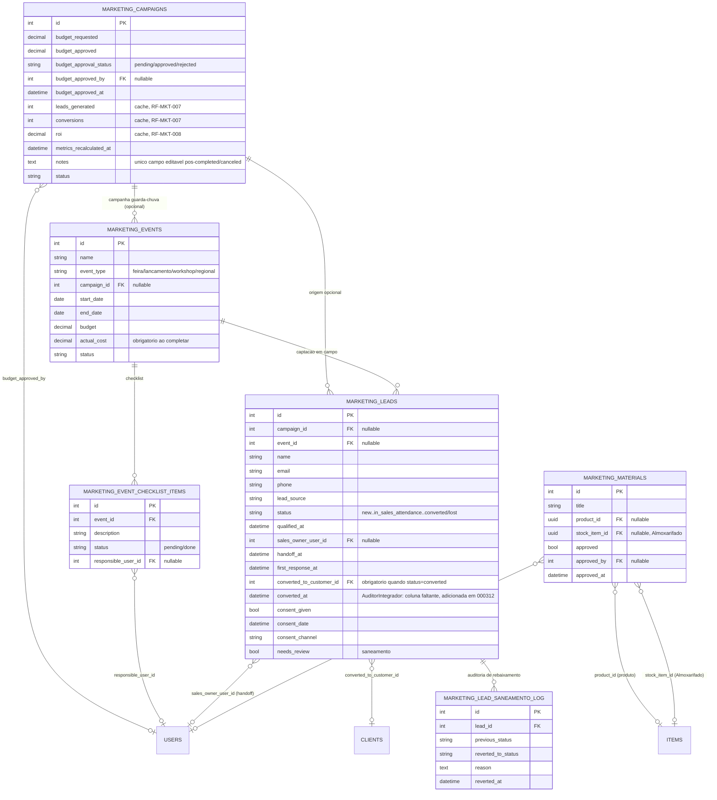

# BLOCO 5 (CORREÇÃO) — Módulo Marketing (MKT) — Modelo de Dados

**Departamento:** 14 — Marketing.
**Insumos:** `docs/business/BLOCO_5_MKT_REQUISITOS.md` (40 RF-MKT, UC-63 a
UC-66) e `docs/business/BLOCO_5_MKT_VERIFICACAO.md` (auditoria que motivou
a correção — veredito GAPS CRÍTICOS).
**Autor:** `AdmDBA`.
**Data:** 2026-08-07.
**Status:** 🟡 Migrations criadas, **não aplicadas** (aguardando aprovação
do dono do produto após revisão do `AuditorIntegrador`, mesma convenção dos
Blocos 1/2/3/4). Nenhum model Sequelize/use-case/controller/RBAC foi
alterado neste passo — isso é responsabilidade do
`ArquitetoSoftwareAPI`/`programador`, depois da validação.

---

## 0. Nota de nomenclatura e escopo

Mantido o prefixo `marketing_` já em uso pela primeira entrega (commit
`2ad27fd`, migration `20260807-000210-create-marketing-module.cjs`) — sem
motivo para trocar. Tabelas novas seguem o mesmo prefixo: `marketing_events`,
`marketing_event_checklist_items`, `marketing_lead_saneamento_log` (esta
última é tabela de auditoria, não de domínio, mas mantém o prefixo por
padronização).

Duas divergências de nome entre o documento de requisitos e o schema real,
decididas nesta passada e documentadas para não haver confusão em quem lê
só o RF:

| Nome no RF (`BLOCO_5_MKT_REQUISITOS.md`) | Nome real na coluna | Motivo |
|---|---|---|
| `responsible_sales_user_id` (RF-MKT-011) | `sales_owner_user_id` | Nome mais curto, mesmo padrão `_owner_` já usado no projeto para "dono de uma tarefa/registro"; decisão explícita deste passo de modelagem |
| `sales_handoff_at` (RF-MKT-013) | `handoff_at` | Idem, brevidade |
| `converted_client_id` (RF-MKT-001/002, §2) | `converted_to_customer_id` | **Não é uma decisão nova** — é o nome já existente desde a migration original (`20260807-000210`); o documento de requisitos usa o nome conceitual do brief, o schema manteve o nome já em produção para não forçar um rename desnecessário de uma coluna que já tem FK e índice ativos |

**6 migrations**, `20260807-000310` a `20260807-000315`, todas `node -c`
validadas, nenhuma aplicada.

---

## 1. Modelo Conceitual (MER) — Mermaid



---

## 2. Funil de Lead, Handoff e Consentimento LGPD — migrations `20260807-000310`/`000311`

### 2.1 Estado novo do funil (RF-MKT-005) — migration `000310`

`enum_marketing_leads_status` ganha `'in_sales_attendance'` via
`ALTER TYPE ... ADD VALUE IF NOT EXISTS` (fora de transação, mesma técnica
já usada em `20260806-000052-add-partially-invoiced-sale-status.cjs`).
Funil corrigido: `new → contacted → qualified → in_sales_attendance →
converted`, `lost` alcançável de qualquer etapa aberta. As
`VALID_TRANSITIONS` do use case (`ChangeLeadStatusUseCase`) não são
alteradas por esta migration — schema apenas viabiliza o valor, a máquina
de estados é decisão de aplicação (`ArquitetoSoftwareAPI`/`programador`).

### 2.2 Colunas de handoff (RF-MKT-011 a 015) — migration `000310`

| Coluna | Tipo | Constraints | Descrição |
|---|---|---|---|
| `qualified_at` | TIMESTAMPTZ | NULL | Momento da transição para `qualified` — base do SLA (RF-MKT-013) |
| `sales_owner_user_id` | INTEGER | NULL, FK → `users.id` **SET NULL** | Vendedor responsável pelo handoff (`responsavel_vendas` do brief) |
| `handoff_at` | TIMESTAMPTZ | NULL | Momento em que `sales_owner_user_id` foi atribuído |
| `first_response_at` | TIMESTAMPTZ | NULL | Primeiro contato do vendedor pós-handoff — coluna adicional (não estava no RF), necessária para o KPI de tempo de ciclo (RF-MKT-026) medir a etapa handoff→1º contato separadamente de handoff→conversão |

Índices: `idx_marketing_leads_sales_owner_user_id`,
`idx_marketing_leads_status_qualified_at` (suporta a listagem de alerta de
SLA vencido, RF-MKT-014).

**Decisão consciente de não adicionar CHECK constraint para RF-MKT-012**
("a partir de `qualified` exige `sales_owner_user_id` para avançar a
`in_sales_attendance`"): leads legados em `qualified`/`converted` não têm
esse campo preenchido e não há como inferir retroativamente quem foi o
responsável histórico — uma CHECK quebraria a aplicação imediatamente
sobre dado pré-existente. Fica como regra de aplicação
(`ChangeLeadStatusUseCase`).

### 2.3 Consentimento LGPD (RF-MKT-035 a 037) — migration `000311`

| Coluna | Tipo | Constraints |
|---|---|---|
| `consent_given` | BOOLEAN | NOT NULL, default `false` |
| `consent_date` | TIMESTAMPTZ | NULL |
| `consent_channel` | ENUM(6 valores) | NULL — `formulario_site`/`whatsapp`/`telefone`/`feira`/`indicacao`/`outro` |

Todos opcionais no `POST` (RF-MKT-036 — decisão de negócio de
obrigatoriedade fica com Compliance). Rotina de expurgo de leads `lost`
(RF-MKT-037) **não entra nesta correção** — pendência P3 explícita.

---

## 3. Integridade da Conversão Lead → Cliente — migration `20260807-000312`

### 3.1 O problema fechado

`BLOCO_5_MKT_VERIFICACAO.md` (achado BR-MKT-008) documentou que
`status='converted'` sem `converted_to_customer_id` é um estado
alcançável hoje — a aplicação só grava o vínculo condicionalmente, nunca
exige. Esta migration fecha essa porta **no banco**, não só na aplicação
(CLAUDE.md §7 "A Verdade no Banco"):

```sql
ALTER TABLE marketing_leads
ADD CONSTRAINT ck_marketing_leads_converted_requires_client
CHECK (status <> 'converted' OR converted_to_customer_id IS NOT NULL);
```

### 3.2 Migration de saneamento (§2 de `BLOCO_5_MKT_REQUISITOS.md`)

O documento de requisitos deixava a decisão como
`[VERIFICAR COM MARKETING]`, com uma recomendação técnica explícita:
opção (a) — rebaixar o lead ao estado anterior, reabrindo o handoff — é
"mais consistente com 'não é um estado válido'". **Esta é a opção
implementada** (caminho reversível, não um estado de exceção permanente):

1. Leads `status='converted' AND converted_to_customer_id IS NULL` são
   identificados.
2. Cada um é registrado em `marketing_lead_saneamento_log` **antes** do
   `UPDATE` (status anterior, status novo, motivo, timestamp) — tabela de
   auditoria permanente, não um log volátil de migração.
3. São rebaixados para `status='qualified'` (único estado
   imediatamente anterior a `converted` que existia no funil **antes**
   desta correção — `in_sales_attendance` só passa a existir na migration
   `000310`, então nenhum lead legado pode tê-lo sido de fato) e marcados
   `needs_review=true`.
4. Só então a `CHECK` constraint de §3.1 é aplicada.
5. A contagem de linhas afetadas é impressa no console da migration
   (`console.log`) durante o `up()`, para auditoria mínima do operador que
   rodar `npm run migration:up`.

`marketing_lead_saneamento_log`:

| Coluna | Tipo | Constraints |
|---|---|---|
| `lead_id` | INTEGER | NOT NULL, FK → `marketing_leads.id` RESTRICT |
| `previous_status` | VARCHAR(30) | NOT NULL — sempre `'converted'` nesta rodada |
| `reverted_to_status` | VARCHAR(30) | NOT NULL — sempre `'qualified'` nesta rodada |
| `reason` | TEXT | NOT NULL |
| `reverted_at` | TIMESTAMPTZ | NOT NULL |

`marketing_leads.needs_review` (BOOLEAN, NOT NULL, default `false`,
indexado): sinaliza os leads afetados para a equipe MKT/Vendas triar
deliberadamente (filtro de tela dedicado — fora do escopo desta
migration) em vez de tratá-los como leads novos comuns.

### 3.2b Correções da auditoria cruzada (`AuditorIntegrador`, 2026-08-07)

Duas correções aplicadas diretamente na migration `20260807-000312` após
a auditoria cruzada Requisito↔Banco↔API, sem alterar a decisão de
saneamento em si (§3.2 permanece a mesma):

1. **`converted_at` (coluna nova, TIMESTAMPTZ, nullable):**
   `docs/business/BLOCO_5_MKT_API.md` (UC-63, resposta de
   `POST /leads/:id/convert`, e o KPI `median_lead_cycle_days` de
   RF-MKT-026) referenciava um campo `converted_at` que não existia em
   nenhuma migration nem neste documento — gap de schema real (API
   prometia campo que o banco não sustentava). Adicionado de forma
   aditiva na mesma migration `000312`, sem backfill retroativo (não há
   como inferir o instante exato de conversões passadas).
2. **Transação explícita:** a versão original desta migration executava
   os passos 1-5 fora de uma transação (gap real — `sequelize-cli` não
   envolve `up()` em transação automaticamente). Como nenhum passo desta
   migration usa `ALTER TYPE ... ADD VALUE` (essa restrição é da migration
   `000310`, não desta), não havia impedimento técnico para uma transação
   única — corrigido nesta auditoria (`queryInterface.sequelize.transaction`
   envolvendo os passos 1 a 5). Mitiga o risco de estado intermediário
   (ex. UPDATE de saneamento aplicado sem o CHECK constraint subsequente,
   caso o processo caia no meio) sem alterar o comportamento idempotente
   já existente (cada passo continua verificando se já foi aplicado antes
   de agir).

### 3.3 Risco declarado (não mitigado — decisão de negócio)

Reabrir um lead que a equipe comercial já considerava "fechado há tempo"
pode gerar trabalho duplicado ou confusão — exatamente o trade-off que o
documento de requisitos identificava como decisão de negócio, não
técnica. Como o schema atual **não tem histórico de status** (não existe
tabela `marketing_lead_status_history`), não há como saber se um lead
converted-órfão específico é um erro recente de operação (baixo risco de
reabrir) ou uma venda fechada há meses (alto risco de reabrir
indevidamente) — o saneamento trata todos os casos da mesma forma. Se o
volume de linhas afetadas (impresso no `console.log` do `up()`) for
material, recomenda-se ao dono do produto revisar a lista via
`marketing_lead_saneamento_log` antes de comunicar a mudança à equipe de
Vendas.

**Ambiente onde isso foi verificado:** não foi possível contar o número
real de linhas afetadas nesta passada (migration não aplicada, sem acesso
a um banco com dado real de Marketing rodando). Isso é reforçado no §7
como pendência explícita antes do Go-Live.

---

## 4. Evento/Feira — migration `20260807-000313`

### 4.1 `marketing_events` (RF-MKT-020)

| Coluna | Tipo | Constraints |
|---|---|---|
| `name` | VARCHAR(200) | NOT NULL |
| `location` | VARCHAR(255) | NULL |
| `event_type` | ENUM(4 valores) | NOT NULL — `feira`/`lancamento`/`workshop`/`regional` |
| `campaign_id` | INTEGER | NULL, FK → `marketing_campaigns.id` **SET NULL** — evento pode existir sem campanha guarda-chuva |
| `start_date`/`end_date` | DATE | `start_date` NOT NULL, `end_date` NULL |
| `budget` | DECIMAL(15,2) | NULL |
| `actual_cost` | DECIMAL(15,2) | NULL — obrigatório ao fechar (ver CHECK abaixo) |
| `status` | ENUM(4 valores) | NOT NULL, default `planned` — `planned`/`in_progress`/`completed`/`canceled` |

`ck_marketing_events_end_after_start`: `end_date IS NULL OR end_date >=
start_date`.

`ck_marketing_events_completed_requires_actual_cost` (RF-MKT-025):
`status <> 'completed' OR actual_cost IS NOT NULL`.

### 4.2 `marketing_event_checklist_items` (RF-MKT-021)

Tabela filha, **não JSONB** — decisão de modelagem justificada: o
checklist precisa de `responsible_user_id` com integridade referencial
real (FK a `users.id`, coisa que JSONB não oferece) e `status`
consultável/filtrável por item. O precedente mais próximo do projeto para
"sub-registro com responsável e status próprios" é
`facility_cleaning_executions` (tabela filha de
`facility_cleaning_schedules`, `20260807-000297`), não os poucos usos de
JSONB do projeto (`acoustic_tests`, `it_access_requests`, `jur_contracts`
etc. — todos payload não estruturado sem necessidade de FK/consulta por
campo).

| Coluna | Tipo | Constraints |
|---|---|---|
| `event_id` | INTEGER | NOT NULL, FK → `marketing_events.id` **RESTRICT** |
| `description` | VARCHAR(255) | NOT NULL |
| `status` | ENUM(2 valores) | NOT NULL, default `pending` — `pending`/`done`, sem enum fechado de categorias (brief: "não engessar em código") |
| `responsible_user_id` | INTEGER | NULL, FK → `users.id` **SET NULL** |

### 4.3 `marketing_leads.event_id` (RF-MKT-022/023/024)

FK opcional → `marketing_events.id`, **SET NULL**. Constraint cruzada:

```sql
ALTER TABLE marketing_leads
ADD CONSTRAINT ck_marketing_leads_event_requires_event_source
CHECK (event_id IS NULL OR lead_source = 'event');
```

Garante que todo lead vinculado a um evento tenha `lead_source='event'`
(a atribuição automática do valor no `POST` é responsabilidade da
aplicação — o CHECK só impede a inconsistência de gravar `event_id` com
outra origem). Contagem de leads do evento (RF-MKT-023) e custo por lead
(RF-MKT-024) são **sempre derivados** via `COUNT`/divisão em tempo de
leitura — nenhuma coluna `leads_count` foi criada em `marketing_events`,
mesmo princípio de BR-MKT-004 aplicado por extensão ao evento.

---

## 5. Orçamento, Aprovação, Imutabilidade e Métricas de Campanha — migration `20260807-000314`

### 5.1 Orçamento e aprovação (RF-MKT-030/031)

`budget` é **renomeado** para `budget_requested` (preserva o dado
existente — nenhuma perda). Colunas novas:

| Coluna | Tipo | Constraints |
|---|---|---|
| `budget_approved` | DECIMAL(15,2) | NULL até a aprovação |
| `budget_approval_status` | ENUM(3 valores) | NOT NULL, default `pending` — `pending`/`approved`/`rejected` |
| `budget_approved_by` | INTEGER | NULL, FK → `users.id` **SET NULL** |
| `budget_approved_at` | TIMESTAMPTZ | NULL |

Aprovação registrada **dentro do módulo MKT** nesta rodada (recomendação
do brief d.2). **Nenhuma FK para `cost_centers` foi adicionada** — a
decisão nº5 deste passo de modelagem ("vínculo opcional a `cost_centers`
se os requisitos pedirem") não se aplica: nenhum RF deste bloco pede esse
vínculo; ficaria fora do escopo do que foi formalmente requisitado. Se o
Financeiro quiser reportar gasto de Marketing por centro de custo no
futuro, é uma migration aditiva simples (`ADD COLUMN cost_center_id`),
sem impacto retroativo.

`ck_marketing_campaigns_active_requires_budget_approval` (RF-MKT-031):
`status <> 'active' OR budget_approval_status = 'approved'`.

**Backfill/grandfathering obrigatório antes da CHECK:** campanhas já
`status='active'` no momento da migration são marcadas
`budget_approval_status='approved'` retroativamente (`budget_approved =
COALESCE(budget_approved, budget_requested)`, `budget_approved_at =
NOW()`), com `budget_approved_by` permanecendo `NULL` (não há como saber
quem aprovou historicamente). Contagem logada no console do `up()`, mesmo
padrão do saneamento de leads (§3.2).

### 5.2 Imutabilidade pós-conclusão (RF-MKT-034)

`notes` (TEXT, nullable) é o único campo pensado para permanecer editável
quando `status IN ('completed', 'canceled')`. O bloqueio dos demais
campos **não é uma CHECK constraint** — Postgres não expressa "impedir
mudança de valor comparada ao estado anterior" sem trigger, e este
projeto tem decisão arquitetural registrada de manter regra de negócio só
na aplicação (`docs/database/06-ESTRUTURAS_PROGRAMAVEIS.md`). Fica para
`UpdateCampaignUseCase`.

### 5.3 Métricas de campanha — cache (RF-MKT-006 a 010, decisão do `AdmDBA`)

**Decisão formal deste passo:** `leads_generated`/`conversions`/`roi`
**permanecem como colunas de cache**, não são removidas nem substituídas
por view materializada nesta rodada — confirma a recomendação do
requisito (RF-MKT-007): listagem de campanha (`GET
/api/marketing/campaigns`) precisa de leitura rápida sem `JOIN`/agregação
pesada a cada request; cache com invalidação automática nos 3 gatilhos
descritos no RF (criação de lead vinculado, conversão, reconciliação sob
demanda) é mais seguro contra drift do que reescrever tudo para
on-the-fly nesta rodada. **Reavaliar para view materializada se o volume
de leads/campanhas crescer o suficiente para o cache se tornar um
gargalo real de consistência** — não é o caso hoje (módulo de baixo
volume transacional, confirmado no próprio RF-MKT-007).

Nova coluna: `metrics_recalculated_at` (TIMESTAMPTZ, nullable) — marca a
última vez que o cache foi recalculado a partir dos vínculos reais,
viabilizando alertar drift (nunca recalculado, ou recalculado há muito
tempo) sem exigir trigger de recálculo automático (decisão nº3 deste
passo: "nada de trigger de recálculo — é use case").

Somente-leitura via API (rejeitar `leads_generated`/`conversions`/`roi`
no `PUT`/`POST` via Zod `.strict()`) é regra de validação, fora do
escopo desta migration de schema.

### 5.4 Alerta de orçamento (RF-MKT-032/033) — sem coluna nova

`budget_alert_level` (`none`/`warning_90`/`over_100`) é **calculado em
tempo de leitura** (`actual_cost ÷ budget_approved`) — não há `ALTER
TABLE` correspondente, por design: evita o mesmo tipo de drift que
motivou manter `leads_generated`/`conversions`/`roi` como cache em vez de
input livre, mas aqui o cálculo é barato o bastante (uma divisão) para
não precisar de cache. Threshold de 90%/100% fica como constante de
aplicação (RF-MKT-033 — `[DEFINIR COM COORDENADOR]`).

---

## 6. Material Promocional — migration `20260807-000315`

| Coluna nova | Tipo | Constraints | RF |
|---|---|---|---|
| `stock_item_id` | UUID | NULL, FK → `items.id` **SET NULL** | RF-MKT-038 — item de estoque do Almoxarifado (categoria "Material Promocional", convenção de negócio); nenhuma movimentação criada pelo módulo MKT (BR-MKT-011 mantida) |
| `approved_by` | INTEGER | NULL, FK → `users.id` **SET NULL** | RF-MKT-039 — auditoria de quem aprovou |
| `approved_at` | TIMESTAMPTZ | NULL | RF-MKT-039 |

`stock_item_id` é `UUID` (não `INTEGER`) pelo mesmo motivo de
`product_id` na mesma tabela: `items.id` é UUID no schema real.

Comportamento "`POST` sempre nasce `approved=false`" (RF-MKT-039) e "nova
versão reseta `approved` para `false`" (RF-MKT-040) são regra de
validação/aplicação (`createMaterialSchema`, endpoint de nova versão) —
a coluna `approved` já existe desde a migration original, sem alteração
de schema necessária além das duas colunas de auditoria acima.

---

## 7. Retenção e Imutabilidade — Resumo

- **Sem soft delete** em nenhuma tabela nova — `marketing_events` usa
  `status`, `marketing_event_checklist_items` usa `status`, nenhuma tem
  endpoint de exclusão física prevista nos RFs deste bloco.
- **Sem trigger** neste bloco — nem para recálculo de métricas (decisão
  explícita nº3), nem para imutabilidade de campanha concluída (§5.2),
  nem para o saneamento de leads (executado uma única vez, dentro da
  própria migration, não como rotina recorrente).
- **FKs RESTRICT por padrão** onde o vínculo é estrutural
  (`marketing_event_checklist_items.event_id`,
  `marketing_lead_saneamento_log.lead_id`); **SET NULL** onde o vínculo é
  puramente informativo/opcional e o registro principal deve sobreviver à
  remoção do lado referenciado (`sales_owner_user_id`, `event_id` em
  leads, `campaign_id` em eventos, `budget_approved_by`, `approved_by`,
  `stock_item_id`) — mesmo padrão já em uso na migration original do
  módulo (`campaign_id`/`converted_to_customer_id`/`product_id`).

---

## 8. Rastreabilidade RF-MKT → Tabela(s)/Migration

| RF-MKT | Tabela(s)/coluna(s) | Migration |
|---|---|---|
| 001 a 004 | `marketing_leads.converted_to_customer_id` + CHECK `ck_marketing_leads_converted_requires_client` | `000312` |
| 005 | `enum_marketing_leads_status` (+`in_sales_attendance`) | `000310` |
| 006 | Fora de escopo de schema — validação Zod (`ArquitetoSoftwareAPI`) | — |
| 007, 009 | `marketing_campaigns.metrics_recalculated_at` (cache mantido, decisão §5.3) | `000314` |
| 008, 010 | Fora de escopo de schema — cálculo em use case (janela de atribuição, receita) | — |
| 011 a 013 | `marketing_leads.qualified_at`/`sales_owner_user_id`/`handoff_at`/`first_response_at` | `000310` |
| 014, 015 | Índice `idx_marketing_leads_status_qualified_at` + RBAC (`ArquitetoSoftwareAPI`) | `000310` |
| 016 a 019 | Fora de escopo de schema — validação Zod, dedup em use case | — |
| 020, 021 | `marketing_events`, `marketing_event_checklist_items` | `000313` |
| 022 | `marketing_leads.event_id` + CHECK `ck_marketing_leads_event_requires_event_source` | `000313` |
| 023, 024 | Derivado em tempo de leitura (`COUNT`/divisão) — sem coluna | — |
| 025 | CHECK `ck_marketing_events_completed_requires_actual_cost` | `000313` |
| 026 a 029 | Fora de escopo de schema — endpoint de relatório (`ArquitetoSoftwareAPI`) | — |
| 030, 031 | `marketing_campaigns.budget_requested`/`budget_approved`/`budget_approval_status`/`budget_approved_by`/`budget_approved_at` + CHECK `ck_marketing_campaigns_active_requires_budget_approval` | `000314` |
| 032, 033 | Derivado em tempo de leitura — sem coluna | — |
| 034 | `marketing_campaigns.notes` (regra de bloqueio é aplicação) | `000314` |
| 035, 036 | `marketing_leads.consent_given`/`consent_date`/`consent_channel` | `000311` |
| 037 | Fora de escopo (P3 explícito, pendente Compliance) | — |
| 038 | `marketing_materials.stock_item_id` | `000315` |
| 039, 040 | `marketing_materials.approved_by`/`approved_at` (regra de nascer `false` é aplicação) | `000315` |
| §2 (saneamento) | `marketing_lead_saneamento_log`, `marketing_leads.needs_review` | `000312` |

---

## 9. Pendências para o `ArquitetoSoftwareAPI`/`programador`

1. **RBAC `approve` (§5.1 do documento de requisitos):** avaliar se
   `marketing` precisa do nível `approve` para aprovação de orçamento
   (RF-MKT-031) e aprovação de material (RF-MKT-039) — não alterado nesta
   migration (`accessModules.ts` hoje só tem leitura implícita/`operate`
   para `marketing`).
2. **Máquina de estados do lead (`ChangeLeadStatusUseCase`):** incluir
   `in_sales_attendance` em `VALID_TRANSITIONS`, exigir
   `sales_owner_user_id` para avançar a partir de `qualified` (RF-MKT-012,
   regra de aplicação — schema não impõe), e gravar
   `converted_to_customer_id` de forma atômica com a criação de `Client`
   quando aplicável (RF-MKT-002, transação única).
3. **Dedup de lead (RF-MKT-018):** consulta cruzada contra
   `marketing_leads` abertos e `clients` — usa os índices já existentes em
   `email`/`phone` (confirmar cobertura, RNF-MKT-002); nenhuma tabela nova
   necessária.
4. **KPIs de funil (RF-MKT-026 a 029):** endpoint de relatório —
   nenhuma tabela nova necessária, tudo é `JOIN`/agregação sobre
   `marketing_leads`/`marketing_campaigns`/`sales`/`clients`.
5. **Job/rotina de reconciliação (RF-MKT-009):** `POST
   /api/marketing/campaigns/:id/recalculate` — grava
   `leads_generated`/`conversions`/`roi`/`metrics_recalculated_at`, deve
   ser idempotente (RNF-MKT-001).
6. **Contagem real do saneamento (§3.3):** rodar a migration `000312`
   contra uma cópia do banco com dado real de Marketing (se existir) e
   revisar `marketing_lead_saneamento_log` antes de comunicar a mudança
   de status para a equipe de Vendas/Marketing — não foi possível
   verificar volume nesta passada (ambiente sem dado real do módulo).
7. **Parâmetros `[DEFINIR COM COORDENADOR]`** (RF-MKT-010/014/033):
   janela de atribuição de receita (90 dias sugeridos), SLA de handoff (2
   dias úteis sugeridos), threshold de alerta de orçamento (90%
   sugerido) — implementar como constantes configuráveis, não hard-code
   espalhado (já são NULL-safe no schema, nenhuma coluna depende desses
   valores).

---

## Referências

- `docs/business/BLOCO_5_MKT_REQUISITOS.md`
- `docs/business/BLOCO_5_MKT_VERIFICACAO.md`
- `docs/business/BLOCO_1_SST_MODELO_DADOS.md`, `BLOCO_2_TI_MODELO_DADOS.md`,
  `BLOCO_3_JUR_MODELO_DADOS.md`, `BLOCO_4_FAC_MODELO_DADOS.md` — mesmo
  padrão de entregável
- `server/src/models/MarketingCampaign.ts`, `MarketingLead.ts`,
  `MarketingMaterial.ts` — models atuais (**não alterados** nesta
  passada, ver §9)
- `server/migrations/20260807-000210-create-marketing-module.cjs` —
  migration original, schema-base deste bloco
