# BLOCO 6 — Módulo RH (Recursos Humanos) — Modelo de Dados

**Departamento:** 02 — RH.
**Insumo:** `docs/business/BLOCO_6_RH_REQUISITOS.md` (81 RF-RH, RNF-RH-01 a
05, UC-67 a UC-71, §6 "Decisões e Pendências para Arquitetos").
**Autor:** `AdmDBA`.
**Data:** 2026-08-08.
**Status:** 🟡 Migrations criadas, **não aplicadas** (aguardando aprovação
do dono do produto após revisão do `AuditorIntegrador`, mesma convenção dos
Blocos 1/2/3/4/5). Nenhum model Sequelize/use-case/controller/RBAC foi
alterado neste passo — isso é responsabilidade do
`ArquitetoSoftwareAPI`/`programador`, depois da validação.

Este é o **sexto e último bloco** do pipeline de módulos novos
(`docs/business/pipeline-modulos-novos.md`). Trabalho coordenado com
`ArquitetoSoftwareAPI`, que desenha o contrato REST em paralelo a partir do
mesmo documento de requisitos. Ver §11 "Contratos que a API deve
respeitar" ao final.

---

## 0. Nota de nomenclatura e escopo

**Prefixo `hr_`** para as tabelas novas (decisão deste passo, conforme
delegado pelo documento de requisitos §"Convenções obrigatórias"). Motivo:
diferente do SST (`sst_`, nomes PT-BR, por exigência textual das NRs) e do
Jurídico/TI (`jur_`/`it_`, ingles por decisão pontual dos respectivos
blocos), o próprio domínio que este bloco estende — `employees`,
`departments` — **já usa nomes de tabela e coluna em inglês** desde a
origem do projeto (`status active/inactive/fired/vacation/license`,
`shift morning/afternoon/...`, `work_regime clt/pj/estagiario/aprendiz`).
Criar tabelas novas em português quebraria essa consistência sem nenhum
ganho equivalente ao do SST (não há aqui uma exigência textual de norma
regulamentadora amarrando nome de coluna a termo legal específico — CLT
não cita nomes de campo de sistema). `hr_` (não `rh_`) foi escolhido para
ficar no mesmo idioma das colunas.

**20 tabelas novas** (corrigido pelo `AuditorIntegrador` em 2026-08-09 —
o texto original dizia "18 tabelas novas", mas a enumeração de §2 a §9
lista 20 nomes distintos: `hr_job_positions`, `hr_job_vacancies`,
`hr_candidates`, `hr_employee_job_history`, `hr_employee_contracts`,
`hr_admission_processes`, `hr_termination_processes`,
`hr_employee_documents`, `hr_vacation_accrual_periods`,
`hr_vacation_schedules`, `hr_absences`, `hr_benefit_types`,
`hr_employee_benefits`, `hr_training_courses`, `hr_job_position_trainings`,
`hr_employee_trainings`, `hr_time_sheet_summaries`,
`hr_payroll_import_batches`, `hr_payroll_import_items`,
`hr_performance_reviews` — confirmado contra as 16 migrations no disco,
que agrupam múltiplas tabelas por arquivo), **16 migrations**,
`20260808-000010` a `20260808-000025` (confirmado que
`20260808-000001`/`000002` já estavam em uso pelo Jurídico antes deste
passo — sem colisão), todas `node -c` validadas, nenhuma aplicada.

**O que este bloco explicitamente NÃO modela** (decisão herdada do
documento de requisitos, não deste passo):
- Cálculo de folha de pagamento (INSS/IRRF/FGTS/13º/rescisão) — BUY/
  INTEGRAR, RNF-RH-03/§6.1. `hr_payroll_import_batches`/`hr_payroll_import_items`
  modelam apenas a **importação** do resultado já calculado.
- Registro/tratamento de ponto eletrônico (REP) — BUY/INTEGRAR, §6.2.
  `hr_time_sheet_summaries` modela apenas a **importação** do espelho
  mensal consolidado.
- ASO/PCMSO — entidade do módulo SST (`sst_asos`), decisão firmada no
  Bloco 1, não reaberta aqui. Nenhuma tabela deste bloco replica laudo
  clínico; `hr_employee_documents`/`hr_admission_processes`/
  `hr_termination_processes` armazenam apenas snapshots de
  aptidão+validade (ver §3 e §5).
- Mensageria eSocial (S-2200/S-2206/S-2230/S-2299) — o ERP cobra
  confirmação (`*_confirmed_at`/`*_confirmed_by`), nunca transmite.

---

## 1. Modelo Conceitual (MER) — Mermaid

```mermaid
erDiagram
    EMPLOYEES ||--o{ HR_EMPLOYEE_JOB_HISTORY : "historico contratual"
    EMPLOYEES ||--o{ HR_EMPLOYEE_CONTRACTS : "contratos (experiencia etc.)"
    EMPLOYEES ||--o{ HR_ADMISSION_PROCESSES : "admissao origina"
    EMPLOYEES ||--o{ HR_TERMINATION_PROCESSES : "desligamento"
    EMPLOYEES ||--o{ HR_EMPLOYEE_DOCUMENTS : "documentos"
    EMPLOYEES ||--o{ HR_VACATION_ACCRUAL_PERIODS : "periodos aquisitivos"
    EMPLOYEES ||--o{ HR_ABSENCES : "afastamentos"
    EMPLOYEES ||--o{ HR_EMPLOYEE_BENEFITS : "adesoes a beneficio"
    EMPLOYEES ||--o{ HR_EMPLOYEE_TRAININGS : "treinamentos realizados"
    EMPLOYEES ||--o{ HR_TIME_SHEET_SUMMARIES : "resumo de ponto mensal"
    EMPLOYEES ||--o{ HR_PAYROLL_IMPORT_ITEMS : "custo de folha importado"
    EMPLOYEES ||--o{ HR_PERFORMANCE_REVIEWS : "avaliacoes"
    EMPLOYEES }o--o| HR_JOB_POSITIONS : "job_position_id (opcional)"

    DEPARTMENTS ||--o{ HR_JOB_POSITIONS : "cargos do setor"
    DEPARTMENTS ||--o{ HR_JOB_VACANCIES : "vagas do setor"
    DEPARTMENTS ||--o{ HR_EMPLOYEE_JOB_HISTORY : "departamento no historico"

    HR_JOB_POSITIONS ||--o{ HR_JOB_POSITION_TRAININGS : "treinamentos obrigatorios"
    HR_TRAINING_COURSES ||--o{ HR_JOB_POSITION_TRAININGS : "curso exigido"
    HR_TRAINING_COURSES ||--o{ HR_EMPLOYEE_TRAININGS : "curso realizado"

    HR_JOB_VACANCIES ||--o{ HR_CANDIDATES : "candidatos"
    HR_CANDIDATES ||--o| HR_ADMISSION_PROCESSES : "origem opcional"
    HR_JOB_VACANCIES ||--o{ HR_ADMISSION_PROCESSES : "vaga opcional"

    HR_EMPLOYEE_CONTRACTS ||--o| HR_ADMISSION_PROCESSES : "contrato inicial"
    HR_EMPLOYEE_JOB_HISTORY ||--o| HR_ADMISSION_PROCESSES : "job history inicial"

    HR_VACATION_ACCRUAL_PERIODS ||--o{ HR_VACATION_SCHEDULES : "fracoes programadas"
    HR_VACATION_ACCRUAL_PERIODS ||--o{ HR_ABSENCES : "impacto sobre o periodo"
    HR_VACATION_ACCRUAL_PERIODS |o--o| HR_VACATION_ACCRUAL_PERIODS : "zeroed_from_period_id"
    HR_VACATION_SCHEDULES |o--o| HR_VACATION_SCHEDULES : "superseded_by_id"

    HR_EMPLOYEE_DOCUMENTS ||--o{ HR_ABSENCES : "ASO de retorno (document_id)"

    HR_BENEFIT_TYPES ||--o{ HR_EMPLOYEE_BENEFITS : "catalogo"

    HR_PAYROLL_IMPORT_BATCHES ||--o{ HR_PAYROLL_IMPORT_ITEMS : "itens do lote"
    COST_CENTERS ||--o{ HR_PAYROLL_IMPORT_ITEMS : "rateio (RF-RH-071)"

    ASSETS }o--o{ HR_TERMINATION_PROCESSES : "checklist devolucao (sem FK, integracao Patrimonio)"

    HR_JOB_POSITIONS {
        int id PK
        int department_id FK
        string name
        decimal salary_range_min "sensivel"
        decimal salary_range_max "sensivel"
        bool active
    }
    HR_ADMISSION_PROCESSES {
        int id PK
        int job_vacancy_id FK "nullable"
        int candidate_id FK "nullable"
        string status
        datetime aso_confirmed_at
        string aso_result "snapshot, sem FK para sst_asos"
        datetime esocial_s2200_confirmed_at
        int employee_id FK "nullable ate concluir"
        int contract_id FK "nullable ate concluir"
        int job_history_id FK "nullable ate concluir"
    }
    HR_EMPLOYEE_CONTRACTS {
        int id PK
        int employee_id FK
        string type
        date start_date
        date period_1_end_date
        date period_2_end_date "uma unica prorrogacao"
        string status
    }
    HR_TERMINATION_PROCESSES {
        int id PK
        int employee_id FK
        string termination_type
        date termination_date
        date payment_deadline "GENERATED (termination_date+10)"
        bool checklist_assets_returned
        string status
    }
    HR_EMPLOYEE_DOCUMENTS {
        int id PK
        int employee_id FK
        string doc_type
        date valid_until
        string aptitude_result "so aso_*, nunca laudo"
        string origin "rh/sst"
    }
    HR_VACATION_ACCRUAL_PERIODS {
        int id PK
        int employee_id FK
        date period_start
        date period_end "GENERADO via CHECK = +12m"
        date concessive_end "GENERADO via CHECK = +12m"
        int entitled_days
        string status
    }
    HR_VACATION_SCHEDULES {
        int id PK
        int accrual_period_id FK
        smallint fraction_number
        date start_date
        int days
        bool abono
        bool employee_agreement_confirmed
        string status
    }
    HR_ABSENCES {
        int id PK
        int employee_id FK
        string type
        date start_date
        date actual_end_date
        string cid "reforcado, RNF-RH-01"
        int accrual_period_impact_id FK "nullable"
    }
    HR_EMPLOYEE_JOB_HISTORY {
        int id PK
        int employee_id FK
        int job_position_id FK "nullable"
        int department_id FK
        decimal salary "sensivel"
        date effective_from
        date effective_to "nullable"
        string reason
    }
    HR_PAYROLL_IMPORT_ITEMS {
        int id PK
        int batch_id FK
        int employee_id FK
        decimal bruto "reforcado, RF-RH-072"
        decimal liquido "reforcado, RF-RH-072"
        int cost_center_id FK "nullable"
    }
```

---

## 2. Cargos e Recrutamento Mínimo (P2) — migrations `20260808-000010`/`000011`/`000012`

### 2.1 `hr_job_positions` (RF-RH-024 a 026) — migration `000010`

| Coluna | Tipo | Constraints | Descrição |
|---|---|---|---|
| id | INTEGER PK | | |
| department_id | INTEGER | NOT NULL, FK → `departments.id` RESTRICT | |
| name | VARCHAR(150) | NOT NULL | |
| cbo_code | VARCHAR(20) | NULL | |
| description | TEXT | NULL | |
| salary_range_min/max | DECIMAL(12,2) | NULL 🔒 | Dado sensível — segregação `rh` (RF-RH-006) |
| requirements | TEXT | NULL | |
| active | BOOLEAN | NOT NULL, default `true` | |

`CHECK ck_hr_job_positions_salary_range`: `salary_range_min IS NULL OR
salary_range_max IS NULL OR salary_range_min <= salary_range_max`.

### 2.2 `employees.pcd`/`employees.job_position_id` — migration `000011`

Extensão aditiva de `employees` (RF-RH-025/067), sem impacto em registros
existentes:

| Coluna nova | Tipo | Constraints |
|---|---|---|
| `pcd` | BOOLEAN | NULL 🔒 — indicador para quota legal (BR-RH-018) |
| `job_position_id` | INTEGER | NULL, FK → `hr_job_positions.id` RESTRICT — `employees.position` (texto livre) permanece válido para registros não migrados |

`work_regime='aprendiz'` (já existente) é reaproveitado para o indicador
de aprendiz — **nenhuma coluna nova** para isso (RF-RH-067).

### 2.3 `hr_job_vacancies` + `hr_candidates` (RF-RH-078 a 081, P2) — migration `000012`

Criadas **antes** de `hr_admission_processes` (ordem deliberada — RF-RH-080
permite que um `Candidate` aprovado origine uma admissão pré-preenchida,
evitando referência para frente sem FK fechada).

| Tabela | Colunas-chave | FK |
|---|---|---|
| `hr_job_vacancies` | job_position_id (nullable), department_id, status (ENUM 4 valores), opened_at, closed_at, created_by | `job_position_id`→hr_job_positions RESTRICT · `department_id`→departments RESTRICT · `created_by`→users RESTRICT |
| `hr_candidates` | job_vacancy_id, name, contact, resume_file_path, stage (ENUM 4 valores), notes | `job_vacancy_id`→hr_job_vacancies RESTRICT |

---

## 3. Histórico Contratual e Contrato de Experiência — migrations `20260808-000013`/`000014`

### 3.1 `hr_employee_job_history` (RF-RH-064 a 066, P9) — migration `000013`

| Coluna | Tipo | Constraints | Descrição |
|---|---|---|---|
| employee_id | INTEGER | NOT NULL, FK → `employees.id` RESTRICT | |
| job_position_id | INTEGER | NULL, FK → `hr_job_positions.id` RESTRICT | |
| department_id | INTEGER | NOT NULL, FK → `departments.id` RESTRICT | |
| salary | DECIMAL(12,2) | NOT NULL 🔒 | Dado sensível — segregação `rh` |
| effective_from/effective_to | DATEONLY | `effective_from` NOT NULL, `effective_to` NULL | |
| reason | ENUM(`admissao`,`promocao`,`transferencia`,`reajuste`) | NOT NULL | |
| pending_aso_risk_change | BOOLEAN | NOT NULL, default `false` — corrigido pelo `AuditorIntegrador`, faltava (ver API §13.1, RF-RH-066) | |
| esocial_event_confirmed_at/by | TIMESTAMPTZ/INTEGER | NULL | |

**Trigger `hr_lock_job_history` (RNF-RH-04, CLT art. 468):** ver §10. A
lista de colunas mutáveis pós-INSERT foi ajustada para incluir também
`pending_aso_risk_change`.

### 3.2 `hr_employee_contracts` (RF-RH-013 a 016, P0) — migration `000014`

| Coluna | Tipo | Constraints | Descrição |
|---|---|---|---|
| employee_id | INTEGER | NOT NULL, FK → `employees.id` RESTRICT | |
| type | ENUM(`indeterminado`,`experiencia`,`aprendiz`,`estagio`) | NOT NULL | |
| start_date | DATEONLY | NOT NULL | |
| period_1_end_date/period_2_end_date | DATEONLY | NULL | `period_2` só uma vez (trigger, RF-RH-015) |
| effective_end_date | DATEONLY | NULL | |
| status | ENUM(5 valores) | NOT NULL, default `ativo` | |

`CHECK ck_hr_employee_contracts_experiencia_90_dias` (RF-RH-014):
`type <> 'experiencia' OR period_1_end_date IS NULL OR
(COALESCE(period_2_end_date, period_1_end_date) - start_date) <= 90`.

**Trigger `hr_lock_employee_contract` (RNF-RH-04 + RF-RH-015):** ver §10.

---

## 4. Admissão e Demissão — migrations `20260808-000015`/`000016`

### 4.1 `hr_admission_processes` (RF-RH-007 a 012, P1) — migration `000015` — UC-69

Checklist de documentos modelado como **6 flags booleanos fixos**
(`checklist_rg`/`cpf`/`ctps`/`pis`/`proof_of_address`/`photo`) — decisão
deliberada, diferente do checklist variável de
`marketing_event_checklist_items` (tabela filha): aqui a lista é fixa e
pequena, sem necessidade de responsável/status por item nem de itens novos
por processo.

**ASO admissional sem FK para SST:** o processo de admissão **não tem
`employee_id`** até a conclusão (RF-RH-009) — por isso o resultado do ASO
é um **snapshot direto** (`aso_confirmed_at`/`aso_result`/`aso_valid_until`),
não uma FK para `hr_employee_documents` (que exige `employee_id NOT
NULL`) nem para `sst_asos` (cross-módulo, RH consome apenas status via
endpoint de leitura — mesmo padrão já usado pelo próprio SST em relação ao
RH, `docs/business/BLOCO_1_SST_MODELO_DADOS.md` §3.2).

**Corrigido pelo `AuditorIntegrador` em 2026-08-09:** `department_id`,
`job_position_id`, `candidate_cpf` e `planned_start_date` faltavam nesta
tabela apesar de exigidos/aceitos pelo `POST /admission-processes` do
contrato de API (`BLOCO_6_RH_API.md` §4.1) — colunas adicionadas
diretamente na migration `000015` (achado #1 da auditoria).

| Coluna | Tipo | Constraints |
|---|---|---|
| job_vacancy_id/candidate_id | INTEGER | NULL, FK SET NULL |
| candidate_name | VARCHAR(200) | NOT NULL |
| candidate_cpf | VARCHAR(14) | NULL |
| department_id | INTEGER | NOT NULL, FK → `departments.id` RESTRICT |
| job_position_id | INTEGER | NULL, FK → `hr_job_positions.id` RESTRICT |
| planned_start_date | DATEONLY | NOT NULL |
| checklist_* (6 colunas) | BOOLEAN | NOT NULL, default `false` |
| status | ENUM(5 valores) | NOT NULL, default `documentos_pendentes` |
| aso_confirmed_at/aso_result/aso_valid_until | TIMESTAMPTZ/ENUM/DATE | NULL |
| esocial_s2200_confirmed_at/by | TIMESTAMPTZ/INTEGER | NULL |
| employee_id/contract_id/job_history_id | INTEGER | NULL até a conclusão, FK RESTRICT |

RF-RH-010 (data de início bloqueada até `esocial_s2200_confirmed_at`) é
regra de aplicação — cross-column/cross-tabela sem viabilidade de `CHECK`
simples; documentado via `COMMENT ON COLUMN`.

### 4.2 `hr_termination_processes` (RF-RH-017 a 023, P1) — migration `000016` — UC-70

`payment_deadline` é **coluna GERADA** (`GENERATED ALWAYS AS
(termination_date + 10) STORED`) — RF-RH-018 garantido no banco, elimina
drift entre telas/relatórios (Sequelize `createTable` não suporta coluna
gerada nativamente; adicionada via SQL bruto após o `createTable`).

| Coluna | Tipo | Constraints |
|---|---|---|
| employee_id | INTEGER | NOT NULL, FK RESTRICT |
| termination_type | ENUM(5 valores) | NOT NULL |
| notice_date/notice_modality | DATEONLY/ENUM | NOT NULL |
| termination_date | DATEONLY | NULL |
| **payment_deadline** | DATE **GERADA** | `termination_date + 10` |
| trct_file_path | VARCHAR(255) | NULL |
| trct_paid_at | TIMESTAMPTZ | NULL — marcador informativo (corrigido pelo `AuditorIntegrador`, faltava, ver API §6.2) |
| s2299_confirmed_at/by | TIMESTAMPTZ/INTEGER | NULL |
| aso_confirmed_at/aso_result | TIMESTAMPTZ/ENUM | NULL — mesmo padrão de snapshot de §4.1 |
| checklist_assets_returned | BOOLEAN | NOT NULL, default `false` |
| status | ENUM(5 valores) | NOT NULL, default `aberto` |

`CHECK ck_hr_termination_processes_concluido_requires_checklist`
(RF-RH-023): `status <> 'concluido' OR checklist_assets_returned = true`
— o banco impede a conclusão sem o checklist de devolução confirmado; a
verificação em si (consultar `assets.responsible_id`, tabela já
existente) é responsabilidade do use case.

RF-RH-022 (`employees.status='fired'` + `dismissal_date` + desativação de
`user_id` na mesma transação) **não exige nenhuma migration** —
`employees.status` já inclui `'fired'` e `employees.dismissal_date` já
existe desde o schema original; é pura regra de aplicação/transação.

---

## 5. Documentos do Funcionário — migration `20260808-000017`

`hr_employee_documents` (RF-RH-027 a 030): `doc_type` inclui os 5 subtipos
de ASO. **RF-RH-028 é explícito**: apenas `aptitude_result`
(apto/inapto/apto_com_restrição) e `valid_until` são armazenados — nenhuma
coluna de laudo/prontuário clínico existe nesta tabela (LGPD art. 5º II).

| Coluna | Tipo | Constraints |
|---|---|---|
| employee_id | INTEGER | NOT NULL, FK RESTRICT |
| doc_type | ENUM(11 valores) | NOT NULL |
| file_path | VARCHAR(255) | NOT NULL |
| valid_until | DATEONLY | NULL |
| aptitude_result | ENUM(3 valores) | NULL — só para `doc_type` `aso_*` |
| origin | ENUM(`rh`,`sst`) | NOT NULL, default `rh` |
| uploaded_by | INTEGER | NOT NULL, FK RESTRICT |

---

## 6. Férias — migrations `20260808-000018`/`000019` — UC-67 (maior risco legal do bloco)

### 6.1 `hr_vacation_accrual_periods` (RF-RH-031 a 034, 041 a 043, P0)

| Coluna | Tipo | Constraints |
|---|---|---|
| employee_id | INTEGER | NOT NULL, FK RESTRICT |
| period_start | DATEONLY | NOT NULL |
| period_end | DATEONLY | NOT NULL, `CHECK = period_start + 1 ano` |
| concessive_end | DATEONLY | NOT NULL, `CHECK = period_end + 1 ano` |
| unexcused_absences | INTEGER | NOT NULL, default 0 |
| entitled_days | INTEGER | NOT NULL, default 30, `CHECK BETWEEN 0 AND 30` |
| days_taken | INTEGER | NOT NULL, default 0 |
| status | ENUM(`em_curso`,`programado`,`gozado`,`vencido_dobra`,`zerado`) | NOT NULL, default `em_curso` |
| zeroed_reason | TEXT | NULL |
| zeroed_from_period_id | INTEGER | NULL, auto-FK SET NULL |

`CHECK ck_hr_vacation_accrual_periods_period_end`/`_concessive_end`
(RF-RH-031/033): garantem no banco, não só na aplicação, que
`period_end = period_start + 12 meses` e `concessive_end = period_end +
12 meses` — "a verdade no banco" (CLAUDE.md §2).

**Trigger `hr_lock_vacation_accrual_period` (RNF-RH-04, BR-RH-004):** ver
§10.

### 6.2 `hr_vacation_schedules` (RF-RH-035 a 040, P0)

| Coluna | Tipo | Constraints |
|---|---|---|
| accrual_period_id | INTEGER | NOT NULL, FK RESTRICT |
| fraction_number | SMALLINT | NOT NULL, `CHECK BETWEEN 1 AND 3` |
| start_date | DATEONLY | NOT NULL |
| days | INTEGER | NOT NULL, `CHECK > 0` |
| abono/abono_days/abono_requested_at | BOOLEAN/INTEGER/TIMESTAMPTZ | `abono_days CHECK > 0 quando não nulo` |
| notice_sent_at | DATEONLY | NULL |
| employee_agreement_confirmed | BOOLEAN | NOT NULL, default `false` |
| status | ENUM(5 valores) | NOT NULL, default `planejado` |
| superseded_by_id | INTEGER | NULL, auto-FK SET NULL — versionamento (RF-RH-040) |
| financial_confirmed_at | TIMESTAMPTZ | NULL — RF-RH-038 |

**Regras agregadas fora de `CHECK` de linha (decisão deliberada, mesmo
critério do Bloco 5 MKT para regras cross-row):**
- Máximo 3 frações por período, sendo uma ≥14 dias e as demais ≥5
  (RF-RH-035) — depende de agregação entre linhas do mesmo
  `accrual_period_id`.
- Abono ≤ 1/3 dos dias do período aquisitivo (RF-RH-036) — idem.
- Percentual máximo simultâneo da equipe em férias por departamento
  (RF-RH-039) — parâmetro configurável, agregação entre funcionários.
- Antecedência de 30 dias do aviso (RF-RH-037) — o próprio RF permite
  override com justificativa, não é um invariante rígido de banco.

Todas ficam para `CreateVacationScheduleUseCase`/`UpdateVacationScheduleUseCase`.

**Trigger `hr_block_delete_vacation_schedule`:** apenas bloqueia DELETE
(RF-RH-040) — ver §10.

---

## 7. Afastamentos — migration `20260808-000020` — UC-71

`hr_absences` (RF-RH-044 a 049):

| Coluna | Tipo | Constraints |
|---|---|---|
| employee_id | INTEGER | NOT NULL, FK RESTRICT |
| type | ENUM(6 valores) | NOT NULL |
| start_date/expected_end_date/actual_end_date | DATEONLY | `start_date` NOT NULL |
| extended_program | BOOLEAN | NOT NULL, default `false` — adesão Empresa Cidadã (RF-RH-046, corrigido pelo `AuditorIntegrador`, faltava na versão original) |
| **cid** | VARCHAR(10) | NULL 🔒🔒 **reforçado** (RNF-RH-01) |
| document_id | INTEGER | NULL, FK → `hr_employee_documents.id` SET NULL |
| s2230_confirmed_at/by | TIMESTAMPTZ/INTEGER | NULL |
| accrual_period_impact_id | INTEGER | NULL, FK → `hr_vacation_accrual_periods.id` SET NULL |
| accrual_impact_days | INTEGER | NULL — campo derivado (RF-RH-049), não editável via API |

`CHECK ck_hr_absences_actual_end_after_start`: `actual_end_date IS NULL OR
actual_end_date >= start_date`.

**`cid` (RNF-RH-01):** leitura completa exige acesso **mais restrito** que
a segregação padrão de campo do módulo `rh` (que basta
`req.user.permissions.rh`, RF-RH-006) — aqui a rota inteira deve ser
bloqueada via `authorizeModule`, mesmo padrão já usado por `sst` para
ASO/Acidente/CAT. Decisão de nível exato (reforçar `rh` ou reaproveitar
`sst`) é do `ArquitetoSoftwareAPI` (ver §11); este bloco só fixa a
exigência via `COMMENT ON COLUMN`.

---

## 8. Benefícios, Treinamentos, Ponto (importação) e Custo de Folha (importação) — migrations `000021`/`000022`/`000023`/`000024`

### 8.1 `hr_benefit_types` + `hr_employee_benefits` (RF-RH-050 a 054, P1) — `000021`

`discount_value` limitado a 6% do salário-base para `category='vt'`
(RF-RH-052) **não é `CHECK`** — depende de `employees.salary` (tabela
diferente); fica como validação de aplicação, mesmo critério já usado
para regras cross-table em outros blocos (ex.: percentual de equipe em
férias, §6.2). `discount_value` 🔒 dado sensível — segregação `rh`.
`hr_employee_benefits.suspended_days` (INTEGER, default 0) — corrigido
pelo `AuditorIntegrador`, faltava na versão original apesar de referenciado
pelo contrato de API para a suspensão de VT/VR durante afastamento
(RF-RH-047).

**Trigger `hr_block_delete_employee_benefit`:** bloqueia DELETE
(RF-RH-054, "nunca excluído fisicamente" — usa
`enrollment_status='cancelado'`).

### 8.2 `hr_training_courses` + `hr_job_position_trainings` + `hr_employee_trainings` (RF-RH-055 a 059, P1) — `000022`

`validity_months` (NULL = sem vencimento) é sempre informado pela SST
(RF-RH-059) — integração de aplicação, sem regra de banco que force a
origem. `hr_employee_trainings.valid_until` é calculado em app a partir de
`completed_at + validity_months` do curso (não é `GENERATED` — Postgres
não permite `JOIN`/subquery em coluna gerada).

`UNIQUE(job_position_id, training_course_id)` em
`hr_job_position_trainings` evita duplicidade na matriz obrigatória.

### 8.3 `hr_time_sheet_summaries` (RF-RH-060 a 063, P1) — `000023`

Cobre **apenas** a importação/consumo do resumo mensal — nenhuma regra
legal de ponto é recalculada (RNF-RH-03). `UNIQUE(employee_id,
competencia)` — reimportação da mesma competência é UPSERT (app), não
duplicata.

### 8.4 `hr_payroll_import_batches` + `hr_payroll_import_items` (RF-RH-070 a 073, P1) — `000024`

Cobre **apenas** a importação do resultado já calculado pelo provedor de
folha (RNF-RH-03/§6.1). `cost_center_id` reaproveita `cost_centers`
(RF-RH-071). Sem `UNIQUE(competencia)` em `hr_payroll_import_batches`
(diferente de `hr_time_sheet_summaries`) — reimportações da mesma
competência são permitidas e auditáveis (cada lote é um evento distinto,
dado financeiro tem valor de manter o histórico de re-importações).

**`bruto`/`liquido` (RF-RH-072):** acesso **mais restrito** que a
segregação padrão de `rh` — exige `rh` **e** nível equivalente a
`financeiro`/`admin`, mesmo racional do relatório de contencioso em
`juridico` (`BR-JUR-050`). Fixado via `COMMENT ON COLUMN`; decisão final de
implementação é do `ArquitetoSoftwareAPI` (§11).

---

## 9. Avaliação de Desempenho (P2) — migration `20260808-000025`

`hr_performance_reviews` (RF-RH-077): mínimo viável, sem workflow de
calibração — `employee_id`, `period`, `reviewer_id`, `score`, `notes`,
`status` (`rascunho`/`concluida`).

---

## 10. Imutabilidade (RNF-RH-04) e Retenção

**Decisão:** trigger de banco (PL/pgSQL), seguindo o mesmo precedente
estreito já aceito nos Blocos 1 (SST) e 3 (Jurídico) —
`docs/database/06-ESTRUTURAS_PROGRAMAVEIS.md` §"Exceção aplicada — BLOCO 6
RH" (atualizado nesta passada). A trava não decide fluxo nem calcula nada
— é invariante estrutural de valor probatório trabalhista (CLT art. 468)
que precisa sobreviver a um bypass da API.

| Tabela | Mecanismo | O que pode mudar após o INSERT |
|---|---|---|
| `hr_employee_job_history` | `hr_lock_job_history` | Apenas `effective_to`/`esocial_event_confirmed_at`/`esocial_event_confirmed_by` (+`updated_at`). DELETE sempre bloqueado. |
| `hr_employee_contracts` | `hr_lock_employee_contract` | Campos estruturais (`employee_id`/`type`/`start_date`/`period_1_end_date`/`created_by`/`created_at`) travados; `status`/`effective_end_date` evoluem livremente; `period_2_end_date` só admite ser preenchido **uma vez** (de `NULL` para um valor — RF-RH-015). DELETE sempre bloqueado. |
| `hr_vacation_accrual_periods` | `hr_lock_vacation_accrual_period` | `employee_id`/`period_start`/`period_end`/`concessive_end` travados; `status`/`entitled_days`/`days_taken`/`zeroed_*` evoluem durante o ciclo de vida. DELETE sempre bloqueado. |
| `hr_vacation_schedules` | `hr_block_delete_vacation_schedule` | Todas as colunas podem evoluir (ciclo de vida ativo); apenas **DELETE é bloqueado** — correção pós-aprovação é sempre um novo registro com `superseded_by_id` (RF-RH-040). |
| `hr_employee_benefits` | `hr_block_delete_employee_benefit` | Idem — apenas **DELETE bloqueado**; cancelamento usa `enrollment_status='cancelado'` (RF-RH-054). |

`hr_admission_processes`/`hr_termination_processes`/`hr_absences`/
`hr_employee_documents` **não** têm trigger de imutabilidade: são
workflows com ciclo de vida real (documentos podem ser recadastrados,
processos evoluem por status) — a trilha é a auditoria de escrita já
existente do projeto (AuditLog), não uma trava estrutural adicional, mesmo
critério já usado para `sst_asos` no Bloco 1.

**Retenção:** nenhuma rotina de expurgo/limpeza automática em nenhuma
tabela deste bloco — mesmo padrão dos Blocos anteriores (retenção
garantida por ausência de mecanismo de exclusão, não por contador de
expiração). Documentos trabalhistas têm exigência legal de guarda longa;
nenhuma FK deste bloco para `employees` usa `CASCADE` (todas são
`RESTRICT`), então um funcionário desligado (`status='fired'`, nunca
excluído fisicamente, mesmo padrão já aplicado hoje) mantém histórico
contratual, férias, afastamentos e documentos consultáveis
indefinidamente.

---

## 11. Contratos que a API deve respeitar (para o `ArquitetoSoftwareAPI`/`AuditorIntegrador`)

1. **Nível de acesso reforçado ainda não implementado em `accessModules.ts`:**
   este bloco **não altera** `server/src/shared/domain/accessModules.ts`
   (fora do escopo de modelagem de dados) — a chave `rh` já existe. A
   decisão de como expressar "mais restrito que `rh` padrão" para
   `hr_absences.cid` (RNF-RH-01) e `hr_payroll_import_items.bruto`/
   `liquido` (RF-RH-072) — sub-nível novo (`rh:payroll`), exigência dupla
   de módulo (`rh` E `financeiro`/`admin`), ou reaproveitamento de `sst` —
   é decisão do `ArquitetoSoftwareAPI`, documentada como pendência
   explícita no próprio documento de requisitos (§6.3/6.4). O schema só
   marca os campos via `COMMENT ON COLUMN`.
2. **`hr_employee_contracts.period_2_end_date` só aceita ser preenchido
   uma vez:** um `PUT`/`PATCH` que tente alterar um `period_2_end_date` já
   preenchido sempre falhará com exceção do Postgres — o `errorHandler`
   precisa mapear para um `AppError`/`ConflictError` 409 amigável, não
   vazar a mensagem SQL crua (mesmo aviso já registrado no Bloco 1 SST
   para `sst_lock_entrega_epi`/`sst_lock_acidente`).
3. **`hr_vacation_accrual_periods`/`hr_employee_job_history`:** campos
   estruturais travados por trigger — o contrato de API precisa expor
   operações específicas por transição de estado (ex.: "fechar período
   aquisitivo" atualiza só `status`/`days_taken`, "zerar por afastamento"
   atualiza só `status`/`zeroed_reason`/`zeroed_from_period_id`), nunca um
   `PUT` genérico irrestrito.
4. **`hr_termination_processes.payment_deadline` é coluna GERADA:** a API
   nunca deve aceitar esse campo no `POST`/`PUT` (rejeitar via schema Zod
   `.strict()` ou similar) — gravar um valor nele sempre falha no Postgres
   (coluna `GENERATED`, não gravável diretamente).
5. **`hr_admission_processes`/`hr_termination_processes.aso_*` são
   snapshots, não FK para `sst_asos`:** o endpoint de solicitação de ASO
   (RF-RH-008/020) precisa consumir o endpoint de leitura do módulo SST
   (`GET /api/sst/aso/status/:employeeId`, já previsto no Bloco 1) e
   **copiar** o resultado para estas colunas — não há JOIN possível entre
   os dois módulos no banco.
6. **`hr_vacation_schedules`/`hr_employee_benefits`:** DELETE sempre
   falhará no Postgres (trigger) — a API não deve expor rota de exclusão
   física para essas duas tabelas; usar sempre a rota de
   cancelamento/nova-versão (`status='cancelado'` ou
   `superseded_by_id`).
7. **Regras agregadas cross-row (RF-RH-035/036/039, RF-RH-052) não estão
   no banco** — são 100% responsabilidade dos use cases
   (`CreateVacationScheduleUseCase`, `CreateEmployeeBenefitUseCase`),
   listadas explicitamente em §6.2/§8.1 para não serem esquecidas na
   implementação.
8. **`hr_employee_trainings.valid_until` e `hr_time_sheet_summaries`
   UPSERT por competência:** cálculo/merge é responsabilidade do use case
   de importação, não do schema.

---

## 12. Rastreabilidade RF-RH → Tabela(s)/Migration

| RF-RH | Tabela(s)/coluna(s) | Migration |
|---|---|---|
| 001–005 | `employees`/`departments` (já existentes, apenas renumeração) | — |
| 006 | Segregação de campo `rh` (já implementada, `employeeSensitiveFields.ts`) | — |
| 007–012 | `hr_admission_processes` | `000015` |
| 013–016 | `hr_employee_contracts` | `000014` |
| 017–023 | `hr_termination_processes` (+ `employees.status`/`dismissal_date`/`user_id`, já existentes) | `000016` |
| 024–026 | `hr_job_positions` + `hr_job_position_trainings` | `000010`, `000022` |
| 025 | `employees.job_position_id` | `000011` |
| 027–030 | `hr_employee_documents` | `000017` |
| 031–034, 041–043 | `hr_vacation_accrual_periods` | `000018` |
| 035–040 | `hr_vacation_schedules` | `000019` |
| 044–049 | `hr_absences` | `000020` |
| 050–054 | `hr_benefit_types` + `hr_employee_benefits` | `000021` |
| 055–059 | `hr_training_courses` + `hr_job_position_trainings` + `hr_employee_trainings` | `000022` |
| 060–063 | `hr_time_sheet_summaries` | `000023` |
| 064–066 | `hr_employee_job_history` | `000013` |
| 067–069 | `employees.pcd` (+ `work_regime='aprendiz'` já existente) — indicador calculado em relatório, sem tabela dedicada | `000011` |
| 070–073 | `hr_payroll_import_batches` + `hr_payroll_import_items` | `000024` |
| 074–076 | Painel/KPIs — endpoint de relatório agregando as tabelas acima, sem tabela dedicada | — |
| 077 | `hr_performance_reviews` | `000025` |
| 078–081 | `hr_job_vacancies` + `hr_candidates` | `000012` |

---

## Referências

- `docs/business/BLOCO_6_RH_REQUISITOS.md`
- `docs/business/briefs/BRIEF_RH_2026-08-06.md`
- `docs/business/BLOCO_1_SST_MODELO_DADOS.md`, `BLOCO_2_TI_MODELO_DADOS.md`,
  `BLOCO_3_JUR_MODELO_DADOS.md`, `BLOCO_4_FAC_MODELO_DADOS.md`,
  `BLOCO_5_MKT_MODELO_DADOS.md` — mesmo padrão de entregável
- `server/src/models/Employee.ts`, `Department.ts`, `Asset.ts` — âncoras de
  integração/precedente (não alterados nesta passada)
- `server/src/modules/employees/domain/services/employeeSensitiveFields.ts`
  — mecanismo de segregação de campo reaproveitado (RF-RH-006, não alterado)
- `server/src/shared/domain/accessModules.ts` — chave `rh` já existente
  (não alterada nesta passada, ver §11 item 1)
- `docs/database/06-ESTRUTURAS_PROGRAMAVEIS.md` — atualizado com a exceção
  de trigger deste bloco
- Migrations: `server/migrations/20260808-000010-*.cjs` a
  `20260808-000025-*.cjs`

**Fim do modelo de dados do BLOCO 6 — RH (último bloco do pipeline).**
