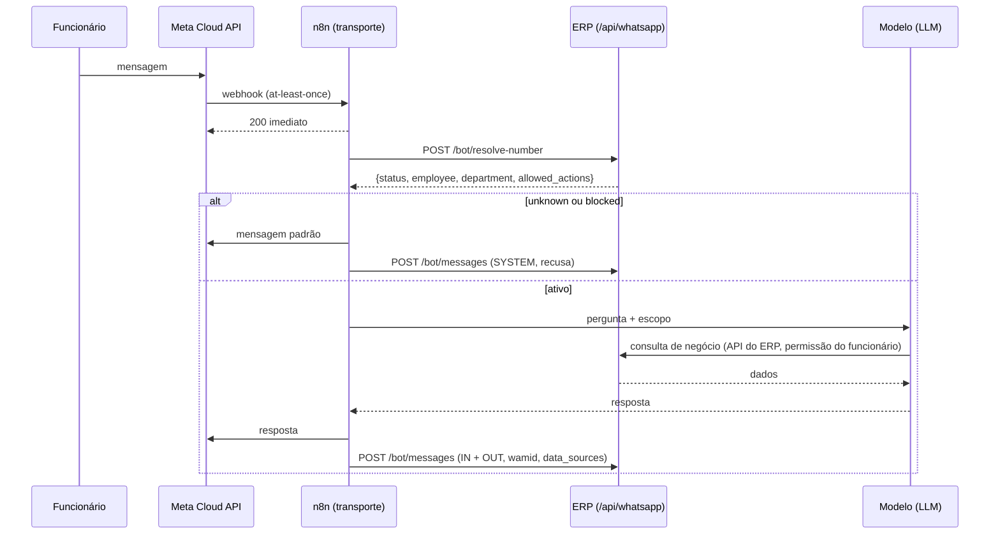

# BLOCO 7 — Assistente WhatsApp / Omnichannel (WPP) — Contrato de API

**Insumos:** `BLOCO_7_WPP_REQUISITOS.md`, `BLOCO_7_WPP_MODELO_DADOS.md`.
**Autor:** Arquitetura de API (sessão de 2026-08-10).
**Status:** 🟡 Pronto para revisão; implementação após aval do dono.
**Convenções do projeto:** Clean Architecture
(`presentation → application → domain → infrastructure`); validação com Zod
`.strict()`; RBAC via `authorizeModule`; `logAction` em toda escrita
(guarda `audit-coverage-guard`); erros no envelope
`{ success: false, error, code, details }`.

Base: `/api/whatsapp`.

---

## 1. Fluxo (sequência) — mensagem de funcionário



Ação N1/N2 (UC-76) insere, entre "IA" e "resposta", um turno de confirmação
explícita; `action.confirmed_at` só é gravado após o "SIM" do funcionário.

## 2. Endpoints do ROBÔ (`whatsapp.bot: operate`)

Superfície mínima — o robô não lê conversas nem administra nada.

### `POST /api/whatsapp/bot/resolve-number` (UC-80, RF-WPP-004)

```jsonc
// req
{ "phone": "+5562982655215" }

// 200 — ativo
{ "success": true, "data": {
  "status": "active",
  "contact_id": 12,
  "employee": { "id": 34, "name": "João da Silva" },
  "department": { "id": 8, "name": "Almoxarifado" },
  "allowed_actions": [ { "action_key": "consultar_estoque", "level": "N0" } ]
}}

// 200 — desconhecido (NÃO é erro: fluxo previsto)
{ "success": true, "data": { "status": "unknown" } }

// 200 — bloqueado
{ "success": true, "data": { "status": "blocked", "reason": "desligamento" } }
```

Notas: sempre 200 nos três casos (BR-WPP-006 — o n8n roteia por `status`, não
por código HTTP); < 500 ms (RNF-WPP-01); telefone normalizado para E.164 antes
da busca.

### `POST /api/whatsapp/bot/messages` (RF-WPP-005/006)

```jsonc
// req — aceita lote (IN + OUT da mesma interação)
{ "messages": [
  { "wamid": "wamid.HBgM...", "contact_id": 12, "direction": "IN",
    "kind": "TEXT", "content": "quanto tem de MP-057?",
    "occurred_at": "2026-08-10T21:03:00Z" },
  { "contact_id": 12, "direction": "OUT", "kind": "TEXT",
    "content": "MP-057 — BOB EVK-M4060401: 0 em estoque.",
    "routed_department": "Almoxarifado",
    "data_sources": [ { "endpoint": "/api/items", "ref": "MP-057" } ],
    "occurred_at": "2026-08-10T21:03:04Z" }
] }

// 201
{ "success": true, "data": { "recorded": 2, "deduplicated": 0 } }
```

Idempotência: `wamid` já registrado → não duplica, conta em `deduplicated`
(RF-WPP-006). Falha aqui **não** deve impedir a resposta ao funcionário
(RNF-WPP-02) — o n8n reenfileira.

### `POST /api/whatsapp/bot/handoff` (RF-WPP-016/017)

```jsonc
// req
{ "contact_id": 12, "department_id": 8, "reason": "pediu humano" }

// 200
{ "success": true, "data": {
  "assignee": { "user_id": 5, "name": "Maria (Almoxarifado)" },
  "source": "schedule"          // fixed | schedule | fallback | nobody
}}
```

### `POST /api/whatsapp/bot/actions/:actionKey/execute` (RF-WPP-011/012/013)

Fase 3. Exige `confirmation_token` emitido no passo anterior; executa
**em nome do funcionário** (autoria RF-WPP-012). Recusas explícitas:

| Código | Quando |
|---|---|
| `WPP-ACTION-NOT-ALLOWED` | Política do departamento não permite o nível |
| `WPP-ACTION-USER-DENIED` | Funcionário não tem a permissão RBAC da ação |
| `WPP-N3-FORBIDDEN` | Ação da lista N3 (RF-WPP-010) — inalcançável por configuração |
| `WPP-CONFIRMATION-REQUIRED` | Sem confirmação válida |

## 3. Endpoints da GESTÃO (`whatsapp`)

| Método | Rota | Nível | UC |
|---|---|---|---|
| GET | `/api/whatsapp/contacts` | view | UC-79 |
| POST | `/api/whatsapp/contacts` | operate | UC-79 |
| PATCH | `/api/whatsapp/contacts/:id` | operate | UC-79 |
| POST | `/api/whatsapp/contacts/:id/block` | operate | RF-WPP-002 |
| POST | `/api/whatsapp/contacts/:id/unblock` | operate | RF-WPP-002 |
| GET | `/api/whatsapp/conversations` | view | UC-78 |
| GET | `/api/whatsapp/conversations/:contactId/messages` | view | UC-78 |
| GET | `/api/whatsapp/policies` | view | UC-79 |
| PUT | `/api/whatsapp/policies` | operate¹ | RF-WPP-009 |
| GET/PUT | `/api/whatsapp/handoff-configs/:departmentId` | operate | RF-WPP-015 |

¹ Elevação de nível (N0→N1→N2) exige `approve` quando a flag de
`whatsapp:approve` estiver configurada (RF-WPP-014).

Filtros de `/conversations`: `department_id`, `employee_id`, `contact_id`,
`from`/`to`, `q` (busca no conteúdo), `has_action`, `handoff_status`;
paginação padrão do projeto.

## 4. Segurança

| Item | Decisão |
|---|---|
| Autenticação | JWT padrão. Robô = usuário de serviço (RF-WPP-018) |
| Rate limit | Rotas `/bot/*` com limiter **próprio** — o teto global de 300/15min derrubaria o canal (RF-WPP-019). Valor a dimensionar pelo volume real; começar em 1000/15min |
| Auditoria | `logAction` em todas as escritas, inclusive as do robô (RF-WPP-008) |
| Conteúdo | Nunca em log de aplicação (RNF-WPP-04) |
| Segredos | Token do robô só em credencial n8n (RF-WPP-020) |

## 5. Impacto nos fluxos n8n (integração, não implementação)

| Nó atual | Passa a |
|---|---|
| `Verifica Num. Existe?` (MySQL) | `POST /bot/resolve-number` |
| `Upsert "Salva ultima MSG"` (MySQL) | Mantém (buffer do agente) **+** `POST /bot/messages` |
| Ferramentas dos sub-agentes (Sheets/Drive) | Chamadas à API do ERP com o escopo retornado |
| `Humano toma Conta` | `POST /bot/handoff` |
| *(novo)* | Dedupe por `wamid` antes de processar (RNF-WPP-03) |

## 6. Pendências que este contrato deixa explícitas

1. **URL pública do ERP** — o n8n.cloud não alcança `localhost`. Cloudflare
   Tunnel resolve antes do servidor de produção (§7 do conceito).
2. **Catálogo de `action_key`** — a definir com a fábrica na fase 3.
3. **Valor final do rate limit** — medir com volume real.
