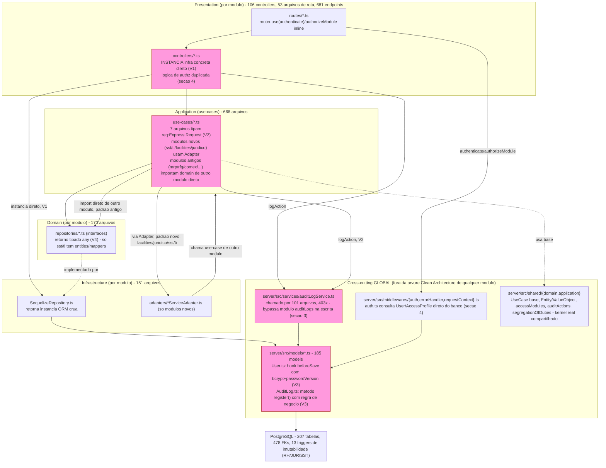

# CURRENT_ARCHITECTURE.md — ERP-LEGACY-001, Passo 24 (Arquitetura real — AS-IS)

```
PROJECT_ID: ERP-LEGACY-001
BASELINE TAG: legacy-baseline-001 → c9359be399c45191fe90e8e9707803125a5ba91d
MÉTODO: Read/Grep/Glob apenas — nenhum comando executado, nenhuma conexão de banco aberta, nenhum teste rodado.
DATA: 2026-08-13
INSUMOS: LEGACY_SYSTEM_INVENTORY.md, SYSTEM_MAP.md, MODULE_CATALOG.md, API_INVENTORY.md,
DATABASE_INVENTORY.md, INTEGRATION_INVENTORY.md, DEPENDENCY_INVENTORY.md, DOCUMENTATION_INVENTORY.md
(mesma pasta), PRODUCTION_STATUS_MAP.md (coretriad/states/ERP-LEGACY-001/)
ESCOPO AMOSTRADO: os 6 módulos PRODUÇÃO REAL (items, categories, departments, users, auth,
auditLogs) lidos por inteiro (controller+use-cases+repositório+domínio); amostra aprofundada de
financial, production, mrp, rh, juridico, quality, ti, sst, facilities (não-produção,
representando financeiro/produção/RH/jurídico/qualidade/TI/SST/facilities).
NÃO É ARQUITETURA-ALVO — isso é o passo 34, fora de escopo desta skill.
```

## 1. Estilo arquitetural real

Confirma-se o "Clean Architecture por módulo" já registrado em
`MODULE_CATALOG.md`:
`server/src/modules/<modulo>/{domain,application,infrastructure,presentation}`,
com controllers delegando para use-cases que recebem repositórios por
injeção de construtor. Isso é real e consistente estruturalmente nos 48
módulos. Mas a leitura profunda encontrou **quatro classes de violação de
camada, sistemáticas, não pontuais**:

### V1 — Nenhum composition root: todo controller instancia infraestrutura concreta diretamente

Nos 6 módulos PRODUÇÃO REAL e em toda a amostra não-produção lida, o
*controller* (`presentation/`) importa e instancia a classe
`Sequelize<X>Repository` (infraestrutura) por `require`/`import` direto, no
escopo de módulo do próprio arquivo de controller, e a injeta no use-case
dentro de cada handler:

- `server/src/modules/items/presentation/controllers/itemController.ts:3,28`
  — `const itemRepository = new SequelizeItemRepository();` no topo do
  arquivo.
- Idêntico em `categoryController.ts:3,16`, `departmentController.ts:3,16`,
  `userController.ts:3,20`, `authController.ts:9,21`,
  `auditLogController.ts:3,13`, `productionOrderController.ts:10,29`,
  `financialController.ts:4,30`, `admissionController.ts:17,39`,
  `contractController.ts:11,33`, `qualityInspectionController.ts:3,21`, e
  no restante dos ~106 controllers do repositório (amostra confirmada em
  15+ arquivos de módulos distintos).

Isso significa que a camada de apresentação tem uma dependência de
compilação explícita sobre a implementação concreta de infraestrutura (não
apenas sobre a interface de domínio), violando a Regra de Dependência da
Clean Architecture no sentido estrito. Não há nenhum container de DI,
factory central ou composition root — confirmado por busca
(`container|DIContainer|awilix|InversifyContainer`) sem ocorrência real no
código de aplicação.

### V2 — Casos de uso (camada de aplicação) tipados com `express.Request`

7 arquivos de `application/` importam o tipo `Request` do Express
diretamente:
`server/src/modules/accessProfiles/application/use-cases/{Create,Update,Deactivate}AccessProfileUseCase.ts`,
`server/src/modules/ti/application/use-cases/accessRequest/ExecuteAccessRequestUseCase.ts:12`,
`server/src/modules/ti/application/use-cases/license/RequestRenewalUseCase.ts`,
`server/src/modules/ti/application/services/AccessProfileExecutionService.ts`,
`server/src/modules/users/application/use-cases/AssignAccessProfileUseCase.ts`.
Exemplo (`CreateAccessProfileUseCase.ts:1,15`): `import type { Request }
from 'express'; ... interface CreateAccessProfileInput { ...; req: Request;
}`. Além disso, **sem o tipo formal**, mas com o mesmo efeito prático, os 5
use-cases do módulo `users` (`CreateUserUseCase.ts:40`,
`DeactivateUserUseCase.ts:31`, `UpdateUserUseCase.ts`,
`RevokeUserSessionsUseCase.ts`, `AssignAccessProfileUseCase.ts`) recebem
`req: any` e o repassam a `logAction(req, ...)`. O propósito é sempre o
mesmo: viabilizar auditoria (`logAction` extrai
`req.user`/`req.ip`/`req.headers['user-agent']`/`req.originalUrl`/`req.method`)
— mas o preço é a camada de aplicação (que deveria ser agnóstica de
framework de transporte) acoplada ao Express.

### V3 — Model Sequelize com regra de negócio (fora da árvore Clean Architecture)

- `server/src/models/User.ts:118-129,143-145` — hook `beforeSave` que
  hasheia a senha com bcrypt (10 rounds) **e** incrementa
  `passwordVersion` para invalidar tokens JWT emitidos antes da troca
  (regra de segurança SEC-09/SEC-10), mais o método de instância
  `comparePassword`. É usado diretamente pelo módulo PRODUÇÃO REAL `auth`.
- `server/src/models/AuditLog.ts:119-165` — método estático `register()`
  com lógica de negócio real: normalização/degradação de vocabulário de
  auditoria via `shared/domain/auditActions`, fallback quando o Postgres
  ainda não conhece um valor de `ENUM` (`actionsRejectedByDatabase`), e
  extração de campos de um objeto no formato de `Request` Express.

Ambos são models "legados/centrais" (`server/src/models/*.ts`, fora de
qualquer `domain/application/infrastructure/presentation` de módulo), mas
carregam regra de negócio real.

### V4 — Domínio sem entidade própria: repositórios tipados `any`, Sequelize instance vaza até o controller

Nos 6 módulos PRODUÇÃO REAL e na esmagadora maioria dos 42 NÃO-PRODUÇÃO, o
"domínio" é só a *interface* do repositório
(`domain/repositories/*Repository.ts`) — não há `domain/entities/`
(confirmado por `Glob` recursivo: `items/domain/**` só tem `repositories/`;
idem `categories`, `departments`, `auditLogs`). Os métodos são tipados para
retornar `any`/`Promise<any>`
(`server/src/modules/items/domain/repositories/ItemRepository.ts:17-39`,
`server/src/modules/auth/domain/repositories/AuthRepository.ts:15-65`), e a
implementação Sequelize devolve a **instância do model ORM diretamente**
(`SequelizeAuthRepository.ts:12-19`: `return User.findOne(...)`). Aprofundado
na seção 3.

## 2. Fronteiras entre módulos

Boundary crossing existe e é **heterogêneo** — dois padrões distintos
coexistem, correlacionados com a idade do módulo:

**Padrão antigo — import direto, sem porta local.** `mrp` (não-produção,
mas hot path do planejamento) importa, na camada de aplicação, a
*interface* de domínio de outro módulo:
`server/src/modules/mrp/application/use-cases/ConvertPlannedOrdersToRequisitionUseCase.ts:20-21`
— importa `PurchaseRequisitionRepository` e `ItemSupplierRepository` de
outros módulos. Isso ainda é razoável (acopla à interface, não à
implementação). **Porém o controller do mesmo módulo vai além**:
`server/src/modules/mrp/presentation/controllers/mrpController.ts:4-7,21-24`
importa e instancia diretamente as classes **concretas** de infraestrutura
de três módulos estrangeiros — `SequelizeItemRepository`,
`SequelizeItemSupplierRepository` (de `items`),
`SequelizePurchaseRequisitionRepository` (de `purchaseRequisitions`),
`SequelizeProductionOrderRepository` (de `production`) — um caso claro de
"módulo acessa internals de outro em vez de sua interface pública", na
camada de apresentação, não só na de aplicação. Confirmado também em
`suppliers/application/use-cases/ListSupplierItemsUseCase.ts`,
`rfq/application/use-cases/CreateRfqUseCase.ts`,
`comex/application/use-cases/{Create,Receive}ImportProcessUseCase.ts`,
`purchaseRequisitions/application/use-cases/CreatePurchaseRequisitionUseCase.ts`
e `inventory/application/use-cases/ReleaseLotUseCase.ts` — todos importam
repositórios de domínio de módulos vizinhos sem um adaptador/porta local.

**Padrão mais novo — porta local + adapter.** Módulos construídos mais
recentemente (`facilities`, `juridico`, `sst`, `ti`) definem sua própria
interface (`application/services/InventoryService.ts`,
`AccountPayableService.ts`, etc.) e implementam um adapter em
`infrastructure/adapters/*ServiceAdapter.ts` que por dentro chama o
*use-case* do módulo estrangeiro:
`server/src/modules/facilities/infrastructure/adapters/InventoryServiceAdapter.ts:29-31`.
É mais disciplinado (o módulo consumidor não conhece a infraestrutura do
módulo fornecedor, só o contrato local), mas ainda alcança o use-case
(aplicação) do módulo fornecedor, não uma API/porta exposta por ele — e o
próprio comentário do arquivo (linhas 6-24) documenta uma limitação real e
já auditada: `reference_type`/`reference_id` prometidos são descartados por
`InventoryService.adjust`, então a rastreabilidade cross-módulo do consumo
de estoque de `facilities`/`sst` fica só em texto livre — achado já
registrado em `AUDITORIA_CONSISTENCIA_CADEIA_PRODUTO_2026-08-10.md`
(P0-01/P1-04), citado aqui apenas como evidência do padrão de fronteira,
não repetido como finding novo.

**Dependência circular**: não encontrada nos pares inspecionados
(`mrp`→`purchaseRequisitions`/`items`/`production`: confirmado, por grep,
que nenhum desses três importa de volta `mrp/`). O grafo exaustivo é
mandato do `vericore-dependency-architecture-auditor`; esta seção só avalia
o impacto arquitetural do que foi amostrado.

## 3. Camada de dados — 185 models Sequelize × entidades de domínio por módulo

**Não há mapeamento na maioria dos módulos — são a mesma coisa.** Nos 6
módulos PRODUÇÃO REAL e em pelo menos mais 40 dos 42 NÃO-PRODUÇÃO, o
repositório de domínio retorna a instância do model Sequelize sem tradução
(`SequelizeAuthRepository.ts:12-19`, `ItemRepository.ts:17-39` tipado
`any`). O objeto que sai do banco (com `.password`, `.comparePassword()`,
`.changed()`, todos os métodos de instância do Sequelize) é o mesmo objeto
que percorre use-case → controller → `res.json()`. Confirmado por `Glob`:
nenhum módulo PRODUÇÃO REAL tem pasta `domain/entities/`.

**Duas exceções, ambas em módulos mais novos**: `sst` e `ti` têm uma camada
`infrastructure/mappers/*Mapper.ts` explícita (`EpiMapper`, `AsoMapper`,
`AccidentMapper`, `CipaMapper`, `PgrMapper`, `TrainingMapper`,
`SafetyRoutineMapper`, `CorrectiveActionMapper` em `sst`; `TicketMapper`,
`TermMapper`, `LicenseMapper`, `AccessRequestMapper`, `BackupLogMapper` em
`ti`) — só 2 dos 48 módulos desacoplam o shape do domínio do shape do ORM.
Isso é uma decisão arquitetural relevante e inconsistente: a estrutura de
pastas "Clean Architecture" existe uniformemente, mas a disciplina que ela
deveria impor (não vazar tipo de infraestrutura pela fronteira de domínio)
só é seguida em ~4% dos módulos.

**Achado mais forte de ownership de dados**: o módulo `auditLogs` "possui"
a leitura da tabela `audit_logs` via seu próprio
`SequelizeAuditLogsRepository.ts:8,27,38` (que importa `models/index` e faz
`AuditLog.findAndCountAll`/`findByPk`) — mas a **escrita** nunca passa por
esse módulo. Ela acontece via `server/src/services/auditLogService.ts`
(fora de qualquer módulo, em `server/src/services/`), que importa
`require('../models/AuditLog')` diretamente
(`auditLogService.ts:14,178,187,198,209`) e é chamado (`logAction(...)`) a
partir de **101 arquivos, 403 ocorrências**, espalhados por quase todos os
48 módulos (confirmado por `Grep` exaustivo). Ou seja: existem **dois
caminhos de código totalmente independentes** para a mesma tabela — um
"dono" formal (o módulo `auditLogs`, só para leitura) e um caminho de
escrita global que nenhum módulo possui, que ignora completamente a árvore
Clean Architecture do `auditLogs`. Isso é o exemplo mais nítido, no código
lido, de dado sem dono único de escrita.

## 4. Autenticação/autorização como cross-cutting concern

`server/src/middlewares/auth.ts` implementa `authenticate` (linha 58) que,
a cada requisição, importa e consulta diretamente `User`, `AccessProfile`,
`AccessProfilePermission` de `models/index` (linha 9) — **sem passar por
nenhum módulo**, nem mesmo pelo módulo `auth` ou `users` que "deveriam"
possuir esse dado. `authorizeModule`/`authorize` são aplicados no nível de
rota (`router.use(authenticate)` de topo de arquivo em 10 módulos, ou
inline por rota em outros 38 — ver `API_INVENTORY.md` destaque #3), nunca
no nível de use-case. Implicação arquitetural: os use-cases e o domínio
confiam cegamente em `req.user.permissions` já resolvido pelo middleware;
não há nenhuma reverificação de autorização na camada de
aplicação/domínio. Qualquer futuro caminho de execução que chame um
use-case sem passar pela rota HTTP (script interno, mensageria, chamada
direta em teste) **não teria nenhuma barreira de autorização** — a
garantia inteira mora na borda de transporte.

Consistente com isso, a lógica de "quem pode aprovar o quê" aparece
**duplicada de formas diferentes em lugares diferentes**: (a) inteiramente
na rota, via `authorizeModule`/`authorize` (padrão dominante); (b)
parcialmente replicada dentro do controller —
`server/src/modules/juridico/presentation/controllers/contractController.ts:37-55`
define `hasApprove()`/`resolveAvailableApproverRoles()`, que leem
`req.user.role`/`req.user.permissions` para decidir papéis de aprovador,
uma decisão de negócio (RF-JUR-003) resolvida na camada de apresentação;
(c) dinamicamente pelo corpo da requisição, no módulo `rh`
(`authorizeContractDecision`, citado em `API_INVENTORY.md`, decide
`approve` vs `operate` conforme `req.body.decision`). Três mecanismos
distintos para o mesmo tipo de decisão (quem pode aprovar) em três módulos
diferentes — falta de padrão único, não um bug isolado.

## 5. Diagrama de arquitetura em camadas (backend)



(Nós em vermelho/rosa marcam onde uma violação de camada ou um cruzamento
de fronteira sem porta foi confirmado por leitura direta; os demais
representam a estrutura tal como projetada.)

## 6. ADRs implícitos (decisões que o código revela, sem documento formal)

1. **Clean Architecture por módulo, sem entidade de domínio própria na
   maioria dos casos** — a estrutura de pastas existe em 48/48 módulos, mas
   só 2/48 (`sst`, `ti`) desacoplam o shape do domínio do shape do
   Sequelize via mapper (seção 3). Decisão implícita: "a estrutura de
   pastas é obrigatória; o desacoplamento de tipo que ela deveria garantir
   não é."
2. **Nenhum composition root / container de DI** — cada controller é seu
   próprio ponto de composição, instanciando `Sequelize<X>Repository` no
   escopo do módulo do arquivo (V1). Decisão implícita, não documentada em
   nenhum ADR encontrado.
3. **Existe, sim, um kernel compartilhado real**
   (`server/src/shared/{domain,application}`) — `UseCase` base,
   `Entity`/`ValueObject`, e vocabulário de domínio cross-módulo
   (`accessModules.ts`, `auditActions.ts`, `segregationOfDuties.ts`,
   `handoffSignal.ts`). Isso contradiz uma leitura simplista de "módulos
   100% isolados" — há sim uma camada compartilhada deliberada, só que ela
   convive com uma segunda camada "compartilhada" **não deliberada**
   (`server/src/models/`, `server/src/services/`, `server/src/middlewares/`),
   que é global mas não está desenhada como kernel — é infraestrutura
   legada que todo módulo acessa por atalho.
4. **Cross-cutting concerns (auditoria, autenticação, autorização) vivem
   fora de qualquer módulo** e falam diretamente com o Sequelize model,
   nunca com o repositório de domínio do módulo "dono" conceitual do dado
   (seção 3 e 4). Auditoria de escrita, em particular, bypassa
   completamente o módulo `auditLogs`.
5. **Fronteira entre módulos evoluiu com o tempo, sem retrofit**: módulos
   mais antigos (`mrp`, `rfq`, `comex`, `purchaseRequisitions`,
   `suppliers`, `inventory`) cruzam fronteira importando direto o domínio
   (ou, no caso do controller de `mrp`, a infraestrutura concreta) de
   módulos vizinhos; módulos mais novos (`facilities`, `juridico`, `sst`,
   `ti`) definem uma porta local + adapter. Não há evidência de que os
   módulos antigos tenham sido migrados para o padrão novo.
6. **Enforcement de invariante crítica delegado ao banco, seletivamente**
   — 13 triggers de imutabilidade (RH/JUR/SST) e 1 `CHECK` XOR
   (conciliação bancária) existem, mas não há equivalente para
   `AuditLog`, `SaleInvoice` emitida ou `AccountingEntry` lançado (já
   registrado em `DATABASE_INVENTORY.md`, trazido aqui só como evidência de
   que a decisão de "onde a integridade é garantida" é módulo a módulo, não
   uma política uniforme).
7. **Documentação de módulo é opcional e não uniforme**: 15 dos 48 módulos
   têm `README.md` próprio (`accessProfiles`, `auth`, `bom`, `clients`,
   `financial`, `inventory`, `production`, `products`, `suppliers`,
   `users`, `purchases`, `comex`, `sales`, `quality`, `masterProduction`);
   os outros 33 não têm — sem convenção declarada sobre quando um módulo
   "precisa" de README.
8. **Tratamento de erro é de fato centralizado e consistente**
   (`server/src/middlewares/errorHandler.ts`, único arquivo, usado por
   toda a API) — mas dois formatos de envelope de erro coexistem
   deliberadamente por compatibilidade (`AppError` →
   `{success:false, error:{code,message,details}}`; erro legado com
   `statusCode` → `{success:false, error:'<string>'}`), confirmando o
   achado já citado em `docs/arquitetura/API.md`. Logging de requisição é
   igualmente centralizado e único (`requestContext.ts`, Winston,
   `x-request-id`) — ao contrário do logging de auditoria de negócio, que
   é chamado ad hoc em 101 pontos de código diferentes, sem padronização
   de "quem deve chamar" (às vezes o controller, às vezes o use-case —
   seção 2/V2).

---

## Resumo das violações de camada encontradas

| # | Violação | Onde (evidência) | Módulos afetados (confirmados) |
|---|---|---|---|
| V1 | Controller (apresentação) instancia infraestrutura concreta direto, sem composition root | `itemController.ts:3,28`, `categoryController.ts:3,16`, `departmentController.ts:3,16`, `userController.ts:3,20`, `authController.ts:9,21`, `auditLogController.ts:3,13`, `mrpController.ts:3-7,20-24`, `productionOrderController.ts:10,29`, `financialController.ts:4,30`, `admissionController.ts:17-21,39-43`, `contractController.ts:11-14,33-35`, `qualityInspectionController.ts:3,21` | Confirmado nos 6 PRODUÇÃO REAL + amostra de 9 módulos NÃO-PRODUÇÃO; padrão sistêmico, não isolado |
| V2 | Use-case (aplicação) tipado/acoplado a `express.Request` | `CreateAccessProfileUseCase.ts:1,15`; `ExecuteAccessRequestUseCase.ts:12`; `CreateUserUseCase.ts:40`; `DeactivateUserUseCase.ts:31` (+3 use-cases de `users`) | `accessProfiles`, `ti`, `users` |
| V3 | Model Sequelize (fora da árvore Clean Architecture) com regra de negócio | `models/User.ts:118-129,143-145` (hash+versão de senha); `models/AuditLog.ts:119-165` (normalização de vocabulário de auditoria) | modelo global `User` (usado por `auth`), modelo global `AuditLog` (usado por `auditLogs` e por 101 chamadores) |
| V4 | Domínio sem entidade própria — repositório retorna instância ORM crua (`any`) | `ItemRepository.ts:17-39`, `AuthRepository.ts:15-65`, `SequelizeAuthRepository.ts:12-19` | ~46/48 módulos; exceção: `sst`, `ti` (têm mappers) |
| — | Módulo acessa infraestrutura concreta de outro módulo (fronteira) | `mrpController.ts:4-7,21-24` (importa `SequelizeItemRepository`, `SequelizeItemSupplierRepository`, `SequelizePurchaseRequisitionRepository`, `SequelizeProductionOrderRepository` de 3 módulos estrangeiros) | `mrp` → `items`, `purchaseRequisitions`, `production` |
| — | Ownership de dado quebrado — escrita bypassa o módulo dono | `auditLogService.ts:14,178,187,198,209` (grava direto em `models/AuditLog`, chamado por 101 arquivos) vs. `SequelizeAuditLogsRepository.ts` (só leitura, é o único caminho do módulo `auditLogs`) | `auditLogs` (dono nominal só da leitura) |
| — | AuthZ resolvida no middleware, nunca reverificada no domínio/aplicação | `middlewares/auth.ts:9,58` (consulta `User`/`AccessProfile` direto do banco) | Todos os 48 módulos (a garantia mora 100% na borda HTTP) |

Nenhum destes é apresentado como finding formal com severidade/confiança —
isso é mandato dos passos 25+/31 (auditoria adversarial), fora do escopo
desta skill. O que está acima é achado de arquitetura AS-IS, provado por
arquivo:linha, para ancorar esse trabalho futuro.

---

Arquivos-chave citados nesta análise:
`server/src/modules/items/presentation/controllers/itemController.ts`,
`server/src/modules/categories/presentation/controllers/categoryController.ts`,
`server/src/modules/departments/presentation/controllers/departmentController.ts`,
`server/src/modules/users/presentation/controllers/userController.ts`,
`server/src/modules/users/application/use-cases/{CreateUserUseCase,DeactivateUserUseCase}.ts`,
`server/src/modules/auth/presentation/controllers/authController.ts`,
`server/src/modules/auth/infrastructure/sequelize/SequelizeAuthRepository.ts`,
`server/src/modules/auth/domain/repositories/AuthRepository.ts`,
`server/src/modules/auditLogs/presentation/controllers/auditLogController.ts`,
`server/src/modules/auditLogs/infrastructure/sequelize/SequelizeAuditLogsRepository.ts`,
`server/src/models/User.ts`, `server/src/models/AuditLog.ts`,
`server/src/services/auditLogService.ts`,
`server/src/middlewares/{auth,errorHandler,requestContext}.ts`,
`server/src/modules/mrp/presentation/controllers/mrpController.ts`,
`server/src/modules/mrp/application/use-cases/ConvertPlannedOrdersToRequisitionUseCase.ts`,
`server/src/modules/facilities/infrastructure/adapters/InventoryServiceAdapter.ts`,
`server/src/modules/juridico/presentation/controllers/contractController.ts`,
`server/src/modules/rh/presentation/controllers/admissionController.ts`,
`server/src/modules/quality/presentation/controllers/qualityInspectionController.ts`,
`server/src/modules/accessProfiles/application/use-cases/CreateAccessProfileUseCase.ts`,
`server/src/modules/ti/application/use-cases/accessRequest/ExecuteAccessRequestUseCase.ts`,
`server/src/shared/{application/UseCase.ts,domain/{Entity,ValueObject,accessModules,auditActions,segregationOfDuties,handoffSignal}.ts}`,
`server/app.ts`.

---

*Produzido pelo agente `vericore-architecture-auditor` em modo read-only
reforçado (Read/Grep/Glob apenas, sem Write disponível nesta sessão);
conteúdo persistido neste caminho pelo orquestrador a partir da resposta do
agente, sem edição de conteúdo.*

**Nota final da skill:** este documento encerra o passo 24. A skill
`coretriad-onboard` PARA aqui — os passos 25-40 não são convocados sem uma
nova aprovação humana explícita e específica para essa próxima fase.
