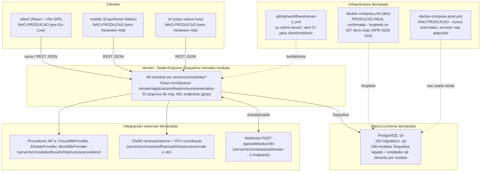

# SYSTEM_MAP.md — ERP-LEGACY-001, Passo 23 (Snapshot técnico)

Mapa de alto nível de como os componentes se relacionam, produzido por
leitura estática (Read/Grep/Glob, sem execução de nenhum comando ou conexão
de banco).

## Notas do mapa

- **Único ponto de entrada de dado real hoje:** o banco por trás de
  `docker-compose.yml` — não existe banco de produção separado (fonte:
  `PRODUCTION_STATUS_MAP.md`, `docker-compose.yml:55` `CORS_ORIGIN` apontando
  para `localhost:5173`).
- Não há evidência, nesta leitura estática, de comunicação direta
  `client/`↔banco ou `mobile/`↔banco sem passar pelo `server/` — toda
  integração observada nos globs de infraestrutura passa por `axios`/REST
  contra a API Express.
- `webhooks` é a única integração backend-to-backend declarada (n8n),
  citada na memória do projeto como "fora do ar" — não reverificado nesta
  sessão (proibido testar conexão real). Ver `INTEGRATION_INVENTORY.md` para
  o inventário detalhado de integrações.
- Nenhum componente de IA/LLM/RAG identificado em operação (consistente com
  a auditoria anterior de `dc52081`).

---

*Produzido pelo agente `vericore-architecture-auditor` em modo read-only
reforçado; conteúdo persistido neste caminho pelo orquestrador a partir da
resposta do agente, sem edição de conteúdo (apenas remoção de acentos dentro
do bloco Mermaid, que não os aceita de forma confiável em todos os
renderizadores).*
