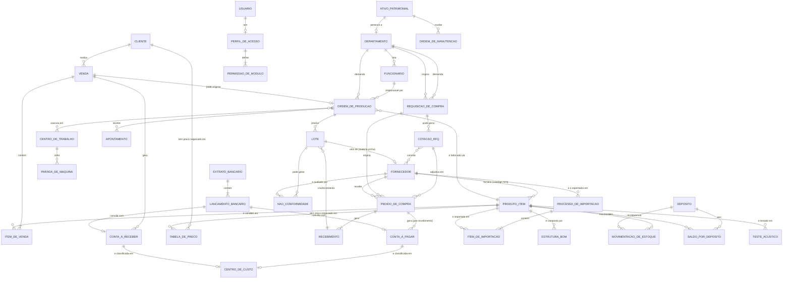

# Modelo Conceitual (MER) — ERP EVOK ÁUDIO

Nível de abstração de negócio: entidades e como elas interagem, **sem**
tecnologia (sem tipos de coluna, sem PK/FK explícitas). Serve para validar
regra de negócio com a diretoria/áreas — não é o modelo técnico (esse é o
[Modelo Lógico/DER](02-MODELO_LOGICO.md)).

> Nota deliberada: o banco real tem dois schemas de produto coexistindo
> (`Produto` legado e `Item` novo — ver decisão arquitetural em
> `CLAUDE.md` §7). Neste MER, ambos aparecem como a mesma entidade de
> negócio **Produto/Item**, porque para a diretoria "produto" é um único
> conceito; a duplicação é um detalhe de implementação em migração,
> tratado no Modelo Lógico.

## Entidades de negócio (glossário)

| Entidade | O que representa |
|---|---|
| **Produto/Item** | Qualquer coisa que a fábrica compra, fabrica ou vende — matéria-prima, componente, semiacabado ou produto final. |
| **Estrutura (BOM)** | A "receita" de um produto: quais componentes e em que quantidade o compõem. |
| **Cliente** / **Fornecedor** | Contrapartes comerciais (compra de quem, vende para quem). |
| **Venda** | Um pedido comercial a um cliente, com itens, valores e ciclo de faturamento. |
| **Requisição de Compra** | O pedido interno de "precisamos comprar isso" — origem obrigatória de toda compra, para rastreabilidade. |
| **Cotação/RFQ** | Processo de consultar múltiplos fornecedores antes de decidir a compra. |
| **Pedido de Compra** | O compromisso formal de compra com um fornecedor, já com preço fechado. |
| **Recebimento** | O evento físico de receber a mercadoria comprada. |
| **Processo de Importação (COMEX)** | O acompanhamento de uma compra internacional (embarque → chegada → desembaraço → entrada em estoque), com câmbio, despesas de importação e o cálculo de nacionalização (tributos + custo unitário nacionalizado) de cada item importado. Fornecedor é o exportador estrangeiro, reaproveitando o mesmo cadastro de Fornecedor nacional. |
| **Lote** | Um grupo rastreável de unidades de um produto — de matéria-prima recebida ou de produto acabado fabricado. |
| **Ordem de Produção** | A instrução de fabricar uma certa quantidade de um produto. |
| **Apontamento** | O registro de produção efetivamente realizada (quantidade boa, refugo, operador, tempo). |
| **Centro de Trabalho** | Uma célula/máquina/posto de fabricação com capacidade e custo próprios. |
| **Parada de Máquina** | Um período em que um centro de trabalho ficou parado (por motivo categorizado). |
| **Depósito** | Um local físico de armazenamento de estoque. |
| **Movimentação de Estoque** | Qualquer entrada, saída ou ajuste de quantidade de um produto. |
| **Teste Acústico** | Uma medição de qualidade/desempenho de um produto (parâmetros eletroacústicos). |
| **Não-Conformidade** | O registro de um defeito/problema de qualidade encontrado. |
| **Conta a Pagar / a Receber** | Obrigações e direitos financeiros da empresa. |
| **Centro de Custo** | Uma categoria organizacional para agrupar despesas/receitas em relatórios gerenciais. |
| **Extrato Bancário / Lançamento Bancário** | O histórico de movimentações da conta bancária real, usado para conciliar com o financeiro do ERP. |
| **Usuário / Perfil de Acesso** | Quem opera o sistema e o que cada um pode fazer. |
| **Ativo Patrimonial** | Um bem físico da empresa (máquina, ferramenta, veículo) sujeito a manutenção e depreciação. |
| **Departamento / Funcionário** | A estrutura organizacional (RH) da fábrica. |

## Fora de escopo deste MER

- As 12 tabelas órfãs do schema-fantasma em português (nunca adotadas
  pelo app real, `[DEPRECATED]`) — ver
  [04-DICIONARIO_DADOS.md](04-DICIONARIO_DADOS.md) e
  `docs/DATABASE.md` seção "Tabelas órfãs".
- Tabelas puramente técnicas de migração (`migracao_*`).
