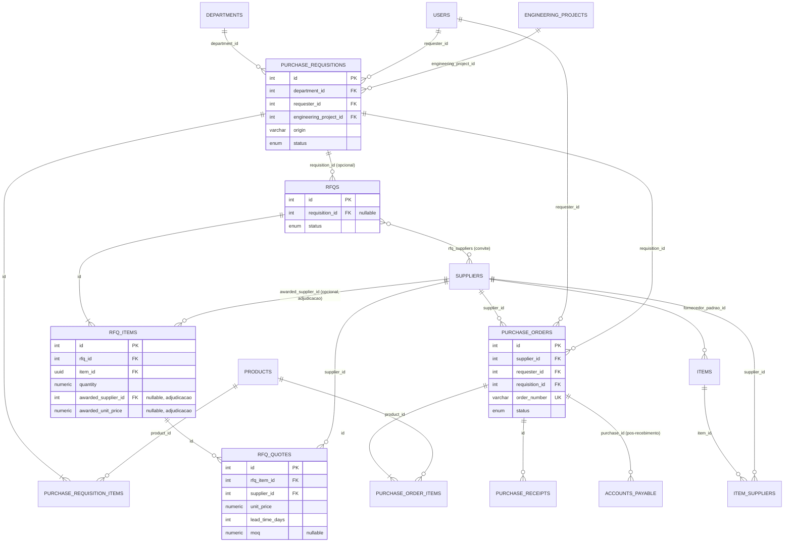
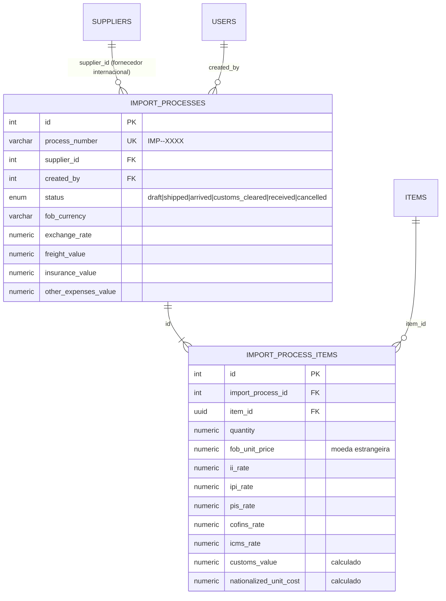
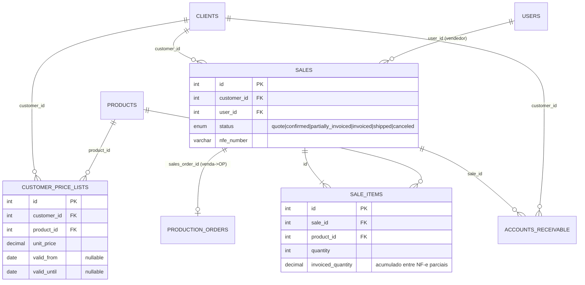
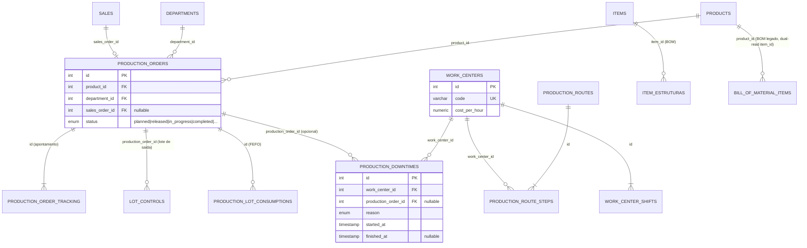
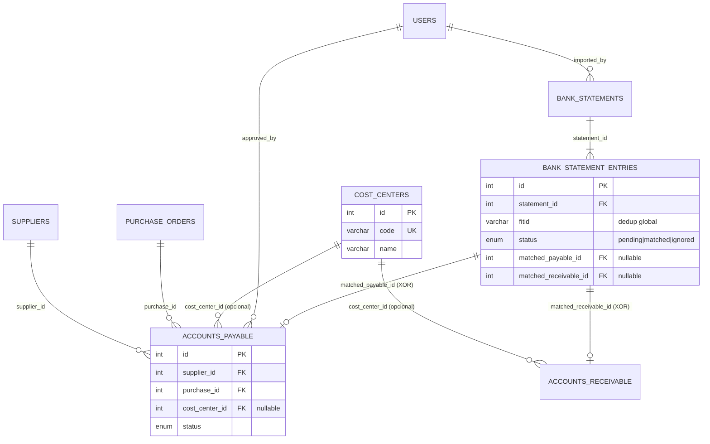
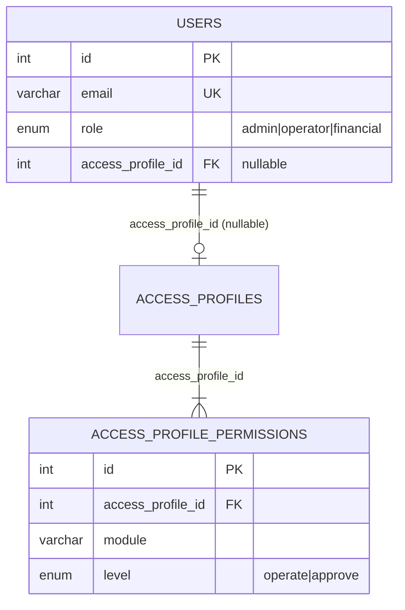

# Modelo Lógico (DER) — ERP EVOK ÁUDIO

DER técnico: tabelas reais, chaves primárias/estrangeiras e cardinalidade,
conforme aplicado pelas 66 migrations no PostgreSQL 16 local (introspecção
real, 2026-08-06, reconferida no mesmo dia após a migration
`20260806-000090-create-import-processes.cjs`, que adicionou
`import_processes`/`import_process_items` — módulo COMEX/Importação, UC-19).
Cobre os módulos principais pedidos (Item, Fornecedor,
Venda, OP, Requisição/Pedido de Compra, Financeiro, RFQ, Centros de
Custo, COMEX/Importação) — **não** cobre as 12 tabelas órfãs do
schema-fantasma em português nem tabelas puramente técnicas de migração
(ver [04-DICIONARIO_DADOS.md](04-DICIONARIO_DADOS.md) para o catálogo
completo das 80 tabelas).

> **Atenção — dualidade Item×Product ainda em migração (Fase 4/expand):**
> o núcleo canônico novo é `items` (UUID), mas `products` (INTEGER) ainda
> é a tabela realmente usada por `sales`, `purchase_order_items`,
> `production_orders` e várias outras. Onde o diagrama mostra uma FK para
> `products`, é o estado real hoje — não um erro de modelagem.

## Compras: Requisição → RFQ → Pedido → Recebimento

## Compras: Processo de Importação (COMEX)

`IMPORT_PROCESS_ITEMS.item_id` referencia o núcleo canônico `ITEMS`
(UUID), não `PRODUCTS` legado — único ponto do bloco Compras/RFQ que já
nasceu apontando só para o modelo novo (ao contrário de
`PURCHASE_REQUISITION_ITEMS`/`PURCHASE_ORDER_ITEMS`, que ainda apontam
para `PRODUCTS`).

## Vendas: Cliente → Venda → Faturamento → Contas a Receber

## Produção: Item/BOM → Ordem de Produção → Apontamento/OEE

## Financeiro: Contas, Centros de Custo, Conciliação Bancária

## Acesso e Perfis

## Convenções de cardinalidade usadas

- `||--o{` = 1 para 0..N (a maioria das FKs opcionais/obrigatórias de lado N).
- `||--|{` = 1 para 1..N (relação "dono" onde o filho não existe sem o pai, ex.: `SALES` → `SALE_ITEMS`).
- `}o--o{` = N para N (via tabela associativa, ex.: `RFQS` × `SUPPLIERS` por `rfq_suppliers`).
- `||--o|` = 1 para 0..1 (FK opcional e tipicamente única do lado N, ex.: `SALES` → `PRODUCTION_ORDERS.sales_order_id`).

Para o `ON DELETE`/`ON UPDATE` exato de cada FK (RESTRICT/CASCADE/SET
NULL), ver [03-MODELO_FISICO.md](03-MODELO_FISICO.md) → `schema.sql`
(fonte de verdade) ou `docs/database/DATABASE.md` (racional de cada decisão).
