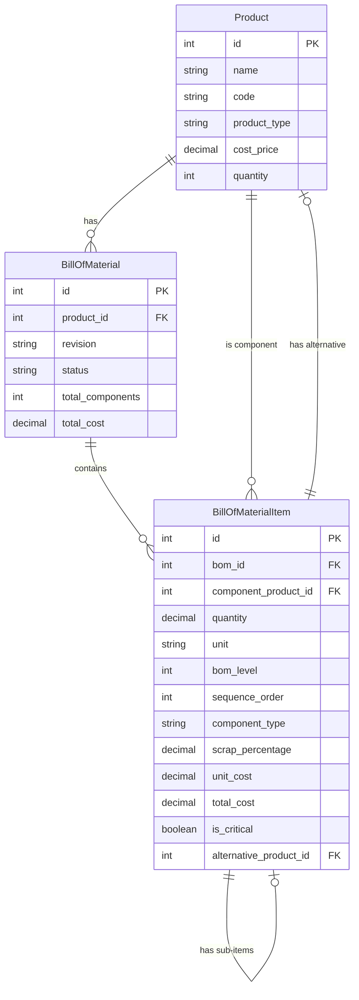
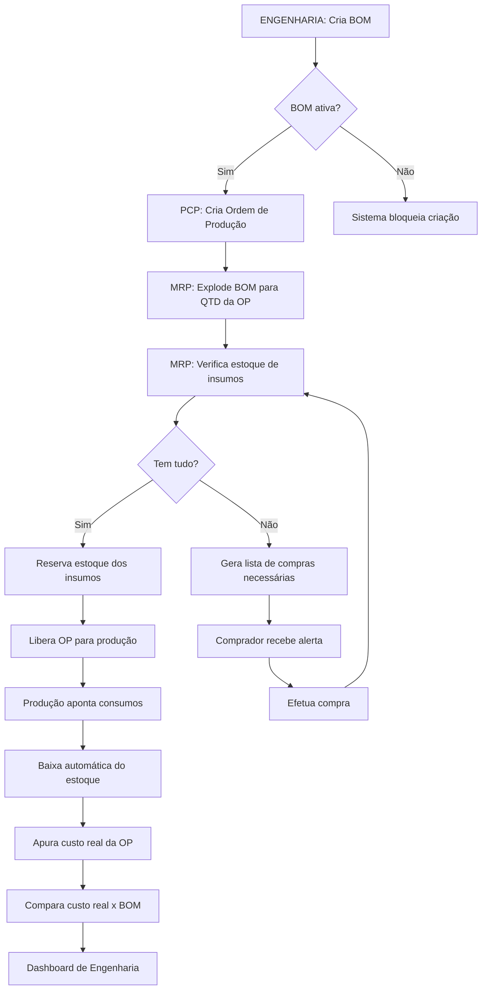
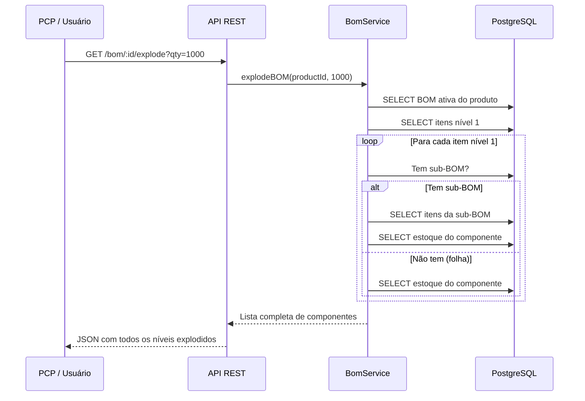

# 📦 Módulo BOM - Bill of Materials (Estrutura do Produto)

**Módulo:** Engenharia do Produto (ver também [01-ENGENHARIA.md](01-ENGENHARIA.md))
**Versão:** 1.0.0
**Aplicação:** ERP EVOK ÁUDIO - Fábrica de Alto-Falantes
**Responsável:** Engenharia do Produto / PCP

---

## 🎯 Papel do Módulo na Fábrica

O módulo **BOM (Bill of Materials)** é o coração da Engenharia do Produto. Ele define **DO QUE** cada alto-falante é feito e **COMO** é montado.

### Por que a BOM é crítica para a EVOK ÁUDIO?

```
🏭 PRODUÇÃO EM MASSA DE ALTO-FALANTES
   │
   ├── 🧾 BOM define: "Alto-falante 12" PRO usa:
   │       ├── Carcaça de alumínio fundido (1 un)
   │       ├── Cone de papel celulose (1 un)
   │       ├── Bobina de cobre 4Ω (1 un)
   │       ├── Imã de Ferrite Y35 (1 un)
   │       ├── Spider Nomex (1 un)
   │       ├── Surround de borracha (1 un)
   │       └── Cola especial (30g)
   │
   ├── 🔄 MRP usa a BOM para calcular (✅ implementado — `[IMPLEMENTADO]`, ver CLAUDE.md §4 e §1, UC-24/UC-24b em `docs/projeto/04-USE_CASES.md`; roda contra estoque real, não congelado, com tela dedicada em `/production/mrp`):
   │       ├── Quanto comprar de cada insumo
   │       ├── Quando comprar (baseado em lead time)
   │       └── Custo real do produto
   │
   └── 📊 CUSTOS usa a BOM para (ver 05-CUSTOS.md):
           ├── Custo de matéria-prima
           ├── Custo de componentes
           └── Custo total de fabricação
```

### Exemplo Real

```
BOM: Alto-Falante 12" Série PRO (código: AF-12PRO)
Revisão: 03 | Status: Active | Data: 2025-04-01

NÍVEL 0: Alto-Falante 12" PRO
  ├── NÍVEL 1: Carcaça de alumínio (AF-CAR-12) - 1 un - R$ 25,00
  ├── NÍVEL 1: Conjunto Móvel (AF-CM-12) - 1 un - R$ 18,50  ← TEM SUB-BOM
  │   ├── NÍVEL 2: Cone celulose (AF-CONE-12) - 1 un - R$ 8,00
  │   ├── NÍVEL 2: Bobina 4Ω (AF-BOB-12) - 1 un - R$ 6,50
  │   │   ├── NÍVEL 3: Fio cobre AWG 28 (MAT-FIO-28) - 50g - R$ 2,00
  │   │   └── NÍVEL 3: Tubete Kapton (MAT-TUB-12) - 1 un - R$ 1,50
  │   ├── NÍVEL 2: Spider Nomex (AF-SPI-12) - 1 un - R$ 2,50
  │   └── NÍVEL 2: Surround borracha (AF-SUR-12) - 1 un - R$ 1,50
  ├── NÍVEL 1: Imã Ferrite Y35 (AF-IMA-12) - 1 un - R$ 12,00
  ├── NÍVEL 1: Terminal PCB (AF-TERM-12) - 2 un - R$ 1,50
  └── NÍVEL 1: Cola epóxi (MAT-COLA) - 30g - R$ 0,90
                                    ─────────
                    CUSTO TOTAL:   R$ 57,90
```

---

## 📋 Estrutura de Arquivos

```
server/src/
├── models/
│   ├── index.ts                    # Registro de modelos e relacionamentos
│   ├── BillOfMaterial.ts           # Modelo da BOM (cabeçalho)
│   └── BillOfMaterialItem.ts       # Modelo dos itens (componentes)
├── controllers/
│   └── bomController.ts            # Controlador REST
├── services/
│   └── bomService.ts               # Serviço com regras de negócio
└── routes/
    └── bom.ts                      # Rotas Express
```

---

## 🗄️ Modelos de Dados

### BillOfMaterial (bill_of_materials)

| Campo | Tipo | Descrição |
|-------|------|-----------|
| id | INT (PK) | Identificador único |
| product_id | INT (FK) | Produto acabado |
| revision | VARCHAR(10) | Revisão da BOM |
| status | ENUM | draft, active, inactive, superseded |
| total_components | INT | Cache: total de itens |
| total_cost | DECIMAL(12,2) | Cache: custo total |
| created_by | INT (FK) | Usuário criador |
| approved_by | INT (FK) | Usuário aprovador |
| approval_date | DATE | Data de aprovação |

### BillOfMaterialItem (bill_of_material_items)

| Campo | Tipo | Descrição |
|-------|------|-----------|
| id | INT (PK) | Identificador único |
| bom_id | INT (FK) | BOM à qual pertence |
| component_product_id | INT (FK) | Produto/insumo componente |
| quantity | DECIMAL(12,4) | Quantidade por unidade do pai |
| unit | VARCHAR(10) | un, g, kg, m, l |
| bom_level | INT | Nível hierárquico (0-10) |
| parent_item_id | INT (FK) | Auto-relacionamento (sub-itens) |
| sequence_order | INT | Ordem de montagem |
| component_type | ENUM | raw_material, component, semi_finished, packaging, consumable |
| scrap_percentage | DECIMAL(5,2) | % de perda técnica |
| unit_cost | DECIMAL(12,2) | Cache: custo unitário |
| total_cost | DECIMAL(12,2) | Cache: custo total com perda |
| is_critical | BOOLEAN | Item crítico (alerta MRP) |
| alternative_product_id | INT (FK) | Produto substituto aprovado |

### Relacionamentos



---

## 🎮 Endpoints da API

### CRUD - BOM

| Método | Rota | Descrição | Autenticação |
|--------|------|-----------|--------------|
| `GET` | `/api/engineering/bom` | Lista BOMs (paginado) | JWT |
| `GET` | `/api/engineering/bom/product/:productId` | BOM ativa de um produto | JWT |
| `GET` | `/api/engineering/bom/:id` | Detalhes da BOM + itens | JWT |
| `POST` | `/api/engineering/bom` | Criar nova BOM | JWT |
| `PUT` | `/api/engineering/bom/:id` | Atualizar dados da BOM | JWT |
| `DELETE` | `/api/engineering/bom/:id` | Inativar BOM | JWT |
| `GET` | `/api/engineering/bom/:id/items` | Listar itens da BOM | JWT |

### Operações de Engenharia

| Método | Rota | Descrição | Parâmetros |
|--------|------|-----------|------------|
| `GET` | `/api/engineering/bom/:id/explode` | Explodir BOM p/ qty | `?qty=1000` |
| `GET` | `/api/engineering/bom/:id/cost` | Calcular custo | `?qty=1` |
| `GET` | `/api/engineering/bom/:id/availability` | Verificar estoque | `?qty=1000` |
| `GET` | `/api/engineering/bom/:id/tree` | Árvore hierárquica | - |

### Exemplos de Requisição

#### 1. Criar BOM

```http
POST /api/engineering/bom
Authorization: Bearer <token>
Content-Type: application/json

{
  "product_id": 1,
  "revision": "01",
  "revision_notes": "Substituído imã Ferrite Y30 por Y35",
  "notes": "BOM para Alto-Falante 12\" Série PRO",
  "items": [
    {
      "component_product_id": 10,
      "quantity": 1,
      "unit": "un",
      "bom_level": 1,
      "sequence_order": 1,
      "component_type": "component",
      "scrap_percentage": 0.5,
      "notes": "Carcaça alumínio fundido"
    },
    {
      "component_product_id": 11,
      "quantity": 1,
      "unit": "un",
      "bom_level": 1,
      "sequence_order": 2,
      "component_type": "component",
      "is_critical": true
    },
    {
      "component_product_id": 16,
      "quantity": 30,
      "unit": "g",
      "bom_level": 1,
      "sequence_order": 8,
      "component_type": "consumable",
      "scrap_percentage": 5.0,
      "notes": "Aplicar em temperatura ambiente"
    }
  ]
}
```

#### 2. Explodir BOM (para 1000 unidades)

```http
GET /api/engineering/bom/1/explode?qty=1000
Authorization: Bearer <token>
```

Response:
```json
{
  "success": true,
  "data": {
    "bom_id": 1,
    "product_id": 1,
    "product_name": "Alto-Falante 12\" PRO",
    "requested_quantity": 1000,
    "total_cost": 57900.00,
    "total_components": 12,
    "components": [
      {
        "component_id": 10,
        "component_name": "Carcaça alumínio",
        "component_code": "AF-CAR-12",
        "component_type": "component",
        "quantity": 1000,
        "unit_cost": 25.00,
        "total_cost": 25000.00,
        "stock_available": 850,
        "is_critical": false,
        "bom_level": 1
      },
      {
        "component_id": 16,
        "component_name": "Cola epóxi",
        "component_code": "MAT-COLA",
        "component_type": "consumable",
        "quantity": 31500,
        "unit_cost": 0.03,
        "total_cost": 945.00,
        "stock_available": 50000,
        "is_critical": false,
        "bom_level": 1,
        "scrap_percentage": 5.0
      }
    ],
    "summary": {
      "by_type": { "component": 8, "raw_material": 2, "consumable": 2 },
      "low_stock_items": [
        { "component_id": 10, "deficit": 150 }
      ],
      "critical_items": [
        { "component_id": 11, "is_critical": true }
      ]
    }
  }
}
```

#### 3. Verificar Disponibilidade

```http
GET /api/engineering/bom/1/availability?qty=1000
Authorization: Bearer <token>
```

Response:
```json
{
  "success": true,
  "data": {
    "product_id": 1,
    "product_name": "Alto-Falante 12\" PRO",
    "requested_quantity": 1000,
    "available": false,
    "max_possible_quantity": 850,
    "total_components_checked": 12,
    "missing_items": [
      {
        "component_id": 10,
        "component_name": "Carcaça alumínio",
        "needed": 1000,
        "available": 850,
        "deficit": 150,
        "suggestion": "Comprar 150.00 un"
      }
    ]
  }
}
```

---

## 🔄 Fluxo de Negócio

### Fluxo: Criação de OP com BOM

> **Correção (pente-fino 2026-08-06):** esta nota estava desatualizada —
> ela dizia que o fluxo abaixo era só "alvo" e que MRP/reserva/apontamento
> "ainda não implementados", citando `docs/BLACKBOX_CRONOGRAMA_CHECKLIST.md`
> (arquivo que não existe mais no repositório). Isso diverge do estado
> real (`CLAUDE.md` §4/§5): hoje o fluxo completo já existe em produção —
> "Cria BOM"/"Explode BOM" (`GET /explode`), MRP contra estoque real
> (UC-24, `/production/mrp`), reserva automática de estoque na liberação
> da OP (`ChangeProductionOrderStatusUseCase.reserveMaterials`), geração
> de requisição de compra a partir de ordens planejadas do MRP (UC-24/
> UC-24b, inclusive fechamento automático opt-in por item) e apontamento
> de consumo/produção no chão de fábrica (UC-13, `/production/shop-floor`)
> com baixa de estoque e apuração de custo real da OP (custeio de
> mão-de-obra/overhead incluído desde 2026-08-04). O diagrama abaixo
> reflete o fluxo real implementado, não mais um "alvo" futuro.



### Diagrama de Sequência (Explosão de BOM)



### Diagrama de Hierarquia (Árvore da BOM)

```mermaid
graph TD
    subgraph "NÍVEL 0 - Produto Acabado"
        AF12["Alto-Falante 12\" PRO"]
    end

    subgraph "NÍVEL 1 - Componentes Diretos"
        CAR["Carcaça alumínio<br/>1 un"]
        CM["Conjunto Móvel<br/>1 un"]
        IMA["Imã Ferrite<br/>1 un"]
        TER["Terminal<br/>2 un"]
        COL["Cola epóxi<br/>30g"]
    end

    subgraph "NÍVEL 2 - Subcomponentes"
        CONE["Cone celulose<br/>1 un"]
        BOB["Bobina 4Ω<br/>1 un"]
        SPI["Spider Nomex<br/>1 un"]
        SUR["Surround borracha<br/>1 un"]
    end

    subgraph "NÍVEL 3 - Matéria-Prima"
        FIO["Fio cobre AWG28<br/>50g"]
        TUB["Tubete Kapton<br/>1 un"]
    end

    AF12 --> CAR
    AF12 --> CM
    AF12 --> IMA
    AF12 --> TER
    AF12 --> COL

    CM --> CONE
    CM --> BOB
    CM --> SPI
    CM --> SUR

    BOB --> FIO
    BOB --> TUB
```

---

## 🛠️ Regras de Negócio Implementadas

### 1. Versionamento de BOM
- Toda alteração na BOM gera nova revisão
- BOMs anteriores ficam `superseded` (substituídas)
- Apenas uma BOM `active` por produto

### 2. Validação de Componentes
- Só produtos acabados (`product_type = 'finished'`) têm BOM master
- Componentes podem ser: raw_material, component, semi_finished, packaging, consumable, other
- Quantidade deve ser maior que zero (mínimo 0.0001)
- Percentual de perda técnica (`scrap_percentage`) entre 0 e 100%
- Nível hierárquico (`bom_level`) entre 0 e 10 — a explosão recursiva para automaticamente em profundidade 10 para evitar loop infinito em BOM mal cadastrada (`BomService.MAX_BOM_DEPTH`)

---

## 🧬 G1 — Fonte única da estrutura de produto (2026-08-10)

### O problema que existia

O ERP carregava **duas estruturas de produto paralelas**, com mestres e
chaves diferentes, e nada reconciliava as duas:

| Estrutura | Mestre | Chave | Quem lia |
|---|---|---|---|
| `item_estruturas` | `items` | UUID | MRP (`SequelizeMrpRepository.listActiveEdges`), explosão de item (`GET /api/items/:id/estrutura/explode`) |
| `bill_of_materials` | `products` | INTEGER | `BomService` → criação, liberação (reserva), **conclusão** (consumo + custeio) da OP |

A única ponte entre elas era casamento de string (`products.code =
items.codigo`) — e ela **nunca foi exercida para estrutura**. Consequência
prática: o planejamento comprava contra uma árvore e o chão de fábrica
consumia e custeava contra outra, **sem nada acusando a divergência**.

### A decisão: `bill_of_materials` sobrevive

Tomada com o código, não por preferência. O dono confirmou (D-B, 2026-08-10)
que **ninguém mantinha nenhuma das duas ainda** — conferido no banco: as 4
linhas de `item_estruturas` e as 2 BOMs existentes são resíduo de teste
(`PA-TESTE-001`, `E2E-*`), zero engenharia real. Isso rebaixou o risco de
migração de base viva para **escolha técnica**.

1. **É a única estrutura que governa dinheiro e estoque.** A liberação da OP
   reserva material por ela; a conclusão consome, baixa lote e **cifra o
   custo do produto acabado** por ela. Depois do **G2**, concluir OP sem BOM
   ativa falha — ela é item obrigatório da corrente.
2. **Sua chave é a que o resto do sistema usa.** `inventory_movements`,
   `lot_controls`, `stock_reservations`, `sale_items`,
   `purchase_order_items` e `production_orders` são todas `products.id`
   (INTEGER). `item_estruturas` era a única ilha de UUID da cadeia física.
3. **O mestre de `item_estruturas` não é sistema de registro de nada
   transacional.** Conferido no banco real: `items.estoque_atual` é
   `0.000000` em **100% das linhas**, enquanto `products.quantity` carrega os
   saldos. Tanto que o próprio MRP abandona `items` quando precisa de número
   — `SequelizeItemRepository.listMrpInventoryPositions` faz o crosswalk para
   `products` para ler saldo, reservado, mínimo e lead time.
4. **Já tem o vocabulário de controle de alteração de engenharia**
   (`draft`/`active`/`inactive`/`superseded`, `revision`, `approved_by`,
   `approval_date`) que a ISO 9001 §8.5.6 exige — o mesmo ciclo que o **G5**
   exercitou em roteiro de manufatura.

> **Sobre "Item core intocado + extensões por domínio" (`CLAUDE.md` §7):** a
> decisão segue valendo para **cadastro** — código, descrição, tipo, custo
> padrão, catálogo item×fornecedor, requisição, RFQ continuam em `items`. O
> que muda é só a **estrutura**: ela não é extensão de cadastro, é regra de
> consumo e de custo, e passa a morar onde o consumo e o custo já moram.

### Como a convergência foi feita (incremental, sem big-bang)

**Nenhuma linha foi copiada, migrada ou apagada.** A convergência é de
**leitura**: `server/src/services/bomStructureProjection.ts` projeta a BOM
ativa (em `products.id`) para o formato de aresta em UUID que o motor de MRP
já consumia, usando o crosswalk `products.code = items.codigo` que o resto do
ERP já usa (recebimento COMEX, conversão de requisição, adjudicação de RFQ,
movimentação de estoque). Como a projeção é feita na hora, **não existe
réplica para sair de sincronia**.

Passaram a ler a projeção:

- `SequelizeMrpRepository.listActiveEdges` (planejamento)
- `SequelizeItemEstruturaRepository` inteiro — inclusive o guarda de
  inativação de item (`hasActiveParentOrComponent`), que antes olhava só a
  tabela vazia e portanto estava **cego para a BOM de produção**: dava para
  inativar um item que é componente de uma BOM ativa

Escrita em `item_estruturas` foi encerrada: `POST /api/items/:id/estrutura`
responde **422 `G1-ESTRUTURA-DUPLA`** apontando para
`POST /api/engineering/bom`. Aceitar em silêncio seria pior que recusar — o
usuário cadastrava a árvore, recebia 201, e a produção continuava sem
enxergar nada.

#### Lacunas de catálogo são reportadas, não engolidas

Se um produto de BOM ativa não tiver `items.codigo` correspondente, a aresta
não existe para o MRP. Engolir isso recriaria o G1 por outro caminho. Por
isso a projeção devolve `unmapped` junto com `edges`, exposto em
`MrpRepository.listStructureGaps`.

**Isso já acontece no banco de dev hoje:** a BOM #18 tem 2 componentes e o
segundo (`E2E-MP2-1786338099090`) não tem item canônico — invisível ao MRP,
visível na produção. É exatamente o sintoma que o G1 fecha.

### Controle de alteração de engenharia (ISO 9001 §8.5.6)

Mesmo com fonte única, a estrutura ainda podia se contradizer **entre
revisões**: `PUT /api/engineering/bom/:id` era um `UPDATE` cru. Dava para
reescrever a revisão de uma BOM vigente, ressuscitar uma `superseded` e —
o pior — marcar `status: 'active'` numa **segunda** BOM do mesmo produto. Com
duas ativas, `findOne({ product_id, status: 'active' })` devolve uma revisão
**arbitrária**, e planejamento e consumo voltam a discordar.

Vale agora o mesmo ciclo do G5 (roteiro de manufatura):

| Regra | Código | Comportamento |
|---|---|---|
| BOM vigente é imutável no conteúdo | `G1-BOM-ATIVA-IMUTAVEL` | Mudar `revision`/`revision_notes`/`notes` de uma BOM `active` → 422. Mudança exige nova revisão (`POST /api/engineering/bom`) |
| BOM substituída é intocável | `G1-BOM-SUPERSEDED-IMUTAVEL` | Qualquer alteração ou reativação de uma `superseded` → 422. Ela sustenta o consumo e o custo das OPs que rodaram com ela |
| Ciclo de vida só avança | `G1-BOM-STATUS-INVALIDO` | De `active` só para `inactive` ou `superseded`; nunca de volta para `draft` |
| Uma vigente por produto | — | Ativar rebaixa a anterior para `superseded` **na mesma transação** (`SequelizeBOMRepository.activateExclusively`), com os componentes intactos. Rede de baixo no banco: índice único parcial `uq_bill_of_materials_active_per_product` |
| Rótulo de revisão único | `G1-BOM-REV-DUP` | Duas revisões com o mesmo rótulo tornam impossível dizer contra qual delas uma OP rodou |
| Produto não é componente de si mesmo | `G1-BOM-AUTO-REF` | Ciclo de profundidade 1. Antes só estourava na explosão, com a BOM já gravada |
| BOM não mistura com suprimento/patrimônio | `G1-BOM-TIPO-NAO-PRODUTIVO` | **(2026-08-12)** Pai ou componente cujo item mestre correspondente (crosswalk `products.code = items.codigo`) é `USO_E_CONSUMO` (MRO) ou `ATIVO_IMOBILIZADO` → 422. `products.product_type` não tem esses tipos, mas o crosswalk permitia um produto gêmeo de um item de suprimento/patrimônio entrar na estrutura — e o MRP planejaria compra de imobilizado por demanda de produção. Ativo imobilizado, para manutenção/depreciação, é cadastro de Patrimônio → Ativos (`assets`), não de BOM. Provado contra PostgreSQL real em `server/tests/integration/bom-tipo-nao-produtivo.test.ts` |

**Bug corrigido de quebra:** o `superseded` da revisão anterior rodava **fora
da transação**, antes dela. Se a criação falhasse depois (componente
inválido, erro de enum, queda de conexão), o produto ficava com **zero** BOM
ativa — e, desde o G2, produto sem BOM ativa **não conclui OP**. Um cadastro
malsucedido derrubava a produção de um produto que estava funcionando.

### O que ficou fora (decisão de negócio pendente)

**Amarrar a OP à revisão de BOM que ela executou** (`production_orders.bom_id`).
Hoje a conclusão explode a BOM **vigente no momento da conclusão** — se a
engenharia revisar a estrutura no meio de uma OP aberta, ela é consumida e
custeada pela revisão nova, não pela que foi reservada na liberação.

É o mesmo gap que o G5 registrou para roteiro, e pela mesma razão: é coluna
nova **mais** decisão de negócio (a OP em curso segue a revisão antiga ou
migra para a nova?), e implementá-la mexe em
`ChangeProductionOrderStatusUseCase`, que está sob trabalho concorrente
(G2/G3/G7). **Pré-requisito honesto se o Fisco ou a auditoria ISO exigirem
reconstituir o produto COMO FABRICADO.**

### Passos seguintes da convergência

| # | Passo | Status |
|---|---|---|
| 1 | Leitura única (MRP + explosão de item passam a ler a BOM ativa projetada); escrita paralela bloqueada; controle de revisão ISO | ✅ 2026-08-10 |
| 2 | `production_orders.bom_id` — registro "como fabricado" | ⏸️ aguarda decisão de negócio |
| 3 | Tela: `ItemMasterDetailPage` deixa de oferecer cadastro de estrutura e aponta para o módulo de BOM | 🔧 pendente (`client/`) |
| 4 | `DROP TABLE item_estruturas` na fase de contração do schema, junto com as tabelas órfãs do schema PT | ⏸️ depois da baseline congelada |
