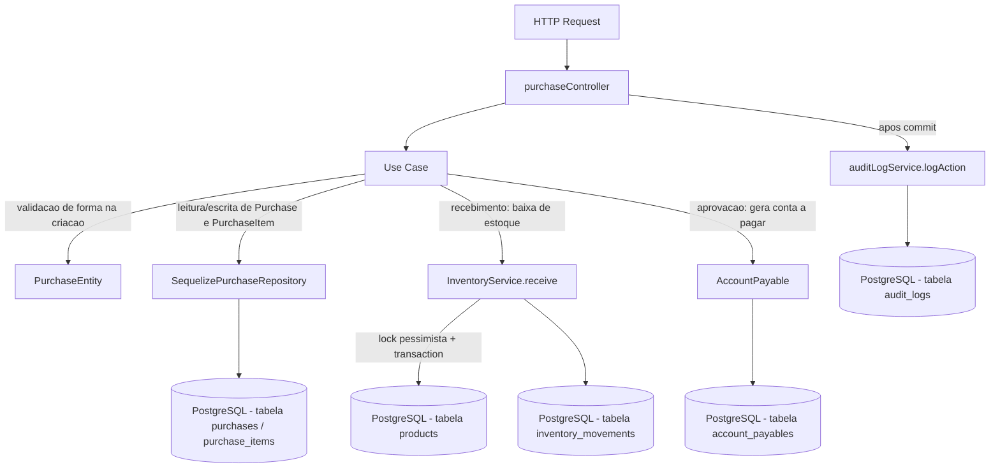

# Módulo Purchases

## Objetivo

Gerenciar o ciclo de vida de Pedidos de Compra (Purchase Orders) junto a
fornecedores: criação, edição, aprovação/transições de status, e
recebimento (total ou parcial) de itens com baixa de estoque. Migrado para
a arquitetura em camadas (`domain` / `application` / `infrastructure` /
`presentation`) descrita na Fase 5 do `docs/BLACKBOX_CRONOGRAMA_CHECKLIST.md`, seguindo o mesmo padrão
dos módulos `products`, `inventory`, `bom` e `production`.

Este módulo **não reimplementa** a lógica transacional de entrada de
estoque no recebimento — isso continua 100% centralizado em
`server/src/services/inventoryService.ts` (`InventoryService.receive`,
com lock pessimista da linha do produto). Os use cases deste módulo são
wrappers finos sobre os models Sequelize existentes
(`Purchase`, `PurchaseItem`, `Product`, `Supplier`, `AccountPayable`) e
sobre `InventoryService`.

## Decisão de compatibilidade de rotas

O endpoint `/api/purchases` (mesmos 6 paths, métodos e formato de resposta
JSON do controller anterior) agora é servido pelas rotas/controller deste
módulo (`presentation/routes/purchases.ts` →
`presentation/controllers/purchaseController.ts`), registrado em
`server/index.ts`.

O arquivo anterior `server/src/routes/purchases.ts` e o controller
`server/src/controllers/purchaseController.ts` **permanecem no
repositório** como referência histórica, mas **não são mais montados em
nenhuma rota** — evitando duplicidade de `/api/purchases` e o risco de
duas implementações divergentes atenderem à mesma URL. Confirmado via
`grep` que apenas `server/index.ts` monta o módulo novo. Os arquivos
anteriors podem ser removidos em uma limpeza futura, uma vez confirmada a
estabilidade da migração.

Nenhum client precisa mudar: mesmos 6 endpoints, mesmos verbos HTTP, mesmo
envelope `{ success, data }` / `{ success, error }` (respostas de sucesso).
Uma pequena diferença de formato existe apenas nas respostas de **erro**
(mesmo padrão já adotado nos módulos `inventory`/`bom`/`production`):
erros de validação/regra de negócio agora são instâncias de `AppError`
(`server/src/errors`) e chegam ao cliente como
`{ success: false, error: { code, message } }` em vez do
`{ success: false, error: "mensagem em string" }` usado pelo controller
anterior. O `statusCode` HTTP retornado é o mesmo em todos os casos (400,
404, 422). Erros inesperados (5xx) mantêm o fallback genérico do
`errorHandler`, igual ao anterior.

## Correção de bug pré-existente (atomicidade da aprovação)

O controller anterior chamava o helper `createPurchasePayable(purchase,
userId, transaction)` a partir de `updateStatus` **sem abrir uma
transaction e sem passar o parâmetro `transaction`**
(`server/src/controllers/purchaseController.ts:67`), ou seja, a mudança de
status para `approved` (`purchase.save()`) e a criação da
`AccountPayable` correspondente não eram atômicas: uma falha entre os dois
passos podia deixar o pedido `approved` sem conta a pagar gerada.

Nesta migração, `ChangePurchaseStatusUseCase` corrige esse problema: o
controller (`presentation/controllers/purchaseController.ts#updateStatus`)
abre uma `sequelize.transaction()` e todo o fluxo — busca do pedido,
validação da transição de status (`VALID_TRANSITIONS`, single source of
truth preservada 1:1 do anterior), `purchase.save({ transaction })` e a
criação idempotente da `AccountPayable` — roda dentro dela, com
`commit`/`rollback` no controller. É uma melhoria de baixo risco, alinhada
ao objetivo de estabilidade transacional das Fases 4/5, sem alterar o
contrato HTTP.

## Cockpit de Compras (Onda 3)

`GET /api/purchases/cockpit` retorna, em uma única chamada, quatro
indicadores agregados usados pelo painel de suprimentos —
`GetPurchaseCockpitUseCase` delega diretamente a
`SequelizePurchaseRepository.getCockpitMetrics()`, que roda 4 queries SQL
raw parametrizadas (sem interpolação de input externo; os únicos
parâmetros são listas fixas de status e `CURRENT_DATE` do servidor):

- `pending_requisitions`: `COUNT(*)` de `purchase_requisitions` com
  `status = 'pending'`.
- `open_orders`: `COUNT(*)` e `SUM(total_amount)` de `purchase_orders` com
  `status IN ('pending', 'approved', 'sent', 'partial')`.
- `arriving_this_week`: `COUNT(*)` de pedidos com `status IN ('sent',
  'approved', 'partial')` e `expected_date` entre hoje e hoje+7 dias.
- `overdue`: `COUNT(*)` de pedidos com `status NOT IN ('received',
  'canceled')`, `expected_date < CURRENT_DATE` e `delivery_date IS NULL`.

Rota registrada em `presentation/routes/purchases.ts` **antes** de
`/api/purchases/:id`, para que o Express não trate `cockpit` como um valor
de `:id`.

## Notas sobre dívidas técnicas conhecidas (docs/BLACKBOX_CRONOGRAMA_CHECKLIST.md)

- **F21 — `AccountPayable` gerado no recebimento**: já estava **correto**
  antes desta migração. O controller anterior já gerava a `AccountPayable`
  em `updateStatus` (na transição para `approved`), não em `receiveItems`.
  A entrada F21 do `docs/BLACKBOX_CRONOGRAMA_CHECKLIST.md` descreve um problema que **já foi resolvido**
  em versão anterior do código; esta migração apenas preserva esse
  comportamento correto (e corrige a lacuna de atomicidade descrita acima).
  Nenhuma mudança de regra de negócio foi feita quanto a "quando" a conta
  a pagar é gerada.
- **F24 — Arredondamento de parcelas impreciso**: está relacionado a
  `saleController.ts` (módulo `sales`, ainda não migrado) e é **fora do
  escopo desta tarefa**. O módulo `purchases` não gera parcelas — apenas
  uma `AccountPayable` única por pedido — portanto não é afetado por F24.

## Estrutura

```
server/src/modules/purchases/
  domain/
    entities/PurchaseEntity.ts                 Validação de forma na criação
    repositories/PurchaseRepository.ts         Interface do repositório
  application/
    use-cases/
      ListPurchasesUseCase.ts
      GetPurchaseByIdUseCase.ts
      CreatePurchaseUseCase.ts
      UpdatePurchaseUseCase.ts
      ChangePurchaseStatusUseCase.ts           Máquina de estados + AccountPayable (transacional)
      ReceivePurchaseItemsUseCase.ts           Wrapper fino sobre InventoryService.receive
  infrastructure/
    sequelize/SequelizePurchaseRepository.ts   Implementação usando os models existentes
  presentation/
    controllers/purchaseController.ts
    routes/purchases.ts
```

## Modelos de dados utilizados

- `server/src/models/Purchase.ts` (Sequelize, reutilizado — nenhum model novo foi criado).
- `server/src/models/PurchaseItem.ts`.
- `server/src/models/Product.ts` (leitura na validação de itens; escrita de `quantity` feita exclusivamente por `InventoryService.receive`).
- `server/src/models/Supplier.ts` (associação `belongsTo`, apenas leitura).
- `server/src/models/AccountPayable.ts` (criada na aprovação do pedido).
- `server/src/models/PurchaseOrderApproval.ts` (G11 — aprovações de alçada; mesmo padrão de `JurContractApproval`/RF-JUR-003).

## Regras de negócio

- Criação: `supplier_id` obrigatório; `items` não pode ser vazio; cada item precisa de `product_id`/`quantity > 0`/`unit_price > 0` (validado por `PurchaseEntity`) e o produto deve existir no banco (validado no use case, dentro da transação). `total_amount` é calculado no backend a partir dos itens.
- Edição (`update`): apenas pedidos `pending` ou `approved` podem ser editados; apenas os campos `expected_date`, `freight_type`, `freight_value`, `notes`, `supplier_id`, `origin` são alteráveis. **G11:** `origin` nunca volta de `import` para `national`, e com o pedido já `approved` os campos que definem a alçada (`supplier_id`, `freight_value`, `origin`) ficam congelados.
- Máquina de estados (`ChangePurchaseStatusUseCase.VALID_TRANSITIONS`, single source of truth):
  - `pending` → `approved` | `canceled`
  - `approved` → `sent` | `canceled`
  - `sent` → `partial` | `received` | `canceled`
  - `partial` → `received` | `canceled`
  - `received` / `canceled` → (terminal, sem transições)
- **Alçada de aprovação por ORIGEM (G11, decisão D-C do dono em 2026-08-10 — regra em `domain/constants.ts`):** a transição para `approved` exige aprovação prévia da diretoria quando a origem efetiva é importação (qualquer valor) ou quando o pedido nacional passa de R$ 500.000 (`total_amount` + `freight_value`, sem impostos). Origem efetiva = `purchase_orders.origin = 'import'` **OU** `suppliers.is_foreign = true` — escalation-only: o campo do pedido só endurece a regra. Sem a alçada satisfeita, 422 (`details.rule = 'G11'`) e **nada** é gravado. Nacional dentro do teto continua seguindo direto, sem consulta extra.
- Ao transicionar para `approved`, gera uma `AccountPayable` (idempotente — não duplica se já existir uma para o mesmo `purchase_id`), com vencimento em 30 dias após `expected_date` (ou 30 dias a partir de hoje, se não houver `expected_date`).
- Recebimento (`receiveItems`): apenas pedidos `sent` ou `partial` podem receber itens; cada item recebido não pode exceder `quantity - received_quantity`; cada linha aciona `InventoryService.receive` (lock pessimista + `InventoryMovement`) na mesma transação; o pedido vira `received` quando todos os itens estiverem `received`, senão `partial`.

## Endpoints

Base URL: `/api/purchases` (autenticação obrigatória via middleware `authenticate` em todas as rotas).

| Método | Rota | Descrição |
|---|---|---|
| GET | `/api/purchases` | Lista pedidos (filtros: `status`, `supplier_id`, `start_date`, `end_date`; paginação: `page`, `limit`) |
| GET | `/api/purchases/cockpit` | Métricas agregadas do cockpit de compras (requisições pendentes, pedidos em aberto, chegadas da semana, atrasos) — somente leitura; registrada ANTES de `/:id` |
| GET | `/api/purchases/:id` | Busca pedido por id (com fornecedor e itens + produto) |
| POST | `/api/purchases` | Cria pedido de compra com itens — transacional |
| PUT | `/api/purchases/:id` | Atualiza campos permitidos do pedido |
| PUT | `/api/purchases/:id/status` | Altera status (máquina de estados) — transacional; gera `AccountPayable` na aprovação |
| POST | `/api/purchases/:id/approve` | **G11** — registra 1 aprovação de alçada da diretoria (módulo dono: `diretor`); não aprova o pedido |
| GET | `/api/purchases/:id/approvals` | **G11** — situação da alçada (origem, valor, papéis exigidos/faltantes), somente leitura; `compras` OU `diretor` |
| POST | `/api/purchases/:id/receive` | Registra recebimento de itens — transacional, lock pessimista via `InventoryService` |

Ver `docs/arquitetura/API.md` para exemplos completos de request/response.

## Permissões

Todas as rotas exigem JWT válido (`authenticate`). O retrofit de RBAC
(Bloco 1.2) já foi aplicado — a afirmação anterior de que "qualquer usuário
autenticado pode criar/aprovar/receber" **não vale mais**:

| Rota | Módulo dono | Nível |
|---|---|---|
| `GET /`, `GET /cockpit`, `GET /:id` | `compras` | padrão (leitura) |
| `POST /`, `PUT /:id`, `PUT /:id/status`, `POST /:id/nfe` | `compras` | `operate` |
| `POST /:id/receive` | `recebimento` | `operate` (módulo dono da ação ≠ módulo de origem) |
| `POST /:id/approve` (G11) | `diretor` | padrão |
| `GET /:id/approvals` (G11) | `compras` **OU** `diretor` | padrão |

Quem opera compras **não** consegue registrar a aprovação de alçada da
diretoria: são módulos de acesso diferentes. `role === 'admin'`, porém,
satisfaz qualquer um deles (curto-circuito padrão de `authorizeModule` em
todo o projeto) — ou seja, um admin sozinho fecha a alçada. Segregação de
função (aprovador ≠ solicitante) **não** está implementada, por decisão
explícita do dono do produto.

## Eventos / Auditoria

Todos os endpoints de escrita continuam chamando `logAction` (via
`server/src/services/auditLogService.ts`) após o `commit`/persistência
(para não segurar locks de banco durante a escrita do log), preservando o
comportamento do controller anterior:

- `create` → entidade `Purchase` criada.
- `update` → campos alterados do pedido.
- `approve` (quando `status = approved`) ou `status_change` (demais
  transições) → mudança de status.
- `update` → recebimento de itens (mudança de status do pedido pós-recebimento).

`GET /` e `GET /:id` são somente leitura e não geram auditoria, mesmo
comportamento do anterior.

## Fluxo simplificado (Mermaid)



## Testes existentes

- `server/tests/unit/onda3-shipping-cockpit-cashflow.test.ts` — `GetPurchaseCockpitUseCase` delegando ao repositório e retornando o envelope de métricas esperado (mock de `getCockpitMetrics`).

Cobertura adicional de `PurchaseEntity`/demais use cases e testes de
integração dos endpoints está prevista na Fase 9 do
`docs/BLACKBOX_CRONOGRAMA_CHECKLIST.md`.

## Pendências conhecidas

- Não há RBAC granular por papel neste módulo (qualquer usuário
  autenticado pode aprovar/receber pedidos de compra).
- Validação de entrada é manual/via entidade (sem schema declarativo);
  migração para Zod está prevista para a Fase 8.
- F24 (arredondamento de parcelas) não se aplica a este módulo (ver seção
  acima) — permanece pendente apenas em `sales`.
- O controller/rota anteriors (`server/src/controllers/purchaseController.ts`,
  `server/src/routes/purchases.ts`) foram deixados intactos no repositório
  como referência histórica, mas não são mais usados; podem ser removidos
  em limpeza futura.
