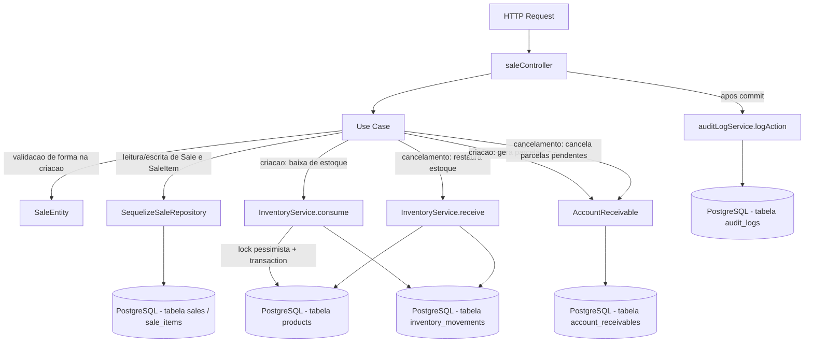

# Módulo Sales

## Objetivo

Gerenciar o ciclo de vida de Vendas ao cliente final: criação (com itens,
baixa de estoque e geração de parcelas em contas a receber) e transições de
status (`quote` → `confirmed` → `invoiced` → `shipped`, com `canceled`
disponível a partir de `quote`/`confirmed`/`invoiced`). Migrado para a
arquitetura em camadas (`domain` / `application` / `infrastructure` /
`presentation`) descrita na Fase 5 do `docs/BLACKBOX_CRONOGRAMA_CHECKLIST.md`, seguindo o mesmo padrão
dos módulos `products`, `inventory`, `bom`, `production` e `purchases`.

Este módulo **não reimplementa** a lógica transacional de baixa/entrada de
estoque — isso continua 100% centralizado em
`server/src/services/inventoryService.ts` (`InventoryService.consume` na
criação da venda, `InventoryService.receive` no cancelamento). Os use cases
deste módulo são wrappers finos sobre os models Sequelize existentes
(`Sale`, `SaleItem`, `Product`, `Client`, `AccountReceivable`) e sobre
`InventoryService`.

## Decisão de compatibilidade de rotas

O endpoint `/api/sales` (mesmos 4 paths, métodos e formato de resposta
JSON do controller anterior) agora é servido pelas rotas/controller deste
módulo (`presentation/routes/sales.ts` →
`presentation/controllers/saleController.ts`), registrado em
`server/index.ts`.

O arquivo anterior `server/src/routes/sales.ts` e o controller
`server/src/controllers/saleController.ts` **permanecem no repositório**
como referência histórica, mas **não são mais montados em nenhuma rota** —
evitando duplicidade de `/api/sales` e o risco de duas implementações
divergentes atenderem à mesma URL. Confirmado via `grep` que apenas
`server/index.ts` monta o módulo novo. Os arquivos anteriors podem ser
removidos em uma limpeza futura, uma vez confirmada a estabilidade da
migração.

A rota anterior importava `authorize` de `../middlewares/auth` mas nunca o
utilizava em nenhum handler — apenas `authenticate` era aplicado às 4
rotas. Esse comportamento foi preservado 1:1 no módulo novo (nenhuma rota
de vendas exige papel/permissão específica hoje; ver seção "Permissões").

Nenhum client precisa mudar: mesmos 4 endpoints, mesmos verbos HTTP, mesmo
envelope `{ success, data }` / `{ success, error }` (respostas de
sucesso). Uma pequena diferença de formato existe apenas nas respostas de
**erro** (mesmo padrão já adotado nos módulos `inventory`/`bom`/`production`/
`purchases`): erros de validação/regra de negócio agora são instâncias de
`AppError` (`server/src/errors`) e chegam ao cliente como
`{ success: false, error: { code, message } }` em vez do
`{ success: false, error: "mensagem em string" }` usado pelo controller
anterior. Erros propagados de `InventoryService` (que ainda usa
`Object.assign(new Error(...), { statusCode })`, não `AppError`) continuam
retornando `{ success: false, error: "mensagem" }` (string), pois o
`errorHandler` central já trata esse formato anterior separadamente — nenhuma
mudança de contrato nesse caso específico. O `statusCode` HTTP retornado é
o mesmo em todos os casos (400, 404, 409, 422). Erros inesperados (5xx)
mantêm o fallback genérico do `errorHandler`, igual ao anterior.

## F24 — Arredondamento de parcelas (já corrigido antes desta migração)

O `docs/BLACKBOX_CRONOGRAMA_CHECKLIST.md` lista F24 como uma dívida técnica relacionada a arredondamento
impreciso de parcelas em `saleController.ts`. **Essa correção já havia sido
aplicada antes desta migração** (o controller anterior já calculava tudo em
centavos usando helpers locais `toCents`/`fromCents`, com a última parcela
absorvendo o resto da divisão inteira). Esta migração **não altera a
regra**, apenas troca os helpers locais duplicados por
`server/src/shared/utils/money.ts` (`toCents`/`fromCents`/`round2`), que já
existiam e eram usados por outros módulos migrados — evitando duas
implementações levemente distintas (`fromCents` local usava
`toFixed`/`parseFloat`; a versão compartilhada usa correção por
`Number.EPSILON` antes de `Math.round`, mais robusta para os mesmos casos
de uso). Comportamento numérico observável preservado para todos os valores
em reais/centavos normais de venda.

Fluxo preservado em `CreateSaleUseCase`:
1. Cada item tem seu `unit_price` convertido para centavos (`toCents`) e o
   total da venda é acumulado em centavos.
2. O desconto é convertido para centavos e subtraído do total.
3. Se `installments > 1`: `baseInstallmentCents = Math.floor(totalNetCents / installments)`
   e o resto (`totalNetCents % installments`) é somado exclusivamente à
   **última** parcela, garantindo que a soma das parcelas seja sempre
   exatamente igual ao total líquido da venda (nenhum centavo perdido ou
   sobrando por arredondamento).
4. Se `installments === 1`: uma única `AccountReceivable` já é criada com
   `status: 'paid'` (comportamento anterior preservado — venda à vista é
   considerada quitada na criação).

## F22 — Orçamento (`quote`) sem baixa de estoque na criação (implementado)

O enum de `status` da venda inclui `'quote'` e a máquina de estados
(`ChangeSaleStatusUseCase.VALID_TRANSITIONS`) permite a transição
`quote → confirmed`. O fluxo real de orçamento está implementado:

- `POST /api/sales` aceita um campo opcional `status` (`'quote'` ou
  `'confirmed'`, default `'confirmed'` — preserva 100% o comportamento
  anterior quando omitido).
- Com `status: 'quote'`: `CreateSaleUseCase` cria a venda e os `SaleItem`
  normalmente, mas **não chama `InventoryService.consume`** (nenhum estoque
  é debitado) **e não gera nenhuma `AccountReceivable`**. A validação de
  quantidade disponível em estoque também é adiada (um orçamento pode ser
  criado mesmo sem estoque suficiente no momento).
- Com `status: 'confirmed'` (ou omitido): comportamento idêntico ao
  anterior — débito de estoque e geração de parcelas acontecem na criação.
- A confirmação de um orçamento (`PUT /api/sales/:id/status` com
  `{ "status": "confirmed" }`, transição `quote → confirmed`) é o momento em
  que `ChangeSaleStatusUseCase` debita o estoque de cada item via
  `InventoryService.consume` (revalidando disponibilidade sob lock, mesma
  regra de erro 404/409 da criação confirmada direta) e gera as parcelas em
  `AccountReceivable` a partir de `total_amount`/`installments`/
  `payment_method` já persistidos na venda, com o mesmo arredondamento em
  centavos (F24).

## Estrutura

```
server/src/modules/sales/
  domain/
    entities/SaleEntity.ts                   Validação de forma na criação
    repositories/SaleRepository.ts           Interface do repositório
  application/
    use-cases/
      ListSalesUseCase.ts
      GetSaleByIdUseCase.ts
      CreateSaleUseCase.ts                   Cálculo em centavos + baixa de estoque + parcelas (transacional)
      ChangeSaleStatusUseCase.ts             Máquina de estados + cancelamento (restaura estoque, cancela parcelas)
  infrastructure/
    sequelize/SequelizeSaleRepository.ts     Implementação usando os models existentes
  presentation/
    controllers/saleController.ts
    routes/sales.ts
```

## Modelos de dados utilizados

- `server/src/models/Sale.ts` (Sequelize, reutilizado — nenhum model novo foi criado).
- `server/src/models/SaleItem.ts`.
- `server/src/models/Product.ts` (leitura na validação de itens; escrita de `quantity` feita exclusivamente por `InventoryService`).
- `server/src/models/Client.ts` (associação `belongsTo`, apenas leitura — a existência do cliente não é validada explicitamente na criação, mesmo comportamento do anterior).
- `server/src/models/AccountReceivable.ts` (parcelas geradas na criação da venda; canceladas em massa no cancelamento).

## Regras de negócio

- Criação: `customer_id` obrigatório; `items` não pode ser vazio; cada item precisa de `product_id`/`quantity > 0`/`unit_price > 0` (validado por `SaleEntity`); `installments >= 1`; `discount >= 0`; `status` opcional (`'quote'`|`'confirmed'`, default `'confirmed'` — ver seção F22). Cada produto referenciado deve existir e estar `status: 'active'`. Estoque suficiente é exigido apenas quando `status: 'confirmed'` (validado no use case, dentro da transação, e revalidado sob lock por `InventoryService.consume`); para `status: 'quote'` essa checagem é adiada para a confirmação. `total_amount` é calculado no backend em centavos a partir dos itens e do desconto.
- Baixa de estoque: `InventoryService.consume` por item, com lock pessimista (`SELECT ... FOR UPDATE`), executada dentro da transação da criação (venda `confirmed`) ou dentro da transação de confirmação (`quote → confirmed`, ver F22) — previne condição de corrida entre vendas concorrentes do mesmo produto (corrigida na Fase 4.1, preservada aqui).
- Geração de parcelas: ver seção F24/F22 acima — na criação (venda `confirmed`) ou na confirmação do orçamento (`quote → confirmed`).
- Máquina de estados (`ChangeSaleStatusUseCase.VALID_TRANSITIONS`, single source of truth):
  - `quote` → `confirmed` | `canceled`
  - `confirmed` → `invoiced` | `canceled`
  - `invoiced` → `shipped` | `canceled`
  - `shipped` → (terminal, sem transições — inclusive não pode ser cancelada; ver bloqueio dedicado abaixo)
  - `canceled` → (terminal, sem transições)
- Cancelamento (`status: 'canceled'`): restaura o estoque de cada item da venda via `InventoryService.receive` (mesma transação) e cancela (`status: 'canceled'`) todas as `AccountReceivable` da venda que ainda não estejam `paid`/`canceled`.
- Múltiplos depósitos (Bloco 4, `BUSINESS_RULES.md` §12 item 7): a confirmação de orçamento (`quote → confirmed`) e o cancelamento chamam `warehouseStockService.removeFromWarehouse`/`addToWarehouse` para o depósito `ACABADOS` (resolvido via `getWarehouseByCode('ACABADOS', transaction)`) na MESMA transação em que `InventoryService.consume`/`receive` altera `products.quantity`, preservando a invariante de soma por depósito. **Pendência conhecida:** `CreateSaleUseCase` (criação direta com `status: 'confirmed'`, sem passar por orçamento) ainda não replica esse dual-write — só `ChangeSaleStatusUseCase` foi coberto nesta entrega.
- Expedição (`status: 'shipped'`, Onda 3): única origem permitida é `invoiced`. Não debita estoque nem altera `AccountReceivable` (isso já ocorreu antes). Uma venda `shipped` **não pode mais ser cancelada** — `ChangeSaleStatusUseCase` lança 422 (`BusinessRuleError`) com mensagem dedicada ("Venda já foi expedida...") antes mesmo de consultar a tabela genérica de transições, para dar uma mensagem mais clara que o erro genérico de transição inválida.

## Endpoints

Base URL: `/api/sales` (autenticação obrigatória via middleware `authenticate` em todas as rotas).

| Método | Rota | Descrição |
|---|---|---|
| GET | `/api/sales` | Lista vendas (filtros: `status`, `customer_id`, `start_date`, `end_date`; paginação: `page`, `limit`) |
| GET | `/api/sales/:id` | Busca venda por id (com cliente e itens + produto) |
| POST | `/api/sales` | Cria venda com itens — transacional; com `status: 'confirmed'` (default) debita estoque e gera parcelas na hora; com `status: 'quote'` não debita estoque nem gera parcelas (F22) |
| PUT | `/api/sales/:id/status` | Altera status (máquina de estados) — transacional; ao confirmar um orçamento (`quote → confirmed`) debita estoque e gera parcelas; ao cancelar, restaura estoque e cancela parcelas pendentes; `invoiced → shipped` marca a expedição (sem efeito colateral em estoque/parcelas); cancelamento de venda `shipped` é bloqueado (422) |

Ver `docs/arquitetura/API.md` para exemplos completos de request/response.

## Permissões

Todas as rotas exigem JWT válido (`authenticate`). O projeto ainda não
possui um middleware de RBAC granular por rota neste módulo — qualquer
usuário autenticado pode criar/cancelar vendas hoje. Isso está listado
como pendência na Fase 12 do `docs/BLACKBOX_CRONOGRAMA_CHECKLIST.md` ("Revisar RBAC completo"), mesma
pendência documentada nos demais módulos migrados.

## Eventos / Auditoria

Todos os endpoints de escrita continuam chamando `logAction` (via
`server/src/services/auditLogService.ts`) após o `commit`/persistência
(para não segurar locks de banco durante a escrita do log), preservando o
comportamento do controller anterior:

- `create` → entidade `Sale` criada.
- `status_change` → mudança de status da venda.

`GET /` e `GET /:id` são somente leitura e não geram auditoria, mesmo
comportamento do anterior.

## Fluxo simplificado (Mermaid)



## Testes existentes

- `server/tests/unit/sales-validators.test.ts` — schemas Zod (`createSaleSchema`, `updateSaleStatusSchema`, `listSalesQuerySchema`, `getSaleByIdParamSchema`).
- `server/tests/unit/integrity-transaction-guards.test.ts` — `ChangeSaleStatusUseCase` (cancelamento com lock/restauração de estoque).
- `server/tests/unit/create-sale-quote.test.ts` — `CreateSaleUseCase` com `status: 'quote'` não debita estoque nem gera `AccountReceivable`.
- `server/tests/integration/sale-cancel-concurrency.test.ts` — concorrência de cancelamento (Postgres real).
- `server/tests/integration/sale-invalid-payload-no-crash.test.ts` — payload inválido não derruba a API.
- `server/tests/integration/sale-quote-confirm.test.ts` — cria venda `quote` (estoque não muda), confirma via `PUT /status` e valida que o débito só acontece na confirmação (Postgres real, F22).
- `server/tests/unit/onda3-shipping-cockpit-cashflow.test.ts` — `invoiced → shipped` permitido; `confirmed → shipped` rejeitado (422); cancelamento de venda `shipped` bloqueado (422, mensagem dedicada); `shipped` confirmado como terminal.

## Pendências conhecidas

- Não há RBAC granular por papel neste módulo (qualquer usuário
  autenticado pode criar/cancelar vendas).
- A existência do `customer_id` não é validada explicitamente na criação
  (mesma lacuna do controller anterior — uma FK inválida cai no tratamento
  genérico de `SequelizeForeignKeyConstraintError` do `errorHandler`).
- O controller/rota anteriors (`server/src/controllers/saleController.ts`,
  `server/src/routes/sales.ts`) foram deixados intactos no repositório
  como referência histórica, mas não são mais usados; podem ser removidos
  em limpeza futura.
